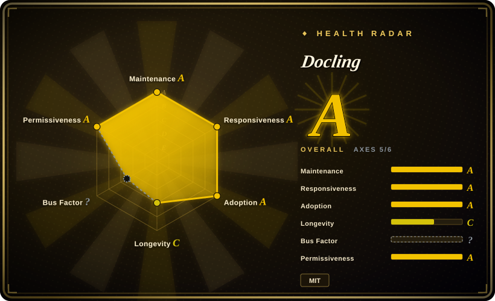
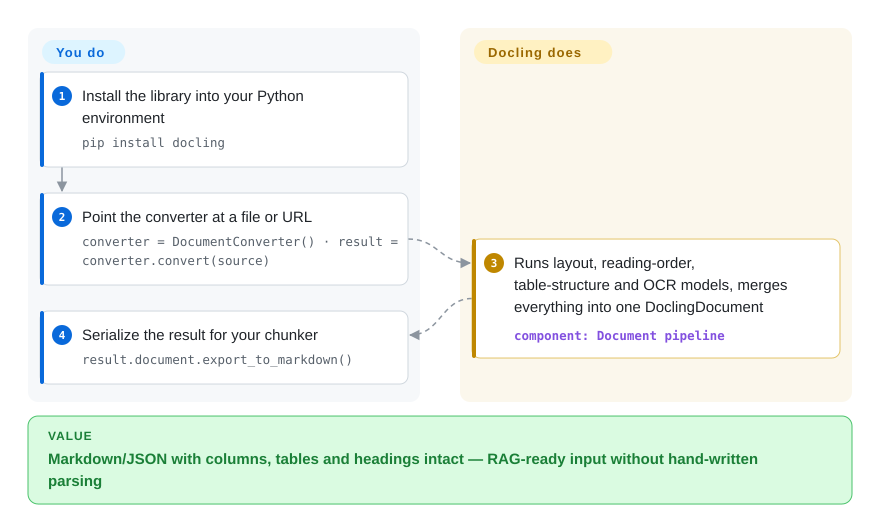

# Docling

You feed a pipeline a multi-column scanned PDF and plain text extraction hands back word-soup — columns interleaved, tables collapsed, headings flattened. Docling parses PDF, Office, HTML, images, audio and more with layout-aware ML models and rebuilds the document as one structured `DoclingDocument` (reading order, real table rows/cells, OCR for scans), then exports clean Markdown / HTML / lossless JSON that a chunker and embedder can consume directly.

## When to use

You're an engineer building a RAG pipeline and your corpus is a pile of messy real-world documents — scanned PDFs with multi-column layout, DOCX contracts, PPTX decks, the occasional spreadsheet and a few HTML exports. Naive text extraction wrecks you: columns interleave, tables collapse into word-soup, headings lose their level, and the chunks you feed the retriever are garbage in, garbage out. You import Docling, point its `DocumentConverter` at a file or URL, and get back a `DoclingDocument` that has reconstructed reading order, detected the layout, recovered table structure as actual rows/cells, and (when the page is a scan) run OCR. From there you call `.export_to_markdown()` or `.export_to_dict()`/JSON and hand structured text — headings, tables, lists intact — to your chunker and embedder. Because it's a plain `pip install docling` library with a Python API and a CLI, it drops into an existing ingestion job rather than forcing a service.

You also reach for it when you want one parser across heterogeneous formats instead of a different tool per type — PDF via PyMuPDF, DOCX via python-docx, PPTX via python-pptx, glued together by hand. Docling normalizes them all to the same `DoclingDocument`, so downstream chunking/serialization code is written once. It ships plug-and-play integrations for LangChain, LlamaIndex, Haystack and Crew AI, so the converter slots in as the document-loader stage of those frameworks.

## How it works

Docling is a conversion pipeline you run in-process. For each source file a format-specific backend reads the raw structure (PDF pages, DOCX XML, HTML DOM…), then a set of vision models runs on the pages: layout analysis (default model: Heron) finds headings, paragraphs, tables and figures and restores reading order, a table-structure model rebuilds rows and cells, and OCR kicks in wherever there is no embedded text layer — by default an `auto` engine selector picks the best OCR engine installed on your machine (RapidOCR, EasyOCR, Tesseract, ocrmac on macOS, Nemotron-OCR). Everything is merged into a single `DoclingDocument` — one lossless tree of typed items independent of the input format — and serialization is your exit door: `export_to_markdown()`, HTML, JSON, or DocTags for VLM prompts. What the library does for you: format normalization, layout/table/OCR inference, and stable exports. What stays yours: the Python environment, the one-time model-weight downloads (they are cached locally, so air-gapped setups need a plan), accelerator choice (CPU works; GPU is materially faster), and all chunking/embedding after the export. A CLI (`docling <file-or-url>`) wraps the same pipeline for one-off conversions.

<!-- flow-steps:begin (generated from flows/docling.json by tools/flow_card.py — do not edit) -->

Text version of the flow

1. **You**: Install the library into your Python environment — `pip install docling`
2. **You**: Point the converter at a file or URL — `converter = DocumentConverter() · result = converter.convert(source)`
3. **Docling**: Runs layout, reading-order, table-structure and OCR models, merges everything into one DoclingDocument — component: `Document pipeline`
4. **You**: Serialize the result for your chunker — `result.document.export_to_markdown()`

**Value**: Markdown/JSON with columns, tables and headings intact — RAG-ready input without hand-written parsing

<!-- flow-steps:end -->

## When NOT to use

- **You need an archive / search / DMS, not a parser.** Docling converts documents; it does not store, index, tag, or let users search them. For "scan, file, OCR, and full-text search my paperwork" you want a document-management app — [paperless-ngx](../document-management/paperless-ngx.md) — not a conversion library.
- **You just need plain text off a clean PDF or a quick OCR pass.** If layout/table fidelity doesn't matter, `pdftotext`/PyMuPDF text extraction or a direct Tesseract OCR call is far lighter than pulling in Docling's layout and table-structure models.
- **You're compute- or footprint-constrained.** Layout analysis and table-structure recovery run ML models; first use downloads model weights and inference is heavier (and much faster on a GPU) than regex/string extraction. On a tiny serverless function or a CPU-only box with hard latency limits, weigh the cost. [推断]
- **You expected a chunker or retriever.** Docling parses and serializes; it is *not* a chunking strategy, embedder, vector store, or retriever. Pair it with LlamaIndex or a retrieval layer like [PageIndex](../rag-retrieval/structured-retrieval/pageindex.md) — Docling produces the clean structured input those consume.
- **Your inputs are news articles or arbitrary web pages.** For boilerplate-stripping article/main-content extraction, readability/newspaper-style libraries are the better fit; Docling targets document files, not de-cluttering live web pages.

## Comparison

| Alternative | In index | Our verdict | Tradeoff |
|---|---|---|---|
| unstructured.io | 未收录 | Pick unstructured.io when you want the broader RAG-loader ecosystem and accept an OSS core plus commercial service split. | Broad multi-format document loader popular for RAG ingestion with many partitioners; open-source core plus a commercial API/service tier — capability split and licensing differ from Docling's single MIT library. |
| LlamaParse | 未收录 | Pick LlamaParse when a hosted parser for complex PDFs/tables is acceptable despite SaaS pricing and data-boundary tradeoffs. | Hosted parsing service (LlamaIndex) strong on complex PDFs/tables; SaaS with usage pricing and data leaving your boundary, vs Docling running fully local/in-process. |
| [Marker](marker.md) | ✅ | Pick Marker when PDF-to-Markdown with DL layout models is enough and Docling's broader input spread is unnecessary. | PDF→Markdown converter also using deep-learning layout models; similar gen-AI target, narrower input-format range than Docling's PDF/Office/HTML/image spread. |
| [PyMuPDF](../pdf-tools/pdf-reading/pymupdf.md) / [pdfplumber](../pdf-tools/pdf-reading/pdfplumber.md) | ✅ | Pick low-level PDF libraries when speed and light footprint matter more than built-in layout/table fidelity. | Fast, lightweight low-level PDF text/geometry extraction with no heavy models; you build layout/table logic yourself — less fidelity out of the box, far lighter footprint. |
| [PageIndex](../rag-retrieval/structured-retrieval/pageindex.md) | ✅ | Pick PageIndex when you need retrieval/reasoning over already parsed documents rather than parsing itself. | A retrieval/reasoning layer over documents, not a parser — complementary, not a substitute; Docling produces the structured text it indexes. |

## Tech stack

- **Language:** Python (`pip install docling`), exposing a `DocumentConverter` API and a CLI.
- **Core model:** every input is normalized to a unified `DoclingDocument` (layout, reading order, tables, figures, lists, headings), then serialized to Markdown / HTML / lossless JSON / DocTags.
- **ML models:** layout analysis and table-structure recovery run vision/DL models; optional Visual Language Model path (e.g. IBM's GraniteDocling, including via `docling --pipeline vlm --vlm-model granite_docling`) and ASR models for audio, video parsing (ASR transcript + keyframes).
- **Inputs/outputs:** parses PDF, DOCX, PPTX, XLSX, HTML, EPUB, images (PNG/TIFF/JPEG), Apple Pages/Keynote, audio (WAV/MP3), WebVTT, email (.eml/.msg), ODF (.odt/.ods/.odp), LaTeX, XBRL, plain text and more; exports Markdown, HTML, WebVTT, DocLang, JSON, DocTags.
- **Integrations:** plug-and-play with LangChain, LlamaIndex, Haystack, Crew AI; MCP server and API-server deployment options exist.

## Dependencies

- **Runtime:** a Python environment — **Python 3.10+** (`requires_python <4.0,>=3.10` on PyPI; 3.9 support was dropped in docling 2.70.0); install via pip/uv.
- **ML model weights:** layout and table-structure models are downloaded on first use and cached locally; this is a one-time network fetch and meaningful disk footprint.
- **OCR engines (for scanned input):** pluggable backends installed as extras — RapidOCR, EasyOCR, Tesseract (CLI or tesserocr), ocrmac (macOS Vision), Nemotron-OCR, KServe; the default `OcrAutoOptions` picks the best available one per platform (source: docs "OCR in Docling" + `docling/datamodel/pipeline_options.py`, 2026-09).
- **Hardware:** runs CPU-only, but layout/table/VLM inference is materially faster on a GPU; throughput on large corpora is dominated by model inference.

## Ops difficulty

**Low-to-medium as a library.** There's no service to deploy or datastore to run — it's `pip install docling` inside your existing ingestion job, and the happy path is a few lines (`DocumentConverter().convert(source)` → `.export_to_markdown()`). The medium part is environment and compute: the first run downloads model weights (size and offline/air-gapped setup need planning), OCR backends bring their own system-level dependencies, and batch-converting a large corpus is a GPU-vs-CPU and parallelism question, not a config flag. If you also run the optional API/MCP server, that's a service to operate on top of the library.

## Health & viability

- **Responsiveness**: Grade A — median first-response time 13.3 hours across 41 qualifying issues/PRs.
- **Maintenance (2026-09).** Last pushed 2026-09 with a fast release cadence (v2.130.0, 2026-09-22) — **highly active**, not archived. [推断]
- **Governance / backing.** The strongest signal here: **IBM-originated and hosted under the LF AI & Data Foundation** (confirmed from README, 2026-09-28) — foundation governance plus a major-vendor origin is a much safer footing than a lone-maintainer repo, lowering bus-factor and abandonment risk. The radar's governance axis is currently unmeasured: GitHub's contributor-stats endpoint was still computing when the scorer ran (`?`), so this bullet is documentation-based, not commit-share-based. [推断]
- **Age & Lindy verdict.** Only ~2 years old (created 2024-07) ⇒ **young**, so the Lindy prior is weak *on age alone* — but the rapid-fire release cadence, foundation backing, and ~68k stars are the offsetting signals. Treat it as a fast-rising, well-backed project rather than a battle-tested veteran. [推断]
- **Adoption & ecosystem.** Strong and growing: ~68.1k stars (up from ~62.3k in June, gh 2026-09-28) and plug-and-play integrations with LangChain, LlamaIndex, Haystack, Crew AI make it a de-facto RAG document-loader. The ~955 open issues are consistent with rapid growth and a large surface, not a stall. [未验证]
- **Risk flags.** MIT, no relicense or open-core split found. The practical caveat is **version churn** — formats, OCR backends, and defaults shift release-to-release, so pin and re-verify the features you depend on. [推断]

## Caveats (unverified)

- [未验证] ~68.1k stars and v2.x as of 2026-09-28 (latest release observed v2.130.0, 2026-09-22, GitHub API); star counts and version numbers are date-sensitive — treat as indicative and re-verify against the repo.
- [未验证] License is MIT and the project is hosted under the LF AI & Data Foundation, originated by IBM Research Zurich — confirm current governance/license against the repo before relying on it.
- [推断] Compute/footprint claims (model-weight download size, GPU speedup, CPU latency) are inferred from the use of layout/table/VLM models, not measured here — benchmark on your hardware and corpus.
- [未验证] VLM (GraniteDocling), ASR/audio and video paths are README-described features whose availability and quality vary by version and configuration; do not assume they're enabled by default.
