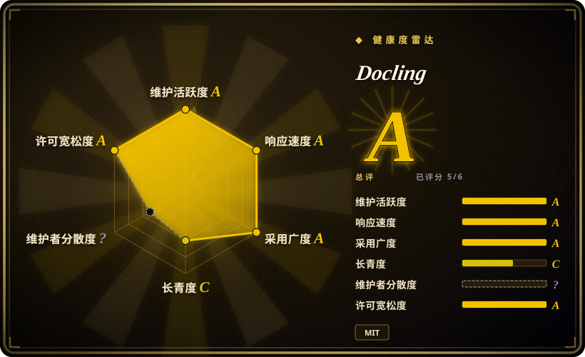
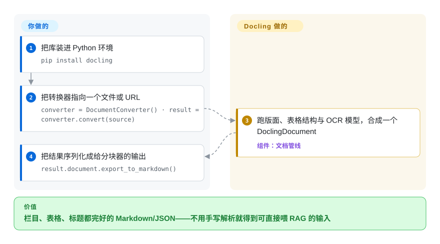

# Docling

你把一份多栏排版的扫描 PDF 喂给管线，纯文本抽取还你一锅词汤——栏目交错、表格塌掉、标题拍平。Docling 用版面感知的 ML 模型解析 PDF、Office、HTML、图片、音频等多种格式，把文档重建成一个统一的结构化 `DoclingDocument`（阅读顺序、真实的表格行/单元格、扫描件走 OCR），再导出干净的 Markdown / HTML / 无损 JSON，让分块器和 embedding 模型可以直接消费。

## 何时使用

你是个搭 RAG 管线的工程师，语料是一堆乱七八糟的真实文档——多栏排版的扫描 PDF、DOCX 合同、PPTX 演示稿、偶尔几张表格、还有几份 HTML 导出件。粗暴的纯文本抽取会把你坑惨：栏目交错、表格塌成一锅词汤、标题丢了层级，喂给 retriever 的 chunk 是垃圾进垃圾出。你引入 Docling，把它的 `DocumentConverter` 指向一个文件或 URL，拿回一个 `DoclingDocument`——它重建了阅读顺序、识别了版面、把表格结构还原成真正的行/单元格，（页面是扫描件时）还跑了 OCR。然后你调 `.export_to_markdown()` 或 `.export_to_dict()`/JSON，把结构化文本——标题、表格、列表都还在——交给你的 chunker 和 embedder。因为它就是 `pip install docling` 一个库、带 Python API 和 CLI，它能直接嵌进你现有的摄取作业，而不是逼你起一个服务。

当你想用一个解析器覆盖异构格式、而不是每种类型各用一个工具（PDF 用 PyMuPDF、DOCX 用 python-docx、PPTX 用 python-pptx，再手工拼起来）时，你也会选它。Docling 把它们全部归一到同一个 `DoclingDocument`，于是下游的 chunking/序列化代码只写一遍。它自带 LangChain、LlamaIndex、Haystack、Crew AI 的即插即用集成，所以这个 converter 可以直接作为这些框架的文档加载阶段。

## 怎么用起来

Docling 是一条在你进程内运行的转换管线。对每个源文件，先由对应格式的 backend 读取原始结构（PDF 页、DOCX 的 XML、HTML 的 DOM……），然后在页面上跑一组视觉模型：版面分析（默认模型 Heron）找出标题、段落、表格和图片并恢复阅读顺序；表格结构模型重建行/单元格；凡是没有内嵌文字层的地方就自动启用 OCR——默认由 `auto` 引擎选择器挑你机器上已装的最佳引擎（RapidOCR、EasyOCR、Tesseract、macOS 的 ocrmac、Nemotron-OCR）。所有结果合并进同一个 `DoclingDocument`——一棵与输入格式无关的类型化条目树，无损——序列化是你的出口：`export_to_markdown()`、HTML、JSON，或面向 VLM 提示的 DocTags。库替你做的：格式归一、版面/表格/OCR 推理、稳定的导出。留给你的：Python 环境、一次性的模型权重下载（下载后缓存在本地，离线环境要提前规划）、加速器选择（CPU 可用，GPU 明显更快），以及导出之后的所有分块与 embedding。CLI（`docling <file-or-url>`）把同一条管线包成一次性转换。

<!-- flow-steps:begin (generated from flows/docling.json by tools/flow_card.py — do not edit) -->

流程文字版

1. **你**：把库装进 Python 环境 — `pip install docling`
2. **你**：把转换器指向一个文件或 URL — `converter = DocumentConverter() · result = converter.convert(source)`
3. **Docling**：跑版面、表格结构与 OCR 模型，合成一个 DoclingDocument — 组件：`文档管线`
4. **你**：把结果序列化成给分块器的输出 — `result.document.export_to_markdown()`

**价值**：栏目、表格、标题都完好的 Markdown/JSON——不用手写解析就得到可直接喂 RAG 的输入

<!-- flow-steps:end -->

## 何时不用

- **你要的是归档 / 搜索 / DMS，而不是解析器。** Docling 负责转换文档；它不存储、不建索引、不打标签、也不让用户搜索。要“扫描、归档、OCR、全文搜我的文件”的话，你要的是文档管理应用——[paperless-ngx](../document-management/paperless-ngx.zh.md)——而不是一个转换库。
- **你只是要从干净 PDF 里抠纯文本，或快速 OCR 一下。** 如果版面/表格保真度无所谓，`pdftotext`/PyMuPDF 抽文本或直接调 Tesseract OCR，比拖进 Docling 的版面和表格结构模型轻得多。
- **你受算力或体积约束。** 版面分析和表格结构还原都跑 ML 模型；首次使用会下载模型权重，推理比正则/字符串抽取重得多（在 GPU 上快很多）。在一个极小的 serverless 函数、或只有 CPU 又有硬延迟上限的机器上，要掂量代价。[推断]
- **你以为它是 chunker 或 retriever。** Docling 负责解析和序列化；它*不是*分块策略、embedder、向量库或 retriever。把它和 LlamaIndex、或像 [PageIndex](../rag-retrieval/structured-retrieval/pageindex.zh.md) 这样的检索层配着用——Docling 产出的正是它们消费的那种干净结构化输入。
- **你的输入是新闻文章或任意网页。** 要做去模板、抽正文/主内容，readability/newspaper 这类库更合适；Docling 面向文档文件，而非给在线网页做去杂。

## 横向对比

| 替代品 | 是否收录 | 我们的评价 | 取舍 |
|---|---|---|---|
| unstructured.io | 未收录 | 想要更大的 RAG loader 生态，并能接受开源核心 + 商业服务层切分时，选 unstructured.io。 | 面向 RAG 摄取、广受欢迎的多格式文档加载器，partitioner 众多；开源核心 + 商用 API/服务层——能力切分与授权方式都和 Docling 的单一 MIT 库不同。 |
| LlamaParse | 未收录 | 可以接受 SaaS 定价和数据边界取舍，且需要复杂 PDF/表格托管解析时，选 LlamaParse。 | 托管解析服务（LlamaIndex），在复杂 PDF/表格上很强；但它是按量计费的 SaaS、数据会出你的边界，而 Docling 完全本地/进程内运行。 |
| [Marker](marker.zh.md) | ✅ | PDF→Markdown 和 DL 版面模型已足够、不需要 Docling 更广输入范围时，选 Marker。 | 同样用深度学习版面模型的 PDF→Markdown 转换器；gen-AI 目标相近，但输入格式范围比 Docling 的 PDF/Office/HTML/图片更窄。 |
| [PyMuPDF](../pdf-tools/pymupdf.zh.md) / [pdfplumber](../pdf-tools/pdfplumber.zh.md) | ✅ | 速度和轻量体积比内建版面/表格保真更重要时，选底层 PDF 库。 | 快、轻、无重模型的底层 PDF 文本/几何抽取；版面/表格逻辑得你自己写——开箱保真度更低，但体积小得多。 |
| [PageIndex](../rag-retrieval/structured-retrieval/pageindex.zh.md) | ✅ | 需要在已解析文档之上做检索/推理，而不是解析本身时，选 PageIndex。 | 是文档之上的检索/推理层，不是解析器——互补而非替代；Docling 产出的正是它建索引的结构化文本。 |

## 技术栈

- **语言：** Python（`pip install docling`），提供 `DocumentConverter` API 和一个 CLI。
- **核心模型：** 每种输入都归一到统一的 `DoclingDocument`（版面、阅读顺序、表格、图片、列表、标题），再序列化为 Markdown / HTML / 无损 JSON / DocTags。
- **ML 模型：** 版面分析和表格结构还原跑视觉/DL 模型；可选的视觉语言模型路径（如 IBM 的 GraniteDocling，可用 `docling --pipeline vlm --vlm-model granite_docling`）以及处理音频的 ASR 模型、视频解析（ASR 转写加关键帧）。
- **输入/输出：** 解析 PDF、DOCX、PPTX、XLSX、HTML、EPUB、图片（PNG/TIFF/JPEG）、Apple Pages/Keynote、音频（WAV/MP3）、WebVTT、邮件（.eml/.msg）、ODF（.odt/.ods/.odp）、LaTeX、XBRL、纯文本等；导出 Markdown、HTML、WebVTT、DocLang、JSON、DocTags。
- **集成：** 与 LangChain、LlamaIndex、Haystack、Crew AI 即插即用；还有 MCP server 和 API-server 部署选项。

## 依赖

- **运行时：** 一个 Python 环境——**Python 3.10+**（PyPI 上 `requires_python <4.0,>=3.10`；docling 2.70.0 起放弃 3.9）；用 pip/uv 安装。
- **ML 模型权重：** 版面和表格结构模型在首次使用时下载并缓存到本地；这是一次性网络拉取，且占用可观磁盘空间。
- **OCR 引擎（给扫描件）：** 以 extras 安装的可插拔后端——RapidOCR、EasyOCR、Tesseract（CLI 或 tesserocr）、ocrmac（macOS Vision）、Nemotron-OCR、KServe；默认 `OcrAutoOptions` 按平台挑可用中最佳的一个（来源：文档「OCR in Docling」加 `docling/datamodel/pipeline_options.py`，2026-09）。
- **硬件：** 可纯 CPU 运行，但版面/表格/VLM 推理在 GPU 上明显更快；大语料的吞吐由模型推理主导。

## 运维难度

**作为库，低到中。** 没有服务要部署、没有数据存储要运维——就是在你现有的摄取作业里 `pip install docling`，顺路径几行代码（`DocumentConverter().convert(source)` → `.export_to_markdown()`）。中等的部分在环境和算力：首次运行会下载模型权重（体积、离线/隔离网环境的准备都要规划），OCR 后端带各自的系统级依赖，而批量转换大语料是 GPU-vs-CPU 和并行度的问题，不是一个配置开关。如果你还跑那个可选的 API/MCP server，那就是在库之上多了个要运维的服务。

## 健康度与可持续性

- **响应速度**：Grade A——中位首次响应时间 13.3 小时，基于 41 个 qualifying issues/PRs。
- **维护（2026-09）。** 最后 push 于 2026-09，发布节奏极快（v2.130.0，2026-09-22）——**高度活跃**，未归档。[推断]
- **治理 / 背书。** 这里最强的信号：**由 IBM 发起，托管在 LF AI & Data 基金会下**（2026-09-28 由 README 确认）——基金会治理加上大厂出身，比单人维护的仓库根基稳得多，降低了 bus-factor 和弃坑风险。雷达的治理轴本次未能实测：跑分时 GitHub 的贡献者统计端点仍在异步计算（`?`），此条是基于文档而非提交份额的判断。[推断]
- **年龄与 Lindy 判断。** 仅约 2 年（2024-07 创建）⇒ **年轻**，*单看年龄* Lindy 先验偏弱——但密集的发布节奏、基金会背书和约 68k star 是抵消信号。应把它当作快速崛起、背书良好的项目，而非久经沙场的老将。[推断]
- **采用度与生态。** 强且在增长：约 68.1k star（gh 2026-09-28，较 6 月的约 62.3k 上升），与 LangChain、LlamaIndex、Haystack、Crew AI 即插即用，使它成为事实上的 RAG 文档加载器。约 955 个 open issue 与高速增长和大面相符，并非停滞。[未验证]
- **风险标记。** MIT，未发现 relicense 或 open-core 切分。实际需注意的是**版本变动**——格式、OCR 后端和默认值随版本变化，请锁版本并重新核实你依赖的特性。[推断]

## 存疑（未验证）

- [未验证] 截至 2026-09-28 约 68.1k star、v2.x（观察到的最新发布 v2.130.0，2026-09-22，GitHub API）；star 数和版本号对时间敏感——仅供参考，请对照仓库重新核实。
- [未验证] 授权为 MIT，项目托管在 LF AI & Data 基金会下，由 IBM 苏黎世研究院发起——依赖前请对照仓库确认当前治理/授权。
- [推断] 算力/体积相关的说法（模型权重下载大小、GPU 加速、CPU 延迟）是从使用版面/表格/VLM 模型推断的，而非此处实测——请在你自己的硬件和语料上做基准。
- [未验证] VLM（GraniteDocling）、ASR/音频与视频路径是 README 描述的特性，其可用性和质量随版本与配置变化；别假设它们默认开启。
