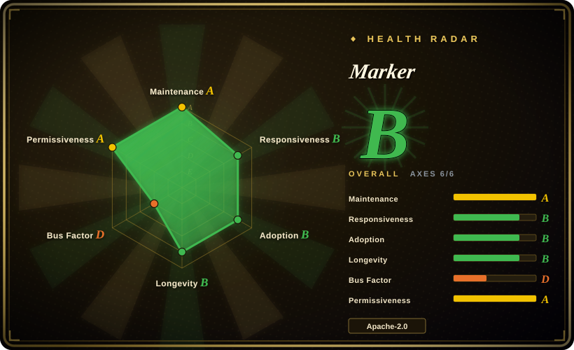
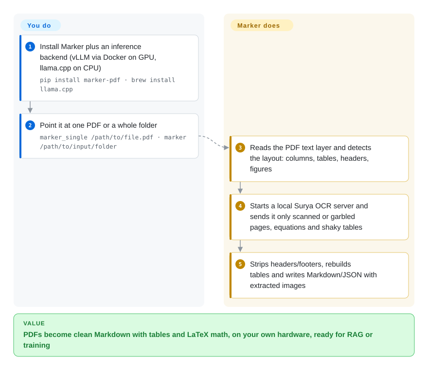

# Marker

You copy text out of a PDF paper and get broken lines, page numbers in mid-sentence, tables flattened into word soup and equations turned into garbage. Marker reads the PDF's own text where it is clean, OCRs only the pages and blocks that are not, and writes Markdown (or JSON/HTML/chunks) with real tables, LaTeX math and extracted images — locally, on a GPU or a plain CPU.

## When to use

You're building a RAG index or a training set from a few thousand PDFs — arXiv papers, textbooks, scanned reports — and your current `pdftotext` step produces text like `Re-\nsults show 3 4.2 % 12` with the table and the formula gone. You want Markdown an LLM can read: headings in order, tables as tables, equations as `$$…$$`, headers and footers removed, and you want to run it on your own machines rather than upload documents to a parsing API.

Marker fits when **PDF quality is the main job and throughput matters**: since v2.0.0 (2026-07-20) it uses the PDF text layer by default and calls its OCR vision model (Surya) only where text is bad, so a born-digital corpus converts fast, and its own olmOCR-bench run reports it ahead of MinerU and Docling on both score and pages/second. Pick it over Docling when you mostly have PDFs and want the extra accuracy and the `--use_llm` repair path; pick Docling when you need a broad, permissively licensed multi-format pipeline under a foundation. Pick it over olmOCR when you don't want to send every page through a 7B vision model.

## How it works

Marker is a Python package and CLI. **You** install it, make sure an inference backend is available (Docker + NVIDIA toolkit for vLLM on a GPU, or the `llama-server` binary from llama.cpp on CPU/Apple Silicon), and point `marker_single` at a file or `marker` at a folder. **Marker** does the rest: it extracts the PDF text layer with `pdftext`, finds the page layout (columns, tables, headers, figures) with a small layout model, and starts a local Surya inference server on first use — Surya is Datalab's OCR vision-language model, i.e. a model that reads page images and outputs text — sending it only scanned or garbled pages, equations and low-confidence tables. Then it strips running headers/footers, rebuilds tables and writes the output. A `--mode` switch picks the tradeoff (`balanced` on GPU, `fast` on CPU), `--disable_ocr` never touches the model, and `--use_llm` adds a pass through Gemini, Claude, an OpenAI-compatible endpoint or Ollama to merge cross-page tables and fix forms.

<!-- flow-steps:begin (generated from flows/marker.json by tools/flow_card.py — do not edit) -->

Text version of the flow

1. **You**: Install Marker plus an inference backend (vLLM via Docker on GPU, llama.cpp on CPU) — `pip install marker-pdf · brew install llama.cpp`
2. **You**: Point it at one PDF or a whole folder — `marker_single /path/to/file.pdf · marker /path/to/input/folder`
3. **Marker**: Reads the PDF text layer and detects the layout: columns, tables, headers, figures
4. **Marker**: Starts a local Surya OCR server and sends it only scanned or garbled pages, equations and shaky tables
5. **Marker**: Strips headers/footers, rebuilds tables and writes Markdown/JSON with extracted images

**Value**: PDFs become clean Markdown with tables and LaTeX math, on your own hardware, ready for RAG or training

<!-- flow-steps:end -->

## When NOT to use

- **If you are a company above $5M in funding or revenue and will use Marker's OCR in production, budget for Datalab's commercial license or use Docling / olmOCR instead, because** the code is Apache-2.0 since v2.0.0 but the model weights it downloads are under a modified OpenRAIL-M license that is free only for research, personal use and startups under that threshold.
- **If your inputs are mostly Office files, HTML or emails rather than PDFs, use MarkItDown or Docling instead of Marker, because** DOCX/PPTX/XLSX/EPUB/HTML need the `marker-pdf[full]` extras and Marker's strength (layout + selective OCR) is wasted on documents that already have structure.
- **If you want a production HTTP service, use Docling Serve or the unstructured API instead of `marker_server`, because** the README calls its FastAPI server "not a very robust API… only intended for small-scale use", and `--use_llm` / `--disable_ocr` are not exposed over it.
- **If you cannot run Docker+GPU or a `llama-server` binary, run Marker only with `--disable_ocr`, or use a pure text extractor (MarkItDown, anydoc), because** every OCR call in v2 goes through a separately spawned local inference server; without one, scanned pages and equations are skipped.
- **If you need guaranteed accuracy on hard scans, handwriting or dense math, use a full-page VLM (olmOCR, Datalab's hosted Chandra) instead of Marker's default mode, because** Marker's own benchmark puts balanced mode at 76.0% on olmOCR-bench versus 85.8% for hosted Chandra — the selective-OCR design trades some accuracy for speed.
- **If you depended on the v1 structured-extraction converter, stay on 1.10.x or move to a `--use_llm` workflow, because** v2.0.0 removed it.
- **If long-term maintenance by more than one person is a hard requirement, prefer Docling (LF AI & Data) over Marker, because** one maintainer authored about 93% of the last year's commits and the roadmap belongs to a single startup.

## Comparison

| Alternative | In index | Our verdict | Tradeoff |
| --- | --- | --- | --- |
| [Docling](docling.md) | ✅ | Choose Docling when you need a permissively licensed, foundation-governed parser across PDF, Office, HTML and images; choose Marker when PDF accuracy and pages/second are what you are measured on. | Docling is MIT with no model-weight revenue cap and a broader input range; Marker reports higher olmOCR-bench scores and throughput but ships weights under OpenRAIL-M with a $5M threshold. |
| [olmOCR](olmocr.md) | ✅ | Choose olmOCR when every page is a hard scan and you can afford a 7B VLM pass on a GPU; choose Marker when most pages are born-digital and you want the text layer used directly. | olmOCR OCRs every page with a large vision model (slow, robust); Marker OCRs only what is broken (fast, slightly lower on hard pages). |
| [MarkItDown](markitdown.md) | ✅ | Choose MarkItDown when inputs are mixed office files and you need a light dependency with no models; choose Marker when PDFs with tables, columns or equations must come out right. | MarkItDown is pure conversion with no layout model and no OCR by default; Marker brings PyTorch, a layout model and an OCR server for much better PDF structure. |
| MinerU | 未收录 | Choose MinerU when you want the most-starred self-hosted parser with its own VLM backend and Chinese-document focus; choose Marker when pipeline throughput on mostly digital PDFs decides it. | Both are local model pipelines and both carry commercial thresholds (MinerU: Apache-2.0 plus additional commercial-license terms; Marker: OpenRAIL-M weights); Marker's README reports ~5× MinerU's pipeline throughput — the vendor's own number. |
| Chandra | 未收录 | Choose Chandra (Datalab's document VLM, or its hosted API) when maximum accuracy matters more than cost; choose Marker for cheap, local, high-volume conversion. | Same vendor; Chandra scores higher (85.8 on olmOCR-bench) but is a heavy VLM or a paid API, while Marker runs selective OCR on commodity hardware. |

## Tech stack

- **Language**: Python ≥ 3.10, packaged with uv/hatchling (v2.0.0 moved off Poetry).
- **Models**: Surya OCR 2 (Datalab's VLM for OCR and, in balanced mode, layout), an rf-detr/ONNX layout model in fast mode, small PyTorch/transformers helpers for OCR-error detection.
- **Inference server**: auto-spawned vLLM (Docker, NVIDIA GPU) or llama.cpp `llama-server` (CPU / Apple Silicon); `SURYA_INFERENCE_URL` can point at an existing one.
- **PDF text**: `pdftext` (Datalab's text-layer extractor); `markdownify` / `markdown2` for rendering.
- **Optional formats**: `mammoth`, `python-pptx`, `openpyxl`, `ebooklib`, `weasyprint` via `marker-pdf[full]`.
- **LLM clients**: `google-genai`, `anthropic`, `openai` (plus Ollama, Vertex, Azure, OpenRouter services) for `--use_llm`.
- **Extensibility**: providers → builders → processors → renderers pipeline; custom processors and renderers plug into `PdfConverter`.

## Dependencies

- **Runtime**: Python 3.10+ and PyTorch; `pip install marker-pdf` (add `[full]` for non-PDF inputs).
- **For OCR**: Docker + NVIDIA Container Toolkit (vLLM) on GPU machines, or the llama.cpp `llama-server` binary on CPU/Apple Silicon. Not needed with `--disable_ocr`.
- **Model weights**: downloaded on first use; under a modified OpenRAIL-M license (free under $5M funding/revenue).
- **Optional external**: an LLM API key (Gemini by default) only if you use `--use_llm`.
- **Hardware**: runs on CPU, but the README's throughput figures (2.9 pg/s balanced, 7.4 pg/s fast) are from a single NVIDIA B200.

## Ops difficulty

**Medium.** A pip install plus one CLI command is all a trial needs, and `--disable_ocr` runs anywhere. Production use is more: you manage the Surya inference server (Docker/GPU or llama.cpp), GPU memory and worker counts (the README's OOM advice is "decrease worker count"), model-weight downloads, and the commercial license check. Batch jobs are well supported (`--workers`, `--skip_existing`, `--num_chunks/--chunk_idx` for sharding across machines), but you build your own service around it since the bundled server is not production-grade.

## Health & viability

- **Maintenance (2026-10-08):** active — last commit 6 days before scoring and 8 of the last 13 weeks with commits; v2.0.0 (2026-07-20) was a full rewrite after 1.10.2 (2026-01-31).
- **Responsiveness:** slow — median first response about 244.5 hours (~10 days) across 8 qualifying issues/PRs on the 2026-10-08 run; expect to self-support.
- **Governance:** the weak axis. 3 people committed in the last 12 months and the top contributor holds 93.1% of those commits — the repo is effectively Vik Paruchuri's, owned by the Datalab organization. Bus factor is one.
- **Backing & longevity:** backed by Datalab, a startup that sells the hosted API and model-weight licenses; created 2023-10, so ~3 years old and still shipping — a moderate Lindy prior tied to one company's commercial interest. [推断]
- **Adoption:** ~40.3k GitHub stars and 571,434 PyPI downloads of `marker-pdf` in the last month (2026-10) — widely used as a PDF-to-Markdown step.
- **Risk flags:** licensing moved the right way — code relicensed GPL-3.0 → Apache-2.0 in the v2.0.0 release prep (2026-07-17) — but the separate model-weight license with a revenue threshold is the real constraint, and the README steers high-accuracy users to the paid Chandra API.

## Caveats (unverified)

- [未验证] The olmOCR-bench scores and throughput (76.0% balanced, ~5× MinerU's pipeline, ahead of Docling) are Datalab's own measurements from its `benchmarks/` harness, not independently reproduced.
- [未验证] The exact terms of the modified OpenRAIL-M model-weight license (what counts as "funding/revenue", what the paid tier costs) were read from the README summary only, not the full license text or the pricing page.
- [推断] The bus-factor judgment rests on the scorer's 12-month contributor window (3 committers, top share 93.1%); Datalab staff may contribute through other repos (Surya, pdftext) not counted here.
- [未验证] MinerU's Chinese-document focus is from its positioning; its license (Apache-2.0 plus commercial-threshold terms in `LICENSE.md`) was checked 2026-10-08, but the threshold values were not compared with Marker's.
- [未验证] CPU-only throughput in `fast` mode with llama.cpp was not measured; README throughput numbers are GPU (B200) figures.
- [未验证] Star and download counts are date-sensitive (2026-10-08) and indicative only.
