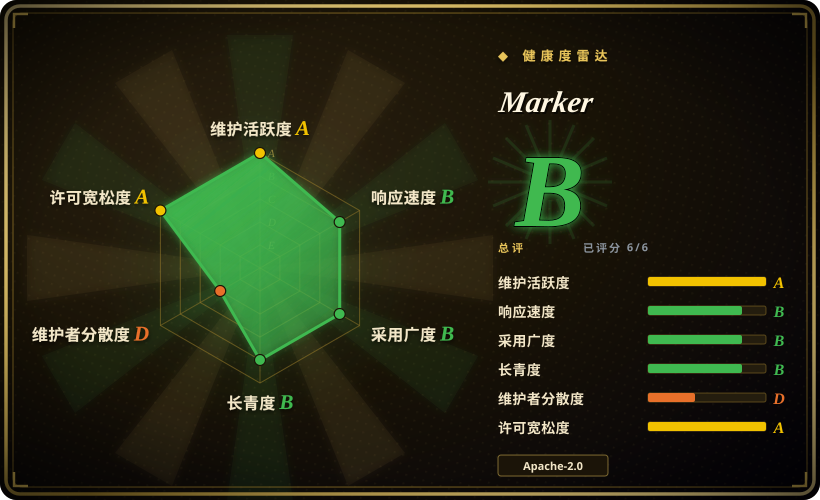
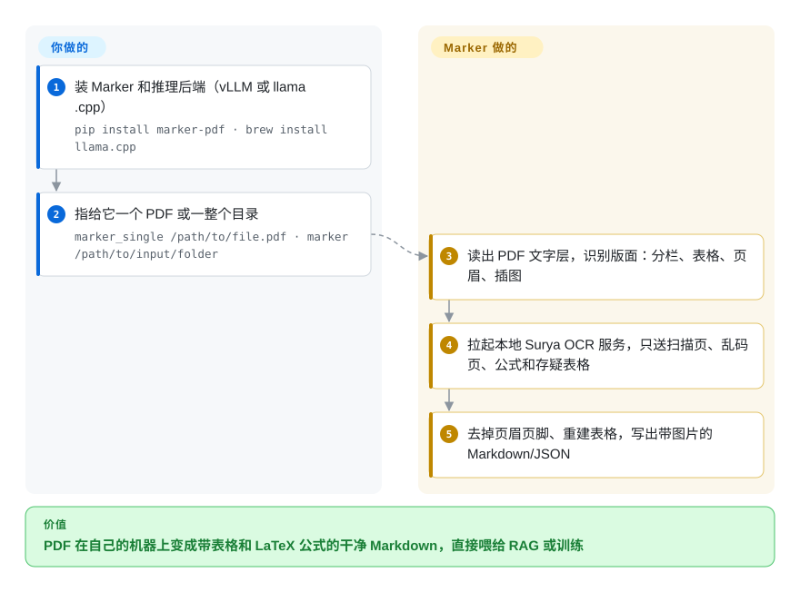

# Marker

从 PDF 论文里复制一段文字，得到的是断成碎片的行、夹在句子中间的页码、被拍扁成一串词的表格和变成乱码的公式。Marker 在 PDF 自带文字干净的地方直接用，只把坏掉的页面和区块送去识别，最后写出带真表格、LaTeX 公式和图片的 Markdown（或 JSON/HTML/分块）——在本地跑，GPU 或普通 CPU 都行。

## 何时使用

你要拿几千份 PDF——arXiv 论文、教材、扫描报告——建 RAG 索引或训练集，现在的 `pdftotext` 吐出来的是 `Re-\nsults show 3 4.2 % 12` 这样的东西，表格和公式都没了。你要的是大模型能读的 Markdown：标题顺序正确，表格还是表格，公式写成 `$$…$$`，页眉页脚去掉；而且你想在自己的机器上跑，不想把文档上传给某个解析 API。

当**主要任务是 PDF 质量、而且吞吐量要紧**时选 Marker：v2.0.0（2026-07-20）起它默认直接读 PDF 文字层，只在文字坏掉的地方调用它的 OCR 视觉模型（Surya），所以原生数字 PDF 转得很快；它自己在 olmOCR-bench 上的测试显示分数和每秒页数都高于 MinerU 和 Docling。主要是 PDF、想要更高准确率和 `--use_llm` 修复通道时，选它而不是 Docling；需要覆盖多种格式、宽松许可、由基金会治理的流水线时，选 Docling。不想让每一页都过一遍 7B 视觉模型时，选它而不是 olmOCR。

## 怎么用起来

Marker 是一个 Python 包加命令行工具。**你要做的**：安装它，准备好推理后端（GPU 机器上装 Docker 和 NVIDIA 容器工具包跑 vLLM，CPU 或 Apple Silicon 上装 llama.cpp 的 `llama-server`），然后用 `marker_single` 转单个文件或用 `marker` 转整个目录。**Marker 替你做的**：先用 `pdftext` 抽出 PDF 文字层，用一个小型版面模型找出分栏、表格、页眉和插图的位置；第一次用时在本地拉起一个 Surya 推理服务——Surya 是 Datalab 的 OCR 视觉语言模型，也就是看页面图片、输出文字的模型——只把扫描页、乱码页、公式和没把握的表格交给它。然后去掉页眉页脚、重建表格、写出结果。`--mode` 选取舍（GPU 默认 `balanced`，CPU 默认 `fast`），`--disable_ocr` 完全不碰模型，`--use_llm` 再过一遍 Gemini、Claude、OpenAI 兼容接口或 Ollama，用来合并跨页表格、修正表单。

<!-- flow-steps:begin (generated from flows/marker.json by tools/flow_card.py — do not edit) -->

流程文字版

1. **你**：装 Marker 和推理后端（vLLM 或 llama.cpp） — `pip install marker-pdf · brew install llama.cpp`
2. **你**：指给它一个 PDF 或一整个目录 — `marker_single /path/to/file.pdf · marker /path/to/input/folder`
3. **Marker**：读出 PDF 文字层，识别版面：分栏、表格、页眉、插图
4. **Marker**：拉起本地 Surya OCR 服务，只送扫描页、乱码页、公式和存疑表格
5. **Marker**：去掉页眉页脚、重建表格，写出带图片的 Markdown/JSON

**价值**：PDF 在自己的机器上变成带表格和 LaTeX 公式的干净 Markdown，直接喂给 RAG 或训练

<!-- flow-steps:end -->

## 何时不用

- **如果你所在公司融资或营收超过 500 万美元、要在生产中用 Marker 的 OCR，要么预算 Datalab 的商业授权，要么改用 Docling / olmOCR，因为**代码从 v2.0.0 起是 Apache-2.0，但它下载的模型权重用的是修改版 OpenRAIL-M 许可，只对研究、个人用途和低于这个门槛的初创公司免费。
- **如果输入主要是 Office 文件、HTML 或邮件而不是 PDF，用 MarkItDown 或 Docling，而不是 Marker，因为**DOCX/PPTX/XLSX/EPUB/HTML 需要装 `marker-pdf[full]` 额外依赖，而 Marker 的长处（版面分析 + 按需 OCR）在本来就有结构的文档上用不上。
- **如果你要的是生产级 HTTP 服务，用 Docling Serve 或 unstructured 的 API，而不是 `marker_server`，因为**README 自己说这个 FastAPI 服务“不是很健壮……只适合小规模使用”，而且 `--use_llm` / `--disable_ocr` 都没开放到接口上。
- **如果你跑不了 Docker+GPU，也装不了 `llama-server`，只用 `--disable_ocr` 模式跑 Marker，或者换纯文本抽取工具（MarkItDown、anydoc），因为**v2 的每次 OCR 调用都要经过一个单独拉起的本地推理服务；没有它，扫描页和公式会被跳过。
- **如果困难扫描件、手写体或密集公式必须保证准确，用整页视觉模型（olmOCR、Datalab 托管的 Chandra），而不是 Marker 默认模式，因为**Marker 自己的测试里 balanced 模式在 olmOCR-bench 上是 76.0%，托管版 Chandra 是 85.8%——按需 OCR 的设计用一部分准确率换了速度。
- **如果你依赖 v1 的结构化抽取转换器，停在 1.10.x 或改用 `--use_llm` 流程，因为**v2.0.0 把它删了。
- **如果硬性要求不止一个人长期维护，选 Docling（LF AI & Data）而不是 Marker，因为**过去一年约 93% 的提交出自同一位维护者，路线图属于一家初创公司。

## 横向对比

| 替代品 | 是否收录 | 我们的评价 | 取舍 |
| --- | --- | --- | --- |
| [Docling](docling.zh.md) | 已收录 | 需要宽松许可、基金会治理、覆盖 PDF/Office/HTML/图片的解析器，选 Docling；考核指标是 PDF 准确率和每秒页数，选 Marker。 | Docling 是 MIT，模型权重没有营收门槛，输入格式更广；Marker 在 olmOCR-bench 上分数和吞吐更高，但权重是带 500 万美元门槛的 OpenRAIL-M。 |
| [olmOCR](olmocr.zh.md) | 已收录 | 每一页都是难啃的扫描件、而且能负担 GPU 上 7B 视觉模型逐页处理，选 olmOCR；大部分是原生数字 PDF、想直接用文字层，选 Marker。 | olmOCR 每页都用大视觉模型识别（慢但稳）；Marker 只识别坏掉的部分（快，难页上略低）。 |
| [MarkItDown](markitdown.zh.md) | 已收录 | 输入是混杂的办公文件、只要一个不带模型的轻依赖，选 MarkItDown；带表格、分栏或公式的 PDF 必须转对，选 Marker。 | MarkItDown 是纯格式转换，默认没有版面模型也没有 OCR；Marker 带上 PyTorch、版面模型和 OCR 服务，换来好得多的 PDF 结构。 |
| MinerU | 未收录 | 想要星数最多、自带视觉模型后端、偏重中文文档的自托管解析器，选 MinerU；以原生数字 PDF 为主、吞吐量决定成败，选 Marker。 | 两者都是本地模型流水线，也都有商用门槛（MinerU 是 Apache-2.0 加附加商业许可条款，Marker 是 OpenRAIL-M 权重）；Marker 的 README 称吞吐约为 MinerU 流水线的 5 倍——这是厂商自己的数字。 |
| Chandra | 未收录 | 准确率比成本更重要时，选 Chandra（Datalab 的文档视觉模型或其托管 API）；要便宜、本地、大批量转换，选 Marker。 | 同一家厂商；Chandra 分数更高（olmOCR-bench 85.8），但它是重型视觉模型或付费 API，Marker 在普通硬件上做按需 OCR。 |

## 技术栈

- **语言**：Python ≥ 3.10，用 uv/hatchling 打包（v2.0.0 起不再用 Poetry）。
- **模型**：Surya OCR 2（Datalab 的视觉语言模型，负责 OCR，balanced 模式下也负责版面）、fast 模式下的 rf-detr/ONNX 版面模型、用于检测 OCR 错误的小型 PyTorch/transformers 模型。
- **推理服务**：自动拉起的 vLLM（Docker，NVIDIA GPU）或 llama.cpp 的 `llama-server`（CPU / Apple Silicon）；也可以用 `SURYA_INFERENCE_URL` 指向现成服务。
- **PDF 文字**：`pdftext`（Datalab 的文字层抽取器）；渲染用 `markdownify` / `markdown2`。
- **可选格式**：通过 `marker-pdf[full]` 引入 `mammoth`、`python-pptx`、`openpyxl`、`ebooklib`、`weasyprint`。
- **大模型客户端**：`google-genai`、`anthropic`、`openai`（另有 Ollama、Vertex、Azure、OpenRouter 服务），供 `--use_llm` 使用。
- **扩展方式**：providers → builders → processors → renderers 流水线；自定义 processor 和 renderer 可以直接传给 `PdfConverter`。

## 依赖

- **运行时**：Python 3.10+ 和 PyTorch；`pip install marker-pdf`（非 PDF 输入加 `[full]`）。
- **OCR 需要**：GPU 机器上要 Docker + NVIDIA 容器工具包（vLLM），CPU/Apple Silicon 上要 llama.cpp 的 `llama-server`。用 `--disable_ocr` 时不需要。
- **模型权重**：首次使用时下载；许可是修改版 OpenRAIL-M（融资/营收低于 500 万美元免费）。
- **可选外部服务**：只有用 `--use_llm` 时才需要大模型 API 密钥（默认 Gemini）。
- **硬件**：CPU 能跑，但 README 的吞吐数字（balanced 2.9 页/秒，fast 7.4 页/秒）来自单张 NVIDIA B200。

## 运维难度

**中等。**试用只要一次 pip 安装加一条命令，`--disable_ocr` 在哪都能跑。生产用要多管几样：Surya 推理服务（Docker/GPU 或 llama.cpp）、显存和 worker 数量（README 对显存不足的建议就是“减少 worker 数”）、模型权重下载，以及商业许可核查。批处理支持得不错（`--workers`、`--skip_existing`、跨机器分片用 `--num_chunks/--chunk_idx`），但自带服务不是生产级的，服务层要你自己搭。

## 健康度与可持续性

- **维护（2026-10-08）**：活跃——评分时最后一次提交在 6 天前，最近 13 周有 8 周有提交；v2.0.0（2026-07-20）是继 1.10.2（2026-01-31）之后的一次完全重写。
- **响应速度**：偏慢——2026-10-08 评分中 8 个合格 issue/PR 的首次回复中位数约 244.5 小时（约 10 天）；要做好自己解决问题的准备。
- **治理**：最弱的一轴。过去 12 个月只有 3 人提交，排名第一的贡献者占 93.1%——仓库实际上是 Vik Paruchuri 一个人的，挂在 Datalab 组织名下。巴士因子是 1。
- **背书与长期性**：背后是 Datalab，一家靠托管 API 和模型权重授权赚钱的初创公司；2023-10 创建，约 3 年，仍在发版——Lindy 先验中等，而且绑定在一家公司的商业利益上。[推断]
- **采用度**：GitHub 约 4.03 万星，`marker-pdf` 在 PyPI 上月下载 571,434 次（2026-10）——作为 PDF 转 Markdown 的一环被广泛使用。
- **风险信号**：许可往好的方向变了——v2.0.0 发布准备时（2026-07-17）代码从 GPL-3.0 改为 Apache-2.0——但真正的约束是另一份带营收门槛的模型权重许可，而且 README 会把追求高准确率的用户引向付费的 Chandra API。

## 存疑（未验证）

- [未验证] olmOCR-bench 分数和吞吐（balanced 76.0%、约为 MinerU 流水线的 5 倍、领先 Docling）是 Datalab 用自己的 `benchmarks/` 工具测的，没有独立复现。
- [未验证] 修改版 OpenRAIL-M 模型权重许可的具体条款（“融资/营收”怎么算、付费档多少钱）只读了 README 摘要，没读许可全文和定价页。
- [推断] 巴士因子的判断依据是评分器的 12 个月贡献者窗口（3 人提交，第一名占 93.1%）；Datalab 员工可能在其他仓库（Surya、pdftext）里贡献，这里没算进去。
- [未验证] MinerU 偏重中文文档来自它自己的定位；它的许可（`LICENSE.md` 里的 Apache-2.0 加商业门槛条款）已于 2026-10-08 核实，但门槛数值没有和 Marker 的对比。
- [未验证] CPU 上用 llama.cpp 跑 `fast` 模式的吞吐没有实测；README 的吞吐数字都是 GPU（B200）上的。
- [未验证] 星数和下载量随日期变化（2026-10-08），仅作参考。
