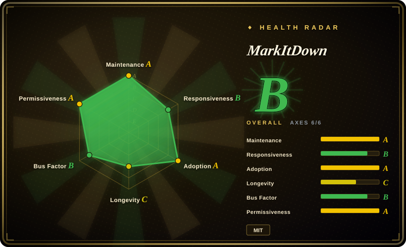
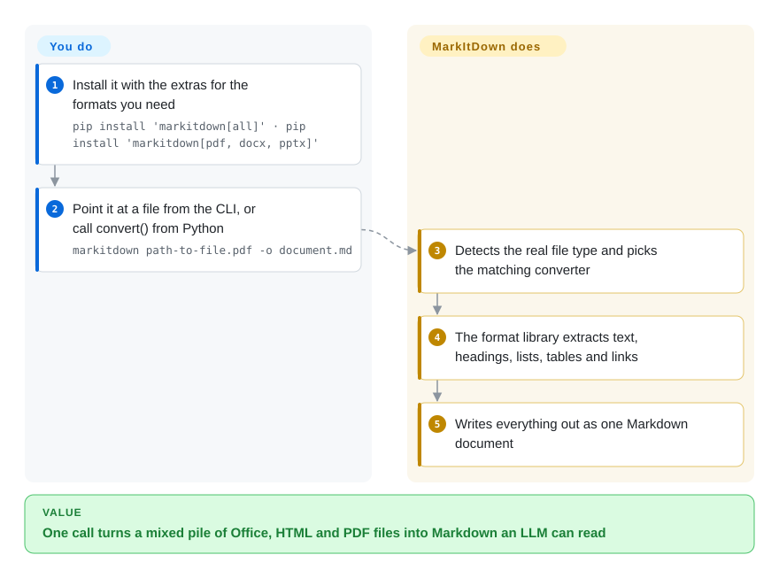

# MarkItDown

Your agent or RAG job is handed a `.docx`, a slide deck, a spreadsheet and a PDF, and each one needs a different library before the model can read a single word. MarkItDown is one Python call (or CLI command) that picks the right converter for each file and gives back plain Markdown — headings, lists, tables and links kept, layout fidelity not promised.

## When to use

You're wiring document input into an LLM app: users drop in Word files, PowerPoints, Excel sheets, HTML exports, EPUBs, the odd PDF, and your code currently has a tangle of `python-docx`, `openpyxl` and `pdfminer` calls that each return text in a different shape. You want one dependency and one call — `markitdown report.docx -o report.md`, or `MarkItDown().convert(path).markdown` in Python — that returns Markdown the model already reads well, with tables as Markdown tables rather than tab-separated mush.

Pick MarkItDown over Docling or Marker when **breadth and lightness beat layout accuracy**: the core install pulls only small pure-Python libraries, there is no PyTorch, no GPU and no model server, and it handles Office, HTML, CSV/JSON/XML, ZIP, EPUB, Outlook `.msg` and YouTube URLs in one place. Pick it over unstructured when you want an in-process MIT library rather than a partitioning framework with a hosted platform beside it. It also ships `markitdown-mcp`, so a coding agent can call the same conversion as an MCP tool.

## How it works

MarkItDown is a Python library plus a `markitdown` CLI. **You** install it with the extras for the formats you need (`[all]`, or e.g. `[pdf, docx, pptx]`) and call `convert` on a path, stream or URL. **MarkItDown** sniffs the file type — using Google's Magika, a small model that guesses a file's real type from its bytes — and hands it to the matching converter: `pdfminer`/`pdfplumber` for PDF text and simple tables, `mammoth` for Word, `python-pptx` for slides, `pandas` for spreadsheets, BeautifulSoup + `markdownify` for HTML. Each converter maps the format's structure to Markdown and returns one string. Anything beyond plain extraction is opt-in and often leaves your machine: image captions and the `markitdown-ocr` plugin call an OpenAI-compatible LLM you pass in, `-d` routes to Azure Document Intelligence, `--use-cu` to Azure Content Understanding, and audio transcription goes through Google's web speech API.

<!-- flow-steps:begin (generated from flows/markitdown.json by tools/flow_card.py — do not edit) -->

Text version of the flow

1. **You**: Install it with the extras for the formats you need — `pip install 'markitdown[all]' · pip install 'markitdown[pdf, docx, pptx]'`
2. **You**: Point it at a file from the CLI, or call convert() from Python — `markitdown path-to-file.pdf -o document.md`
3. **MarkItDown**: Detects the real file type and picks the matching converter
4. **MarkItDown**: The format library extracts text, headings, lists, tables and links
5. **MarkItDown**: Writes everything out as one Markdown document

**Value**: One call turns a mixed pile of Office, HTML and PDF files into Markdown an LLM can read

<!-- flow-steps:end -->

## When NOT to use

- **If your PDFs are scanned, multi-column or full of complex tables and equations, use Marker, Docling or olmOCR instead of MarkItDown, because** the built-in PDF path is text-layer extraction with `pdfminer`/`pdfplumber` — no layout model, no OCR — and the README itself says it "may not be the best option for high-fidelity document conversions".
- **If documents must not leave your network, don't enable the LLM, Azure or audio options — or use Docling, which does OCR locally — because** image captions/OCR (`markitdown-ocr`) call an external LLM, `-d`/`--use-cu` send files to billable Azure services, and audio transcription calls `recognize_google` (Google's web speech API).
- **If you convert untrusted user uploads or URLs in a shared service, sandbox the process or use a dedicated parsing service instead of calling `convert()` directly, because** the README warns MarkItDown "performs I/O with the privileges of the current process" and tells you to sanitize inputs and use the narrowest `convert_*` function.
- **If you need an HTTP API or web UI out of the box, use unstructured's API or Docling Serve instead, because** the maintainers declare servers, REST APIs and frontends out of scope for this repo (only the `markitdown-mcp` server ships).
- **If you need legacy `.doc` / `.ppt` or millisecond conversion with no Python stack, use anydoc instead of MarkItDown, because** MarkItDown lists `.xls` but not legacy Word/PowerPoint binaries, and each format pulls its own Python libraries.
- **If you need round-tripping or editing, use python-docx / PyMuPDF instead, because** MarkItDown converts one way, file → Markdown.

## Comparison

| Alternative | In index | Our verdict | Tradeoff |
|---|---|---|---|
| [Docling](docling.md) | ✅ | Choose Docling when layout, reading order, tables and local OCR must be right across PDFs and Office files; choose MarkItDown when you want a light, model-free converter and can accept flatter output. | Docling brings layout/table models and a heavier install for much better structure; MarkItDown installs in seconds with pure-Python extras but has no layout model or built-in OCR. |
| [Marker](marker.md) | ✅ | Choose Marker when PDFs are the main input and tables, columns and equations must survive; choose MarkItDown when inputs are mostly Office/HTML files. | Marker needs PyTorch plus a local OCR inference server and has a model-weight revenue threshold; MarkItDown is MIT and model-free but much weaker on hard PDFs. |
| [unstructured](unstructured.md) | ✅ | Choose unstructured when you need typed document elements, chunking strategies and a path to a hosted ETL platform; choose MarkItDown for a single Markdown string from an in-process library. | unstructured returns element lists with metadata and has many system dependencies for its full feature set; MarkItDown returns Markdown and stays small. |
| [anydoc](anydoc.md) | ✅ | Choose anydoc for legacy `.doc`/`.ppt` support and millisecond conversion from Rust, Node or the browser; choose MarkItDown for Python-native extras like Outlook, YouTube, audio and LLM image captions. | anydoc is a young single-author 0.x Rust project with no OCR; MarkItDown is Microsoft-maintained Python with a plugin system but slower per-format Python libraries. |
| textract | 未收录 | Choose textract only for maintaining an older pipeline that already uses its plain-text output; for new LLM ingestion choose MarkItDown, which keeps headings, lists and tables as Markdown. | textract (the project MarkItDown's README names as its closest analogue) extracts plain text from many formats; MarkItDown preserves structure as Markdown. |

## Tech stack

- **Language**: Python 3.10–3.14; packaged with Hatch, monorepo under `packages/` (`markitdown`, `markitdown-mcp`, `markitdown-ocr`, `markitdown-sample-plugin`).
- **Core deps**: `beautifulsoup4`, `markdownify`, `requests`, `magika` (file-type detection), `charset-normalizer`, `defusedxml`.
- **Format extras**: `pdfminer.six` + `pdfplumber` (PDF), `mammoth` + `lxml` (DOCX), `python-pptx`, `pandas` + `openpyxl`/`xlrd` (Excel), `olefile` (Outlook), `pydub` + `SpeechRecognition` (audio), `youtube-transcript-api`.
- **Cloud extras**: `azure-ai-documentintelligence`, `azure-ai-contentunderstanding`, `azure-identity`; any OpenAI-compatible client for LLM captions/OCR.
- **Extensibility**: third-party converter plugins (`--use-plugins`, tagged `#markitdown-plugin`); MCP server over STDIO, Streamable HTTP or SSE.

## Dependencies

- **Runtime**: Python 3.10–3.14 and `pip install 'markitdown[all]'` (or only the extras you need).
- **No service, database or GPU** for the built-in converters; runs in your process.
- **Optional system tools**: `exiftool` for image/audio metadata and `ffmpeg` for audio handling — the repo's Dockerfile installs both (`EXIFTOOL_PATH`, `FFMPEG_PATH`).
- **Optional external services**: an OpenAI-compatible LLM (image descriptions, `markitdown-ocr`), Azure Document Intelligence or Content Understanding endpoints (billable), Google's web speech API for audio transcription, YouTube for transcripts.

## Ops difficulty

**Low.** A pip install and an import; it is stateless and in-process, and the bundled Dockerfile just wraps the CLI with `exiftool` and `ffmpeg` preinstalled. The work that remains is choosing extras deliberately (`[all]` pulls pandas, lxml and the Azure SDKs), pinning a 0.x version that still changes between minor releases, and isolating it when inputs are untrusted — the I/O-privilege warning in the README is the one real operational concern. If you enable LLM or Azure paths, add API keys, cost and data-egress review.

## Health & viability

- **Maintenance (2026-10-08):** active — 9 of the last 13 weeks with commits, last commit 4 days before scoring; v0.1.8 shipped 2026-09-21 after two betas, about every 1–2 months in 2026.
- **Responsiveness:** median first response about 63.7 hours across 30 qualifying issues/PRs (2026-10-08 run) — answered within days, not hours.
- **Adoption:** very high — 14,569,559 PyPI downloads of `markitdown` in the last month and ~189k GitHub stars (2026-10), common as the default "file → Markdown" step in agent stacks.
- **Governance:** Microsoft-owned with a CLA; 57 people committed in 12 months, but the top contributor holds 45.6% and the top three 53.7% — a small core decides scope, and the README states that servers and UIs will not be accepted.
- **Age & Lindy:** created 2024-11, under two years old and still 0.x — the Lindy prior is weak; corporate backing and download volume carry the bet. [推断]
- **Risk flags:** MIT, no relicense history. Watch for 0.x API changes and for Microsoft shifting focus toward the Azure-backed paths now built into the library.

## Caveats (unverified)

- [未验证] Which features silently degrade without `exiftool`/`ffmpeg` on the host (outside the Docker image) was not tested; the README does not list them as prerequisites.
- [未验证] How well the `pdfplumber` borderless-table heuristics handle real-world forms was not tested.
- [推断] The weak-Lindy judgment rests on age (~23 months) and 0.x versioning; Microsoft's long-term commitment is not documented.
- [未验证] anydoc's and textract's format coverage come from their own pages/README positioning, not a side-by-side run.
- [未验证] Star and download counts are date-sensitive (2026-10-08) and indicative only; 189k stars on a two-year-old repo partly reflects brand and LLM-tooling hype.
