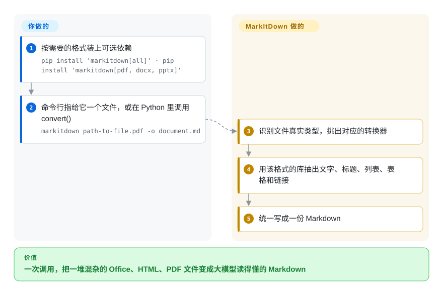

# MarkItDown

你的 agent 或 RAG 任务收到一个 `.docx`、一份幻灯片、一张表格和一个 PDF，每种文件都得先换一个库处理，模型才读得到第一个字。MarkItDown 只要一次 Python 调用（或一条命令），就为每个文件挑好对应的转换器，统一吐出纯 Markdown——标题、列表、表格、链接都保留，但不承诺版面还原。

## 何时使用

你在给一个大模型应用接文档输入：用户会丢进来 Word、PowerPoint、Excel、导出的 HTML、EPUB，偶尔还有 PDF，而你的代码里现在缠着 `python-docx`、`openpyxl`、`pdfminer` 一堆调用，每个返回的文本形状都不一样。你想要一个依赖、一次调用——`markitdown report.docx -o report.md`，或者 Python 里的 `MarkItDown().convert(path).markdown`——拿回模型本来就读得顺的 Markdown，表格是 Markdown 表格，而不是一团用制表符隔开的字。

当**格式覆盖面和轻量比版面准确更重要**时，选 MarkItDown 而不是 Docling 或 Marker：核心安装只拉一些小型纯 Python 库，不要 PyTorch、不要 GPU、不要模型服务，Office、HTML、CSV/JSON/XML、ZIP、EPUB、Outlook `.msg`、YouTube 链接一处搞定。想要一个进程内的 MIT 库、而不是旁边还挂着托管平台的分块框架时，选它而不是 unstructured。它还自带 `markitdown-mcp`，coding agent 可以把同样的转换当 MCP 工具调用。

## 怎么用起来

MarkItDown 是一个 Python 库加一个 `markitdown` 命令行。**你要做的**：按需要的格式装上对应的可选依赖（`[all]`，或者比如 `[pdf, docx, pptx]`），然后对文件路径、数据流或 URL 调用 `convert`。**MarkItDown 替你做的**：先识别文件类型——用 Google 的 Magika，一个根据文件字节猜出真实类型的小模型——再交给对应的转换器：PDF 文字和简单表格用 `pdfminer`/`pdfplumber`，Word 用 `mammoth`，幻灯片用 `python-pptx`，表格用 `pandas`，HTML 用 BeautifulSoup 加 `markdownify`。每个转换器把该格式的结构映射成 Markdown，返回一个字符串。超出纯抽取的能力都要你主动打开，而且往往会把数据送出本机：图片描述和 `markitdown-ocr` 插件调用你传入的 OpenAI 兼容大模型，`-d` 走 Azure Document Intelligence，`--use-cu` 走 Azure Content Understanding，音频转写走 Google 的网页语音识别接口。

<!-- flow-steps:begin (generated from flows/markitdown.json by tools/flow_card.py — do not edit) -->

流程文字版

1. **你**：按需要的格式装上可选依赖 — `pip install 'markitdown[all]' · pip install 'markitdown[pdf, docx, pptx]'`
2. **你**：命令行指给它一个文件，或在 Python 里调用 convert() — `markitdown path-to-file.pdf -o document.md`
3. **MarkItDown**：识别文件真实类型，挑出对应的转换器
4. **MarkItDown**：用该格式的库抽出文字、标题、列表、表格和链接
5. **MarkItDown**：统一写成一份 Markdown

**价值**：一次调用，把一堆混杂的 Office、HTML、PDF 文件变成大模型读得懂的 Markdown

<!-- flow-steps:end -->

## 何时不用

- **如果你的 PDF 是扫描件、多栏排版，或者满是复杂表格和公式，用 Marker、Docling 或 olmOCR，而不是 MarkItDown，因为**内置的 PDF 路径只是用 `pdfminer`/`pdfplumber` 抽文字层——没有版面模型，也没有 OCR——README 自己也说它“可能不是高保真文档转换的最佳选择”。
- **如果文档不能离开你的网络，就别开大模型、Azure 和音频选项——或者改用能在本地做 OCR 的 Docling——因为**图片描述/OCR（`markitdown-ocr`）要调用外部大模型，`-d`/`--use-cu` 会把文件发给按次计费的 Azure 服务，音频转写调用的是 `recognize_google`（Google 的网页语音识别接口）。
- **如果要在共享服务里转换不可信的用户上传或 URL，把进程放进沙箱，或者改用专门的解析服务，不要直接调用 `convert()`，因为**README 警告 MarkItDown“以当前进程的权限做 I/O”，并要求你清洗输入、调用范围最窄的 `convert_*` 函数。
- **如果你要开箱即用的 HTTP API 或网页界面，用 unstructured 的 API 或 Docling Serve，因为**维护者明确把服务端、REST API 和前端划在这个仓库的范围之外（只提供 `markitdown-mcp` 服务）。
- **如果你要处理老式 `.doc` / `.ppt`，或者要在没有 Python 环境的情况下毫秒级转换，用 anydoc，而不是 MarkItDown，因为**MarkItDown 支持 `.xls`，但不支持老式 Word/PowerPoint 二进制格式，而且每种格式都要拉各自的 Python 库。
- **如果你需要回写或编辑原文档，用 python-docx / PyMuPDF，因为**MarkItDown 只做单向转换：文件 → Markdown。

## 横向对比

| 替代品 | 是否收录 | 我们的评价 | 取舍 |
|---|---|---|---|
| [Docling](docling.zh.md) | 已收录 | PDF 和 Office 文件的版面、阅读顺序、表格和本地 OCR 都必须正确时，选 Docling；想要轻量、不带模型的转换器、能接受更扁平的输出时，选 MarkItDown。 | Docling 带版面/表格模型、安装更重，换来好得多的结构；MarkItDown 几秒装好、可选依赖都是纯 Python，但没有版面模型，也没有内置 OCR。 |
| [Marker](marker.zh.md) | 已收录 | 输入以 PDF 为主、表格分栏公式都得保住时，选 Marker；输入主要是 Office/HTML 文件时，选 MarkItDown。 | Marker 要 PyTorch 加一个本地 OCR 推理服务，模型权重还有营收门槛；MarkItDown 是 MIT、不带模型，但遇到难啃的 PDF 弱得多。 |
| [unstructured](unstructured.zh.md) | 已收录 | 需要带类型的文档元素、分块策略、以及通往托管 ETL 平台的路时，选 unstructured；只要进程内的库给出一个 Markdown 字符串时，选 MarkItDown。 | unstructured 返回带元数据的元素列表，完整功能要装很多系统依赖；MarkItDown 只返回 Markdown，体积小。 |
| [anydoc](anydoc.zh.md) | 已收录 | 需要老式 `.doc`/`.ppt`、要在 Rust、Node 或浏览器里毫秒级转换时，选 anydoc；需要 Outlook、YouTube、音频、大模型图片描述这类 Python 生态的扩展时，选 MarkItDown。 | anydoc 是单作者维护的年轻 0.x Rust 项目，没有 OCR；MarkItDown 是微软维护的 Python 库，有插件体系，但每种格式走各自的 Python 库，更慢。 |
| textract | 未收录 | 只在维护一条已经依赖其纯文本输出的老流水线时选 textract；新的大模型文档接入选 MarkItDown，它把标题、列表、表格保留成 Markdown。 | textract（MarkItDown 的 README 点名的最接近的同类）从多种格式抽纯文本；MarkItDown 把结构保留为 Markdown。 |

## 技术栈

- **语言**：Python 3.10–3.14；用 Hatch 打包，`packages/` 下是单仓多包（`markitdown`、`markitdown-mcp`、`markitdown-ocr`、`markitdown-sample-plugin`）。
- **核心依赖**：`beautifulsoup4`、`markdownify`、`requests`、`magika`（文件类型识别）、`charset-normalizer`、`defusedxml`。
- **格式可选依赖**：`pdfminer.six` + `pdfplumber`（PDF）、`mammoth` + `lxml`（DOCX）、`python-pptx`、`pandas` + `openpyxl`/`xlrd`（Excel）、`olefile`（Outlook）、`pydub` + `SpeechRecognition`（音频）、`youtube-transcript-api`。
- **云服务可选依赖**：`azure-ai-documentintelligence`、`azure-ai-contentunderstanding`、`azure-identity`；大模型图片描述/OCR 可接任意 OpenAI 兼容客户端。
- **扩展方式**：第三方转换器插件（`--use-plugins`，打 `#markitdown-plugin` 标签）；MCP 服务支持 STDIO、Streamable HTTP 和 SSE。

## 依赖

- **运行时**：Python 3.10–3.14，`pip install 'markitdown[all]'`（或只装需要的可选依赖）。
- **内置转换器不需要服务、数据库或 GPU**；在你的进程内运行。
- **可选系统工具**：图片/音频元数据用 `exiftool`，音频处理用 `ffmpeg`——仓库的 Dockerfile 会装好这两个（`EXIFTOOL_PATH`、`FFMPEG_PATH`）。
- **可选外部服务**：OpenAI 兼容大模型（图片描述、`markitdown-ocr`）、Azure Document Intelligence 或 Content Understanding 端点（计费）、音频转写用的 Google 网页语音识别接口、取字幕用的 YouTube。

## 运维难度

**低。**pip 安装、import 即用；无状态、进程内运行，自带的 Dockerfile 只是把命令行和预装好的 `exiftool`、`ffmpeg` 包了一层。剩下的工作是：有意识地挑可选依赖（`[all]` 会拉进 pandas、lxml 和 Azure SDK），锁定一个次版本之间仍会变化的 0.x 版本，以及在输入不可信时把它隔离起来——README 里那条 I/O 权限警告是唯一真正的运维隐患。如果打开大模型或 Azure 路径，还要加上 API 密钥、费用和数据外发的审查。

## 健康度与可持续性

- **维护（2026-10-08）**：活跃——最近 13 周有 9 周有提交，评分时最后一次提交在 4 天前；v0.1.8 经过两个 beta 后于 2026-09-21 发布，2026 年大约每 1–2 个月一个版本。
- **响应速度**：2026-10-08 评分中 30 个合格 issue/PR 的首次回复中位数约 63.7 小时——几天内有人回，不是几小时。
- **采用度**：非常高——`markitdown` 在 PyPI 上月下载 14,569,559 次，GitHub 约 18.9 万星（2026-10），是 agent 技术栈里常见的默认“文件 → Markdown”环节。
- **治理**：微软持有，需签 CLA；12 个月内有 57 人提交，但第一名占 45.6%、前三名占 53.7%——范围由一个小核心决定，README 也写明不接受服务端和界面类贡献。
- **年龄与 Lindy**：2024-11 创建，不到两年，还在 0.x——Lindy 先验偏弱，押注靠的是公司背书和下载量。[推断]
- **风险信号**：MIT，没有改许可的历史。要留意 0.x 的 API 变动，以及微软把重心移向已经内置进库里的 Azure 路径。

## 存疑（未验证）

- [未验证] 宿主机（Docker 镜像之外）没装 `exiftool`/`ffmpeg` 时哪些功能会悄悄降级，没有测试；README 没把它们列为前置条件。
- [未验证] `pdfplumber` 无边框表格启发式在真实表单上的效果没有测试。
- [推断] Lindy 偏弱的判断依据是年龄（约 23 个月）和 0.x 版本号；微软的长期投入没有公开文档。
- [未验证] anydoc 和 textract 的格式覆盖来自它们自己的页面/README 定位，没有并排跑过。
- [未验证] 星数和下载量随日期变化（2026-10-08），仅作参考；一个两年的仓库有 18.9 万星，部分反映的是品牌和大模型工具热潮。
