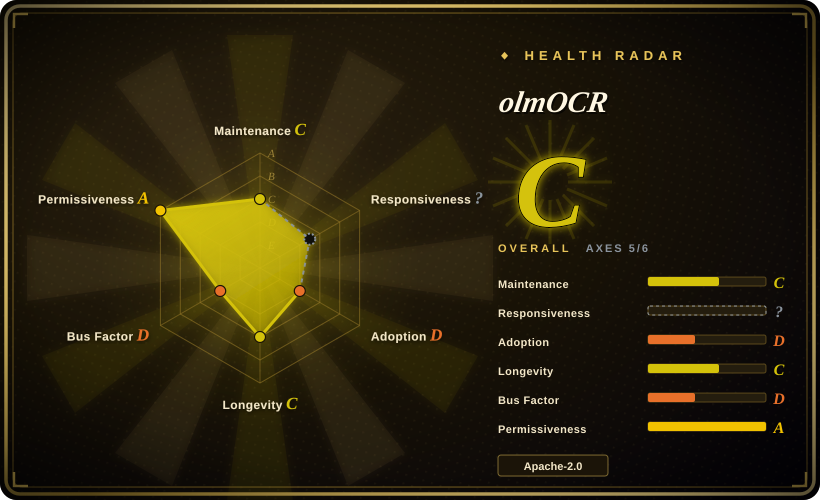
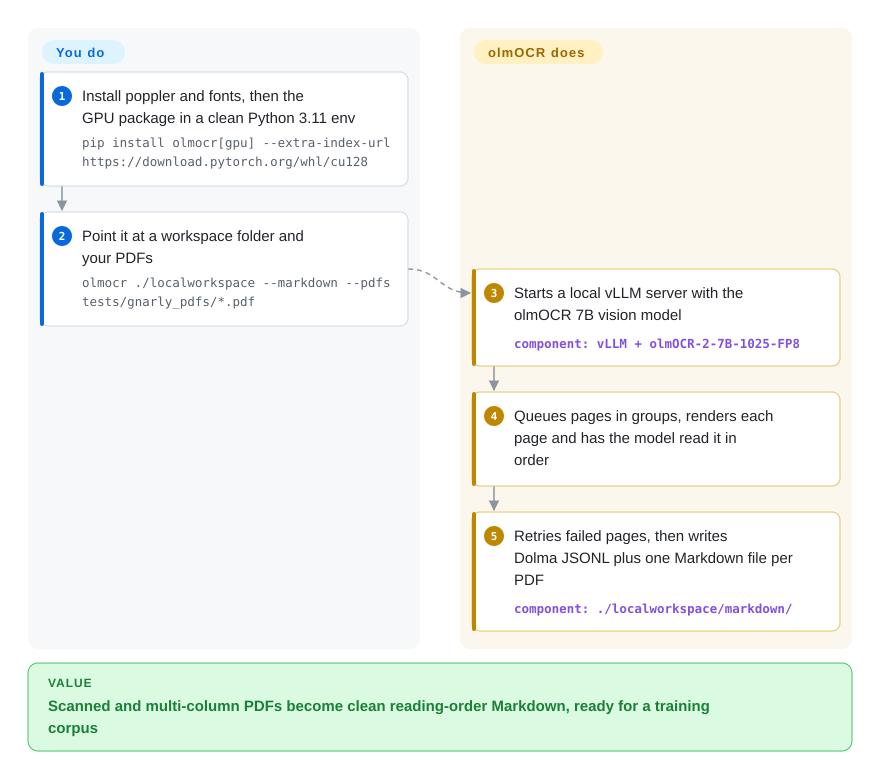

# olmOCR

Your PDF-to-text step turns equations into gibberish, tables into run-on lines, and two-column papers into sentences spliced across columns — tolerable for search, poison for a training corpus. olmOCR has a vision model look at each rendered page and re-type it as Markdown in reading order, as a batch job over thousands to millions of PDFs on your own GPUs.

## When to use

You're a machine learning researcher or data engineer preparing a large-scale corpus of academic papers, technical manuals, and scanned documents for pre-training or fine-tuning an LLM. Your existing pipeline extracts raw text from PDFs but drops equations, garbles tables, loses multi-column reading order, and embeds headers and footers as if they were body text. You need clean, natural-reading Markdown that preserves the semantic structure of equations, tables, and complex layouts without the noise. You choose olmOCR over Docling because its VLM-based approach provides deeper semantic understanding of complex documents than Docling's layout-aware heuristics; you pick it over MarkItDown because MarkItDown handles basic office documents but cannot reconstruct equations, tables, or handwritten content; you prefer it over Marker when most pages are scans or messy layouts, because Marker leans on the PDF text layer and sends only bad pages to its OCR model, while olmOCR reads every page with the VLM. You install olmOCR, point it at a directory of PDFs, and it outputs structured Markdown files with headers and footers removed, equations in LaTeX, and tables reconstructed — ready for tokenization and training. It is purpose-built for dataset construction, not one-off document reading.

## How it works

olmOCR is a batch pipeline wrapped around one vision-language model (VLM — a model that looks at an image and writes text about it): olmOCR-2-7B, a fine-tune of Qwen2.5-VL-7B. **It runs the whole conveyor belt for you**: it starts a local vLLM server (an inference engine that keeps the model loaded on the GPU and batches requests), splits your PDFs into page groups on a work queue inside the workspace folder, renders each page to an image, has the model transcribe it in natural reading order — equations as LaTeX, tables rebuilt, headers and footers dropped — retries pages that fail, and writes Dolma JSONL (AI2's corpus format) plus, with `--markdown`, one Markdown file per PDF. **You provide the GPU (a recent NVIDIA card with 12 GB+ of memory, per the README), a clean Python 3.11 environment and the PDFs** — or skip the local GPU and point `--server` at a vLLM / OpenAI-compatible endpoint someone else runs. The workspace can also be an S3 prefix, so more machines can join the same queue; that is how it scales to millions of pages.

<!-- flow-steps:begin (generated from flows/olmocr.json by tools/flow_card.py — do not edit) -->

Text version of the flow

1. **You**: Install poppler and fonts, then the GPU package in a clean Python 3.11 env — `pip install olmocr[gpu] --extra-index-url https://download.pytorch.org/whl/cu128`
2. **You**: Point it at a workspace folder and your PDFs — `olmocr ./localworkspace --markdown --pdfs tests/gnarly_pdfs/*.pdf`
3. **olmOCR**: Starts a local vLLM server with the olmOCR 7B vision model — component: `vLLM + olmOCR-2-7B-1025-FP8`
4. **olmOCR**: Queues pages in groups, renders each page and has the model read it in order
5. **olmOCR**: Retries failed pages, then writes Dolma JSONL plus one Markdown file per PDF — component: `./localworkspace/markdown/`

**Value**: Scanned and multi-column PDFs become clean reading-order Markdown, ready for a training corpus

<!-- flow-steps:end -->

## When NOT to use

- **No GPU, and pages may not leave your machine.** Local inference needs a recent NVIDIA GPU with at least 12 GB of memory and ~30 GB of disk (README). Without one, the lightweight `pip install olmocr` can send pages to a remote vLLM server or a hosted provider via `--server`, but then documents leave your box and you pay per token. For CPU-only, fully local conversion use [Docling](docling.md) or [MarkItDown](markitdown.md) instead, accepting weaker handling of equations and messy scans.
- **Quiet upstream since 2026-03.** The last commit was 2026-03-25 and the last release v0.4.27 (2026-03-12) after a near-weekly 2025 cadence; if you need fixes on your timeline (new vLLM/CUDA versions), budget for pinning and patching yourself, or prefer [Docling](docling.md), which is hosted under LF AI & Data with more than one maintainer.
- **Cost-sensitive at massive scale.** If you need high-volume batch processing where layout fidelity is not critical, use PyMuPDF or Tesseract instead of olmOCR, because pure rule-based or traditional OCR extraction is still cheaper than VLM inference even though the README claims less than $200 USD per million pages.
- **Simple, clean text PDFs.** If your PDFs are already well-structured digital text with no equations, tables, or multi-column layouts, use [MarkItDown](markitdown.md) or PyMuPDF instead of olmOCR, because lighter tools will be faster and cheaper for basic extraction.
- **Real-time or streaming parsing.** If you need low-latency, on-demand document conversion, use [Docling](docling.md) or [MarkItDown](markitdown.md) instead of olmOCR, because the VLM inference pipeline is designed for batch dataset preparation, not real-time streaming.
- **Proprietary or sensitive documents without audit.** If your documents require strict data residency or no neural model processing, use self-hosted Docling or on-premise Tesseract instead of olmOCR, because sending documents through a VLM pipeline means they are processed by a neural model and you must verify the offline deployment path before use.
- **Document editing or round-tripping.** If you need to edit, modify, or write back to the original PDF format, use Adobe Acrobat or a dedicated PDF editor instead of olmOCR, because this is one-way PDF-to-Markdown conversion with no write-back capability.
- **Layout-perfect reproduction for human publishing.** If you need pixel-perfect or print-quality reproduction of complex visual layouts, use Adobe Acrobat or professional typesetting tools instead of olmOCR, because the output is optimized for machine-readable Markdown (training data, RAG) and may simplify visual layouts.

## Comparison

| Alternative | In index | Our verdict | Tradeoff |
|---|---|---|---|
| [Docling](docling.md) | ✅ | For mixed office/PDF documents on CPU or in a RAG ingestion service, pick Docling; pick olmOCR when you are building a training corpus from scans and equation-heavy PDFs and have GPUs. | Docling runs layout models plus heuristics locally without a big GPU and emits richer structured JSON; olmOCR's single VLM pass reads messy pages more robustly but costs GPU hours. |
| [MarkItDown](markitdown.md) | ✅ | For quick conversion of born-digital Office files and clean PDFs into LLM context, pick MarkItDown; pick olmOCR only when scans, equations or multi-column layouts break it. | MarkItDown is a pip-install with no model at all; it cannot see a scanned page or rebuild a table from pixels. |
| [Marker](marker.md) | ✅ | For mostly born-digital PDF collections, pick Marker: it reads the text layer and sends only bad pages to its OCR model; pick olmOCR when every page should go through a vision model or you want S3-queued corpus runs. | Marker's selective OCR saves GPU time and adds a `--use_llm` repair pass; olmOCR treats every page the same way, which is simpler on scans but costs a GPU pass per page. |
| LlamaParse | 未收录 | For teams with no GPUs that are allowed to upload documents, pick LlamaParse; pick olmOCR when documents must stay on your own hardware or volume makes usage fees add up. | Parsing runs on LlamaIndex's hosted service behind an API key: zero infrastructure, but usage-based pricing and data leaves your network. |
| [Tesseract](../ocr/tesseract.md) / OCRmyPDF | 部分已收录 | For a cheap searchable text layer on scans, pick Tesseract or OCRmyPDF (not indexed); pick olmOCR when reading order, tables and equations must survive. | Classic OCR runs on CPU at a fraction of the cost, but outputs flat text lines with no layout semantics. |
| [PyMuPDF](../pdf-tools/pdf-reading/pymupdf.md) | ✅ | For born-digital PDFs where the embedded text layer is already right, pick PyMuPDF; pick olmOCR when the text layer is missing or scrambled. | PyMuPDF extracts embedded text in milliseconds with no model, but cannot fix a bad or absent text layer. |

## Tech stack

- **Python** — the `olmocr` CLI (`olmocr.pipeline`) orchestrates everything.
- **Model** — olmOCR-2-7B-1025 (FP8 variant by default in the README examples), fine-tuned from Qwen2.5-VL-7B-Instruct per its Hugging Face model card.
- **Inference** — vLLM (pinned `vllm==0.11.2` with `torch>=2.7.0`, `transformers==4.57.3` in the `gpu` extra); switched from SGLang to vLLM in v0.1.75.
- **PDF handling** — poppler-utils for rendering pages, plus `pypdf`/`pypdfium2` in the base package.
- **Output** — Dolma JSONL in the workspace, optional Markdown mirror (`--markdown`); workspaces may be local or S3 (`boto3`).

## Dependencies

- **GPU (local mode)** — a recent NVIDIA GPU with ≥12 GB of GPU RAM (tested on RTX 4090, L40S, A100, H100) and ~30 GB free disk, per the README. Not needed if you use `--server` against a remote endpoint.
- **Python ≥ 3.11** (`requires-python` in `pyproject.toml`); the README insists on a clean conda environment because the GPU stack is hard to install into an existing one.
- **System packages** — `poppler-utils` and a set of fonts (MS core fonts, Carlito, Caladea, etc.) for page rendering.
- **Model weights** — pulled from Hugging Face (`allenai/olmOCR-2-7B-1025-FP8`), or baked into the ~30 GB `alleninstituteforai/olmocr:latest-with-model` Docker image.
- **Optional** — an OpenAI-compatible inference endpoint (`--server`), S3 for multi-node work queues, Beaker for AI2-internal clusters. No database or long-running service of its own.

## Ops difficulty

**Medium.** Requires GPU setup and model weight management. The inference pipeline is more complex than a pure Python library. Batch processing is straightforward once the model is loaded, but you need to manage GPU memory, model download/caching, and potentially queue documents for throughput. The claimed cost of less than $200 per million pages suggests efficient batching, but achieving that efficiency requires tuning batch size and GPU utilization.

## Health & viability

- **Maintenance**: Grade C — 0/13 active weeks in trailing 13; last commit 197 days ago (2026-03-25). About 34 releases shipped in 2025 (v0.1.58 in 2025-02 through the v0.4.x line), then stopped at v0.4.27 (2026-03-12): an active research tool that has gone quiet, not an archived one.
- **Responsiveness**: Cannot be scored — no_window_signal.
- **Adoption**: Grade D — 19,942 monthly downloads via pypi.org (package: olmocr); ~19.7k GitHub stars show far more attention than package installs.
- **Longevity**: Grade C — 751 days old; too young for a Lindy prior either way.
- **Governance**: Grade D — top-3 contributor share 99.7% (4 active maintainers in the trailing 12 months): in practice one AI2 researcher's project, backed by the institute.
- **Risk / License**: Grade A — Apache-2.0 license; the model weights are also Apache-2.0 on Hugging Face.

## Caveats (unverified)

- [未验证] The 12 GB GPU-memory floor and the tested-GPU list come from the README; real throughput per GPU was not measured here.
- [未验证] The "less than $200 USD per million pages" claim is from the README; actual cost depends on GPU type, region, cloud provider pricing, and batching efficiency.
- [未验证] Support for handwriting, equations, and complex formatting quality varies by document type; the VLM may hallucinate or misinterpret rare or highly stylized layouts.
- [未验证] The base model (Qwen2.5-VL-7B-Instruct) comes from the Hugging Face model card metadata, not from the README or a training-code read.
- [推断] The "one AI2 researcher" reading of governance is inferred from contributor share (top-1 98.7%), not from a stated ownership document.
- [推断] AI2's long-term maintenance commitment to this specific tool versus their broader OLMo ecosystem is plausible but not guaranteed; the project could be deprioritized if it no longer serves strategic research goals.
- [推断] ~19.7k stars (2026-10) on a ~2-year-old project reflect the AI2 brand and the 2024–2025 LLM dataset tooling hype cycle, not just organic adoption; the gap to ~20k monthly PyPI downloads supports that reading.
