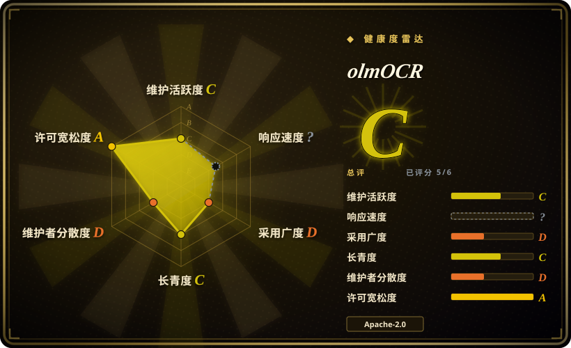
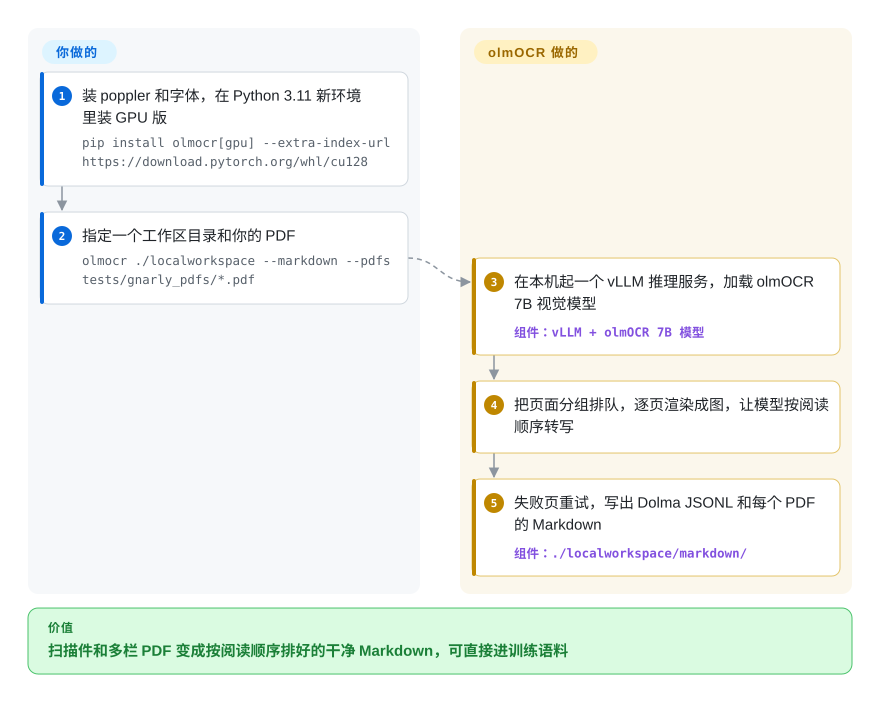

# olmOCR

你的 PDF 抽文本流程把公式抽成乱码、表格抽成一行行粘连的字、双栏论文的句子左右栏交错拼在一起——拿来检索还能凑合，拿来做训练语料就是毒药。olmOCR 让一个视觉模型逐页“看”渲染出来的页面，按阅读顺序重新打成 Markdown，在你自己的 GPU 上批量处理成千上万份 PDF。

## 何时使用

你是一名机器学习研究员或数据工程师，正在为预训练或微调 LLM 准备大规模语料库，涵盖学术论文、技术手册和扫描文档。现有流水线从 PDF 提取原始文本时，会丢弃公式、搞乱表格、丢失多栏阅读顺序，还把页眉页脚混进正文。你需要干净、自然阅读的 Markdown，保留公式、表格和复杂版面的语义结构，同时去除噪声。你选择 olmOCR 而不是 Docling，因为它的 VLM 方案对复杂文档的语义理解比 Docling 的版面感知启发式更深；你选它而不是 MarkItDown，因为 MarkItDown 只能处理基础办公文档，无法重建公式、表格或手写内容；当大部分页面是扫描件或版面很乱时，你选它而不是 Marker，因为 Marker 依赖 PDF 自带的文本层，只把坏页送给 OCR 模型，而 olmOCR 每一页都交给 VLM 读。你安装 olmOCR，指向一个 PDF 目录，它输出结构化 Markdown 文件——页眉页脚已移除、公式以 LaTeX 保留、表格被重建——可直接用于 tokenization 和训练。它是为数据集构建而设计的，而非一次性文档阅读。

## 怎么用起来

olmOCR 是围绕一个视觉语言模型（VLM——看一张图、写出关于它的文字的模型）搭起来的批处理流水线，模型是 olmOCR-2-7B，由 Qwen2.5-VL-7B 微调而来。**整条传送带它替你跑**：在本机起一个 vLLM 服务（把模型常驻在 GPU 上、把请求攒批处理的推理引擎），把你的 PDF 按页分组放进工作区目录里的任务队列，逐页渲染成图片，让模型按自然阅读顺序转写——公式写成 LaTeX、表格重建、页眉页脚去掉——失败的页自动重试，最后写出 Dolma JSONL（AI2 的语料格式），加上 `--markdown` 时每个 PDF 再出一份 Markdown。**你要提供的是 GPU（README 要求较新的 NVIDIA 卡、显存 12 GB 以上）、一个干净的 Python 3.11 环境和 PDF 本身**——或者不用本地 GPU，用 `--server` 指向别人跑着的 vLLM / OpenAI 兼容接口。工作区也可以是一个 S3 前缀，多台机器可以接入同一个队列，它就是这样扩到百万页规模的。

<!-- flow-steps:begin (generated from flows/olmocr.json by tools/flow_card.py — do not edit) -->

流程文字版

1. **你**：装 poppler 和字体，在 Python 3.11 新环境里装 GPU 版 — `pip install olmocr[gpu] --extra-index-url https://download.pytorch.org/whl/cu128`
2. **你**：指定一个工作区目录和你的 PDF — `olmocr ./localworkspace --markdown --pdfs tests/gnarly_pdfs/*.pdf`
3. **olmOCR**：在本机起一个 vLLM 推理服务，加载 olmOCR 7B 视觉模型 — 组件：`vLLM + olmOCR 7B 模型`
4. **olmOCR**：把页面分组排队，逐页渲染成图，让模型按阅读顺序转写
5. **olmOCR**：失败页重试，写出 Dolma JSONL 和每个 PDF 的 Markdown — 组件：`./localworkspace/markdown/`

**价值**：扫描件和多栏 PDF 变成按阅读顺序排好的干净 Markdown，可直接进训练语料

<!-- flow-steps:end -->

## 何时不用

- **没有 GPU，且页面不能离开你的机器。**本地推理需要较新的 NVIDIA GPU（显存至少 12 GB）和约 30 GB 磁盘（README）。没有 GPU 时，轻量的 `pip install olmocr` 可以用 `--server` 把页面发给远端 vLLM 服务或托管厂商，但文档就离开了你的机器，还要按 token 付费。要纯 CPU、完全本地的转换，请改用 [Docling](docling.zh.md) 或 [MarkItDown](markitdown.zh.md)，代价是公式和脏扫描件处理得更差。
- **上游自 2026-03 起安静。**最后一次提交是 2026-03-25，最后一个版本 v0.4.27（2026-03-12），此前 2025 年几乎每周发版；如果你需要按自己的节奏拿到修复（新 vLLM/CUDA 版本），要预留自己锁版本、打补丁的人力，或者改选 [Docling](docling.zh.md)——它托管在 LF AI & Data 之下，维护者不止一人。
- **大规模成本敏感场景。**如果你需要高批量处理且对版面保真度要求不高，请改用 PyMuPDF 或 Tesseract，而不是 olmOCR，因为纯规则式或传统 OCR 提取仍比 VLM 推理更便宜，尽管 README 声称每百万页不到 200 美元。
- **简单、干净的纯文本 PDF。**如果你的 PDF 已是结构良好的数字文本，不含公式、表格或多栏布局，请改用 [MarkItDown](markitdown.zh.md) 或 PyMuPDF，而不是 olmOCR，因为更轻量的工具会更快、更便宜。
- **实时或流式解析。**如果你需要低延迟、按需文档转换，请改用 [Docling](docling.zh.md) 或 [MarkItDown](markitdown.zh.md)，而不是 olmOCR，因为 VLM 推理流水线面向数据集批处理设计，非实时流式。
- **专有或敏感文档未经审计。**如果你的文档要求严格的数据驻留或不接受神经网络模型处理，请改用自托管 Docling 或本地 Tesseract，而不是 olmOCR，因为将文档送入 VLM 流水线意味着由神经网络模型处理，你必须在使用前验证离线部署路径。
- **文档编辑或往返转换。**如果你需要编辑、修改或回写原始 PDF 格式，请改用 Adobe Acrobat 或专用 PDF 编辑器，而不是 olmOCR，因为这是单向 PDF 转 Markdown 转换，无回写能力。
- **面向人类出版的版面完美复现。**如果你需要像素级或印刷级复现复杂视觉版面，请改用 Adobe Acrobat 或专业排版工具，而不是 olmOCR，因为输出针对机器可读的 Markdown（训练数据、RAG）优化，可能简化视觉版面。

## 横向对比

| 替代品 | 是否收录 | 我们的评价 | 取舍 |
|---|---|---|---|
| [Docling](docling.zh.md) | ✅ | 处理混合的办公文档/PDF、跑在 CPU 上或放进 RAG 入库服务，选 Docling；要从扫描件和公式密集的 PDF 构建训练语料、手里又有 GPU，选 olmOCR。 | Docling 在本地用版面模型加启发式，不需要大 GPU，输出更丰富的结构化 JSON；olmOCR 用单个 VLM 一遍读完，对脏页面更稳，但要花 GPU 时间。 |
| [MarkItDown](markitdown.zh.md) | ✅ | 要把原生数字版 Office 文件和干净 PDF 快速转成 LLM 上下文，选 MarkItDown；只有扫描件、公式或多栏版面让它失手时才换 olmOCR。 | MarkItDown 一个 pip 包、完全不用模型；但它看不见扫描页，也不能从像素里重建表格。 |
| [Marker](marker.zh.md) | ✅ | PDF 大多是原生数字版时选 Marker：它读文本层，只把坏页送给 OCR 模型；要每页都过视觉模型，或要用 S3 队列跑语料级批处理时，选 olmOCR。 | Marker 只在需要时 OCR，省 GPU 时间，还带 `--use_llm` 修复环节；olmOCR 对每页一视同仁，处理扫描件更简单，但每页都要过一遍 GPU。 |
| LlamaParse | 未收录 | 团队没有 GPU、又允许上传文档时，选 LlamaParse；文档必须留在自己硬件上，或量大到按量计费吃不消时，选 olmOCR。 | 解析在 LlamaIndex 的托管服务上跑，凭 API key 调用：零基础设施，但按量计费，数据离开你的网络。 |
| [Tesseract](../ocr/tesseract.zh.md) / OCRmyPDF | 部分已收录 | 只想给扫描件加一层便宜的可搜索文本，选 Tesseract 或 OCRmyPDF（未收录）；阅读顺序、表格和公式必须保住时，选 olmOCR。 | 传统 OCR 在 CPU 上跑，成本只是零头，但输出的是没有版面语义的平铺文本行。 |
| [PyMuPDF](../pdf-tools/pdf-reading/pymupdf.zh.md) | ✅ | 原生数字版 PDF、自带文本层本来就对时，选 PyMuPDF；文本层缺失或错乱时，选 olmOCR。 | PyMuPDF 不用模型，毫秒级抽出内嵌文本，但修不了坏掉或缺失的文本层。 |

## 技术栈

- **Python**——`olmocr` 命令行（`olmocr.pipeline`）编排全流程。
- **模型**——olmOCR-2-7B-1025（README 示例默认用 FP8 版本），据 Hugging Face 模型卡由 Qwen2.5-VL-7B-Instruct 微调而来。
- **推理**——vLLM（`gpu` 扩展里锁定 `vllm==0.11.2`，配 `torch>=2.7.0`、`transformers==4.57.3`）；v0.1.75 起从 SGLang 换成 vLLM。
- **PDF 处理**——用 poppler-utils 渲染页面，基础包里还有 `pypdf`/`pypdfium2`。
- **输出**——工作区里的 Dolma JSONL，可选 Markdown 镜像（`--markdown`）；工作区可以是本地目录或 S3（`boto3`）。

## 依赖

- **GPU（本地模式）**——README 要求较新的 NVIDIA GPU，显存至少 12 GB（在 RTX 4090、L40S、A100、H100 上测过），外加约 30 GB 空闲磁盘。用 `--server` 连远端接口时不需要。
- **Python ≥ 3.11**（`pyproject.toml` 的 `requires-python`）；README 强调要新建干净的 conda 环境，因为 GPU 依赖很难装进已有环境。
- **系统包**——`poppler-utils` 和一组字体（MS core fonts、Carlito、Caladea 等），用于渲染页面。
- **模型权重**——从 Hugging Face 拉取（`allenai/olmOCR-2-7B-1025-FP8`），或直接用打包了模型、约 30 GB 的 `alleninstituteforai/olmocr:latest-with-model` Docker 镜像。
- **可选**——OpenAI 兼容推理接口（`--server`）、多机任务队列用的 S3、AI2 内部集群用的 Beaker。它自己没有数据库，也没有常驻服务。

## 运维难度

**中。**需要 GPU 配置与模型权重管理。推理流水线比纯 Python 库更复杂。模型加载后批处理较直接，但你需要管理 GPU 内存、模型下载/缓存，并可能需要为吞吐量对文档排队。README 声称每百万页不到 200 美元，暗示批量效率较高，但达到该效率需要调优 batch size 和 GPU 利用率。

## 健康度与可持续性

- **维护活跃度**：Grade C——最近 13 周中 0 周有提交；最后提交距今 197 天（2026-03-25）。2025 年发了约 34 个版本（从 2025-02 的 v0.1.58 一路到 v0.4.x），然后停在 v0.4.27（2026-03-12）：是一个变安静了的活跃研究工具，不是归档项目。
- **响应速度**：无法计算——no_window_signal。
- **采用广度**：Grade D——pypi.org 上月下载量 19,942（包名：olmocr）；GitHub 上约 19.7k star，关注度远高于包安装量。
- **长青度**：Grade C——仓库已创建 751 天；太年轻，Lindy 先验说明不了什么。
- **治理集中度**：Grade D——前三贡献者占比 99.7%（过去 12 个月内 4 位活跃维护者）：实际上是 AI2 一位研究员的项目，由研究所背书。
- **许可风险**：Grade A——Apache-2.0 许可证；Hugging Face 上的模型权重同样是 Apache-2.0。

## 存疑（未验证）

- [未验证] 12 GB 显存下限和测试过的 GPU 列表来自 README；每块 GPU 的实际吞吐没有在这里实测。
- [未验证] “每百万页不到 200 美元” 的说法来自 README；实际成本取决于 GPU 型号、区域、云厂商定价和批处理效率。
- [未验证] 对手写体、公式和复杂版面的支持质量因文档类型而异；VLM 可能对罕见或高度风格化版面产生幻觉或误读。
- [未验证] 基座模型（Qwen2.5-VL-7B-Instruct）取自 Hugging Face 模型卡元数据，不是来自 README 或训练代码。
- [推断] “AI2 一位研究员的项目”这一治理判断由贡献占比（头号贡献者 98.7%）推断，没有成文的归属文件。
- [推断] AI2 对该特定工具的长期维护承诺，相对于其更广泛的 OLMo 生态，是合理但无保障的；若不再服务于战略研究目标，项目可能被降级。
- [推断] 约 19.7k star（2026-10）落在一个约 2 年的项目上，反映了 AI2 品牌和 2024–2025 LLM 数据集工具 hype 周期，不只是有机采用；和每月约 2 万的 PyPI 下载量之间的落差也支持这一判断。
