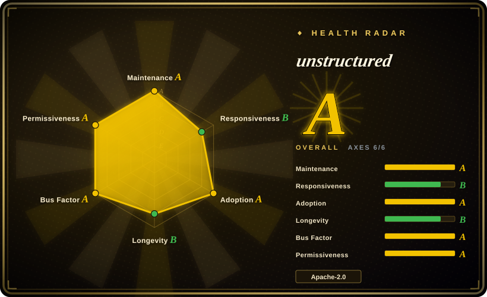
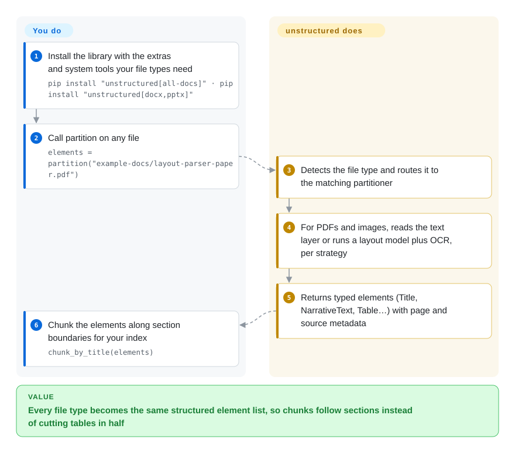

# unstructured

Your RAG pipeline ingests PDFs, emails, Word files and HTML, and splitting them every 1,000 characters cuts tables in half and glues a page footer onto the next heading. unstructured breaks each document into typed pieces — title, paragraph, list item, table, with page number and source metadata — so you can clean, filter and chunk along the document's own structure.

## When to use

You're the engineer behind an internal "ask our documents" assistant: the corpus is a shared drive of PDFs, `.eml` exports, DOCX, PPTX and HTML pages, and the naive splitter keeps producing chunks like `…Q3 revenue was | Page 4 of 12 | 2. Risks…`. You want every file, whatever its type, turned into the same list of elements — `Title`, `NarrativeText`, `ListItem`, `Table`, `Image`, each with `page_number`, file name and (for PDFs) coordinates — so you can drop headers and footers, keep tables whole, and chunk by section with `chunk_by_title`.

Pick unstructured over MarkItDown when you need **elements with metadata and section-aware chunking**, not just one Markdown string; pick it over Docling or Marker when breadth of input types (email, Outlook, EPUB, RTF, ODT, org, rst…) and a uniform element model across all of them matter more than best-in-class PDF layout. It is the Apache-2.0 core of a company whose paid Transform API is the higher-accuracy path, so choose it knowing that boundary.

## How it works

unstructured is a Python library. **You** install it with the extras for your file types (`unstructured[all-docs]`, or e.g. `[docx,pptx]`) plus the system tools those types need — `libmagic` for file-type detection, `poppler` and `tesseract` for PDFs and images, LibreOffice for legacy Office files — then call `partition(filename=...)`. **unstructured** detects the file type, routes it to the matching partitioner, and returns a list of elements: typed text blocks with metadata. For PDFs and images a *strategy* decides how: `fast` reads the embedded text layer, `hi_res` runs a layout-detection model (via `unstructured-inference`) plus Tesseract OCR to find tables and reading order, `ocr_only` OCRs everything, and `auto` chooses. You then feed the elements to `chunk_by_title` or your own logic. Batch ingestion from S3, SharePoint and similar sources lives in the separate `unstructured-ingest` package; the library also pings an analytics endpoint by default unless you set `DO_NOT_TRACK`.

<!-- flow-steps:begin (generated from flows/unstructured.json by tools/flow_card.py — do not edit) -->

Text version of the flow

1. **You**: Install the library with the extras and system tools your file types need — `pip install "unstructured[all-docs]" · pip install "unstructured[docx,pptx]"`
2. **You**: Call partition on any file — `elements = partition("example-docs/layout-parser-paper.pdf")`
3. **unstructured**: Detects the file type and routes it to the matching partitioner
4. **unstructured**: For PDFs and images, reads the text layer or runs a layout model plus OCR, per strategy
5. **unstructured**: Returns typed elements (Title, NarrativeText, Table…) with page and source metadata
6. **You**: Chunk the elements along section boundaries for your index — `chunk_by_title(elements)`

**Value**: Every file type becomes the same structured element list, so chunks follow sections instead of cutting tables in half

<!-- flow-steps:end -->

## When NOT to use

- **If PDF table and layout accuracy is the deciding metric, use Docling or Marker instead of unstructured's open-source library, because** the README's own benchmark (Sept 2026) scores the OSS library at 0.426 table-cell content accuracy and 0.715 text accuracy, against 0.866 / 0.878 for its paid Transform API.
- **If you want a pure-Python `pip install` with no system packages, use MarkItDown instead, because** full PDF/image/Office support here needs `libmagic`, `poppler`, `tesseract` and LibreOffice on the host (or the project's Docker image).
- **If your environment forbids default outbound calls, set `DO_NOT_TRACK=1` (or `SCARF_NO_ANALYTICS`) before import, or pick a library without telemetry such as Docling, because** unstructured sends an analytics ping to `packages.unstructured.io` on import and per partition call by default.
- **If you just need one Markdown string for an LLM prompt, use MarkItDown or Docling, because** unstructured's native output is an element list; turning it into clean Markdown is extra work on your side.
- **If you need a GPU-accelerated, high-throughput PDF pipeline, use Marker instead, because** the `hi_res` strategy runs a layout model plus Tesseract per page on CPU by default and is the slow path. [推断]
- **If you are on Python 3.10 or 3.14, pin an older release or wait, because** the current package requires Python `>=3.11, <3.14`.

## Comparison

| Alternative | In index | Our verdict | Tradeoff |
|---|---|---|---|
| [Docling](docling.md) | ✅ | Choose Docling when PDF/Office layout, tables and reading order must be accurate with local models and no telemetry; choose unstructured when you need a uniform element model across many more input types plus section-aware chunking. | Docling's layout models produce richer document structure; unstructured covers email, EPUB, RTF, ODT and more with one `partition()` call but its OSS PDF tables are weaker. |
| [MarkItDown](markitdown.md) | ✅ | Choose MarkItDown when a single Markdown string per file is enough and you want no system dependencies; choose unstructured when you need typed elements, metadata and chunking for retrieval. | MarkItDown is small and model-free; unstructured is heavier (spaCy, numba, system tools) but returns structure you can filter and chunk. |
| [Marker](marker.md) | ✅ | Choose Marker when the corpus is mostly PDFs and you can run a GPU or llama.cpp OCR server; choose unstructured for mixed-format corpora where PDFs are only one source. | Marker reports far higher PDF accuracy and throughput on its own benchmark, but its model weights carry a revenue threshold; unstructured is plain Apache-2.0 with Tesseract-based OCR. |
| [Dedoc](dedoc.md) | ✅ | Choose Dedoc when you need a logical document tree with attachments and annotations from an on-prem service; choose unstructured for a flat element list feeding a RAG chunker. | Dedoc recovers deeper hierarchy but runs as a heavier Linux service; unstructured is an importable library with a larger ecosystem. |
| Unstructured Transform API | not a repo | Choose the paid API when table and text accuracy justify sending documents to a hosted service; choose the open-source library to keep documents in-house. | Hosted SaaS from the same company, not a repository: about 2× table accuracy by the vendor's numbers, at per-page cost and with data leaving your network. |

## Tech stack

- **Language**: Python `>=3.11, <3.14` (GitHub reports HTML as the top language because of large HTML test fixtures).
- **Core**: BeautifulSoup/lxml/html5lib for HTML, spaCy and langdetect for text handling, `python-magic` + `filetype` for type detection, numba/numpy, `unstructured-client` for the hosted API.
- **PDF/image extras**: `pdfminer.six`, `pdf2image`, `pikepdf`, `pypdf`, `unstructured-inference` (layout models), `unstructured-pytesseract`; optional Google Cloud Vision OCR agent.
- **Office/other extras**: `python-docx`, `python-pptx`, `pandas`, `pypandoc-binary` (EPUB, ODT, RTF, org, rst), `python-oxmsg` (Outlook).
- **Chunking**: `chunk_by_title` and basic chunking over elements.
- **Packaging**: uv-managed; Docker images built on `wolfi-base` for every push to `main`.

## Dependencies

- **Python packages**: `pip install "unstructured[all-docs]"`, or per-type extras; plain text, HTML, XML, JSON and email need no extras.
- **System packages** (depending on file types): `libmagic-dev`, `poppler-utils`, `tesseract-ocr` (+ `tesseract-lang` for more languages), `libreoffice`; pandoc comes via `pypandoc-binary`.
- **Model downloads**: the `hi_res` strategy pulls layout-detection model weights through `unstructured-inference` on first use. [推断]
- **Network**: default telemetry to `packages.unstructured.io` (opt out with `DO_NOT_TRACK` / `SCARF_NO_ANALYTICS`); optional Google Cloud Vision or the hosted Unstructured API.
- **Batch connectors**: separate `unstructured-ingest` package for S3, SharePoint, databases and other sources.

## Ops difficulty

**Medium.** For text/HTML/email it is a pip install. Real corpora need the system packages, and the host image grows quickly once LibreOffice, Tesseract language packs and layout models are in it — the project's Docker image exists for exactly this reason, and its `wolfi-base` build can break on upstream changes. Patch releases land several times a month (0.27.5 → 0.27.16 between 2026-08-28 and 2026-10-05), so pin versions and test upgrades. Tuning `hi_res` vs `fast` per document type, managing CPU time for OCR, and disabling telemetry in locked-down environments are the recurring tasks.

## Health & viability

- **Maintenance (2026-10-08):** very active — last commit the day of scoring and a stream of 0.27.x patch releases (latest 0.27.16 on 2026-10-05); still versioned 0.x and classified "Beta" after four years.
- **Responsiveness:** median first response about 85.6 hours across only 3 qualifying issues/PRs in the 2026-10-08 window — a thin sample; triage looks slower than commit activity suggests.
- **Adoption:** strong — 2,462,836 PyPI downloads last month and 3,374 dependent repositories (2026-10); widely embedded in LangChain/LlamaIndex-style ingestion stacks. [推断]
- **Governance & backing:** owned by Unstructured Technologies, the commercial company that sells the hosted platform; 23 people committed in the last 12 months, top contributor 19.3%, top three 42.1% — a staffed team, not one maintainer. The roadmap serves the company's hosted platform; the README states the open-source library "is, and will stay, completely free".
- **Age & Lindy:** created 2022-09, ~4 years old and continuously active — a moderate Lindy prior, bounded by dependence on one company.
- **Risk flags:** Apache-2.0 with no relicense history, but open-core dynamics (best models only in the paid API) and default-on telemetry are the items to review.

## Caveats (unverified)

- [推断] `hi_res` being the slow path and downloading layout model weights on first use is inferred from the `unstructured-inference` dependency and the strategy names; throughput was not measured.
- [未验证] The OSS-vs-Transform accuracy figures come from Unstructured's own benchmarks (OSS on 1,000+ pages; Transform on its 224-page SCOREBench), not an independent evaluation.
- [推断] Its spread through LangChain/LlamaIndex loaders is inferred from the dependent-repository count and common loader names, not a survey.
- [未验证] Dedoc's and Marker's positioning in the comparison comes from their own pages in this index, not a side-by-side run.
- [未验证] Star (~15.5k) and download counts are date-sensitive (2026-10-08) and indicative only.
