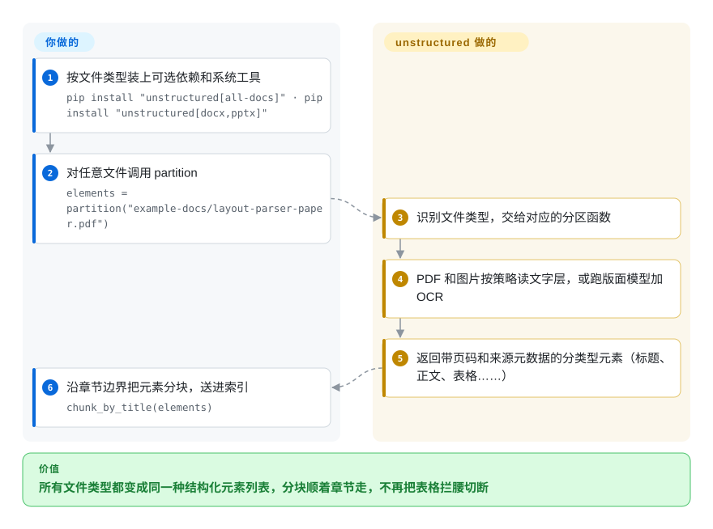

# unstructured

你的 RAG 流水线要吃进 PDF、邮件、Word 和 HTML，按每 1000 个字符一刀切下去，表格被拦腰切断，页脚还粘到了下一节标题上。unstructured 把每份文档拆成带类型的片段——标题、正文段落、列表项、表格，附带页码和来源元数据——让你能顺着文档自己的结构去清洗、过滤和分块。

## 何时使用

你负责一个内部“问问我们的文档”助手：语料是共享盘里的 PDF、导出的 `.eml`、DOCX、PPTX 和 HTML 页面，朴素的切分器老是切出 `…Q3 revenue was | Page 4 of 12 | 2. Risks…` 这样的块。你希望不管什么类型的文件，都变成同一种元素列表——`Title`、`NarrativeText`、`ListItem`、`Table`、`Image`，每个都带 `page_number`、文件名，PDF 还带坐标——这样就能去掉页眉页脚、保持表格完整，再用 `chunk_by_title` 按章节分块。

需要**带元数据的元素和按章节分块**、而不只是一个 Markdown 字符串时，选 unstructured 而不是 MarkItDown；输入类型的覆盖面（邮件、Outlook、EPUB、RTF、ODT、org、rst……）和所有类型统一的元素模型比最顶尖的 PDF 版面分析更重要时，选它而不是 Docling 或 Marker。它是一家公司的 Apache-2.0 开源内核，更高准确率的路线是这家公司付费的 Transform API——选它时要清楚这条边界。

## 怎么用起来

unstructured 是一个 Python 库。**你要做的**：按文件类型装上可选依赖（`unstructured[all-docs]`，或者比如 `[docx,pptx]`），再装这些类型需要的系统工具——识别文件类型用 `libmagic`，PDF 和图片用 `poppler` 和 `tesseract`，老式 Office 文件用 LibreOffice——然后调用 `partition(filename=...)`。**unstructured 替你做的**：识别文件类型，交给对应的分区函数，返回一个元素列表，也就是带元数据的分类型文本块。PDF 和图片由*策略*决定怎么处理：`fast` 读内嵌的文字层，`hi_res` 跑一个版面检测模型（通过 `unstructured-inference`）加 Tesseract OCR 来找表格和阅读顺序，`ocr_only` 全部走 OCR，`auto` 自动选。之后你把元素交给 `chunk_by_title` 或自己的逻辑。从 S3、SharePoint 等来源批量导入在单独的 `unstructured-ingest` 包里；另外这个库默认会向一个统计端点发请求，除非你设置 `DO_NOT_TRACK`。

<!-- flow-steps:begin (generated from flows/unstructured.json by tools/flow_card.py — do not edit) -->

流程文字版

1. **你**：按文件类型装上可选依赖和系统工具 — `pip install "unstructured[all-docs]" · pip install "unstructured[docx,pptx]"`
2. **你**：对任意文件调用 partition — `elements = partition("example-docs/layout-parser-paper.pdf")`
3. **unstructured**：识别文件类型，交给对应的分区函数
4. **unstructured**：PDF 和图片按策略读文字层，或跑版面模型加 OCR
5. **unstructured**：返回带页码和来源元数据的分类型元素（标题、正文、表格……）
6. **你**：沿章节边界把元素分块，送进索引 — `chunk_by_title(elements)`

**价值**：所有文件类型都变成同一种结构化元素列表，分块顺着章节走，不再把表格拦腰切断

<!-- flow-steps:end -->

## 何时不用

- **如果 PDF 表格和版面准确率是决定性指标，用 Docling 或 Marker，而不是 unstructured 的开源库，因为**README 自己的基准（2026 年 9 月）给开源库的表格单元格内容准确率是 0.426、文字准确率 0.715，而它的付费 Transform API 是 0.866 / 0.878。
- **如果你想要一个纯 Python、不装系统包的 `pip install`，用 MarkItDown，因为**这里完整支持 PDF/图片/Office 需要主机上有 `libmagic`、`poppler`、`tesseract` 和 LibreOffice（或者用项目的 Docker 镜像）。
- **如果你的环境禁止默认外连，在 import 之前设置 `DO_NOT_TRACK=1`（或 `SCARF_NO_ANALYTICS`），或者换一个不带遥测的库比如 Docling，因为**unstructured 默认在 import 时和每次分区调用时都会向 `packages.unstructured.io` 发统计请求。
- **如果你只要给大模型提示词塞一个 Markdown 字符串，用 MarkItDown 或 Docling，因为**unstructured 的原生输出是元素列表，转成干净的 Markdown 要你自己再加工。
- **如果你需要 GPU 加速、高吞吐的 PDF 流水线，用 Marker，因为**`hi_res` 策略默认在 CPU 上逐页跑版面模型加 Tesseract，是慢路径。[推断]
- **如果你在用 Python 3.10 或 3.14，锁定旧版本或者先等等，因为**当前版本要求 Python `>=3.11, <3.14`。

## 横向对比

| 替代品 | 是否收录 | 我们的评价 | 取舍 |
|---|---|---|---|
| [Docling](docling.zh.md) | 已收录 | PDF/Office 的版面、表格和阅读顺序必须准确、要本地模型且不要遥测时，选 Docling；需要覆盖多得多的输入类型、统一的元素模型和按章节分块时，选 unstructured。 | Docling 的版面模型给出更丰富的文档结构；unstructured 一个 `partition()` 就覆盖邮件、EPUB、RTF、ODT 等，但开源版的 PDF 表格更弱。 |
| [MarkItDown](markitdown.zh.md) | 已收录 | 每个文件一个 Markdown 字符串就够、而且不想装系统依赖时，选 MarkItDown；检索需要带类型的元素、元数据和分块时，选 unstructured。 | MarkItDown 小而且不带模型；unstructured 更重（spaCy、numba、系统工具），但返回的是能过滤、能分块的结构。 |
| [Marker](marker.zh.md) | 已收录 | 语料以 PDF 为主、能跑 GPU 或 llama.cpp OCR 服务时，选 Marker；语料格式混杂、PDF 只是其中一种来源时，选 unstructured。 | Marker 在自家基准上的 PDF 准确率和吞吐高得多，但模型权重有营收门槛；unstructured 是纯 Apache-2.0，OCR 基于 Tesseract。 |
| [Dedoc](dedoc.zh.md) | 已收录 | 需要从本地部署的服务里拿到带附件和批注的文档逻辑树时，选 Dedoc；要给 RAG 分块器喂扁平元素列表时，选 unstructured。 | Dedoc 能还原更深的层级，但作为较重的 Linux 服务运行；unstructured 是可直接 import 的库，生态更大。 |
| Unstructured Transform API | 非仓库 | 表格和文字准确率值得把文档送到托管服务时，选付费 API；文档要留在内部时，选开源库。 | 同一家公司的托管 SaaS，不是仓库：按厂商的数字表格准确率约高一倍，代价是按页计费、数据离开你的网络。 |

## 技术栈

- **语言**：Python `>=3.11, <3.14`（GitHub 把 HTML 列为主语言，是因为仓库里有大量 HTML 测试样例）。
- **核心**：HTML 用 BeautifulSoup/lxml/html5lib，文本处理用 spaCy 和 langdetect，类型识别用 `python-magic` + `filetype`，另有 numba/numpy，以及调用托管 API 的 `unstructured-client`。
- **PDF/图片可选依赖**：`pdfminer.six`、`pdf2image`、`pikepdf`、`pypdf`、`unstructured-inference`（版面模型）、`unstructured-pytesseract`；可选 Google Cloud Vision 作 OCR 后端。
- **Office 及其他可选依赖**：`python-docx`、`python-pptx`、`pandas`、`pypandoc-binary`（EPUB、ODT、RTF、org、rst）、`python-oxmsg`（Outlook）。
- **分块**：基于元素的 `chunk_by_title` 和基础分块。
- **打包**：用 uv 管理；每次推送到 `main` 都会基于 `wolfi-base` 构建 Docker 镜像。

## 依赖

- **Python 包**：`pip install "unstructured[all-docs]"`，或按类型装可选依赖；纯文本、HTML、XML、JSON 和邮件不需要可选依赖。
- **系统包**（视文件类型而定）：`libmagic-dev`、`poppler-utils`、`tesseract-ocr`（更多语言加 `tesseract-lang`）、`libreoffice`；pandoc 通过 `pypandoc-binary` 自带。
- **模型下载**：`hi_res` 策略首次使用时会通过 `unstructured-inference` 下载版面检测模型权重。[推断]
- **网络**：默认向 `packages.unstructured.io` 发遥测（用 `DO_NOT_TRACK` / `SCARF_NO_ANALYTICS` 关闭）；可选 Google Cloud Vision 或托管的 Unstructured API。
- **批量连接器**：S3、SharePoint、数据库等来源在单独的 `unstructured-ingest` 包里。

## 运维难度

**中等。**只处理文本/HTML/邮件时就是一次 pip 安装。真实语料需要那些系统包，一旦装上 LibreOffice、Tesseract 语言包和版面模型，主机镜像会迅速变大——项目的 Docker 镜像正是为此存在，而它基于 `wolfi-base` 的构建可能因上游变化而失败。补丁版本每月发好几次（2026-08-28 到 2026-10-05 之间从 0.27.5 到 0.27.16），所以要锁版本、测升级。按文档类型调 `hi_res` 和 `fast`、管理 OCR 的 CPU 耗时、在封闭环境里关掉遥测，是反复要做的事。

## 健康度与可持续性

- **维护（2026-10-08）**：非常活跃——评分当天还有提交，0.27.x 补丁版本接连发布（最新 0.27.16，2026-10-05）；四年了仍是 0.x，分类仍标“Beta”。
- **响应速度**：2026-10-08 窗口里只有 3 个合格 issue/PR，首次回复中位数约 85.6 小时——样本很薄；分拣速度看起来比提交活跃度慢。
- **采用度**：强——PyPI 上月下载 2,462,836 次，3,374 个依赖它的仓库（2026-10）；广泛嵌在 LangChain/LlamaIndex 一类的文档接入栈里。[推断]
- **治理与背书**：归 Unstructured Technologies 所有，这家商业公司卖的是托管平台；过去 12 个月有 23 人提交，第一名占 19.3%，前三名占 42.1%——是一支有编制的团队，不是单人维护。路线图服务于公司的托管平台；README 写明开源库“现在免费、将来也会一直完全免费”。
- **年龄与 Lindy**：2022-09 创建，约 4 年，一直活跃——Lindy 先验中等，上限受制于对一家公司的依赖。
- **风险信号**：Apache-2.0，没有改许可的历史；要审的是开源核心模式（最好的模型只在付费 API 里）和默认开启的遥测。

## 存疑（未验证）

- [推断] `hi_res` 是慢路径、首次使用会下载版面模型权重，这是从 `unstructured-inference` 依赖和策略名推出来的；没有实测吞吐。
- [未验证] 开源版和 Transform 的准确率对比来自 Unstructured 自己的基准（开源版用 1000 多页；Transform 用它 224 页的 SCOREBench），不是独立评测。
- [推断] 它在 LangChain/LlamaIndex 加载器里的普及程度，是从依赖仓库数和常见加载器名称推出来的，没有做调查。
- [未验证] 对比表里 Dedoc 和 Marker 的定位来自本索引里它们各自的页面，没有并排跑过。
- [未验证] 星数（约 1.55 万）和下载量随日期变化（2026-10-08），仅作参考。
