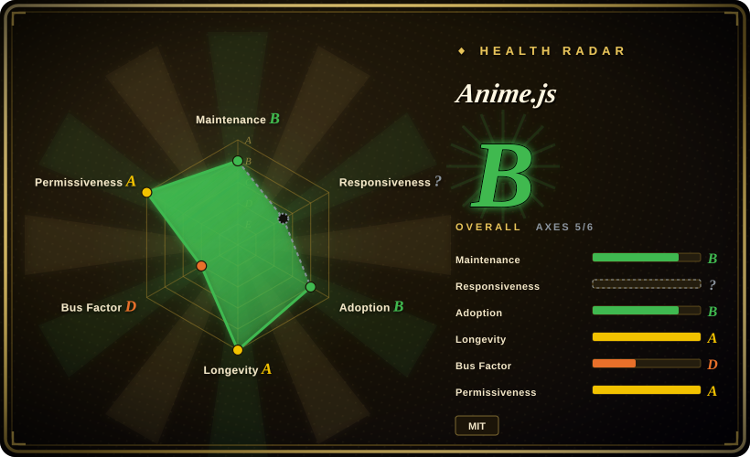
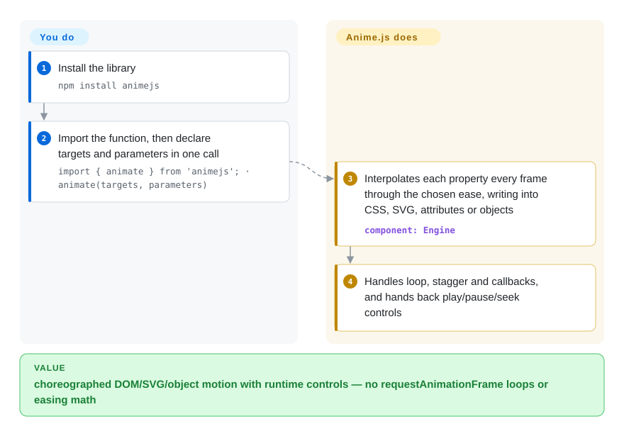

# Anime.js

Your landing page needs motion — a headline that staggers in letter by letter, an SVG logo that draws itself, a card you can fling with inertia — and hand-rolling `requestAnimationFrame` loops and easing math is miserable. Anime.js is a small, dependency-free animation engine: one `animate(targets, parameters)` call tweens CSS properties, SVG, DOM attributes or plain JS objects, with timelines, staggering, spring easings and scroll-linked playback built in.

## When to use

You're a front-end developer building a marketing site or product landing page, and the design calls for choreographed motion — a hero headline that staggers in letter by letter, an SVG logo that draws its strokes, a few elements that animate as they scroll into view, and a card you can fling around with physics. You don't want to pull in a heavy motion framework tied to one UI library, and you don't want to hand-roll `requestAnimationFrame` loops and easing math. You reach for Anime.js: `animate(targets, { translateX: 250, ease: 'outElastic', loop: true })` covers the basic case, and when the sequence gets complex you compose a `createTimeline()` with offsets instead of juggling `setTimeout`. Because it's framework-agnostic vanilla JS with zero runtime dependencies, it drops into a plain `<script>`, a Vite/webpack bundle, or any of React/Vue/Svelte without an adapter, and the modular v4 build lets you import only the `animate`, `stagger`, `svg`, or `scroll` pieces you actually use.

It also fits when you're animating things the CSS engine can't reach cleanly: tween arbitrary JS object values to feed a canvas or chart, morph one SVG path into another, run a motion-path animation, or scrub a timeline against scroll position. The v4 rewrite splits these into discrete modules (Timer, Animation, Timeline, Animatable, Draggable, Layout, Scope, Events/onScroll, SVG, Text) so you keep the bundle lean while still having the heavier features available when a specific screen needs them.

## How it works

You never write the animation loop — you declare it. An `animate(targets, parameters)` call tells the engine *what* to move (a CSS selector, DOM/SVG nodes, or a plain JS object) and *what values to reach* (numbers, colors, unit strings, function-based values), plus how to get there: duration, an easing function, delay, loop. The engine then runs one shared timer, and on every frame it interpolates each property from its current value to its target through the chosen ease and writes the result back — as an inline style, a transform, an SVG attribute, or an object field. Sequencing that would otherwise be `setTimeout` soup becomes a `createTimeline()` where you add animations at offsets, with `stagger()` spreading delay or value across many targets; scroll-linked playback and draggable springs come from the separate `ScrollObserver`/`Draggable` modules. What the library does: interpolation, easing math, style writing, and playback control (`play()`, `pause()`, `seek()`…). What stays yours: layout, choosing which properties are safe to animate for performance, and honoring reduced-motion preferences. For simple cases there is also a 3KB `waapi.animate()` variant that hands the tweening to the browser's own Web Animations API instead of the JS engine (docs state ~10KB for the full `animate()`).

<!-- flow-steps:begin (generated from flows/anime.json by tools/flow_card.py — do not edit) -->

Text version of the flow

1. **You**: Install the library — `npm install animejs`
2. **You**: Import the function, then declare targets and parameters in one call — `import { animate } from 'animejs'; · animate(targets, parameters)`
3. **Anime.js**: Interpolates each property every frame through the chosen ease, writing into CSS, SVG, attributes or objects — component: `Engine`
4. **Anime.js**: Handles loop, stagger and callbacks, and hands back play/pause/seek controls

**Value**: choreographed DOM/SVG/object motion with runtime controls — no requestAnimationFrame loops or easing math

<!-- flow-steps:end -->

## When NOT to use

- **You're already in a React-first declarative motion world.** If your app composes animation as JSX state (mount/unmount transitions, layout animations, gesture springs), a React-native library like Framer Motion or `react-spring` will feel more idiomatic than imperatively calling `animate()` on refs. (both `未收录` here)
- **You need full 3D / WebGL scene animation.** Anime.js ships a Three.js adapter to *drive* values, but it is not a 3D engine; for scene graphs, materials, and cameras you want Three.js / GSAP-with-WebGL, not this.
- **You want the broadest battle-tested plugin ecosystem and commercial support.** GSAP has a deeper plugin catalog (MorphSVG, ScrollTrigger, SplitText, physics) and long industry track record; if you need that breadth or paid support, Anime.js's lighter surface may fall short.
- **Pure CSS keyframes already do the job.** For simple hovers, loaders, and one-shot transitions, a CSS `@keyframes` / `transition` has zero JS cost and no library to ship — reach for JS animation only when you need sequencing, dynamic values, or runtime control.
- **You're locked to a long-lived v3 codebase.** v4 is a significant API and module rewrite; migrating existing v3 animations is not a drop-in version bump and carries real refactor cost.
- **Strict legacy-browser requirements.** The library targets modern evergreen browsers; if you must support very old engines, verify the feature set you rely on before committing.

## Comparison

| Alternative | In index | Our verdict | Tradeoff |
|---|---|---|---|
| GSAP (GreenSock) | 未收录 | Choose GSAP when plugin breadth, ScrollTrigger/MorphSVG-style features, and commercial support are decisive; choose Anime.js for a smaller MIT, dependency-free, framework-agnostic animator. | Larger, more mature ecosystem (ScrollTrigger, MorphSVG, physics plugins) and commercial support; heavier mindshare. Anime.js is smaller, MIT-licensed, dependency-free, and now fully modular in v4. |
| Motion / Framer Motion | 未收录 | Choose Motion or Framer Motion for React-first declarative component animation; choose Anime.js when imperative, framework-agnostic orchestration is the better fit. | Declarative, React-first (also a vanilla `motion` core); idiomatic for component-driven apps. Anime.js is imperative and framework-agnostic — better when you're not living inside React's render model. |
| Motion One | 未收录 | Choose Motion One when the smallest WAAPI-based runtime is the priority; choose Anime.js when timelines, draggable, SVG, scroll, and text helpers justify more surface area. | Tiny WAAPI-based animator; very small footprint. Anime.js offers more built-ins (timeline, draggable, SVG morph, scroll, text) at a larger but still light cost. |
| Web Animations API (WAAPI) | 未收录 | Choose raw WAAPI when you want no library and can tolerate low-level code; choose Anime.js when you need timeline, stagger, SVG, and ergonomic sequencing on top. | Native browser API, no library to ship; lower-level, no timeline/stagger/SVG-morph sugar. Anime.js v4 includes a WAAPI adapter and adds the ergonomic layer on top. |
| CSS `@keyframes` / transitions | 未收录 | Choose CSS transitions/keyframes for simple hover, loading, or one-shot effects; choose Anime.js only when runtime control, sequencing, or dynamic values are needed. | Zero JS, GPU-friendly for simple cases; no sequencing, dynamic values, or runtime control. Anime.js is for when you need JS-driven orchestration. |
| Velocity.js | 未收录 | Choose Velocity.js only for legacy compatibility with an existing jQuery-era codebase; choose Anime.js for actively maintained modern vanilla animation. | Older jQuery-era JS animator, now largely unmaintained. Anime.js is the actively maintained modern equivalent. |

## Tech stack

- **Language:** JavaScript (vanilla; no TypeScript-runtime requirement, ships type definitions for consumers).
- **Targets it animates:** CSS properties, SVG elements, DOM/HTML attributes, and arbitrary JavaScript object values.
- **v4 modules:** `Timer`, `Animation` (`animate`), `Timeline` (`createTimeline`), `Animatable`, `Draggable`, `Layout` (auto-layout transitions), `Scope`, `Events`/`onScroll` (scroll-linked), `SVG` (`morphTo`, `createDrawable`, `createMotionPath`), `Text` (`splitText`, `scrambleText`), plus `stagger`, spring/built-in easings, and a WAAPI adapter (`waapi.animate`, ~3KB). A Three.js adapter (`Adapters`) drives 3D object properties, materials and uniforms.
- **Build/distribution:** modular ESM for tree-shaking; UMD/IIFE bundles for `<script>` usage. Published to npm as `animejs`.
- **Dependencies:** none at runtime — the engine is self-contained.

## Dependencies

- **Runtime:** a browser DOM environment (or a JS runtime when only tweening plain objects). No external runtime dependencies.
- **Install:** `npm install animejs` (package `animejs`, v4.5.0), or load a UMD/IIFE build via `<script>` / CDN.
- **Build tooling:** none required to consume; any bundler (Vite, webpack, esbuild, Rollup) or no bundler at all works. Framework integration (React/Vue/Svelte) needs no dedicated adapter — call the API from effects/lifecycle hooks.

## Ops difficulty

**Low.** This is a client-side library with no server, no datastore, and no infrastructure to operate — "ops" reduces to shipping a JS bundle. Adoption cost is mostly in learning the v4 module API and, for existing users, migrating v3 code (a non-trivial refactor, not a version bump). Performance/maintenance burden is the usual front-end kind: keep heavy animations off the main thread where possible, mind layout thrash, and pin the major version to avoid surprise API drift.

## Health & viability

- **Responsiveness**: Cannot be scored — unknown.
- **Maintenance (2026-09).** Last commit on master 2026-08-09, repo pushed 2026-08; latest release v4.5.0 (2026-06-22) still current — **active** (a quieter stretch after the v4 ramp, not archived). Open-issue count ~118 is healthy for a library this widely used. [推断]
- **Governance / bus factor.** A **single-author, `User`-owned repo** (`juliangarnier/anime`) with ~73k stars — the classic bus-factor flag: enormous adoption resting on one maintainer, with no foundation or vendor behind it; sustainability depends on GitHub Sponsors. [推断]
- **Age & Lindy verdict.** ~10 years old (created 2016-03) and **still actively shipping** (it completed a full v4 rewrite this year) ⇒ a **strong Lindy** signal — a decade of survival plus a fresh major version is the opposite of a stalled project, which substantially tempers the single-maintainer concern. [推断]
- **Adoption.** Very strong (~73.2k stars, gh 2026-09-28; MIT, dependency-free, framework-agnostic, on npm as `animejs` with 7,272 dependent repos) — a default-tier choice for imperative web animation. [未验证]
- **Risk flags.** No relicense or open-core found (MIT throughout). The concrete cost is the **v3→v4 migration** — a real API/module rewrite, not a drop-in bump; pin the major version. [推断]

## Caveats (unverified)

- [未验证] Star count reported ~73.2k as of 2026-09-28; latest release v4.5.0 published 2026-06-22 per the GitHub API (also still the latest on npm). GitHub stars are unreliable and date-sensitive — treat as indicative only, re-verify against the repo.
- [未验证] The v4 module list (Timer / Animation / Timeline / Animatable / Draggable / Layout / Scope / Events-onScroll / SVG / Text, WAAPI + Three.js adapters) is taken from the documentation site structure (animejs.com/documentation, 2026-09-28); verify the precise set and import paths against the current docs before relying on a specific module.
- [未验证] The docs cite ~3KB for `waapi.animate` and ~10KB for `animate`, but no full-bundle gzipped size or browser-support matrix is stated; verify against the build or bundlephobia before budgeting.
- [推断] Comparison verdicts (GSAP ecosystem breadth, Framer Motion's React fit, Motion One's WAAPI footprint, Velocity.js being unmaintained) are judgment based on general knowledge of these libraries, not measured here — re-check current state of each substitute.
- [未验证] v3→v4 migration cost is characterized as a real refactor based on it being an API/module rewrite; the precise breaking-change surface should be checked against the project's migration guide (README links a wiki page).
