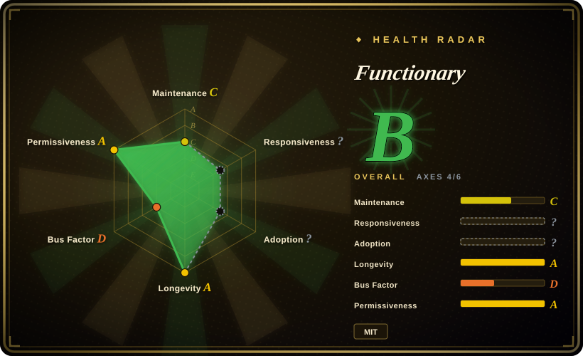

# Functionary

An early open LLM line (and its vLLM/SGLang/TGI serving scripts) that interprets and executes JSON-Schema tool definitions — the canonical open "function-calling model" of 2023–2024, now **deprecated** by its maintainers and kept for reference only.

## When to use

You're a product engineer adding tool calling to your app, and you keep hitting Functionary's v3 models in older write-ups and the Berkeley Function-Calling Leaderboard. You want to know whether to build on it, or what its prompt/format design is worth learning. You should treat this repo as a **design reference and historical oracle**, not a dependency: its `features_desc.md`, prompt templates, JSON-Schema tool definition format, and its parallel/serial call semantics are a readable, complete template for how OpenAI-style function calling was implemented before native tool use spread into every general model — and its `server_vllm.py` / `server_sglang.py` / `server_tgi.py` show the serving shape you would otherwise assemble yourself.

For anything you will actually ship, take that design and put a **current** model behind it: run a modern function-calling model on [vLLM](../llm-inference/vllm.md) or [SGLang](../llm-inference/sglang.md), go on-device with [Needle](../on-device-ml/needle.md) when the footprint must be single-digit MB, or call a hosted frontier API when accuracy is the binding constraint. Choose this layer of abstraction only because you want the pattern; choose the model elsewhere.

## When NOT to use

- **Any production deployment.** The maintainers put an explicit deprecation banner on the README: no updates, no bug fixes, no support, and the code/models/docs are described as a very old snapshot. Use a maintained serving path ([vLLM](../llm-inference/vllm.md) or [SGLang](../llm-inference/sglang.md)) with a current model instead.
- **On-device or MCU-class footprints.** Functionary is an 8B–70B-class family served on a GPU; it does not fit a phone or wearable. Use [Needle](../on-device-ml/needle.md) or [LiteRT-LM](../on-device-ml/litert-lm.md) instead.
- **You need current tool-calling accuracy.** Its headline result is a 2024 BFCL placement against 2024 models. For today's accuracy, use a current open model served yourself, or a frontier hosted API instead.
- **You want an actively maintained repo with issue response.** Recent pushes notwithstanding, the project is declared dead. If maintenance matters, choose a maintained engine ([vLLM](../llm-inference/vllm.md), [SGLang](../llm-inference/sglang.md)) and a maintained model.
- **You need a vendored, support-contracted SDK.** There is no commercial SLA here; the org has moved on. [推断]

## Comparison

| Alternative | In index | Our verdict | Tradeoff |
|---|---|---|---|
| [Needle](../on-device-ml/needle.md) | ✅ | Pick Needle when the tool-calling model must run on-device with a compiled grammar and a confidence score; pick Functionary only as the server-side historical reference — never to ship. | Same task (schema-driven tool calls) at opposite scales: Needle is 8–29 MB on-device; Functionary is a deprecated 8B+ GPU model. |
| FunctionGemma (Google) | 未收录 | Pick Google's purpose-built on-device function-calling model (270M and fine-tunes) when you want a maintained, small function-calling model on Hugging Face weights; treat Functionary as its deprecated ancestor. | Maintained vendor-backed small model versus an abandoned 8B+ one — no code repo for FunctionGemma, but it is the live successor in this niche. |
| [vLLM](../llm-inference/vllm.md) | ✅ | Pick vLLM when you are serving a current function-calling model yourself; Functionary's bundled `server_vllm.py` is a frozen 2025-era snapshot of exactly this path. | A maintained serving engine with a live ecosystem versus a pinned, unmaintained server script; same architecture, opposite maintenance posture. |
| [SGLang](../llm-inference/sglang.md) | ✅ | Pick SGLang for same reasons — constrained/structured generation and fast serving of tool-using models — rather than Functionary's deprecated SGLang integration. | RadixAttention and structured generation are today's defaults; Functionary's value is documenting the pattern, not running it. |
| Cloud function calling (OpenAI / Gemini) | 未收录 | Pick a hosted frontier API when tool-call accuracy on hard requests matters and a network round-trip is fine; Functionary's historical niche — self-hosted JSON-Schema function calling — is now served by current models on vLLM/SGLang or by these APIs. | Zero ops and best accuracy at per-call cost and data egress, versus the self-hosted route Functionary pioneered. |

## Tech stack

- **Models:** fine-tuned Llama-class LLMs (small/medium, ~8B and ~70B) with Functionary's own prompt template; weights published as `meetkai/functionary-*` on Hugging Face.
- **Serving:** Python servers for vLLM, SGLang, TGI and Modal (`server_vllm.py`, `server_sglang.py`, `server_tgi.py`, `server_vision.py`), plus an `example_llama_cpp.py` for the GGUF path.
- **Tool interface:** OpenAI-style JSON-Schema function definitions; parallel and serial call handling; the model interprets tool outputs and decides whether to call again.
- **Runtime deps:** `jsonref`, `json_source_map`, `PyYAML`; optional `vllm==0.8.2` or `sglang[all]==0.4.4.post1` extras (both pinned to old versions).

## Dependencies

- **Python ≥3.9** plus `jsonref`, `json_source_map`, `PyYAML`; the serving path additionally needs a **GPU** and either vLLM or SGLang at the pinned versions.
- **Model weights** are separate downloads from the `meetkai/*` Hugging Face repos (v2.x/v3.x/v4r previews) — not in the repo.
- **No database or managed service**; you operate the GPU server yourself.
- Deprecated: nothing in the dependency chain will be updated by upstream, so version churn is your problem.

## Ops difficulty

**Medium, and rising.** At release it was "install the vLLM or SGLang extra, point the server at a `meetkai/*` model, expose an OpenAI-compatible endpoint" — a standard self-hosted GPU serving job. The maintenance burden is what makes it medium-plus now: the pinned serving deps (`vllm==0.8.2`, `sglang==0.4.4.post1`) are old, the project is deprecated, and any dependency or security fix is yours to carry. There is no batching service to run beyond vLLM/SGLang, but you own the whole stack. For a new deployment, start from a maintained engine instead.

## Health & viability

- **Deprecated (verified 2026-09-19).** The README carries an explicit deprecation banner: no longer actively maintained, reference only, no updates/bug fixes/support. That is the load-bearing viability fact — treat this as a pattern source, not a selection. 
- **Age & Lindy (created 2023-07-11, ~3.2yr).** Old enough to be Lindy-relevant, but **age × still-active fails**: the project is explicitly stopped, so age does not rescue it.
- **Governance / bus factor.** Backed by MeetKai (org) with several sustained contributors (top contributors 284/226/112/99/89 in the sampled window) — [推断] a healthier bus factor than a single-maintainer project, but the org has chosen to stop the line.
- **Adoption & ecosystem.** ~1.6k stars / 118 forks; historically notable (its v3.1 medium model was reported 2nd on the Berkeley Function-Calling Leaderboard in 2024-08) and referenced by surrounding tooling (e.g. `llama-cpp-python` streaming support). [未验证] the leaderboard claim is a dated changelog entry.
- **Risk flags.** No versioned releases (the only tag is `archive/deprecate-v1`); deprecated; pinned old serving dependencies; the field it defined has since been absorbed into general models with native tool calling. License MIT (permissive). 

## Caveats (unverified)

- [未验证] The 2024 BFCL "ranked 2nd" claim is from the repo's changelog against 2024 models and was not re-checked on the current leaderboard.
- [未验证] Exact model lineup and parameter counts (v3.1/v3.2 small/medium, v4r-small-preview, 128k-context 70B) are from the README/changelog and may shift; not re-verified per model card.
- [推断] "Deprecated" is read from the README banner plus the single `archive/deprecate-v1` tag and `version = 0.0.1`; the org has not published a formal sunset date.
- [未验证] Star/fork counts (~1.6k / 118) are a 2026-09-19 snapshot.
- [未验证] The claim that recent (2026-06-30) pushes are archival only is inferred; the last-push date alone does not prove active maintenance either way.
- [未验证] No independent production-user list or current issue-responsiveness measurement was made.
