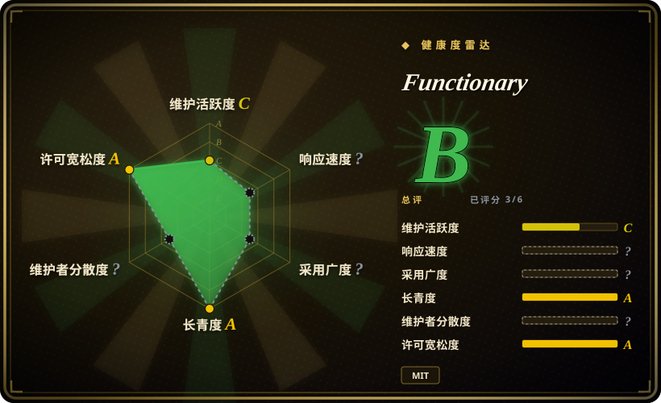

# Functionary

一个早期的开源 LLM 系列（以及它配套的 vLLM/SGLang/TGI 服务脚本），能解释并执行 JSON Schema 工具定义——2023–2024 年开源「函数调用模型」的代表作，如今已被维护者**废弃**，仅作参考保留。

## 何时使用

你是一名给产品加工具调用的工程师，反复在旧文章和 Berkeley Function-Calling Leaderboard 里看到 Functionary 的 v3 模型。你想知道能不能基于它开发，或者它的 prompt/格式设计有什么值得学。应当把这个仓库当作**设计参考与历史样本**，而不是依赖：它的 `features_desc.md`、prompt 模板、JSON Schema 工具定义格式，以及串行/并行调用语义，是一份可读、完整的模板，展示了在原生工具调用扩散到所有通用模型之前，OpenAI 式函数调用是怎么实现的；它的 `server_vllm.py` / `server_sglang.py` / `server_tgi.py` 也给出了你本来要自己拼装的服务形态。

对任何真正要上线的系统，把这份设计拿出去，换成**当前**的模型：在 [vLLM](../llm-inference/serving-engines/vllm.zh.md) 或 [SGLang](../llm-inference/serving-engines/sglang.zh.md) 上跑现代函数调用模型；体积必须压到个位数 MB 时用端侧的 [Needle](../on-device-ml/needle.zh.md)；准确率是硬约束时调用云端前沿 API。选这层抽象，只是因为你想要这套模式；模型去别处选。

## 何时不用

- **任何生产部署。** 维护者在 README 上加了明确的废弃声明：不再更新、不再修 bug、不提供支持，代码/模型/文档都被描述为非常旧的快照。改用维护中的服务路径（[vLLM](../llm-inference/serving-engines/vllm.zh.md) 或 [SGLang](../llm-inference/serving-engines/sglang.zh.md)）配当前模型。
- **端侧或 MCU 级体积。** Functionary 是在 GPU 上服务的 8B–70B 级模型族，装不进手机或可穿戴。改用 [Needle](../on-device-ml/needle.zh.md) 或 [LiteRT-LM](../on-device-ml/litert-lm.zh.md)。
- **你要当前的工具调用准确率。** 它的标志性成绩是 2024 年 BFCL 上对 2024 年模型的排名。要今天的准确率，用当前开源模型自托管，或调用云端前沿 API。
- **你要一个活跃维护、有 issue 响应的仓库。** 尽管近期仍有 push，项目已被声明终止。维护性重要时，选维护中的引擎（[vLLM](../llm-inference/serving-engines/vllm.zh.md)、[SGLang](../llm-inference/serving-engines/sglang.zh.md)）配维护中的模型。
- **你要可 vendor、有支持合同的 SDK。** 这里没有商业 SLA，原组织已经转向。[推断]

## 横向对比

| 替代品 | 是否收录 | 我们的评价 | 取舍 |
|---|---|---|---|
| [Needle](../on-device-ml/needle.zh.md) | ✅ | 工具调用模型必须端侧运行、且要编译好的 grammar 与 confidence 分数时，选 Needle；Functionary 只作服务端历史参考——不要拿去上线。 | 同一任务（schema 驱动的工具调用）在两个极端尺度上：Needle 是 8–29 MB 端侧模型，Functionary 是已废弃的 8B+ GPU 模型。 |
| FunctionGemma（Google） | 未收录 | 想要维护中、体积小的函数调用模型并接受 Hugging Face 权重时，选 Google 专为端侧函数调用发布的模型（270M 及其微调版）；把 Functionary 当作它已废弃的前身。 | 厂商背书、维护中的小模型，对一个被放弃的 8B+ 模型——FunctionGemma 没有代码仓库，但它是这个生态位里仍然活着的那一个。 |
| [vLLM](../llm-inference/serving-engines/vllm.zh.md) | ✅ | 你要自己服务当前函数调用模型时，选 vLLM；Functionary 自带的 `server_vllm.py` 不过是这条路径 2025 年前后的冻结快照。 | 维护中的服务引擎与活跃生态，对一个锁定版本、无人维护的服务脚本；架构相同，维护姿态相反。 |
| [SGLang](../llm-inference/serving-engines/sglang.zh.md) | ✅ | 同理选 SGLang——约束/结构化生成加高速服务，用来跑工具调用模型——而不是 Functionary 已废弃的 SGLang 集成。 | RadixAttention 与结构化生成是当下的默认；Functionary 的价值在于记录模式，而不在运行它。 |
| 云端函数调用（OpenAI / Gemini） | 未收录 | 困难请求上的工具调用准确率要紧、且能接受网络往返时，选云端前沿 API；Functionary 当年的生态位——自托管 JSON Schema 函数调用——如今由 vLLM/SGLang 上的当前模型或这些 API 承担。 | 零运维、最佳准确率，代价是按调用计费与数据外流，对照 Functionary 开创的自托管路线。 |

## 技术栈

- **模型：** 基于 Llama 系微调的 LLM（small/medium，约 8B 与 70B），配 Functionary 自己的 prompt 模板；权重以 `meetkai/functionary-*` 发布在 Hugging Face。
- **服务：** Python 服务脚本覆盖 vLLM、SGLang、TGI 与 Modal（`server_vllm.py`、`server_sglang.py`、`server_tgi.py`、`server_vision.py`），另有 `example_llama_cpp.py` 走 GGUF 路径。
- **工具接口：** OpenAI 风格的 JSON Schema 函数定义；串行与并行调用处理；模型理解工具输出并决定是否继续调用。
- **运行时依赖：** `jsonref`、`json_source_map`、`PyYAML`；可选 `vllm==0.8.2` 或 `sglang[all]==0.4.4.post1`（两者都锁定旧版本）。

## 依赖

- **Python ≥3.9** 加 `jsonref`、`json_source_map`、`PyYAML`；服务路径还需要 **GPU** 以及锁定版本的 vLLM 或 SGLang。
- **模型权重**是单独的下载，来自 `meetkai/*` 的 Hugging Face 仓库（v2.x/v3.x/v4r 预览）——不在仓库里。
- **没有数据库或托管服务**；GPU 服务由你自己运维。
- 已废弃：依赖链上没有任何东西会由上游更新，版本演进全是你自己的事。

## 运维难度

**中，且还在升高。** 发布时它是「装 vLLM 或 SGLang extra，把服务指向 `meetkai/*` 模型，暴露 OpenAI 兼容端点」——一个标准的自托管 GPU 服务任务。让它变成中等偏上的，是现在的维护负担：锁定的服务依赖（`vllm==0.8.2`、`sglang==0.4.4.post1`）已经很旧，项目已废弃，任何依赖或安全修复都要你自己扛。除 vLLM/SGLang 外没有额外的批处理服务，但整栈归你。新部署请从维护中的引擎起步。

## 健康度与可持续性

- **已废弃（2026-09-19 核实）。** README 带明确的废弃声明：不再活跃维护、仅供参考、不更新/不修 bug/不提供支持。这是决定性的可持续性事实——把它当模式来源，而不是选型对象。
- **年龄与 Lindy（创建于 2023-07-11，约 3.2 年）。** 足够老，本应有 Lindy 价值，但「年龄 × 仍活跃」不成立：项目已明确停止，年龄救不了它。
- **治理/bus factor。** 由 MeetKai（组织）背书，采样窗口内有多位持续贡献者（头几名 284/226/112/99/89）。[推断] bus factor 比单人维护的项目健康，但组织选择停止这条产品线。
- **采用与生态。** 约 1.6k star / 118 fork；历史上较有影响（其 v3.1 medium 模型据称在 2024-08 的 Berkeley Function-Calling Leaderboard 上排名第 2），并被周边工具引用（如 `llama-cpp-python` 的流式支持）。[未验证] 该榜单成绩是记于 changelog 的历史条目。
- **风险信号。** 没有版本化发布（唯一的 tag 是 `archive/deprecate-v1`）；已废弃；锁定旧的服务依赖；它定义的领域已被具备原生工具调用的通用模型吸收。许可为 MIT（宽松）。

## 存疑（未验证）

- [未验证] 2024 年 BFCL「排名第 2」的说法来自仓库 changelog，是对 2024 年模型的排名，未在当期榜单复核。
- [未验证] 具体模型阵容与参数量（v3.1/v3.2 small/medium、v4r-small-preview、128k 上下文 70B）来自 README/changelog，可能变动；未逐模型卡复核。
- [推断] 「已废弃」由 README 声明加唯一 tag `archive/deprecate-v1` 与 `version = 0.0.1` 推断；组织未发布正式下线日期。
- [未验证] star/fork 数（约 1.6k / 118）是 2026-09-19 的快照。
- [未验证] 「2026-06-30 的 push 只是归档性提交」为推断；仅凭最后 push 时间无法证明维护是否活跃。
- [未验证] 未做独立的生产使用者名单或当期 issue 响应度测量。
