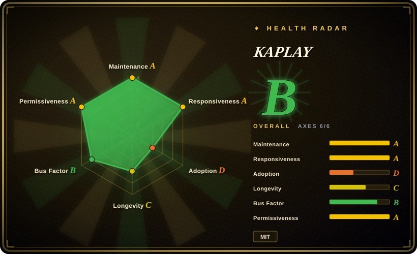
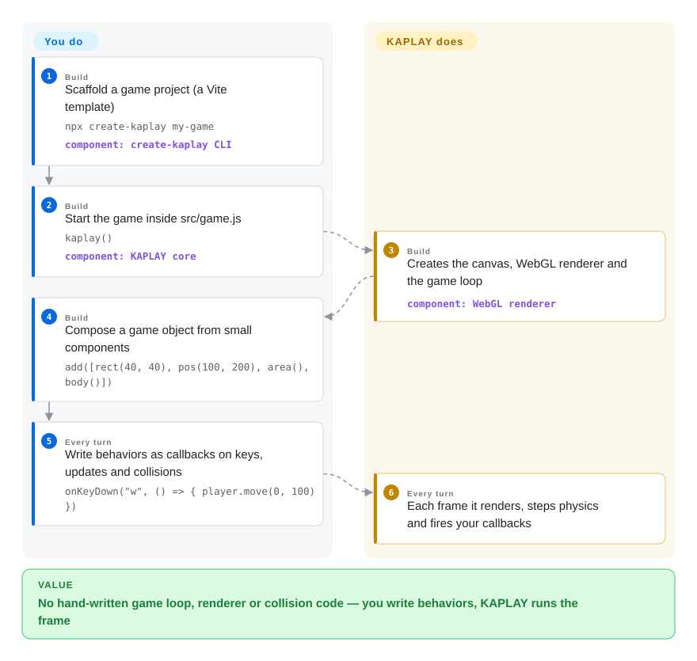

# KAPLAY

You want to put a small 2D game on the web this weekend, and every "real" engine wants a scene editor, a project format and an asset pipeline before a single pixel moves. KAPLAY is one `kaplay()` call plus a page of JavaScript: you compose game objects out of small components and write behaviors as callbacks, and it runs the canvas, the game loop, rendering and collision for you.

## When to use

You're a web developer (JavaScript or TypeScript) building a small 2D game — a game-jam entry, a browser toy, a tutorial-sized platformer — and the honest blocker with heavyweight engines is ceremony: you spend the first evening on project structure instead of movement. With KAPLAY you run `npx create-kaplay my-game`, and ten lines later a sprite falls under gravity and jumps on keypress: `add([sprite("bean"), pos(), area(), body()])`, then `onKeyDown("w", …)`. There is no scene-file format, no class hierarchy, no editor to learn — the code reads like the game. That is the deciding tradeoff against Phaser: KAPLAY trades Phaser's formal scene manager and huge plugin ecosystem for minimal boilerplate and a scripting style built for jam-scale iteration.

You also reach for it when you're coming from **Kaboom.js**: Replit archived kaboom in 2024 and its own README points to KAPLAY as the community fork, with kaboom's most prolific contributor (slmjkdbtl, 1511 commits) now KAPLAY's top contributor — old kaboom snippets and tutorials mostly still map over. TypeScript types are first-class (the library is written in TS), and the in-browser KAPLAYGROUND playground lets you try snippets with zero setup.

## How it works

KAPLAY is an npm library you load into a web page — usually inside a Vite project, because a bundler is the expected setup (the README says so explicitly; a CDN `<script>` also works). What you write is *declarative objects plus imperative callbacks*: a game object is an `add([...])` call whose list mixes render components (`sprite`, `rect`), spatial components (`pos`, `area`), physics components (`body`), data components (`health`) and plain string tags. What KAPLAY does for you is everything frame-shaped: it owns the canvas and a custom WebGL renderer, steps gravity and collisions, and every frame calls back into your code (`onUpdate`, `onKeyDown`, `player.onCollide("enemy", …)`) so behaviors stay one-liners. You never write `requestAnimationFrame`, a draw loop, or a bounding-box check.

<!-- flow-steps:begin (generated from flows/kaplay.json by tools/flow_card.py — do not edit) -->

Text version of the flow

1. **You** (Build): Scaffold a game project (a Vite template) — `npx create-kaplay my-game` — component: `create-kaplay CLI`
2. **You** (Build): Start the game inside src/game.js — `kaplay()` — component: `KAPLAY core`
3. **KAPLAY** (Build): Creates the canvas, WebGL renderer and the game loop — component: `WebGL renderer`
4. **You** (Build): Compose a game object from small components — `add([rect(40, 40), pos(100, 200), area(), body()])`
5. **You** (Every turn): Write behaviors as callbacks on keys, updates and collisions — `onKeyDown("w", () => { player.move(0, 100) })`
6. **KAPLAY** (Every turn): Each frame it renders, steps physics and fires your callbacks

**Value**: No hand-written game loop, renderer or collision code — you write behaviors, KAPLAY runs the frame

<!-- flow-steps:end -->

## When NOT to use

- **You're building a product with a long maintenance horizon.** The stable npm line (`3001.0.19`) has not seen a release since 2025-06, while all development goes to `4000.0.0-alpha` (27+ alphas since mid-2025, latest 2026-05, with breaking changes in the unreleased changelog). Until v4000 stabilizes, pick **Phaser** for code you must pin and maintain for years — its release history is far more settled.
- **You're doing 3D.** KAPLAY is strictly 2D. For 3D on the web use **Three.js**; for a full 3D/2D engine with an editor use **Godot** or Unity.
- **You want a visual editor, scene files, animation timelines, an asset-import pipeline.** KAPLAY is code-only; the KAPLAYGROUND is a browser sandbox for trying code, not a project editor. Use **Godot** for editor-driven production work.
- **You need a general rigid-body physics simulator** — articulated bodies, constraints, thousands of interacting bodies. KAPLAY's built-in `body()` physics is arcade/platformer-shaped (gravity, ground collision, jumping; see `src/game/gravity.ts`); for serious simulation use an engine that integrates **Rapier**, **Matter.js** or **planck.js**. [推断]
- **You're targeting native desktop, mobile stores or consoles as first-class platforms.** KAPLAY is web-canvas-first; community wrappers exist (e.g. a Neutralino template in the org) but that is not the paved path. Use **Godot** for multi-platform export.

## Comparison

| Alternative | In index | Our verdict | Tradeoff |
|---|---|---|---|
| Phaser | 未收录 | Choose Phaser when you need a mature, semver-stable 2D framework with a large plugin/module ecosystem for a long-lived product; choose KAPLAY when boilerplate-free component scripting and jam-scale iteration speed win. | Phaser (MIT, ~40k stars, active 2026-08) gives structure and ecosystem at the cost of more ceremony; KAPLAY gives immediacy at the cost of a smaller ecosystem and an unsettled v4000 API. Not added in this tab-intake batch. |
| Kaboom.js | 未收录 | Treat kaboom as its own README does — no longer maintained — and start new work on KAPLAY, the community continuation with the same API feel and top contributor lineage. | Archived by Replit (2024); KAPLAY inherits the tutorial base and the fun-first API, so the fork is nearly a rename for small projects. Archived repo, not added in this tab-intake batch. |
| PixiJS | 未收录 | Choose PixiJS when you need a fast 2D WebGL renderer (effects, particles, thousands of sprites) and are willing to build game logic yourself; choose KAPLAY when you want loop, input, physics and collision already wired in. | PixiJS (MIT, ~48k stars, active 2026-09) is a rendering engine, not a game library — you get speed and flexibility, not `body()` or `onCollide`. Not added in this tab-intake batch. |
| Excalibur.js | 未收录 | Choose Excalibur when you want a TypeScript-first 2D engine with a traditional actor/scene model and a long (since 2013) release history; choose KAPLAY when kaboom-style component composition feels faster to you. | Excalibur (BSD-2, ~2.3k stars, active) is the more conventional, structured engine; KAPLAY is the looser, snippet-friendly one. Not added in this tab-intake batch. |
| Godot | 未收录 | Choose Godot when the project needs an editor, scenes, 2D+3D and export to desktop/mobile/console; choose KAPLAY for a web-first game you describe entirely in code. | Full engine versus a web library — Godot covers far more surface at a much heavier learning and tooling cost. Not added in this tab-intake batch. |

## Tech stack

- **Language:** TypeScript throughout (source, types bundled — `dist/doc.d.ts`); ships as ESM (`kaplay.mjs`) and CJS (`kaplay.cjs`) with a `./global` export for script-tag use.
- **Rendering:** a custom **WebGL** renderer written in-repo (`src/gfx/`: texture packer, framebuffers, draw calls); audio in `src/audio/`; a new ECS layer is growing in `src/ecs/` for v4000.
- **Build/dev tooling (contributors only):** esbuild, dts-bundle-generator, ESLint + dprint, Playwright for tests, Node ≥ 24 in `engines`.

## Dependencies

- **Runtime:** a browser (canvas/WebGL) and your assets (sprites, sounds) loaded over HTTP; no server, datastore or native dependencies.
- **Dev:** Node + a bundler (Vite via `create-kaplay`, or esbuild/webpack of your choice) — or no toolchain at all via the unpkg CDN script.

## Ops difficulty

**Low — it is a client-side library; there is nothing to operate.** `npx create-kaplay my-game` gives a Vite dev server; "deployment" is publishing static files. The only operational edge is pinning the right version channel (stable `3001.x` vs `4000.0.0-alpha.*`) and watching breaking changes across alphas.

## Health & viability

- **Maintenance (2026-09-28).** Active: latest commit 2026-09-22, 95 open issues receiving feature discussion. But the **release channel is lopsided**: stable `3001.0.19` dates 2025-06-15 and hasn't moved, while v4000 has been in alpha for ~a year (alpha.27.1, 2026-05-12) with breaking changes queued. Active development, stalled stable line. [推断]
- **Governance / bus factor.** Community org (`kaplayjs`, 23 repos: create-kaplay, KAPLAYGROUND, plugin templates), funded via OpenCollective. All-time contribution history concentrates on three people (1511 / 525 / 216 commits via the contributors API), while the measured 12-month window shows 18 active maintainers with the top one at ~32% — a small core team with a real long tail. [推断]
- **Backing & Lindy.** The repo is young (2024-05) but is the **direct continuation of Kaboom.js** (2020-12, archived by Replit; kaboom's README redirects to KAPLAY; kaboom's top contributor is KAPLAY's top contributor) ⇒ ~6 years of lineage × still-active = a reasonable Lindy read for this class of library, with no foundation or vendor behind it.
- **Adoption.** 1.8k stars, 118 forks; npm 25,801 downloads last month (2026-09-28 scan; ~8.4k in the final week); 133 example files in-repo; a live playground and an ecosystem of plugins/templates. Real but modest compared with Phaser/PixiJS.
- **Risk flags.** MIT (LICENSE file, no relicense history). Main risks: the 3001/4000 version split breaking tutorials and pinning, alpha churn, and single-vendor-community dependence (no foundation).

## Caveats (unverified)

- [推断] "Stable channel stalled / v4000 stuck in alpha" is read from npm dist-tags and GitHub release dates (2026-09-28), not from a maintainer statement about release plans.
- [推断] Bus-factor numbers mix two measures: the all-time contributors API (top-1 ≈ 62% of the top-12 list) versus the health scanner's 12-month window (top-1 ≈ 32%, 18 active maintainers); attribution windows and tools count differently.
- [未验证] That old kaboom.js tutorials "mostly" carry over to KAPLAY is inferred from the shared lineage and API examples, not tested against the tutorial corpus.
- [未验证] KAPLAYGROUND's capabilities (the README calls it a web-based editor with 90+ examples; the repo's `examples/` holds 133 entries) were not exercised in a browser.
- [未验证] The arcade-physics ceiling (no articulated bodies / constraint solver) is inferred from the component surface and `src/game/gravity.ts`; no stress test was run.
- [未验证] npm download counts (8.4k/week) and star counts are point-in-time 2026-09-28 snapshots and go stale quickly.
