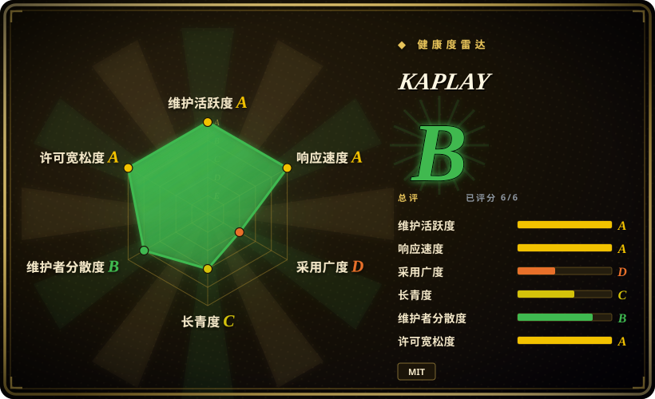
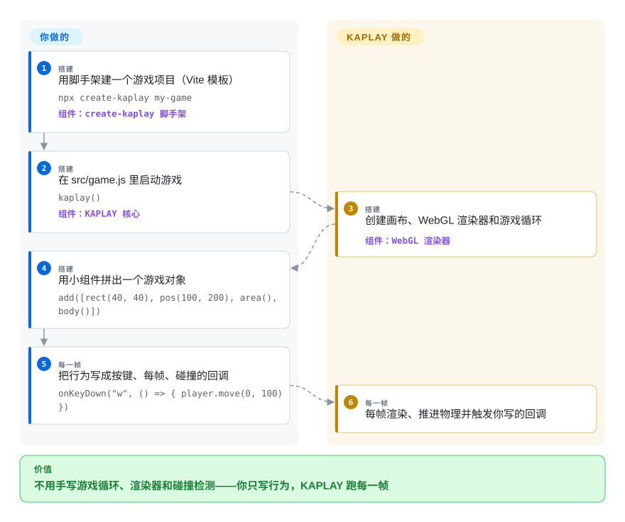

# KAPLAY

你想在周末把一个小型 2D 游戏放上网页，而每个「正经引擎」都先让你搭场景编辑器、项目格式和资源管线，才能让第一个像素动起来。KAPLAY 只需要一次 `kaplay()` 调用加一页 JavaScript：游戏对象由小组件拼装，行为写成回调，画布、游戏循环、渲染和碰撞检测都由它替你跑。

## 何时使用

你是 Web 开发者（JavaScript 或 TypeScript），在做一个小型 2D 游戏——游戏 Jam 作品、浏览器小玩具、教程规模的平台跳跃——而重型引擎对你真正的阻碍是仪式感：第一个晚上耗在项目结构上，角色还没动起来。用 KAPLAY，`npx create-kaplay my-game` 之后十行代码，精灵就会受重力下落、按键即跳：`add([sprite("bean"), pos(), area(), body()])`，再写 `onKeyDown("w", …)`。没有场景文件格式、没有类继承体系、没有要学的编辑器——代码读起来就是游戏本身。这是它对 Phaser 的决定性取舍：KAPLAY 用 Phaser 的正式场景管理与庞大插件生态，换来接近零的样板代码和为 Jam 规模迭代设计的脚本风格。

从 **Kaboom.js** 迁移时也会选它：Replit 在 2024 年归档了 kaboom，其 README 自己指向 KAPLAY 这个社区分支，kaboom 代码量最多的贡献者（slmjkdbtl，1511 次提交）如今是 KAPLAY 的首席贡献者——旧的 kaboom 代码片段和教程大多能对上。TypeScript 类型是一等公民（库本身用 TS 写成），浏览器里的 KAPLAYGROUND 让你零配置试运行代码片段。

## 怎么用起来

KAPLAY 是一个装进网页的 npm 库——通常放在 Vite 项目里，因为打包器是预期配置（README 明说了；CDN `<script>` 也可以）。你写的是「声明式对象加命令式回调」：一个游戏对象就是一次 `add([...])` 调用，列表里混着渲染组件（`sprite`、`rect`）、空间组件（`pos`、`area`）、物理组件（`body`）、数据组件（`health`）和普通字符串标签。KAPLAY 替你做的是一切「每帧」的事：它掌管画布和一个自带的 WebGL 渲染器，推进重力和碰撞，并在每一帧回调你的代码（`onUpdate`、`onKeyDown`、`player.onCollide("enemy", …)`），让行为保持一行一个。你永远不用写 `requestAnimationFrame`、绘制循环或包围盒判断。

<!-- flow-steps:begin (generated from flows/kaplay.json by tools/flow_card.py — do not edit) -->

流程文字版

1. **你**（搭建）：用脚手架建一个游戏项目（Vite 模板） — `npx create-kaplay my-game` — 组件：`create-kaplay 脚手架`
2. **你**（搭建）：在 src/game.js 里启动游戏 — `kaplay()` — 组件：`KAPLAY 核心`
3. **KAPLAY**（搭建）：创建画布、WebGL 渲染器和游戏循环 — 组件：`WebGL 渲染器`
4. **你**（搭建）：用小组件拼出一个游戏对象 — `add([rect(40, 40), pos(100, 200), area(), body()])`
5. **你**（每一帧）：把行为写成按键、每帧、碰撞的回调 — `onKeyDown("w", () => { player.move(0, 100) })`
6. **KAPLAY**（每一帧）：每帧渲染、推进物理并触发你写的回调

**价值**：不用手写游戏循环、渲染器和碰撞检测——你只写行为，KAPLAY 跑每一帧

<!-- flow-steps:end -->

## 何时不用

- **在做需要长期维护的产品。** npm 稳定线（`3001.0.19`）自 2025-06 后没有新版本，而全部开发都进了 `4000.0.0-alpha`（2025 年中以来 27+ 个 alpha，最新 2026-05，未发布日志里排着破坏性变更）。在 v4000 稳定之前，要钉住版本维护多年的代码请选 **Phaser**——它的发布史沉稳得多。
- **做 3D。** KAPLAY 只做 2D。Web 上的 3D 用 **Three.js**；要带编辑器的完整 2D/3D 引擎用 **Godot** 或 Unity。
- **想要可视化编辑器、场景文件、动画时间线、资源导入管线。** KAPLAY 纯代码；KAPLAYGROUND 是浏览器里试代码的沙盒，不是项目编辑器。编辑器驱动的生产工作用 **Godot**。
- **需要通用刚体物理模拟**——铰接体、约束、成千上万个相互作用的对象。KAPLAY 内置的 `body()` 物理是街机/平台跳跃形状的（重力、落地碰撞、跳跃；见 `src/game/gravity.ts`）；严肃模拟请选能集成 **Rapier**、**Matter.js** 或 **planck.js** 的引擎。[推断]
- **以原生桌面、手机商店或主机为第一等目标平台。** KAPLAY 是 Web 画布优先；社区封装存在（组织里有一个 Neutralino 模板），但那不是铺好的路。多平台导出用 **Godot**。

## 横向对比

| 替代品 | 是否收录 | 我们的评价 | 取舍 |
|---|---|---|---|
| Phaser | 未收录 | 长生命周期产品需要成熟、版本号稳定的 2D 框架和庞大插件生态时选 Phaser；零样板、组件式脚本和 Jam 规模的迭代速度更重要时选 KAPLAY。 | Phaser（MIT，约 4 万星，2026-08 仍活跃）给结构和生态，代价是更多仪式感；KAPLAY 给即时性，代价是更小的生态和未定的 v4000 API。本批 tab-intake 未收录。 |
| Kaboom.js | 未收录 | 按 kaboom 自己 README 的说法——不再维护——新项目直接从 KAPLAY 开始，它是同一 API 手感、同一核心贡献者谱系的社区延续。 | 2024 年被 Replit 归档；KAPLAY 继承了教程存量和 fun-first API，对小项目几乎是换名。已归档仓库，本批 tab-intake 未收录。 |
| PixiJS | 未收录 | 需要快速的 2D WebGL 渲染器（特效、粒子、海量精灵）且愿意自己搭游戏逻辑时选 PixiJS；想要循环、输入、物理、碰撞都接好时选 KAPLAY。 | PixiJS（MIT，约 4.8 万星，2026-09 仍活跃）是渲染引擎不是游戏库——给你速度和灵活，不给你 `body()` 和 `onCollide`。本批 tab-intake 未收录。 |
| Excalibur.js | 未收录 | 想要 TypeScript 优先、传统 actor/场景模型且发布史悠久（2013 年起）的 2D 引擎时选 Excalibur；kaboom 式组件拼装写起来更快时选 KAPLAY。 | Excalibur（BSD-2，约 2.3 千星，活跃）是更常规、结构化的引擎；KAPLAY 是更松散、对代码片段友好的那个。本批 tab-intake 未收录。 |
| Godot | 未收录 | 项目需要编辑器、场景系统、2D+3D 和桌面/移动/主机导出时选 Godot；做纯代码描述的 Web 优先小游戏时选 KAPLAY。 | 完整引擎对 Web 库——Godot 覆盖面大得多，学习和工具链成本也重得多。本批 tab-intake 未收录。 |

## 技术栈

- **语言：** 全 TypeScript（源码即类型，`dist/doc.d.ts` 随包发布）；以 ESM（`kaplay.mjs`）和 CJS（`kaplay.cjs`）双格式发布，另有 `./global` 导出供 script 标签使用。
- **渲染：** 仓库内自写的 **WebGL** 渲染器（`src/gfx/`：纹理打包、帧缓冲、绘制调用）；音频在 `src/audio/`；`src/ecs/` 里正在为 v4000 生长新的 ECS 层。
- **构建/开发工具（仅贡献者需要）：** esbuild、dts-bundle-generator、ESLint 与 dprint、Playwright 测试，`engines` 要求 Node ≥ 24。

## 依赖

- **运行时：** 一个浏览器（canvas/WebGL）和走 HTTP 加载的资源（精灵图、音效）；没有服务器、数据库或原生依赖。
- **开发期：** Node 加一个打包器（`create-kaplay` 自带 Vite，或自选 esbuild/webpack）——或者走 unpkg CDN 脚本，完全不要工具链。

## 运维难度

**低——纯客户端库，无可运维面。** `npx create-kaplay my-game` 给出 Vite 开发服务器；「部署」就是发布静态文件。唯一的运维边角是钉对版本通道（稳定 `3001.x` 还是 `4000.0.0-alpha.*`）并盯住 alpha 之间的破坏性变更。

## 健康度与可持续性

- **维护（2026-09-28）。** 活跃：最新提交 2026-09-22，95 个开放议题里有实质的功能讨论。但**发布通道失衡**：稳定版 `3001.0.19` 停在 2025-06-15，v4000 却 alpha 了约一年（alpha.27.1，2026-05-12），未发布日志里排着破坏性变更。开发在跑，稳定线停滞。[推断]
- **治理/巴士系数。** 社区组织（`kaplayjs`，23 个仓库：create-kaplay、KAPLAYGROUND、插件模板），OpenCollective 资助。全部历史的贡献集中在三个人（contributors API 计 1511／525／216 次提交），而机器测得的近 12 个月窗口有 18 位活跃维护者、首席约占 32%——核心团队小，但有真实的长尾贡献者。[推断]
- **背书与 Lindy。** 仓库年轻（2024-05 创建），但它是 **Kaboom.js 的直接延续**（kaboom 2020-12 创建、被 Replit 归档；kaboom 的 README 重定向到 KAPLAY；kaboom 的首席贡献者就是 KAPLAY 的首席贡献者）⇒ 约 6 年谱系 × 仍活跃 = 对这类库是合理的 Lindy 判断，背后没有基金会或厂商。
- **采用。** 1.8 千星、118 fork；npm 上月下载 25801 次（2026-09-28 扫描；最后一周约 8.4 千次）；仓库内 133 个示例文件；有在线 playground 和插件/模板生态。真实但相比 Phaser/PixiJS 规模有限。
- **风险旗标。** MIT（LICENSE 文件，无换证史）。主要风险：3001/4000 版本分裂会打断教程和版本钉定、alpha 变更频繁、依赖单一社区（无基金会）。

## 存疑（未验证）

- [推断] 「稳定线停滞／v4000 卡在 alpha」读自 npm dist-tags 与 GitHub 发布日期（2026-09-28），并非维护者对发布计划的表态。
- [推断] 巴士系数数字混了两种口径：全部历史的 contributors API（首席约占前 12 名列表的 62%）对健康度扫描器的近 12 个月窗口（首席约 32%、18 位活跃维护者）；归因窗口与工具不同，统计结果不同。
- [未验证] 旧 kaboom.js 教程「大多能」迁移到 KAPLAY 是从谱系与 API 示例推断的，没有对教程语料实测。
- [未验证] KAPLAYGROUND 的能力（README 称其为带 90+ 示例的网页编辑器；仓库 `examples/` 有 133 个条目）未在浏览器里实际试用。
- [未验证] 街机物理的天花板（无铰接体/约束求解器）是从组件面和 `src/game/gravity.ts` 推断的，未做压力测试。
- [未验证] npm 下载数（周 8.4 千）与星数是 2026-09-28 的时点快照，很快会过期。
