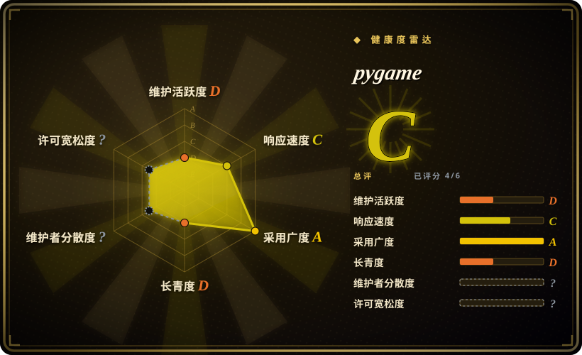
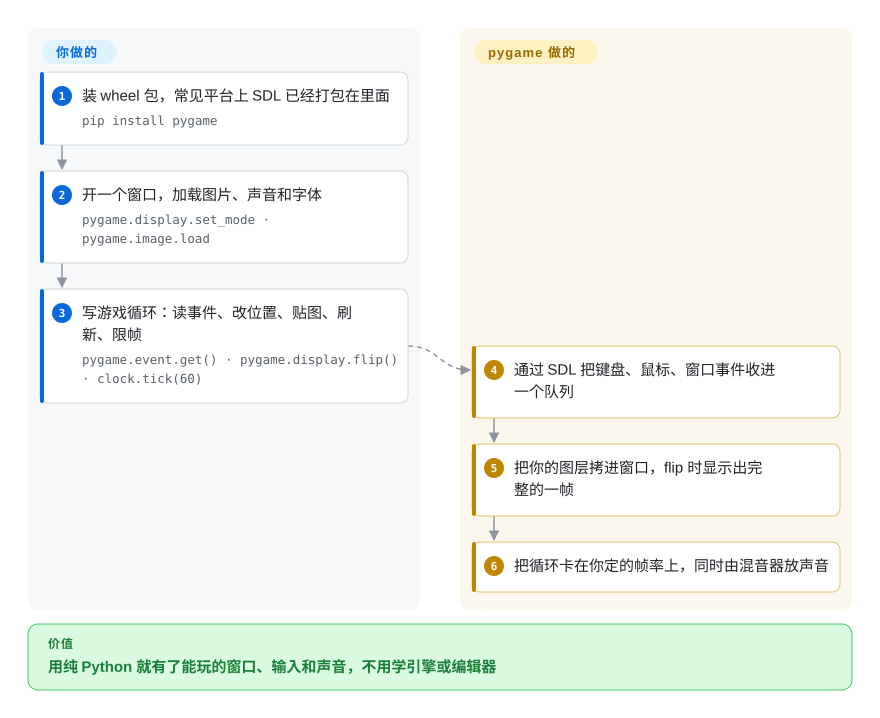

# pygame

一个免费、跨平台的 Python 库，用来写 2D 游戏和多媒体应用——它是 SDL 之上的 Pythonic 封装，给你一个显示 surface、一个事件循环、图像/声音/字体加载，以及精灵/碰撞辅助。

## 何时使用

你在自学（或带一门课）编程，想要把像素画到屏幕上的那种成就感，而不只是往终端打印。你 `pip install pygame`，几十行内就有了一个窗口、一个轮询 `pygame.event.get()` 的游戏循环、一个用方向键移动的玩家矩形，以及碰撞时播放的一段声音。没有引擎 GUI、没有工程格式、没有要学的资源管线——它就是 Python，你能读懂自己游戏的每一行。对于学习游戏循环、精灵、碰撞和基础图形/音频，pygame 是 Python 里典范级的低摩擦起点。

当你想做一个*小*的 2D 游戏或交互多媒体玩具、而你已经习惯用 Python 思考时，你也会选它：一次 game-jam 作品、一个带键鼠交互的可视化、一个教学 demo，或一个原型。你能往 surface 上 blit、加载图像和字体、用 mixer 做音频、用带碰撞检测的精灵组、用 clock 控帧率——足够你不离开 Python 生态、不上重量级引擎就交付一个完整的小 2D 游戏。

## 怎么用起来

pygame 给你的是积木，不是游戏。**平台层的活它来干**：通过 SDL（Simple DirectMedia Layer，一个和各操作系统的窗口、输入、图形、音频打交道的 C 库）开窗口、收键盘鼠标事件、加载图片声音字体，并在后台混音。**构成游戏本身的那个循环由你来写**：每一帧用 `pygame.event.get()` 取事件，移动你的对象，把你的 surface（内存里的图像）blit——也就是拷贝——到屏幕 surface 上，调用 `pygame.display.flip()` 显示这一帧，再用 `clock.tick(60)` 把帧率卡住。`pygame.sprite` 精灵组、矩形碰撞检测这类辅助能省掉样板代码，但场景、物理、编辑器都得你自己搭。它是一盒乐高积木，不是拼好的模型。

<!-- flow-steps:begin (generated from flows/pygame.json by tools/flow_card.py — do not edit) -->

流程文字版

1. **你**：装 wheel 包，常见平台上 SDL 已经打包在里面 — `pip install pygame`
2. **你**：开一个窗口，加载图片、声音和字体 — `pygame.display.set_mode · pygame.image.load`
3. **你**：写游戏循环：读事件、改位置、贴图、刷新、限帧 — `pygame.event.get() · pygame.display.flip() · clock.tick(60)`
4. **pygame**：通过 SDL 把键盘、鼠标、窗口事件收进一个队列
5. **pygame**：把你的图层拷进窗口，flip 时显示出完整的一帧
6. **pygame**：把循环卡在你定的帧率上，同时由混音器放声音

**价值**：用纯 Python 就有了能玩的窗口、输入和声音，不用学引擎或编辑器

<!-- flow-steps:end -->

## 何时不用

- **你要做 3D 游戏或任何性能敏感的东西。** pygame 是 2D、CPU blitting 的库；没有场景图、没有内置 3D，Python 游戏循环在任何吃力的场景下都会成为瓶颈。要 3D 或 AAA 级，那是 Godot/Unity/Unreal 的地盘。
- **你想要编辑器、场景系统或资源管线。** 它是*库*，不是引擎——没有可视化编辑器、没有场景格式、没有动画时间轴。想要“打开工程拖实体”，去看 Godot。
- **你需要一个打磨完善、功能齐全的 2D 引擎。** 想要更多结构（内置物理、tilemap、GUI、部署到主机），考虑 pyglet、Arcade 或一个真引擎；pygame 刻意保持底层。
- **你把 web 或移动端当作一等平台。** pygame 桌面优先（Windows/macOS/Linux）；web（经 pygbag/WASM）和移动端可行，但不是主要的、铺好的路。
- **你要开新项目，并且想用仍在积极维护的那条线。** 本仓库自 2025-10-05 起没有提交，2.6.1（2024-09）之后没有发版。社区分叉 **pygame-ce**（`pip install pygame-ce`，导入名仍是 `pygame`）2026-10-06 还有推送，PyPI 上到了 2.5.8；除非课程或依赖钉死了原版包，否则优先选它。先确认你的教程和依赖假设的是哪一个——两个包装进同一个环境会抢同一个 `pygame` 导入名。

## 横向对比

| 替代品 | 是否收录 | 我们的评价 | 取舍 |
|---|---|---|---|
| pygame-ce（社区版） | 未收录 | 当更快发布、更新 SDL 支持或教程兼容性指向分叉时，选 pygame-ce；当原始包名和长期生态对课程或依赖链更稳时，选 pygame。 | 同一个库的社区分叉，发布节奏更快、SDL 支持更新；API 兼容到选择主要在于维护速度和你的教程以哪个为目标。[未验证] |
| pyglet | 未收录 | 当 OpenGL 优先的窗口、多媒体或轻量 3D 支持更重要时，选 pyglet；当 SDL 支撑的 2D 教学材料和初学者生态更重要时，选 pygame。 | 纯 Python、基于 OpenGL 的窗口/多媒体库；不依赖 SDL，经 OpenGL 支持 3D，但教学社区比 pygame 小。 |
| Arcade | 未收录 | 当你要更干净的现代 Python 2D API、tilemap 和物理辅助时，选 Arcade；当你要低层经典 API 和更大的教程库时，选 pygame。 | 基于 OpenGL 的现代 Python 2D 游戏库，OO API 更干净，内置 tilemap/物理辅助；更年轻、生态更小。 |
| Godot | 未收录 | 当你需要带编辑器、场景、2D/3D 和资源流程的真正引擎时，选 Godot；当任务是 Python 优先的小型 2D 项目或教学循环时，选 pygame。 | 一个完整的开源游戏*引擎*（编辑器、场景、2D 加 3D、GDScript/C#）；能力强得多但是完全另一种要学的工具——对“画个矩形让它动”而言杀鸡用牛刀。 |
| Raylib（加 python 绑定） | 未收录 | 当简单 C 游戏库和多语言绑定更合适时，选 Raylib；当 Python 教程引力和 SDL 风格 2D 工作流是决定因素时，选 pygame。 | 简单的 C 游戏库，带多语言绑定；很易上手，但生态不同，没有 pygame 那样的 Python 教程引力。 |

## 技术栈

- **核心语言：** C（扩展模块）封装 **SDL** 做窗口、输入和渲染，上层套一个 Python API。[推断]
- **后端/库：** SDL 加它的配套库——图像（SDL_image）、音频混音（SDL_mixer）、字体（SDL_ttf/freetype）；仓库内置了 FLAC、Ogg/Vorbis、Opus、PNG、JPEG、freetype、portmidi 等的许可文件。
- **分发：** PyPI 上提供常见平台的预编译 wheel（所以通常 `pip install pygame` 不需要编译器），也可源码构建。
- **API 面：** display/surface blitting、事件队列、image/font/mixer 模块、`sprite` 组加碰撞辅助、用 `time.Clock` 控帧。

## 依赖

- **运行时：** 一个 CPython 解释器；多数平台上 PyPI wheel 已打包 SDL 栈，无需单独装系统库。
- **系统库（源码构建）：** 从源码编译而非装 wheel 时，需要 SDL2 及其配套开发库（image/mixer/ttf）。
- **构建：** 从源码构建需要 C 工具链加 SDL 开发头文件；有匹配 wheel 时不需要。

## 运维难度

**低——它是客户端库，没有要运维的东西。** 对用户而言，靠 wheel，在受支持平台上 `pip install pygame` 就是全部安装；你把游戏当普通 Python 脚本跑。“难度”只出现在边缘：对着正确 SDL 版本从源码构建、为分发打包游戏（PyInstaller 之类），或面向 web/移动端——这些都在铺好的路之外。没有服务器、数据存储或部署面。

## 健康度与可持续性

- **响应速度**：Grade C——中位首次响应时间 460.0 小时，基于 3 个 qualifying issues/PRs。
- **维护（2026-10）：吃老本。** 最近的发布是 2.6.1（2024-09）和 2.6.0（2024-06）；默认分支最后的提交是 2025-10-05 的一批合并（Python 3.14 的 Windows 构建配置、文档修正），之后再无提交。这次重算里雷达的维护轴从 B 掉到 D：一年没有提交，已经抵消了成熟库的宽限。未归档。
- **治理 / bus factor。** 组织所有（`pygame`），有多人贡献历史（illume/René Dudfield、MyreMylar、Starbuck5、ankith26，以及初代作者 PeterShinners/llindstrom）。评分器已经无法归属近期活动（统计窗口内没有提交），而活跃开发大多转到了 **pygame-ce** 分叉（`pygame-community/pygame-ce`，2026-10-06 仍有推送）。[推断]
- **年龄与 Lindy 判断。** 这个 GitHub 仓库始于 2017-03（长青度轴现在是 D，因为年龄只在仓库仍活跃时才算数），但 **pygame 这个项目约有 25 年历史**，每月仍有约 220 万次安装——*这套 API 和生态*有非常强的 Lindy 先验；*这个发行版*的发布线已经没有了。想要 Lindy 的稳妥又要有人维护，pygame-ce 继承了同一套 API。
- **采用度。** Grade A——PyPI 上月下载量 2,217,050、依赖仓库 17,300 个；在教程和课程里无处不在。
- **风险标记。** 和 **pygame-ce** 的分裂是要权衡的主要一项：导入名相同，发布线分道扬镳。README 声明 LGPL-2.1（GitHub 不报 SPDX id，所以雷达的许可轴无法打分）。

## 存疑（未验证）

- [未验证] 许可：README 声明 GNU **LGPL v2.1**（文件 `docs/LGPL.txt`）并明确保留为未来版本重新许可的权利；GitHub API 未报告 SPDX id，所以 LGPL-2.1 取自 README/LICENSE 文件而非 API 徽章。
- [未验证] 截至 2026-10 约 9.0k star（4126 fork、777 个 open issue 为 2026-06 数据）——易变且对时间敏感。
- [未验证] pygame-ce 的活跃度（2026-10-06 推送、PyPI 2.5.8）已于 2026-10-08 核实；它与原版 API 的兼容程度、对更新 SDL 的支持，以及“导入名仍是 `pygame`、两个包装在同一环境会冲突”的说法来自社区认知，不是来自它的 README 或代码对比。
- [未验证] 真实项目年龄（约 25 年、2000 年代初起源）远超 GitHub 仓库 2017 的 `created_at`；Lindy 判断依赖更早的起源，而非仅凭本仓库元数据断言。
- [推断] SDL/SDL_image/SDL_mixer 后端拆分和内置依赖许可是从仓库 `docs/licenses` 目录和标准 pygame 架构推断的，并非代码审计。
- [未验证] web（pygbag/WASM）和移动端支持存在但不是主要受支持路径；状态随时间变化。
