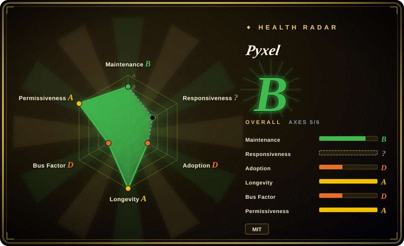
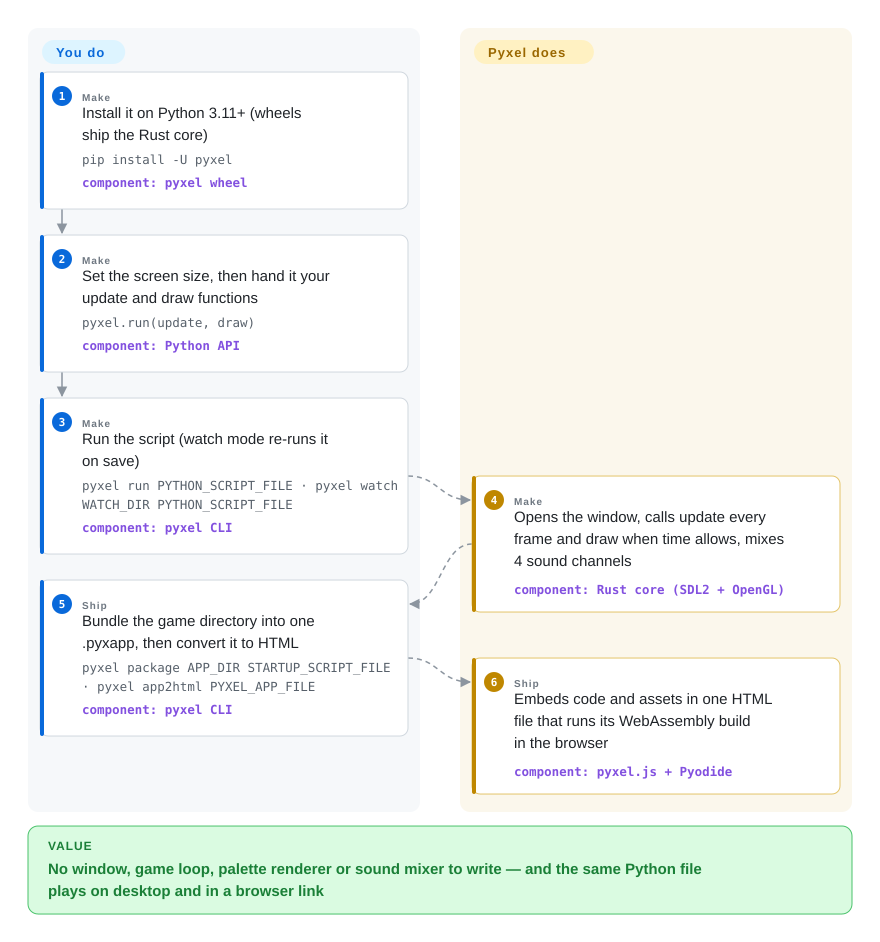

# Pyxel

You want to make a small game in Python, but with pygame you first spend an evening choosing a palette, drawing sprites in some other program, wiring a sound library and writing the frame loop — and the result still can't be opened from a link. Pyxel fixes the limits up front, like an old console (16 colors, 4 sound channels, a small pixel screen), and ships the loop, the pixel editor, a chiptune sound editor and a one-command web export with it.

## When to use

You're a Python programmer — a student, a teacher running a class, a hobbyist entering a game jam — and you want a finished-looking little game, not a framework project. With pygame the first hours go to everything that isn't the game: `pygame.display.set_mode`, a `while True` loop with `clock.tick(30)`, loading PNGs you drew in Aseprite, finding `.wav` files, and then discovering your friends need Python installed to play it. With Pyxel you write two functions, call `pyxel.run(update, draw)`, open `pyxel edit` to draw sprites and compose music in the same tool, and finish with `pyxel app2html` — the game is one HTML file you can post anywhere.

The deciding tradeoff is **constraint for speed**. Pyxel, like the PICO-8 / TIC-80 fantasy consoles it is compared to, takes design choices away (a fixed 16-color default palette, 256×256 image banks, 4-channel chip sound) and in return gives you a coherent retro look and a complete toolchain on day one. Pick it over pygame when "retro pixel art, done this weekend, playable in a browser" is the goal; pick it over PICO-8 when you want real Python, the full standard library, an MIT license and no paid license.

## How it works

Pyxel is a Python package whose heavy lifting is done by a Rust core (`pyxel-core`, bound to Python with PyO3 and drawing through SDL2 and OpenGL). You only write Python: `pyxel.init(160, 120)` sets the screen, and `pyxel.run(update, draw)` hands over control. From then on Pyxel owns the frame — it calls your `update` every frame and your `draw` when time allows (it skips draws under load so motion stays smooth), keeps the screen as a grid of palette numbers rather than real colors (like a paint-by-numbers canvas the GPU colors in at the last moment), and mixes the four sound channels. Sprites, tilemaps, sounds and music live in a `.pyxres` resource file you edit with the bundled Pyxel Editor (`pyxel edit`), or you write them as strings / MML — Music Macro Language, a text notation like `"CDEFG"`. For the web, the same Python runs inside the browser through a WebAssembly build of Pyxel on Pyodide (CPython compiled to WebAssembly); `app2html` packs your code and assets into a single page.

<!-- flow-steps:begin (generated from flows/pyxel.json by tools/flow_card.py — do not edit) -->

Text version of the flow

1. **You** (Make): Install it on Python 3.11+ (wheels ship the Rust core) — `pip install -U pyxel` — component: `pyxel wheel`
2. **You** (Make): Set the screen size, then hand it your update and draw functions — `pyxel.run(update, draw)` — component: `Python API`
3. **You** (Make): Run the script (watch mode re-runs it on save) — `pyxel run PYTHON_SCRIPT_FILE · pyxel watch WATCH_DIR PYTHON_SCRIPT_FILE` — component: `pyxel CLI`
4. **Pyxel** (Make): Opens the window, calls update every frame and draw when time allows, mixes 4 sound channels — component: `Rust core (SDL2 + OpenGL)`
5. **You** (Ship): Bundle the game directory into one .pyxapp, then convert it to HTML — `pyxel package APP_DIR STARTUP_SCRIPT_FILE · pyxel app2html PYXEL_APP_FILE` — component: `pyxel CLI`
6. **Pyxel** (Ship): Embeds code and assets in one HTML file that runs its WebAssembly build in the browser — component: `pyxel.js + Pyodide`

**Value**: No window, game loop, palette renderer or sound mixer to write — and the same Python file plays on desktop and in a browser link

<!-- flow-steps:end -->

## When NOT to use

- **You need 3D, high resolution, or many on-screen objects.** Pyxel is a software pixel engine: every primitive is drawn on the CPU into a small palette-indexed buffer, and your per-object logic runs in Python each frame. For a 2D game at modern resolutions, or 3D, use **Godot**; for a Python 2D game with GPU-batched sprites, use **Arcade**.
- **The game's look must not be "retro".** The 16-color default palette and pixel scaling are the point. You can load custom palettes and raise limits through the Advanced API, but if you are fighting the aesthetic, **pygame** (or pygame-ce) gives you an unconstrained RGB surface.
- **You want to sell on Steam, consoles or the mobile app stores.** Distribution is `.pyxapp`, a PyInstaller-based `app2exe`, and HTML; there is no native iOS/Android or console export, and phones are reached only through the browser with a virtual gamepad. For multi-platform commercial shipping, use **Godot**.
- **Your web build must work offline or from your own servers only.** `app2html` embeds your code but the page still pulls Pyxel's `pyxel.js` from jsdelivr and Pyodide from the jsdelivr CDN, and the Pyodide download is several MB (an issue cites ~9 MB+) before the game starts. For a tiny self-contained web build, use **TIC-80** or a JavaScript library such as [KAPLAY](kaplay.md).
- **You need a project that outlives one person.** Pyxel is a single-maintainer project: the author has ~7,300 commits and the next contributor 12, external PRs are often left open or closed unmerged, and the 2.4 release broke the sound API (`play` ticks became seconds, MML syntax changed). If a team must own the engine long term, use **pygame** (an organization repo with decades of history) or **Godot** (a foundation-backed engine).
- **You're teaching plain Python to absolute beginners on locked-down machines.** It needs Python ≥ 3.11 for the local install (older school images fail at `pip install`); there, use the browser-only Pyxel Code Maker or stay on **pygame**, which supports older Pythons.

## Comparison

| Alternative | In index | Our verdict | Tradeoff |
|---|---|---|---|
| [pygame](pygame.md) | ✅ | Choose pygame when the game needs an unconstrained RGB screen, your own asset pipeline, or an older Python; choose Pyxel when a retro look with built-in editors and one-command web export is the goal. | pygame gives raw SDL surfaces and the largest tutorial base but no editor, palette, sound tools or web export; Pyxel gives the whole retro toolchain at the price of fixed specs and a single maintainer. |
| TIC-80 | 未收录 | Choose TIC-80 when you want a true fantasy console with a fixed 240×136 cartridge format, built-in code editor, and Lua (or another script language) in a small web build; choose Pyxel when you want CPython with the standard library and your own editor/IDE. | TIC-80 (MIT, ~6.1k stars, active 2026-10) is a self-contained console app with tighter limits and cartridges; Pyxel is a Python library with editable specs and a heavier Pyodide web runtime. Not added in this tab batch. |
| PICO-8 | 非仓库 | Choose PICO-8 when you want the most polished, community-rich fantasy console and accept a paid closed license and Lua; choose Pyxel when an open MIT engine and Python matter more. | A commercial, closed-source fantasy console (paid license, Lua, 128×128) — the reference point Pyxel's design is compared to, but not a repository. |
| Arcade | 未收录 | Choose Arcade for a modern Python 2D library with GPU sprite batching, tilemaps and physics at normal resolutions; choose Pyxel when a fixed retro pixel look and bundled pixel/sound editors are the point. | Arcade (pythonarcade/arcade, ~2.1k stars, active 2026-10) scales to more sprites and higher resolution through OpenGL, but brings no editors or chiptune tooling. Not added in this tab batch. |
| Godot | 未收录 | Choose Godot when the project needs 3D, a scene editor, or desktop/mobile/console export; choose Pyxel for a code-first retro 2D game in Python that ships as a web page. | Godot (MIT, ~118k stars, foundation-backed) covers far more but is a whole engine and language (GDScript) to learn; Pyxel is a weekend-sized tool. Not added in this tab batch. |

## Tech stack

- **Core:** Rust (`crates/pyxel-core`) — software rasterizer into a `u8` palette-indexed canvas, uploaded each frame to OpenGL/GLES via `glow` and colored by GLSL shaders (crisp / smooth / retro screen modes); SDL2 for window, input and audio (`platform/sdl2`).
- **Audio:** an in-house synthesizer (tones, wavetables, MML parser, BGM generator) plus `symphonia` for PCM file playback.
- **Python binding:** PyO3 (`abi3-py311`) built with maturin into a single wheel; type stubs ship as `__init__.pyi`.
- **Tooling in Python:** the `pyxel` CLI (`run`, `watch`, `play`, `edit`, `package`, `app2exe`, `app2html`) and Pyxel Editor (image, tilemap, sound, music editors) are written in Pyxel itself.
- **Web:** an Emscripten wheel (`wasm/pyxel-*-emscripten_*.whl`) loaded by `pyxel.js` into Pyodide.

## Dependencies

- **Local:** CPython ≥ 3.11 on Windows, macOS or Linux; `pip install -U pyxel` pulls a prebuilt wheel with SDL2 bundled — no other pip runtime dependencies.
- **Optional:** PyInstaller for `pyxel app2exe`; FFmpeg for MP4 screen captures (it reports failures as errors since 2.9.8).
- **Web:** a modern browser plus network access to `cdn.jsdelivr.net` (Pyxel's `pyxel.js` and the Pyodide runtime) unless you self-host those files.
- **Building from source (contributors only):** a pinned nightly Rust toolchain (`rust-toolchain.toml`), maturin, and SDL2 built via CMake.

## Ops difficulty

**Low — a client-side library with no server.** Users `pip install` and run scripts; web publishing is a static HTML file or a GitHub-hosted launcher URL. The only ongoing chores are pinning a Pyxel version (the Web Launcher and unpinned `pyxel.js` script tag always use the latest release, so a breaking change can reach an already-published game) and re-testing after upgrades given the 2.4-style API breaks.

## Health & viability

- **Maintenance (2026-10-05).** Very active: v2.9.9 on 2026-08-12, ten releases between 2026-04 and 2026-08, last push 2026-09-28, and recent changelogs full of crash and robustness fixes. Only 12 open issues/PRs.
- **Governance / bus factor.** A one-person project by Takashi Kitao (User-owned repo; contributors API: kitao 7,348 commits, next 12). The README itself says it is "developed by one person". External PRs exist but several were closed unmerged (e.g. #676 `resize`, whose feature then shipped from the author's own code) or left open for months — the roadmap is his. Bus factor is 1.
- **Backing & Lindy.** No company or foundation; funded through GitHub Sponsors and Ko-fi, with a Japanese official guidebook published in 2025. Age ~7.3 years (repo created 2018-06) × still very active ⇒ a solid Lindy prior for a hobby engine, discounted by the single maintainer.
- **Adoption.** 18.4k stars and 963 forks (2026-10), ~10k PyPI downloads in the last month (pypistats, 2026-10-05; the radar's 89,290 is the all-time total of the stale `pyxel-engine` crate, not monthly Python installs), a curated user-examples gallery, Discord servers in English and Japanese. Strong among education and hobbyists; there is no sign of commercial titles at scale. [推断]
- **Risk flags.** MIT license from the start (LICENSE file; GitHub's API shows `NOASSERTION` only because the file has an extra project line). Breaking API changes across minor versions (2.4 sound/MML) and a pinned nightly Rust toolchain are the real risks, not licensing.

## Caveats (unverified)

- [推断] "Strong among education and hobbyists, no commercial titles at scale" is inferred from the user-examples gallery, the Japanese guidebook and issue traffic; no usage survey was found.
- [未验证] The ~9 MB+ Pyodide web download size comes from issue #647's author, not a measurement; the author has a `pocketpy` branch where all examples reportedly run, which could shrink web builds if it lands.
- [未验证] A 3D subsystem: the coding policy lists "per-pixel 3D rasterization" and "3D collision and BVH queries" as hot paths, while PR #685 ("Add 3D p3d module") was closed unmerged on 2026-05-05; whether 3D is coming to a release was not confirmed.
- [推断] "Many objects on screen bottleneck" is inferred from the architecture (CPU rasterizer + Python per-object logic each frame); no benchmark was run.
- [未验证] No native iOS/Android or console export was found in the CLI or docs as of 2026-10-05; third-party wrappers may exist.
- [推断] The `NOASSERTION` license reading is attributed to the extra "This license applies to Pyxel" line in an otherwise standard MIT text; pyproject.toml and Cargo.toml both declare `MIT`.
- [未验证] PICO-8 details (paid license, Lua, 128×128) are from general knowledge of the product, not re-checked on its store page.
- [推断] The health radar's adoption axis was scored from the crates.io crate `pyxel-engine` (the same repo, but last published 2.6.8 in 2026-02; its 89,290 figure is all-time downloads, ~183 in the last 90 days) rather than the PyPI package `pyxel` that users actually install; the machine grade understates Python-side adoption and was left as computed.
- [未验证] Stars, forks and PyPI download counts are 2026-10-05 snapshots and go stale quickly.
