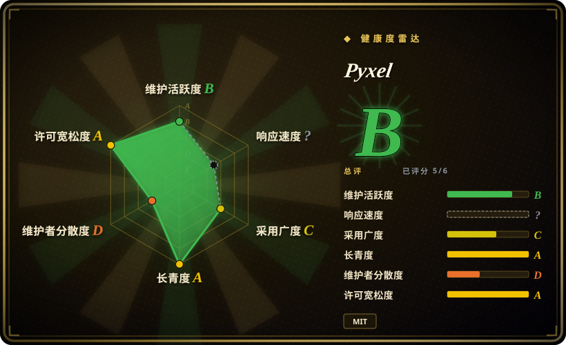
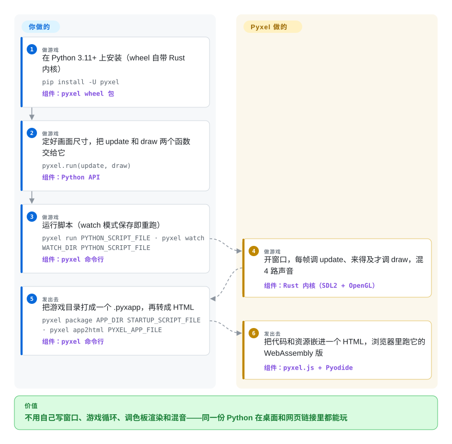

# Pyxel

想用 Python 做个小游戏，用 pygame 的话第一个晚上先得挑配色、在别的软件里画精灵图、接一个声音库、手写帧循环——做完了朋友还得先装 Python 才能玩。Pyxel 像老式游戏机一样先把规格定死（16 色、4 路声音、一块小小的像素屏），再把游戏循环、像素编辑器、芯片音乐编辑器和一条命令导出网页一并配齐。

## 何时使用

你会写 Python——学生、带编程课的老师、报名游戏 Jam 的业余爱好者——想要的是一个看起来像成品的小游戏，而不是一个框架工程。用 pygame，前几个小时都花在游戏以外的事上：`pygame.display.set_mode`、带 `clock.tick(30)` 的 `while True` 循环、加载在 Aseprite 里画好的 PNG、到处找 `.wav`，最后才发现朋友要装 Python 才能玩。用 Pyxel，你写两个函数，调用 `pyxel.run(update, draw)`，在 `pyxel edit` 这一个工具里画精灵、编曲，最后 `pyxel app2html`——游戏就是一个能随手发出去的 HTML 文件。

决定性的取舍是**用约束换速度**。Pyxel 和常被拿来比较的 PICO-8、TIC-80 这类“幻想游戏机”一样，替你拿掉一部分设计选择（固定的 16 色默认调色板、256×256 的图像库、4 路芯片音源），换来统一的复古画风和第一天就齐全的工具链。目标是“复古像素风、这个周末做完、浏览器里能玩”时，选它而不选 pygame；想要真正的 Python 和完整标准库、MIT 许可、不付授权费时，选它而不选 PICO-8。

## 怎么用起来

Pyxel 是一个 Python 包，重活由 Rust 内核完成（`pyxel-core`，经 PyO3 绑定到 Python，通过 SDL2 和 OpenGL 出画面）。你只写 Python：`pyxel.init(160, 120)` 定好屏幕，`pyxel.run(update, draw)` 交出控制权。之后每一帧都归 Pyxel 管——它每帧调用你的 `update`，时间来得及才调用你的 `draw`（负载高时跳过绘制，保证动作流畅）；屏幕里存的不是真实颜色，而是一格格调色板编号（像“按数字填色”的画布，最后一刻才由显卡上色）；四路声音也由它混音。精灵、瓦片地图、音效和音乐放在 `.pyxres` 资源文件里，用自带的 Pyxel Editor（`pyxel edit`）编辑，也可以直接写成字符串或 MML——Music Macro Language，一种像 `"CDEFG"` 这样的文字记谱法。到了网页上，同一份 Python 在浏览器里通过 Pyxel 的 WebAssembly 版本运行在 Pyodide（编译成 WebAssembly 的 CPython）之上；`app2html` 把你的代码和资源打成一个页面。

<!-- flow-steps:begin (generated from flows/pyxel.json by tools/flow_card.py — do not edit) -->

流程文字版

1. **你**（做游戏）：在 Python 3.11+ 上安装（wheel 自带 Rust 内核） — `pip install -U pyxel` — 组件：`pyxel wheel 包`
2. **你**（做游戏）：定好画面尺寸，把 update 和 draw 两个函数交给它 — `pyxel.run(update, draw)` — 组件：`Python API`
3. **你**（做游戏）：运行脚本（watch 模式保存即重跑） — `pyxel run PYTHON_SCRIPT_FILE · pyxel watch WATCH_DIR PYTHON_SCRIPT_FILE` — 组件：`pyxel 命令行`
4. **Pyxel**（做游戏）：开窗口，每帧调 update、来得及才调 draw，混 4 路声音 — 组件：`Rust 内核（SDL2 + OpenGL）`
5. **你**（发出去）：把游戏目录打成一个 .pyxapp，再转成 HTML — `pyxel package APP_DIR STARTUP_SCRIPT_FILE · pyxel app2html PYXEL_APP_FILE` — 组件：`pyxel 命令行`
6. **Pyxel**（发出去）：把代码和资源嵌进一个 HTML，浏览器里跑它的 WebAssembly 版 — 组件：`pyxel.js + Pyodide`

**价值**：不用自己写窗口、游戏循环、调色板渲染和混音——同一份 Python 在桌面和网页链接里都能玩

<!-- flow-steps:end -->

## 何时不用

- **需要 3D、高分辨率或满屏大量对象。** Pyxel 是软件像素引擎：每个图元都由 CPU 画进一块很小的调色板编号缓冲区，每个对象的逻辑每帧都在 Python 里跑。现代分辨率的 2D 游戏或 3D 用 **Godot**；要 GPU 批量绘制精灵的 Python 2D 游戏用 **Arcade**。
- **游戏的画风不能“复古”。** 16 色默认调色板和像素放大就是它的卖点。高级 API 可以换调色板、放宽上限，但如果你一直在和这种画风较劲，**pygame**（或 pygame-ce）给你的是不受限的 RGB 画布。
- **要上 Steam、主机或手机应用商店卖。** 发布形式只有 `.pyxapp`、基于 PyInstaller 的 `app2exe` 和 HTML；没有原生 iOS／Android 或主机导出，手机只能走浏览器加虚拟手柄。多平台商业发行用 **Godot**。
- **网页版必须离线可用或只从自己的服务器加载。** `app2html` 会把代码嵌进页面，但页面仍要从 jsdelivr 拉 Pyxel 的 `pyxel.js`、从 jsdelivr CDN 拉 Pyodide，游戏开始前要先下载好几 MB 的 Pyodide（有 issue 说约 9 MB 以上）。要小而自包含的网页版，用 **TIC-80** 或 [KAPLAY](kaplay.zh.md) 这类 JavaScript 库。
- **需要一个能活过一个人的项目。** Pyxel 是单人维护：作者约 7300 次提交，第二名 12 次；外部 PR 经常被挂着或不合并就关掉；2.4 版还改坏过声音 API（`play` 的 tick 改成秒、MML 语法换新）。如果引擎要由团队长期接手，选 **pygame**（组织仓库、几十年历史）或 **Godot**（有基金会支持）。
- **在锁死的机房里给零基础学生教 Python。** 本地安装要求 Python ≥ 3.11，老的学校镜像会在 `pip install` 这一步失败；这种场合用纯浏览器的 Pyxel Code Maker，或者继续用支持旧版 Python 的 **pygame**。

## 横向对比

| 替代品 | 是否收录 | 我们的评价 | 取舍 |
|---|---|---|---|
| [pygame](pygame.zh.md) | ✅ | 游戏需要不受限的 RGB 画面、自己的资源管线或旧版 Python 时选 pygame；目标是复古画风、内置编辑器和一条命令导出网页时选 Pyxel。 | pygame 给你原始的 SDL 画布和最大的教程存量，但没有编辑器、调色板、声音工具和网页导出；Pyxel 给你整套复古工具链，代价是规格固定和单人维护。 |
| TIC-80 | 未收录 | 想要真正的幻想游戏机——固定 240×136 卡带格式、内置代码编辑器、用 Lua（或其他脚本语言）、网页版小——时选 TIC-80；想用带标准库的 CPython 和自己的编辑器／IDE 时选 Pyxel。 | TIC-80（MIT，约 6.1 千星，2026-10 仍活跃）是自成一体的游戏机应用，限制更紧、以卡带分发；Pyxel 是 Python 库，规格可放宽，网页运行时（Pyodide）更重。本批未收录。 |
| PICO-8 | 非仓库 | 想要最成熟、社区最大的幻想游戏机，并接受付费闭源授权和 Lua 时选 PICO-8；更看重开源 MIT 引擎和 Python 时选 Pyxel。 | 商业闭源的幻想游戏机（付费授权、Lua、128×128）——Pyxel 设计上常被拿来对照的参照物，但它不是仓库。 |
| Arcade | 未收录 | 想要现代的 Python 2D 库，在正常分辨率下有 GPU 精灵批量绘制、瓦片地图和物理时选 Arcade；固定复古像素风和内置像素／声音编辑器才是重点时选 Pyxel。 | Arcade（pythonarcade/arcade，约 2.1 千星，2026-10 仍活跃）借 OpenGL 能撑更多精灵、更高分辨率，但不带编辑器和芯片音乐工具。本批未收录。 |
| Godot | 未收录 | 项目需要 3D、场景编辑器或桌面／移动／主机导出时选 Godot；用 Python 写代码优先、以网页发布的复古 2D 小游戏时选 Pyxel。 | Godot（MIT，约 11.8 万星，有基金会支持）覆盖面大得多，但要学一整个引擎和一门语言（GDScript）；Pyxel 是周末规模的工具。本批未收录。 |

## 技术栈

- **内核：** Rust（`crates/pyxel-core`）——软件光栅化写入 `u8` 调色板编号画布，每帧经 `glow` 上传到 OpenGL／GLES，由 GLSL 着色器上色（crisp／smooth／retro 三种屏幕模式）；窗口、输入和音频走 SDL2（`platform/sdl2`）。
- **音频：** 自研合成器（音色、波表、MML 解析器、BGM 生成器），外加 `symphonia` 播放 PCM 音频文件。
- **Python 绑定：** PyO3（`abi3-py311`），用 maturin 打成单个 wheel；类型存根随包发布为 `__init__.pyi`。
- **Python 写的工具：** `pyxel` 命令行（`run`、`watch`、`play`、`edit`、`package`、`app2exe`、`app2html`）和 Pyxel Editor（图像、瓦片地图、音效、音乐编辑器）本身就是用 Pyxel 写的。
- **网页：** Emscripten 版 wheel（`wasm/pyxel-*-emscripten_*.whl`），由 `pyxel.js` 加载进 Pyodide。

## 依赖

- **本地：** Windows、macOS 或 Linux 上的 CPython ≥ 3.11；`pip install -U pyxel` 拉下自带 SDL2 的预编译 wheel——没有其他 pip 运行时依赖。
- **可选：** `pyxel app2exe` 需要 PyInstaller；录屏导出 MP4 需要 FFmpeg（2.9.8 起失败会如实报错）。
- **网页：** 现代浏览器，以及能访问 `cdn.jsdelivr.net`（Pyxel 的 `pyxel.js` 和 Pyodide 运行时），除非你自己托管这些文件。
- **从源码构建（仅贡献者）：** 钉死版本的 nightly Rust 工具链（`rust-toolchain.toml`）、maturin，以及经 CMake 构建的 SDL2。

## 运维难度

**低——纯客户端库，没有服务器。** 用户 `pip install` 后直接跑脚本；网页发布就是一个静态 HTML 文件，或一个指向 GitHub 的启动器 URL。唯一的长期杂事是钉住 Pyxel 版本（Web Launcher 和没写版本号的 `pyxel.js` 脚本标签总用最新版，一次破坏性变更可能打到已经发布的游戏），以及考虑到 2.4 那样的 API 破坏，升级后要重测。

## 健康度与可持续性

- **维护（2026-10-05）。** 非常活跃：v2.9.9 发布于 2026-08-12，2026-04 到 2026-08 之间发了 10 个版本，最近一次推送 2026-09-28，近期的更新日志满是崩溃和健壮性修复。开放的 issue／PR 只有 12 个。
- **治理／巴士系数。** 北尾崇（Takashi Kitao）一个人的项目（个人账号仓库；contributors API：kitao 7348 次提交，第二名 12 次）。README 自己写明“由一个人开发”。外部 PR 有，但好几个被不合并就关掉（例如 #676 `resize`，这个功能后来由作者自己的代码发布）或挂了几个月——路线图由他一人决定。巴士系数为 1。
- **背书与 Lindy。** 没有公司或基金会；靠 GitHub Sponsors 和 Ko-fi 资助，2025 年出了日文官方指南书。约 7.3 年（仓库 2018-06 创建）× 仍非常活跃 ⇒ 对业余游戏引擎来说是不错的 Lindy 先验，但要按单人维护打折。
- **采用。** 1.84 万星、963 fork（2026-10），PyPI 近一个月约 1.05 万次下载、85 个仓库依赖它（2026-10-08 起雷达的采用度一轴按 PyPI 包 `pyxel` 计分，评为 D），有精选的用户作品集、英文和日文两个 Discord 服务器。在教学和业余圈很强；没看到规模化的商业作品。[推断]
- **风险旗标。** 一开始就是 MIT（LICENSE 文件；GitHub API 显示 `NOASSERTION` 只是因为文件里多了一行项目说明）。真正的风险是小版本之间的破坏性 API 变更（2.4 的声音／MML）和钉死的 nightly Rust 工具链，而不是许可证。

## 存疑（未验证）

- [推断] “在教学和业余圈很强、没有规模化商业作品”是从用户作品集、日文指南书和 issue 流量推断的，没找到使用调查。
- [未验证] Pyodide 网页下载约 9 MB 以上，出自 issue #647 发起人的说法，不是实测；作者有一个 `pocketpy` 分支，据说所有示例都能跑，若并入可能让网页版变小。
- [未验证] 3D 子系统：编码规范把“逐像素 3D 光栅化”“3D 碰撞与 BVH 查询”列为热点路径，但 PR #685（“Add 3D p3d module”）在 2026-05-05 未合并就关闭了；3D 是否会进正式版本未能确认。
- [推断] “满屏大量对象会成瓶颈”是从架构推断的（CPU 光栅化 + 每帧在 Python 里跑每个对象的逻辑），没有做基准测试。
- [未验证] 截至 2026-10-05，命令行和文档里都没找到原生 iOS／Android 或主机导出；第三方封装可能存在。
- [推断] `NOASSERTION` 归因于在标准 MIT 文本里多出的那行“This license applies to Pyxel”；pyproject.toml 和 Cargo.toml 都声明为 `MIT`。
- [未验证] PICO-8 的细节（付费授权、Lua、128×128）来自对该产品的一般了解，没有回到其商店页面核对。
- [未验证] 星数、fork 数和 PyPI 下载数是 2026-10-05 的时点快照，很快会过期。
