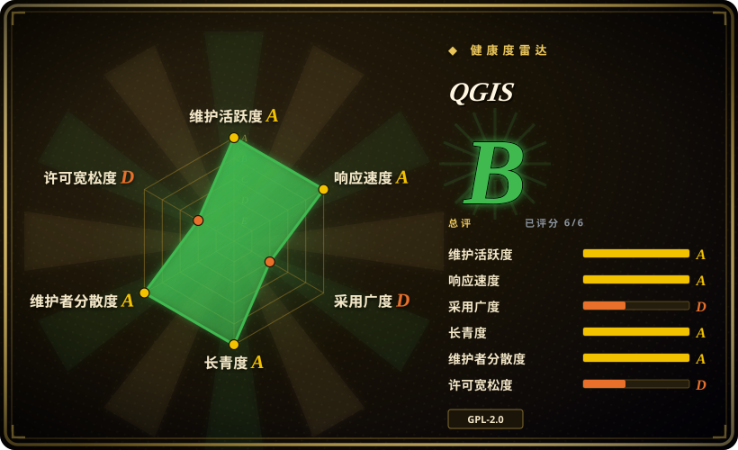
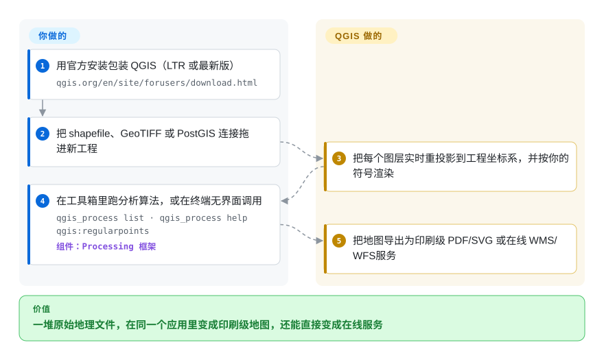

# QGIS

别人甩给你一堆 shapefile 和 GeoTIFF，要求周五前交一张能印刷的地图——在 notebook 里用 GeoPandas + matplotlib 手拼图例、比例尺、分页，一周就没了。QGIS 是把整条路都接管的桌面 GIS：图层拖进来就自动重投影、实时渲染，分析、样式和印刷级导出都在同一个应用里完成。

## 何时使用

你是一名分析师、规划人员或研究者，刚拿到一堆地理空间数据——shapefile、GeoTIFF、一个 PostGIS 连接，也许还有别人导出的 GeoPackage——你需要真正把它们**看一眼**、修正几何错误、跑一套缓冲区/叠加/分区统计的处理流程，并产出一张能放进报告的印刷级地图。你不想买 ArcGIS Pro 授权，也不想为了一个图例、比例尺和按要素分页的地图册，就在 notebook 里用 GeoPandas + matplotlib 从零拼一整套出图逻辑。QGIS 给你一个统一的桌面应用：把图层拖进来，用强大的符号化引擎做样式，跑 200 多个原生 Processing 算法（再加上从 GDAL、GRASS、SAGA、OrfeoToolbox 封装来的约 1000 个），然后在打印排版器里把它排成版。

当你需要**脚本化、工程化**地做 GIS 工作而不只是点击操作时，它同样合适。PyQGIS API 让你能用 Python 自动化同一套 Processing 工具箱——在内置控制台里、作为插件、或通过 `qgis_process` 无界面运行。而 QGIS Server 能把你做好样式的工程发布成 WMS/WFS/WCS/OGC-API 端点，于是你交互式设计的地图制图无需重写渲染栈就变成在线服务。

## 怎么用起来

QGIS 是一个基于 Qt/C++ 的桌面应用，底层是一套数据抽象层：GDAL/OGR 几乎读取所有矢量/栅格格式，每个图层都会被实时重投影到你为地图选定的 CRS（坐标参考系），渲染器再按你的符号设置绘制。分析走 Processing 框架——200 多个原生算法，外加从 GDAL、GRASS、SAGA、OrfeoToolbox 封装来的 1000 多个——可以在 GUI 工具箱里点，可以在 Python 控制台（PyQGIS）里调，也可以在终端里无界面运行：`qgis_process run native:buffer -- INPUT=source.shp DISTANCE=2 OUTPUT=buffered.shp`。制图收尾在打印排版器里完成（导出 PDF/SVG/图片，或用 Atlas 按要素自动分页）。工程文件 `.qgis` 还能交给 QGIS Server 无界面渲染成 WMS/WFS/WCS/OGC-API 服务——你在桌上做好的那张地图直接变成在线服务，不必重写渲染栈。留在你手里的：插件甄别、数据管理，以及发布时要运维的那台 Web 服务器。

<!-- flow-steps:begin (generated from flows/qgis.json by tools/flow_card.py — do not edit) -->

流程文字版

1. **你**：用官方安装包装 QGIS（LTR 或最新版） — `qgis.org/en/site/forusers/download.html`
2. **你**：把 shapefile、GeoTIFF 或 PostGIS 连接拖进新工程
3. **QGIS**：把每个图层实时重投影到工程坐标系，并按你的符号渲染
4. **你**：在工具箱里跑分析算法，或在终端无界面调用 — `qgis_process list · qgis_process help qgis:regularpoints` — 组件：`Processing 框架`
5. **QGIS**：把地图导出为印刷级 PDF/SVG 或在线 WMS/WFS 服务

**价值**：一堆原始地理文件，在同一个应用里变成印刷级地图，还能直接变成在线服务

<!-- flow-steps:end -->

## 何时不用

- **你想要纯代码、可复现、不要桌面应用的流水线。** 如果你的工作流是「读几何、变换、写出」，那么 GeoPandas/Shapely 或裸 GDAL/OGR 这类库更精简、更适合 CI；QGIS 的 GUI 和工程模型在这里是多余的开销。
- **你要做的是 Web 地图前端。** QGIS 渲染地图，但要做浏览器里的交互式地图，你需要的是 JS 地图库（Leaflet、OpenLayers、MapLibre）+ 瓦片/要素服务——QGIS Server 可以做后端，但它不是客户端。
- **你需要开箱即用的托管式多用户企业级 SDI。** QGIS Server 是渲染器 / OGC 端点；一套完整的空间数据基础设施（目录、鉴权、用户管理、大规模切片）通常要把它和 GeoServer/MapServer + 目录服务搭配，本身就是个真正的运维工程。
- **大规模无界面地理处理 / serverless。** 为批处理拉起整个 QGIS 栈（Qt、GUI 库）很重；纯 ETL 用 GDAL CLI 或容器里的 Python 地理栈要轻得多。
- **你依赖某个专有格式或仅 ArcGIS 才有的扩展。** 部分 Esri 原生格式和工具箱只有部分开源等价物，甚至没有；格式支持来自 GDAL，对小众/专有类型可能滞后。
- **你需要插件行为绝对稳定。** 第三方插件生态庞大但质量与维护参差不齐；你依赖的某个插件可能在 QGIS 版本升级时失效。

## 横向对比

| 替代品 | 是否收录 | 我们的评价 | 取舍 |
|---|---|---|---|
| GRASS GIS | 未收录 | 当你要深度栅格分析和拓扑重工作流时，选 GRASS GIS；当桌面制图、编辑和更友好的插件/处理外壳更重要时，选 QGIS。 | 强大的栅格/地理分析引擎和拓扑模型；UI 更陡峭，常作为 Processing provider 在 QGIS 里**被调用**而非独立使用。 |
| SAGA GIS | 未收录 | 当地形和栅格分析模块是中心时，选 SAGA；当还需要通用桌面 GIS、制图和编辑时，选 QGIS。 | 地形/栅格分析库和模块很强；制图与通用编辑较弱；同样被封装进 QGIS Processing。 |
| GDAL/OGR | 未收录 | 当你要脚本化 ETL、格式转换和适合 CI 的代码路径时，选 GDAL/OGR；当你要交互式桌面制图、工程编排和可视化分析时，选 QGIS。 | QGIS 自身依赖的底层 I/O + 栅格/矢量转换库；是 CLI/库而非桌面应用——脚本化 ETL 选它，交互式制图不选它。 |
| GeoServer | 未收录 | 当需求是 OGC 发布服务端时，选 GeoServer；当你需要桌面制作/分析，或要把 QGIS Server 绑定到 QGIS 工程时，选 QGIS。 | 面向发布的 Java OGC 服务端（WMS/WFS/WCS）；在发布侧与 QGIS Server 重叠，但没有桌面端的制作/分析 GUI。 |
| MapServer | 未收录 | 当你要成熟快速、用 mapfile 配置的 OGC 发布服务时，选 MapServer；当要桌面 GIS 流程或作者已维护 QGIS 工程时，选 QGIS。 | 快速、成熟的 C 语言 OGC 地图服务端；仅做发布、用 mapfile 配置；对标 QGIS Server，而非桌面端。 |
| GeoPandas / Shapely | 未收录 | 当你要 Python 原生、可复现的矢量流水线时，选 GeoPandas 和 Shapely；当 GUI 编辑、制图排版或栅格优先流程更重要时，选 QGIS。 | 面向代码优先/可复现流水线的 Python 原生矢量分析；没有 GUI、没有制图打印排版、不以栅格为先。 |
| ArcGIS Pro (Esri) | 未收录 | 当专有 Esri 生态支持、扩展或格式是硬要求时，选 ArcGIS Pro；当开源桌面 GIS 和较低授权成本是决定因素时，选 QGIS。 | 专有商业桌面 GIS；厂商支持/生态更广但有授权成本——QGIS 主要替代的就是这个商业方案。 |

## 技术栈

- **语言：** C++（约占仓库 78%），加上大量 Python（约 20%）用于 PyQGIS、插件和工具链；构建中还有少量 QML、C、GLSL、Yacc/Perl。
- **UI 工具包：** Qt（桌面 GUI、渲染、表达式/符号化引擎）。
- **地理核心：** GDAL/OGR（矢量 + 栅格 I/O 与转换）、PROJ（坐标参考系 / 重投影）、GEOS（几何运算）。[推断] 这些是 QGIS 标准的地理栈依赖；确切所需版本随 QGIS 发行版而变。
- **Processing provider：** QGIS 原生算法（200+），加上封装的 GDAL、GRASS、SAGA、OrfeoToolbox 工具箱。
- **服务端：** QGIS Server——无界面渲染器，暴露 WMS、WFS、WFS3 / OGC API for Features 和 WCS。
- **脚本：** PyQGIS Python API；内置 Python 控制台；用于无界面运行的 `qgis_process` CLI。
- **构建：** CMake。

## 依赖

- **运行 / 安装：** 提供 Windows、macOS、Linux 的预编译安装包（官方源、Windows 上的 OSGeo4W、Flatpak/Conda 等）；桌面使用除操作系统外无需另行准备运行时。
- **核心库（捆绑/必需）：** Qt、GDAL/OGR、PROJ、GEOS——由安装包带入；从源码构建则还需要它们的 dev 头文件和 CMake。
- **可选数据后端：** PostgreSQL/PostGIS、SpatiaLite/SQLite、GeoPackage，以及任意 GDAL 支持的格式/驱动；基于文件的工作不需要数据库。
- **服务端部署：** QGIS Server 跑在 Web 服务器之后（如经 FCGI/Apache/Nginx），需要同一套地理栈库；这是比桌面应用更重、相互独立的一套部署。

## 运维难度

**桌面端低，服务端中到高。** 作为桌面应用，QGIS 是装好即用：官方安装包搞定 Qt/GDAL/PROJ/GEOS 栈，单用户无需任何基础设施。当涉及可复现性（在团队里固定 QGIS 版本 + 插件集）、从源码构建、或在 Linux 上对齐 GDAL/PROJ 版本时，摩擦上升。QGIS Server 则是一块真正的运维面——你要把它部署在 Web 服务器之后、管理同一套原生库、并为并发做调优——这更接近运行 GeoServer/MapServer，而非运行桌面端。

## 健康度与可持续性

- **响应速度**：Grade A——中位首次响应时间 38.2 小时，基于 15 个 qualifying issues/PRs（评分器，2026-09-28）。
- **维护——非常活跃（截至 2026-09）。** 两条用户分支并行发布：最新版 4.2.x 与长期支持版 3.44.x，两线同于 2026-09-25 出点发布（4.2.3 / 3.44.15，GitHub API）；README 记载了基于时间表的路线图，LTR 与 LR 每月各出一个修复版，master 最近一次提交就在当天。约 5.5k 的高未决 issue 数，对一个长寿桌面应用而言读作庞大、繁忙的 tracker，而非疏于维护。[推断]
- **治理与背书——基金会，bus factor 低。** QGIS 属于开源地理空间基金会 OSGeo（README），并运作在 QGIS 基金会之下，其章程、年度大会、年报与财务在 qgis.org 上公开（2026-09-28 抓取）。评分器数到近 12 个月 94 个不同提交者（头号贡献者约占 36% 提交）——这是真正的多维护者、多厂商结构，而非某一个人的仓库。
- **年龄与 Lindy——强。** 开发始于 **2002**（README：「developed using the Qt toolkit and C++, since 2002」；文档版权页「2002-now」）；GitHub 仓库建于 2011-05（约 15 年，仅为仓库年龄）。约 24 年连续开发 × 至今月度发版（年龄 × 仍活跃），几乎是开源 GIS 里最稳的 Lindy 选择；这里唯一「不符合 Lindy」的风险在第三方插件，而非内核。
- **采用与生态。** 约 14.4k star（GitHub API，2026-09-28）。在政府、学术界被广泛使用，也是 ArcGIS 的开源替代；插件仓库庞大，PyQGIS/Processing 生态（GDAL/GRASS/SAGA provider）成熟，外围还有野外/移动端应用家族（QField、Mergin Maps）。插件质量参差，可能在版本升级时失效——这是生态风险，而非内核维护风险（见「何时不用」）。
- **风险标记——少。** GPL-2.0-or-later，内核应用没有重新授权或 open-core 历史。现实风险是插件 churn 与 GDAL/PROJ 版本耦合，两者前文与存疑账本均已覆盖。

## 存疑（未验证）

- [未验证] Star 数（14,434）与未决 issue（约 5.5k）是 2026-09-28 的 GitHub API 快照——时效敏感，仅作参考。
- [未验证] 4.2.x（LR）/ 3.44.x（LTR）的版本线配对核对于 2026-09-28（GitHub releases + qgis.org 下载页）；版本线会轮转，定标准前请重新核对当前 LR/LTR。
- [未验证] 算法/provider 数量（「200+ 原生」「经 GDAL、SAGA、GRASS、OrfeoToolbox 等 1000+ 个」）是 README 自己的宣称（2026-09-28 逐字引用），未经逐一枚举核实。
- [推断] GDAL、PROJ、GEOS 是标准底层地理库，但确切的最低/必需版本随发行版而定，此处未做版本固定——请查目标版本的构建文档。
- [未验证] 格式与 CRS 覆盖继承自 GDAL/PROJ；对任何特定专有或小众格式的支持取决于已安装的 GDAL 驱动集，且在安装包之间可能不同（如 qgis.org 明示 Windows 安装包不含可选投影网格）。
- [推断] 「约 5.5k 未决 issue 是繁忙 tracker 而非疏于维护」是从发布节奏与仓库体量推断的，未逐条审计 issue 队列。
