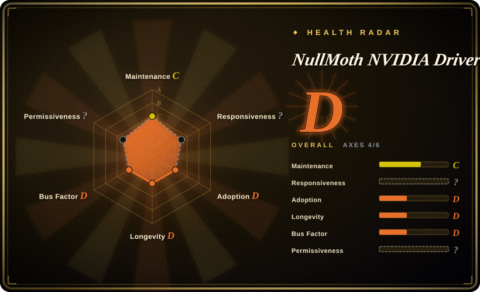
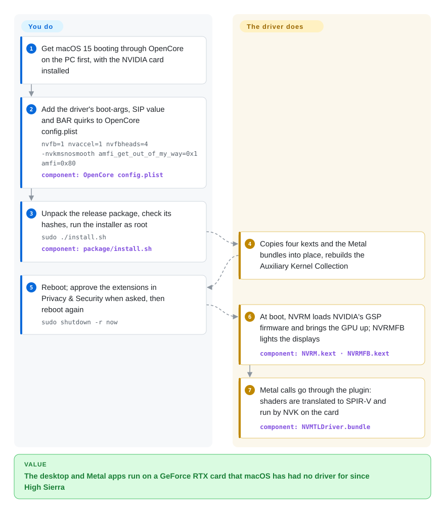

# NullMoth NVIDIA Driver for macOS

You put a GeForce RTX card in an OpenCore PC and macOS 15 boots to an unaccelerated, unusable screen — Apple and NVIDIA stopped shipping NVIDIA drivers after High Sierra, so Turing-and-later cards have never had one. This project ports NVIDIA's open Linux kernel driver and Mesa's open Vulkan driver into macOS kernel extensions plus a Metal plugin, so Sequoia can draw the desktop and run Metal apps on the card.

## When to use

You run macOS 15 Sequoia on an x86 PC through OpenCore, and the only discrete GPU in the box is an RTX 20/30/40/50 or GTX 16 card. Today the card does nothing under macOS: `system_profiler SPDisplaysDataType` shows no Metal support, WindowServer falls back to the firmware framebuffer, and the usual Hackintosh advice is "buy a Radeon". You either cannot swap the card (laptop, budget, you also need CUDA under Windows/Linux on the same box) or you want to experiment, and you accept running a two-day-old, single-author kernel driver with core macOS protections switched off.

That is the only situation it serves, and the choice against its substitutes is narrow: a supported AMD card with [WhateverGreen](https://github.com/acidanthera/WhateverGreen) is the stable path but costs a GPU swap; NVIDIA's Web Drivers stop at High Sierra and Pascal; OpenCore Legacy Patcher restores Kepler-era NVIDIA acceleration on old real Macs, not Turing-and-later cards. Pick this when keeping the NVIDIA card matters more than stability, and only for personal or non-profit use — the core license forbids any commercial use.

## How it works

Underneath there are two halves. In the kernel, `NVRM.kext` is NVIDIA's own open GPU kernel module (the r610 "resource manager") rebuilt for macOS's XNU kernel; it loads NVIDIA's GSP firmware — the code that runs on a small processor inside the GPU and does most of the hardware bring-up — and starts the card, while `NVRMFB.kext` presents each output as a macOS framebuffer (the display object WindowServer draws to), `NVAccel.kext` is the accelerator WindowServer composites through, and `NVRMAGDC.kext` answers Apple's display-policy queries. In user space, `NVMTLDriver.bundle` is the Metal driver macOS loads for the card: it implements Metal on top of Vulkan, translating each Metal shader from Apple's AIR bitcode into SPIR-V (the Vulkan shader format) and handing it to NVK, Mesa's open NVIDIA Vulkan driver, patched to talk to NVRM instead of Linux. Think of it as an interpreter chain: macOS speaks Metal, the plugin re-says it in Vulkan, and a Linux driver taught to live in macOS says it to the GPU. What it does for you is all of that; what you do is the OpenCore side — SIP value, boot arguments, BAR sizing, blocking Apple's firmware framebuffer driver — and approving the kexts. The companion **1401** Mac app can do the OpenCore edits, install, add a "Remove NVIDIA driver" boot-picker entry and map USB ports for you; the card below follows the README's scripted path, which is the same install without the app.

<!-- flow-steps:begin (generated from flows/nvidia-macos-driver.json by tools/flow_card.py — do not edit) -->

Text version of the flow

1. **You**: Get macOS 15 booting through OpenCore on the PC first, with the NVIDIA card installed
2. **You**: Add the driver's boot-args, SIP value and BAR quirks to OpenCore config.plist — `nvfb=1 nvaccel=1 nvfbheads=4 -nvkmsnosmooth amfi_get_out_of_my_way=0x1 amfi=0x80` — component: `OpenCore config.plist`
3. **You**: Unpack the release package, check its hashes, run the installer as root — `sudo ./install.sh` — component: `package/install.sh`
4. **NullMoth NVIDIA Driver for macOS**: Copies four kexts and the Metal bundles into place, rebuilds the Auxiliary Kernel Collection
5. **You**: Reboot; approve the extensions in Privacy & Security when asked, then reboot again — `sudo shutdown -r now`
6. **NullMoth NVIDIA Driver for macOS**: At boot, NVRM loads NVIDIA's GSP firmware and brings the GPU up; NVRMFB lights the displays — component: `NVRM.kext · NVRMFB.kext`
7. **NullMoth NVIDIA Driver for macOS**: Metal calls go through the plugin: shaders are translated to SPIR-V and run by NVK on the card — component: `NVMTLDriver.bundle`

**Value**: The desktop and Metal apps run on a GeForce RTX card that macOS has had no driver for since High Sierra

<!-- flow-steps:end -->

## When NOT to use

- **You need a stable daily driver or anything production.** The repo was created 2026-10-07 and shipped 21 releases in its first ~37 hours; the open issue list is mostly black screens, `Failed to create MetalDevice` WindowServer loops, failed sleep/wake and boot hangs across RTX 2060/3050/3070/3080/5070/5080 machines. If the Mac has to work tomorrow, use a natively supported AMD Radeon with WhateverGreen instead.
- **Your card is not an RTX 5060 on macOS 15.7/15.8.** The author's own [card-support doc](https://github.com/nullmoth/nvidia-macos-driver/blob/main/docs/CARD-SUPPORT.md) lists physical validation only for an RTX 5060 (automated) and RTX 5070/5080 (user-reported); Turing, Ampere and Ada are "Pending". A device-table match is explicitly not a working claim. On another card, plan for the AMD swap or stay on Windows/Linux, where NVIDIA's own drivers run the card.
- **Pascal, Maxwell, Kepler or older.** Out of scope by design — the driver is built on NVIDIA's GSP firmware stack, which starts at Turing. For Kepler on an old real Mac, use OpenCore Legacy Patcher; for Pascal on High Sierra, the closed NVIDIA Web Drivers.
- **macOS 26 Tahoe, or a laptop with Optimus switching.** Tahoe "full hardware and application qualification remains pending" and an open issue reports a black desktop from an ABI mismatch; integrated/discrete switching is listed as not qualified and a PCI-ID match "does not implement an Optimus display mux". Stay on Sequoia, or use a dGPU-only (MUX) configuration.
- **You cannot turn off macOS security protections.** The tested setup sets `csr-active-config` `<430A0000>` (unsigned and unapproved kexts allowed, filesystem and authenticated-root protections off), disables AMFI code-signing enforcement through boot arguments, and sets OpenCore `SecureBootModel` to `Disabled`. A managed, compliance-bound or security-sensitive Mac should not run this; use a supported AMD GPU, which needs none of it.
- **Any commercial use.** `plugin/`, `kexts/`, `build/` and `package/` are PolyForm Noncommercial 1.0.0 — not an OSI open-source license. A repair shop, a reseller preinstalling it, or a company workstation is not a permitted purpose. There is no commercial license on offer; choose the AMD path.
- **You want to build what you run from this source.** The build scripts assume the author's workstation (`$HOME/nvmtl-build/LIVE/plugin`, `$HOME/ogkm610` with a pre-generated Darwin compile-command file), `build/` has scripts for the plugin, translator, NVK, NVAccel and NVRMAGDC but none for `NVRM.kext` or `NVRMFB.kext`, and there is no CI. The 269 MB release tarball also carries NVIDIA's GSP firmware and NVVM compiler libraries as binaries. In practice you install the author's binaries; if you need a reproducible, auditable driver, this is not it yet.
- **You want an upstream with a review process.** Every one of the 40 commits is by one author, no outside pull request has been merged, and the maintainer had not commented on any issue as of 2026-10-09 — support runs through a Discord and the author's log-upload site. If bus factor matters, there is no substitute that keeps the NVIDIA card; that alone is a reason to choose the AMD swap.

## Comparison

| Alternative | In index | Our verdict | Tradeoff |
|---|---|---|---|
| AMD Radeon card + [WhateverGreen](https://github.com/acidanthera/WhateverGreen) | not indexed | For any Hackintosh that has to be reliable, swap to a Radeon macOS ships drivers for and use WhateverGreen for the remaining framebuffer fixes; choose this NullMoth driver only when keeping the NVIDIA card is the whole point. | The AMD path gains Apple's own signed drivers, SIP and Secure Boot left on, and an 8-year-old maintained patch kext; it costs buying a GPU and losing CUDA on that card. Not added in this tab batch. |
| [OpenCore Legacy Patcher](https://github.com/dortania/OpenCore-Legacy-Patcher) | not indexed | For a real old Mac with a Kepler NVIDIA GPU, OCLP's root patches restore acceleration on new macOS; choose this driver only for Turing-and-later cards, which OCLP does not address. | OCLP gains a 6-year track record and a large community but targets Apple hardware and legacy GPUs; this driver covers new NVIDIA silicon at the cost of being two days old. Not added in this tab batch. |
| NVIDIA Web Drivers | not a repo | If you can stay on macOS 10.13 High Sierra with a Pascal-or-older card, NVIDIA's own drivers are the vendor-built option; choose this driver for Sequoia and Turing-and-later, which the Web Drivers never supported. | Closed binaries from NVIDIA, discontinued after High Sierra; vendor-quality on an obsolete OS versus an unproven port on a current one. |
| [NVIDIA open-gpu-kernel-modules](https://github.com/NVIDIA/open-gpu-kernel-modules) on Linux | not indexed | If what you need is the GPU working rather than macOS specifically, run Linux (or Windows) where NVIDIA's own driver — the same r610 module this project ports — is supported; choose this driver only when the workload must run under macOS. | Linux gains NVIDIA-supported drivers, CUDA and a mature stack; it costs macOS-only apps and the Metal ecosystem. Not added in this tab batch. |

## Tech stack

- **Kernel:** four kexts in C/C++ (`kexts/NVRM`, `NVRMFB`, `NVRMAGDC`, plus `NVAccel` built from `kexts/NVRM/accel`), compiled with `-fapple-kext -mkernel` against NVIDIA's `open-gpu-kernel-modules` tag `610.57.04` with an XNU OS layer (`os-xnu*.cpp`) in place of Linux's; the accelerator links against reconstructed Apple `IOAccelerator`/`IOGraphicsAccelerator2` headers shipped in `kexts/NVRM/accel/re/`.
- **Metal driver:** `plugin/` in Objective-C and C (`NVMTLDevice.m`, `nvmtl_vk.c`), built as `NVMTLDriver.bundle` for `/Library/GPUBundles/`; an optional "vendor compiler" lane uses NVIDIA's NVVM libraries (`NVIDIAShared.bundle`, binary-only).
- **Shader translator:** `translator/` in Rust — a modified fork of steelbrain's metal2vulkan (Apple AIR → SPIR-V), LGPL-3.0, built as `libnvmtl_translate.dylib`.
- **Vulkan back end:** Mesa NVK plus the NAK compiler, as a 452 KB patch (`nvk/nvk-macos.patch`) on Mesa commit `17ca6174`, built with Meson/Ninja.
- **Companion app (1401):** Swift + WebKit UI (`app/Sources`, HTML/JS in `app/Resources`), a root shell script `nullmoth-setup.sh` that edits OpenCore, and a Rust UEFI tool (`app/efi-safe`) for the boot-picker removal entry.
- **Tests:** Python and Swift regression scripts under `tools/` that compile production snippets on macOS without a GPU; no CI workflow in the repo.

## Dependencies

- **Hardware:** an x86_64 PC (or Intel Mac) with an NVIDIA Turing-or-later GPU; BIOS with Above 4G Decoding on and CSM off; Resizable BAR is the validated configuration (small-BAR boards fall back and wait longer at boot).
- **OS and boot chain:** macOS 15 Sequoia (tested 15.7.x and 15.8.1) booted by OpenCore with an SMBIOS model that has a discrete GPU (tested `iMacPro1,1`); OpenCore must block `com.apple.iokit.IONDRVSupport` and resize the GPU BARs.
- **Security posture:** SIP set to `0x0A43`, AMFI relaxed via `amfi_get_out_of_my_way=0x1 amfi=0x80`, `SecureBootModel` `Disabled`; the kexts are not Apple-signed and load from the Auxiliary Kernel Collection that `install.sh` rebuilds with `kmutil`.
- **NVIDIA binaries:** GSP firmware `610.57.04` installed to `/Users/Shared/nvfw`, plus the NVVM libraries in `NVIDIAShared.bundle` — both arrive in the release tarball, not the git tree.
- **Network (optional):** the 1401 app checks GitHub Releases for driver updates and, when you press *Send logs*, POSTs redacted logs to `https://nullmothsystems.com/api/upload` after an administrator prompt.
- **Build from source (if attempted):** Xcode 16, stable Rust, Meson/Ninja, Vulkan headers, NVIDIA `open-gpu-kernel-modules` at `610.57.04`, Mesa `17ca6174` — and paths that match the author's machine.

## Ops difficulty

**High.** Installing is a script or an app, but you are now operating an unsigned kernel driver with SIP, AMFI and Secure Boot relaxed, on hardware the author has mostly not tested. A bad release means a Mac that will not reach the desktop: recovery is the `1401: Remove NVIDIA driver` boot-picker entry (it sets `-nvoff` and a removal flag so a LaunchDaemon uninstalls on the next start) or `sudo ./uninstall.sh` from a working boot. The OpenCore and BAR settings that the driver needs are the opposite of what the macOS installer needs, so every macOS update or reinstall is a config swap. Releases arrive several times a day, and earlier companion versions (≤ 1.0.15) had a USB-to-internal OpenCore promotion that could delete Windows and vendor boot files — disabled in 1.0.16, but it shows the blast radius. Debugging means reading `kmutil showloaded`, kernel logs and WindowServer crash reports, then filing them with the author.

## Health & viability

- **Maintenance — extremely active, extremely early (as of 2026-10-09).** 21 tagged releases from v1.0.0 (2026-10-07) to v1.1.1 (2026-10-08), each with detailed notes, validation scope and SHA-256 sums; fixes land within hours of reports. That is a launch sprint, not yet a cadence anyone can extrapolate.
- **Governance & bus factor — one anonymous author.** All 40 commits are authored "NullMoth Systems", a GitHub user account created 2026-09-25; no outside pull request merged (several open), zero maintainer comments on issues, support on Discord and a donation link. If the author stops, nothing else keeps the driver building — the build scripts depend on their machine.
- **Age & Lindy — no prior to lean on.** Two days old at writing; the Lindy prior gives it essentially nothing, and the 1.7k stars in 48 hours measure demand for NVIDIA-on-Sequoia, not driver maturity. `[推断]`
- **Adoption — real downloads, real breakage.** Release assets show thousands of downloads across versions and ~50 issues/PRs in two days, many of them careful engineering reports from users on Turing/Ampere/Ada cards — an engaged early community, but most reports are failures outside the validated RTX 5060.
- **Risk flags — license, binaries, security posture.** Non-OSI noncommercial license on the core; NVIDIA firmware and NVVM libraries redistributed as binaries; reconstructed Apple headers in the kext tree; required SIP/AMFI/Secure Boot downgrades; a kernel driver from an unknown publisher with no reproducible build. Each of these is a reason to keep it off any machine that matters.

## Caveats (unverified)

- `[推断]` **"Not reproducible from this repo"** — based on the build scripts hard-coding `$HOME/nvmtl-build/...` and `$HOME/ogkm610/.../_out/Darwin_x86_64/compile_cmds.sh`, and on `build/` lacking scripts for `NVRM.kext`/`NVRMFB.kext`; no build was attempted, and the author may build those kexts some other way.
- `[未验证]` **Whether release binaries match the source.** No CI, no build attestations; the release tarball (269 MB) was not downloaded or inspected (brief: do not install). `VALIDATION.json` assets exist but were not read.
- `[未验证]` **Redistribution rights for NVIDIA binaries.** NOTICE says GSP firmware is redistributed "under NVIDIA's firmware licence"; HOW-IT-WORKS says `NVIDIAShared.bundle` carries NVIDIA's NVVM compiler libraries, whose redistribution terms (CUDA EULA) were not checked against what ships.
- `[推断]` **Legal standing of the reconstructed Apple headers** in `kexts/NVRM/accel/re/` — reverse-engineered interface headers; not assessed by anyone qualified.
- `[推断]` **SIP bit decoding** — `<430A0000>` is little-endian `0x0A43`; reading it as untrusted kexts + unrestricted filesystem + unrestricted NVRAM + unapproved kexts + unauthenticated root comes from the public `csr` flag values, not from the project's docs.
- `[未验证]` **Translator provenance** — 354 files under `translator/translator`: 16 blob-identical to steelbrain/metal2vulkan's current HEAD, 282 share a path but differ, 56 new. Some differences may be upstream's later changes rather than NullMoth's edits; the fork base commit was not identified.
- `[未验证]` **Card support beyond RTX 5060.** RTX 5070/5080 are "reported working" per the author; issue reports on Turing/Ampere/Ada show both partial successes and failures. Nothing beyond the author's own test notes was reproduced.
- `[未验证]` **Log-upload behaviour.** Source shows the upload only from the *Send logs* action (with redaction and an admin prompt); HOW-IT-WORKS still says "Nothing is sent", which is stale. Server-side retention at nullmothsystems.com is unknown.
- `[未验证]` **Health radar gaps.** The scorer leaves `risk_license` at `?` because GitHub reports `NOASSERTION` and it does not parse PolyForm text (a human reading of LICENSE says source-available, non-OSI — the bottom tier); `responsiveness` is `?` for lack of a maintainer-response window in a two-day-old repo. The D (4/6) aggregate therefore omits the license axis.
- `[未验证]` **NVIDIA Web Drivers ending at macOS 10.13 / Pascal** and **OCLP's Kepler-only NVIDIA coverage** are from community knowledge and OCLP's Monterey notes, not re-verified against NVIDIA.
