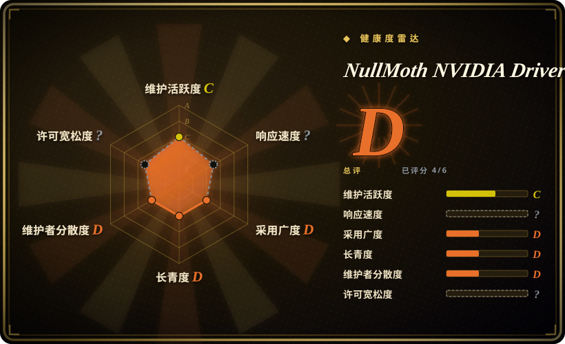
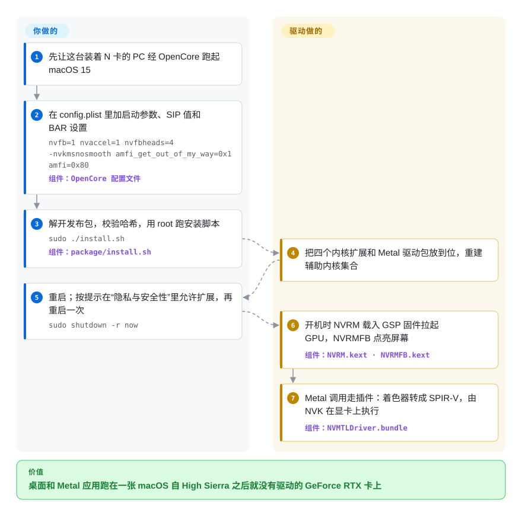

# NullMoth NVIDIA Driver for macOS

你在一台用 OpenCore 引导的 PC 里插了 GeForce RTX 显卡，macOS 15 开机后画面没有任何加速、几乎没法用——苹果和英伟达在 High Sierra 之后就不再提供英伟达驱动，图灵及之后的显卡在 macOS 上从来没有过驱动。这个项目把英伟达开源的 Linux 内核驱动和 Mesa 开源的 Vulkan 驱动移植成 macOS 内核扩展加一个 Metal 插件，让 Sequoia 能用这张卡画桌面、跑 Metal 应用。

## 何时使用

你在一台 x86 PC 上通过 OpenCore 跑 macOS 15 Sequoia，机箱里唯一的独显是 RTX 20／30／40／50 或 GTX 16 系列。眼下这张卡在 macOS 下毫无用处：`system_profiler SPDisplaysDataType` 显示不支持 Metal，WindowServer 只能落回固件帧缓冲，而黑苹果圈的标准答案是“去买张 Radeon”。你要么换不了卡（笔记本、预算、同一台机器在 Windows／Linux 下还要用 CUDA），要么就是想折腾，并且能接受跑一个只有两天历史、单一作者写的内核驱动，同时关掉 macOS 的核心安全保护。

它只服务这一种情形，和替代品之间的取舍也很窄：换一张 macOS 自带驱动的 AMD 卡再配 [WhateverGreen](https://github.com/acidanthera/WhateverGreen) 是稳定路线，但要换显卡；英伟达 Web Driver 止步于 High Sierra 和 Pascal；OpenCore Legacy Patcher 能在老款真 Mac 上恢复开普勒时代英伟达显卡的加速，管不到图灵及之后的卡。当“保住这张英伟达卡”比稳定更重要时选它，而且只能用于个人或非营利用途——核心代码的许可证禁止任何商业使用。

## 怎么用起来

底下分两半。内核这一半：`NVRM.kext` 就是英伟达自己的开源 GPU 内核模块（r610 版“资源管理器”），被重新编译到 macOS 的 XNU 内核上；它加载英伟达的 GSP 固件——跑在显卡内部一颗小处理器上、负责大部分硬件初始化的那段代码——把卡拉起来；`NVRMFB.kext` 把每个输出口呈现为 macOS 的帧缓冲（WindowServer 往上画图的显示对象），`NVAccel.kext` 是 WindowServer 合成画面所经过的加速器，`NVRMAGDC.kext` 负责回答苹果的显示策略查询。用户态这一半：`NVMTLDriver.bundle` 是 macOS 为这张卡加载的 Metal 驱动，它在 Vulkan 之上实现 Metal，把每个 Metal 着色器从苹果的 AIR 字节码翻译成 SPIR-V（Vulkan 的着色器格式），交给 NVK——Mesa 的开源英伟达 Vulkan 驱动，打过补丁后改为跟 NVRM 而不是 Linux 对话。可以把它想成一条传话链：macOS 说 Metal，插件把话转成 Vulkan，一个被教会在 macOS 里生活的 Linux 驱动再把话说给 GPU。这些都是它替你做的；你要做的是 OpenCore 那一侧——SIP 值、启动参数、BAR 大小、屏蔽苹果的固件帧缓冲驱动——以及批准这些内核扩展。配套的 **1401** Mac 应用可以替你改 OpenCore、安装、在启动选择器里加一个“Remove NVIDIA driver”入口、映射 USB 口；下面的卡片走的是 README 的脚本路线，装的是同一套东西，只是不经过这个应用。

<!-- flow-steps:begin (generated from flows/nvidia-macos-driver.json by tools/flow_card.py — do not edit) -->

流程文字版

1. **你**：先让这台装着 N 卡的 PC 经 OpenCore 跑起 macOS 15
2. **你**：在 config.plist 里加启动参数、SIP 值和 BAR 设置 — `nvfb=1 nvaccel=1 nvfbheads=4 -nvkmsnosmooth amfi_get_out_of_my_way=0x1 amfi=0x80` — 组件：`OpenCore 配置文件`
3. **你**：解开发布包，校验哈希，用 root 跑安装脚本 — `sudo ./install.sh` — 组件：`package/install.sh`
4. **NullMoth NVIDIA Driver for macOS**：把四个内核扩展和 Metal 驱动包放到位，重建辅助内核集合
5. **你**：重启；按提示在“隐私与安全性”里允许扩展，再重启一次 — `sudo shutdown -r now`
6. **NullMoth NVIDIA Driver for macOS**：开机时 NVRM 载入 GSP 固件拉起 GPU，NVRMFB 点亮屏幕 — 组件：`NVRM.kext · NVRMFB.kext`
7. **NullMoth NVIDIA Driver for macOS**：Metal 调用走插件：着色器转成 SPIR-V，由 NVK 在显卡上执行 — 组件：`NVMTLDriver.bundle`

**价值**：桌面和 Metal 应用跑在一张 macOS 自 High Sierra 之后就没有驱动的 GeForce RTX 卡上

<!-- flow-steps:end -->

## 何时不用

- **你需要稳定的日常机或任何生产用途。** 仓库 2026-10-07 才创建，头约 37 小时就发了 21 个版本；未关闭的 issue 大多是黑屏、WindowServer 反复报 `Failed to create MetalDevice`、睡眠唤醒失败和开机卡住，涉及 RTX 2060／3050／3070／3080／5070／5080 等机器。如果这台 Mac 明天必须能用，改用 macOS 原生支持的 AMD Radeon 配 WhateverGreen。
- **你的卡不是跑在 macOS 15.7／15.8 上的 RTX 5060。** 作者自己的[显卡支持文档](https://github.com/nullmoth/nvidia-macos-driver/blob/main/docs/CARD-SUPPORT.md)只给 RTX 5060（自动化测试）和 RTX 5070／5080（用户反馈）列了实机验证；图灵、安培、Ada 都是“Pending”。设备表里有你的卡，作者明确说不代表能用。换别的卡，就规划换 AMD，或者留在 Windows／Linux 上用英伟达自己的驱动。
- **Pascal、Maxwell、开普勒或更老的卡。** 设计上就不在范围内——驱动建立在英伟达的 GSP 固件栈上，而它从图灵起步。老款真 Mac 上的开普勒卡用 OpenCore Legacy Patcher；High Sierra 上的 Pascal 卡用闭源的英伟达 Web Driver。
- **macOS 26 Tahoe，或者带 Optimus 切换的笔记本。** 作者写明 Tahoe 的“完整硬件与应用验证仍未完成”，已有 issue 报告因 ABI 不匹配导致桌面全黑；核显／独显切换被列为未验证，PCI ID 匹配“并不实现 Optimus 显示切换”。留在 Sequoia，或者改用只走独显（MUX）的配置。
- **你不能关掉 macOS 的安全保护。** 测试配置把 `csr-active-config` 设为 `<430A0000>`（允许未签名、未批准的内核扩展，关闭文件系统和已认证根卷保护），用启动参数放开 AMFI 代码签名强制，并把 OpenCore 的 `SecureBootModel` 设为 `Disabled`。受管、有合规要求或对安全敏感的 Mac 不该跑它；换一张受支持的 AMD 显卡就一样都不用关。
- **任何商业用途。** `plugin/`、`kexts/`、`build/`、`package/` 采用 PolyForm Noncommercial 1.0.0——不是 OSI 认可的开源许可证。维修店、预装后转卖的商家、公司工作站都不属于许可用途，作者也没有提供商业授权。这种情况走 AMD 路线。
- **你想用这份源码自己构建出要跑的东西。** 构建脚本假定的是作者的工作站（`$HOME/nvmtl-build/LIVE/plugin`、带预生成 Darwin 编译命令文件的 `$HOME/ogkm610`），`build/` 里有插件、翻译器、NVK、NVAccel 和 NVRMAGDC 的脚本，却没有 `NVRM.kext` 和 `NVRMFB.kext` 的，也没有 CI。269 MB 的发布包里还带着英伟达的 GSP 固件和 NVVM 编译器库这些二进制。实际上你装的是作者编好的二进制；需要可复现、可审计的驱动，它现在还不是。
- **你需要一个有评审流程的上游。** 40 个提交全部出自一位作者，外部 PR 一个都没合并，截至 2026-10-09 维护者在 issue 里一条评论都没有——支持走 Discord 和作者的日志上传网站。如果你在意巴士因子，又想保住英伟达卡，没有别的替代品；光这一点就足以让你选择换 AMD。

## 横向对比

| 替代品 | 是否收录 | 我们的评价 | 取舍 |
|---|---|---|---|
| AMD Radeon 显卡 + [WhateverGreen](https://github.com/acidanthera/WhateverGreen) | 未收录 | 只要黑苹果需要可靠，就换一张 macOS 自带驱动的 Radeon，剩下的帧缓冲问题交给 WhateverGreen；只有“保住英伟达卡”本身就是目的时才选 NullMoth 驱动。 | AMD 路线换来苹果自己签名的驱动、SIP 与安全启动保持开启，以及一个维护了 8 年的补丁扩展；代价是要买新显卡，这张卡上也没了 CUDA。本轮标签批次未收录。 |
| [OpenCore Legacy Patcher](https://github.com/dortania/OpenCore-Legacy-Patcher) | 未收录 | 老款真 Mac 配开普勒英伟达显卡，用 OCLP 的根卷补丁在新系统上恢复加速；只有图灵及之后的卡才选这个驱动，OCLP 不管这些卡。 | OCLP 换来 6 年的记录和庞大的社区，但面向苹果硬件和老显卡；这个驱动覆盖新的英伟达芯片，代价是它只有两天大。本轮标签批次未收录。 |
| 英伟达 Web Driver | 非仓库 | 如果你能停在 macOS 10.13 High Sierra 并用 Pascal 或更老的卡，英伟达自家驱动就是厂商出品的选项；要 Sequoia 加图灵及之后的卡就选这个驱动，Web Driver 从来没支持过它们。 | 英伟达的闭源二进制，High Sierra 之后停更；一边是过时系统上的厂商级质量，一边是当前系统上未经验证的移植。 |
| Linux 上的 [NVIDIA open-gpu-kernel-modules](https://github.com/NVIDIA/open-gpu-kernel-modules) | 未收录 | 如果你要的是显卡能干活而不是非得 macOS，就跑 Linux（或 Windows），那里有英伟达官方支持的驱动——正是本项目移植的同一个 r610 模块；只有工作必须在 macOS 下进行时才选这个驱动。 | Linux 换来英伟达官方支持的驱动、CUDA 和成熟的软件栈；代价是失去 macOS 独占应用和 Metal 生态。本轮标签批次未收录。 |

## 技术栈

- **内核：** 四个内核扩展，C／C++ 编写（`kexts/NVRM`、`NVRMFB`、`NVRMAGDC`，以及由 `kexts/NVRM/accel` 构建的 `NVAccel`），以 `-fapple-kext -mkernel` 编译，链接英伟达 `open-gpu-kernel-modules` 的 `610.57.04` 标签，用一层 XNU 系统适配（`os-xnu*.cpp`）替换 Linux 那一层；加速器依赖仓库里 `kexts/NVRM/accel/re/` 下重建的苹果 `IOAccelerator`／`IOGraphicsAccelerator2` 头文件。
- **Metal 驱动：** `plugin/` 用 Objective-C 和 C 写成（`NVMTLDevice.m`、`nvmtl_vk.c`），构建为放进 `/Library/GPUBundles/` 的 `NVMTLDriver.bundle`；可选的“厂商编译器”通道使用英伟达的 NVVM 库（`NVIDIAShared.bundle`，只有二进制）。
- **着色器翻译器：** `translator/` 用 Rust 写成，是 steelbrain 的 metal2vulkan（苹果 AIR → SPIR-V）的改动分支，LGPL-3.0，构建为 `libnvmtl_translate.dylib`。
- **Vulkan 后端：** Mesa NVK 加 NAK 编译器，以 452 KB 的补丁（`nvk/nvk-macos.patch`）打在 Mesa 提交 `17ca6174` 上，用 Meson／Ninja 构建。
- **配套应用（1401）：** Swift + WebKit 界面（`app/Sources`，HTML／JS 在 `app/Resources`），一个以 root 运行、负责改 OpenCore 的 shell 脚本 `nullmoth-setup.sh`，以及一个 Rust 写的 UEFI 小工具（`app/efi-safe`），用于启动选择器里的卸载入口。
- **测试：** `tools/` 下的 Python 和 Swift 回归脚本，在 macOS 上编译生产代码片段，不需要 GPU；仓库里没有 CI 工作流。

## 依赖

- **硬件：** 一台 x86_64 PC（或 Intel Mac），配英伟达图灵或更新的 GPU；BIOS 里打开 Above 4G Decoding、关闭 CSM；Resizable BAR 是验证过的配置（小 BAR 主板会走回退路径，开机等待更久）。
- **系统与引导链：** 由 OpenCore 引导的 macOS 15 Sequoia（测试过 15.7.x 和 15.8.1），SMBIOS 机型需带独显（测试用 `iMacPro1,1`）；OpenCore 必须屏蔽 `com.apple.iokit.IONDRVSupport` 并调整 GPU BAR 大小。
- **安全设置：** SIP 设为 `0x0A43`，用 `amfi_get_out_of_my_way=0x1 amfi=0x80` 放开 AMFI，`SecureBootModel` 设为 `Disabled`；内核扩展没有苹果签名，从 `install.sh` 用 `kmutil` 重建的辅助内核集合加载。
- **英伟达二进制：** GSP 固件 `610.57.04` 装到 `/Users/Shared/nvfw`，外加 `NVIDIAShared.bundle` 里的 NVVM 库——两者都随发布包提供，不在 git 仓库里。
- **网络（可选）：** 1401 应用会查 GitHub Releases 获取驱动更新；你点 *Send logs* 时，在管理员授权弹窗之后把脱敏日志 POST 到 `https://nullmothsystems.com/api/upload`。
- **自行从源码构建（如果要试）：** Xcode 16、稳定版 Rust、Meson／Ninja、Vulkan 头文件、`610.57.04` 版英伟达 `open-gpu-kernel-modules`、Mesa `17ca6174`——还得有跟作者机器一致的路径。

## 运维难度

**高。** 安装本身是一个脚本或一个应用，但从此你在运营一个没有签名的内核驱动，SIP、AMFI 和安全启动都放宽了，而且跑在作者大多没测过的硬件上。一个坏版本就意味着这台 Mac 进不了桌面：恢复靠启动选择器里的 `1401: Remove NVIDIA driver` 入口（它设置 `-nvoff` 和一个卸载标记，让 LaunchDaemon 在下次启动时卸掉驱动），或者在能正常启动时跑 `sudo ./uninstall.sh`。驱动需要的 OpenCore 与 BAR 设置和 macOS 安装器需要的正好相反，所以每次系统升级或重装都要来回切配置。版本一天发好几个；配套应用的早期版本（≤ 1.0.15）有一条“把 U 盘上的 OpenCore 搬到内置盘”的路径，可能删掉 Windows 和厂商的启动文件——1.0.16 已禁用，但它说明了出错时的波及范围。排错要看 `kmutil showloaded`、内核日志和 WindowServer 崩溃报告，再交给作者。

## 健康度与可持续性

- **维护——极其活跃，也极其早期（截至 2026-10-09）。** 从 v1.0.0（2026-10-07）到 v1.1.1（2026-10-08）打了 21 个版本标签，每个都附有详细说明、验证范围和 SHA-256 校验值；问题报告后几小时内就有修复。这是发布冲刺，还谈不上能外推的节奏。
- **治理与巴士因子——一位匿名作者。** 40 个提交的作者都是“NullMoth Systems”，这是一个 2026-09-25 才注册的 GitHub 个人账号；外部 PR 一个没合并（有几个还开着），维护者在 issue 里零评论，支持走 Discord 外加一个打赏链接。作者一旦停手，没有任何别的东西能让这个驱动继续构建——构建脚本依赖的是作者自己的机器。
- **年龄与 Lindy——没有可依赖的先验。** 写作时只有两天大；Lindy 先验几乎给不了它任何分，48 小时 1.7k 星衡量的是大家对“Sequoia 上用英伟达卡”的需求，而不是驱动的成熟度。`[推断]`
- **采用——下载是真的，坏掉也是真的。** 各版本发布资源累计下载数以千计，两天里有约 50 个 issue／PR，其中不少是图灵、安培、Ada 用户写得很细的工程报告——早期社区很投入，但大多数报告是验证过的 RTX 5060 之外的失败。
- **风险信号——许可证、二进制、安全设置。** 核心代码是非 OSI 的非商业许可证；英伟达固件和 NVVM 库以二进制再分发；内核扩展树里有重建的苹果头文件；必须降级 SIP／AMFI／安全启动；一个来自不知名发布者、无法复现构建的内核驱动。每一条都足以让它远离任何重要的机器。

## 存疑（未验证）

- `[推断]` **“无法从本仓库复现构建”**——依据是构建脚本写死了 `$HOME/nvmtl-build/...` 和 `$HOME/ogkm610/.../_out/Darwin_x86_64/compile_cmds.sh`，且 `build/` 里没有 `NVRM.kext`／`NVRMFB.kext` 的脚本；没有实际尝试构建，作者可能用别的方式构建这两个扩展。
- `[未验证]` **发布的二进制是否与源码一致。** 没有 CI，没有构建证明；269 MB 的发布包没有下载或检查（任务要求不安装）。发布里有 `VALIDATION.json` 资源，但没有读。
- `[未验证]` **英伟达二进制的再分发权。** NOTICE 说 GSP 固件按“英伟达固件许可证”再分发；HOW-IT-WORKS 说 `NVIDIAShared.bundle` 带有英伟达的 NVVM 编译器库，其再分发条款（CUDA EULA）没有对照实际发布内容核查。
- `[推断]` **重建的苹果头文件的法律地位**——`kexts/NVRM/accel/re/` 里是逆向得到的接口头文件；没有经过任何有资质的人评估。
- `[推断]` **SIP 位的解读**——`<430A0000>` 按小端序是 `0x0A43`；把它读作“未信任扩展 + 不受限文件系统 + 不受限 NVRAM + 未批准扩展 + 未认证根卷”来自公开的 `csr` 标志位定义，不是项目文档的说法。
- `[未验证]` **翻译器的来源**——`translator/translator` 下 354 个文件：16 个与 steelbrain/metal2vulkan 当前 HEAD 的 blob 完全相同，282 个路径相同但内容不同，56 个是新文件。部分差异可能来自上游后来的修改而非 NullMoth 的改动；没有找出分叉时的基准提交。
- `[未验证]` **RTX 5060 以外的显卡支持。** RTX 5070／5080 是作者转述的“用户反馈可用”；图灵、安培、Ada 的 issue 里既有部分成功也有失败。除作者自己的测试记录外，没有任何复现。
- `[未验证]` **日志上传行为。** 源码显示只有 *Send logs* 操作会上传（带脱敏和管理员授权弹窗）；HOW-IT-WORKS 仍写着“Nothing is sent”，已过时。nullmothsystems.com 服务器端如何保留这些数据不得而知。
- `[未验证]` **健康度雷达的空缺。** 评分器把 `risk_license` 留作 `?`，因为 GitHub 报 `NOASSERTION`，而它不解析 PolyForm 文本（人工读 LICENSE 的结论是源码可见、非 OSI——最低一档）；`responsiveness` 为 `?`，是因为一个两天大的仓库还没有维护者回应的观测窗口。所以 D（4/6）这个汇总分没有算许可证这一轴。
- `[未验证]` **英伟达 Web Driver 止步于 macOS 10.13／Pascal**，以及 **OCLP 对英伟达只覆盖开普勒**，来自社区常识和 OCLP 的 Monterey 说明，没有对照英伟达官方再核实。
