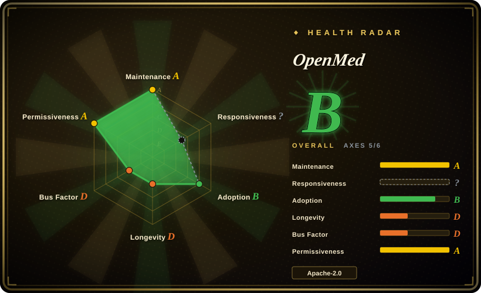
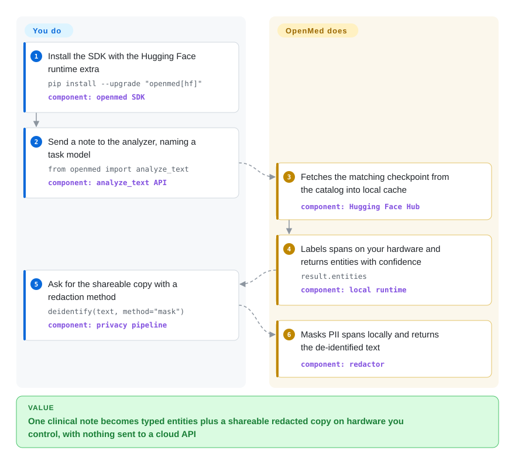

# OpenMed

Every clinical note you touch is full of names, MRNs and SSNs, and your policy says none of it may leave your network — yet you still want typed entities and a shareable redacted copy. OpenMed runs model-based clinical extraction and PII de-identification entirely on hardware you control: once the model weights are local, the text never goes to a cloud API.

## When to use

You are a data engineer or clinical-informatics developer at a hospital, registry, or digital-health company. Your task looks like: take discharge summaries and turn them into cohort signals (DISEASE, DRUG, ANATOMY, GENE spans) plus a de-identified copy you can hand to researchers. The note says `Patient: John Doe, DOB: 01/15/1970, SSN: 123-45-6789`, and a regex layer misses the date written as `January 15th, 1970` while a hosted medical-NLP API (AWS Comprehend Medical, Google Healthcare NLP) is off the table because contractual data-residency rules forbid patient data leaving your VPC. Writing and serving your own biomedical NER checkpoints is the only lane left.

You reach for OpenMed when that lane is exactly your problem: one `pip install` gives you a curated registry of task-specialised medical checkpoints (disease, pharma, PII, anatomy, gene models) behind a single API, running on CPU, CUDA, Apple MLX, ONNX (Android, browser) or as a FastAPI service — the same weights across all of them. Its de-identification path goes past raw redaction: smart merging keeps `01/15/1970` whole instead of fragmenting it into three tokens, policy profiles map onto the 18 HIPAA Safe Harbor identifier categories (the US privacy rule that a dataset is de-identified once 18 named identifier types are removed), and outputs include per-class leakage metrics and signed audit reports. Closest substitutes cover less ground: Presidio is a general PII framework with no medical checkpoints, scispaCy/medSpaCy is a research pipeline with no packaged deid workflow, and hosted APIs solve the accuracy problem by shipping your patient data to someone else's cloud. The deciding tradeoff: local-first breadth (medical NER + PHI redaction + mobile/browser surfaces in one project) at the price of validating every model on your own notes — the project's own docs insist on that.

## How it works

OpenMed is a Python runtime plus a model catalog, not a service you must sign up to. The catalog's SSOT is `models.jsonl` in the repo: 2,266 rows (as of 2026-09-28) describing token-classification checkpoints (models that label each span of text directly — 1,093 NER, 1,018 PII, 143 experimental zero-shot families) with the export formats each checkpoint ships in. Because one base model appears as several rows (PyTorch, ONNX, MLX 4-bit/8-bit), the row count overstates the number of distinct weights [推断]. You call `analyze_text(..., model_name=...)` or `extract_pii` / `deidentify`; the runtime resolves the name, fetches the required artifact from Hugging Face on first use (or loads a pre-vendored local directory — `model_id="./models/…"` — for air-gapped boxes), then runs inference entirely on your machine and returns entities with span offsets and confidence. On top of the classifier sits the privacy layer you own the policy for: methods `mask` / `replace` / `hash` / `shift_dates`, Faker-backed synthetic replacement with country-specific ID providers (CPF, BSN, NIE…), calibrated thresholds, and report artefacts. What the project does for you: artifact resolution, cross-backend execution, span-integrity merging, redaction pipelines. What stays yours: choosing models, validating recall on your own notes (no medical-accuracy claim here is reproducible without a gold corpus), and every compliance judgment — `docs/compliance.md` is explicit that the SDK provides evidence but never certifies HIPAA/GDPR compliance. Other surfaces — FastAPI/gRPC REST service, Swift OpenMedKit (SPM) and Android (JitPack) on-device SDKs, Transformers.js in-browser export, an MCP server, a CLI, and a catalog of installable agent skills — all front the same runtime.

<!-- flow-steps:begin (generated from flows/openmed.json by tools/flow_card.py — do not edit) -->

Text version of the flow

1. **You**: Install the SDK with the Hugging Face runtime extra — `pip install --upgrade "openmed[hf]"` — component: `openmed SDK`
2. **You**: Send a note to the analyzer, naming a task model — `from openmed import analyze_text` — component: `analyze_text API`
3. **OpenMed**: Fetches the matching checkpoint from the catalog into local cache — component: `Hugging Face Hub`
4. **OpenMed**: Labels spans on your hardware and returns entities with confidence — `result.entities` — component: `local runtime`
5. **You**: Ask for the shareable copy with a redaction method — `deidentify(text, method="mask")` — component: `privacy pipeline`
6. **OpenMed**: Masks PII spans locally and returns the de-identified text — component: `redactor`

**Value**: One clinical note becomes typed entities plus a shareable redacted copy on hardware you control, with nothing sent to a cloud API

<!-- flow-steps:end -->

## When NOT to use

- **Your PII problem is not clinical, and you need rule-grade control.** For general-purpose PII detection with custom recognizers and regex/deny-list plumbing, use Microsoft Presidio instead — OpenMed's value is its medical checkpoints; it even ships an optional `presidio` bridge extra rather than competing head-on there.
- **Egress is allowed and you want zero deployment.** AWS Comprehend Medical and Google Healthcare Natural Language API (both 非仓库) trade data residency for managed accuracy; if your policy permits sending text to a cloud, a hosted API is less work than validating local models.
- **You need a research-grade clinical NLP pipeline as the primary deliverable** — negation detection, experiencer classification, section segmentation, UMLS concept linking. That is the scispaCy/medSpaCy ecosystem; OpenMed is span-classifier-first (its UMLS grounding is an optional extra), so build on spaCy there.
- **You want arbitrary user-defined entity labels at runtime.** For zero-shot NER where you invent the schema per call, GLiNER is the dedicated project; OpenMed's zero-shot family is self-labelled *experimental* in its registry.
- **The target device is tiny.** The Privacy Filter family is ~1.4B parameters (Hugging Face metadata, 2026-09-28) and the headline NER checkpoints are 434M BERT-class; on watch/MCU-class hardware use a deterministic regex/lookup layer, or export the smallest int8 ONNX variant and measure RAM yourself — the repo's memory footprints were not independently benchmarked here.
- **Your language is outside the 35 model-backed routes.** The README itself flags Russian as a documented multilingual-default placeholder and lists only 39 supported codes; for other locales, verify `docs/languages.md` per language before trusting a redaction pass — a silent miss on PHI is exactly the failure this tool exists to prevent.
- **You want a slow-moving dependency.** v2.0.0 landed 2026-07-28, nine tagged releases between 2026-07 and 2026-09, weekly minor cadence, and a v1→v2 migration guide — pin the version, mirror the weights you use, and expect breaking changes between minors.
- **You need someone else to own the compliance determination.** OpenMed maps to Safe-Harbor categories and emits leakage evidence, but expert determination, the "no actual knowledge" judgment, and key custody stay yours by policy; no redaction SDK can sign that off.
- **First-network-fetch must be impossible.** Unless you pre-vendor artifacts and pass a local `model_id`, the first call resolves weights via the Hugging Face Hub; air-gapped deployments need a vendoring step you operate yourself.

## Comparison

| Alternative | In index | Our verdict | Tradeoff |
|---|---|---|---|
| Microsoft Presidio | 未收录 | Pick OpenMed when the text is clinical and you need medical entity types plus PHI-grade redaction with leakage reports; pick Presidio when you are redacting general PII and want an orchestrator of recognizers you fully customize with rules. | Presidio has no medical checkpoints and no on-device model catalog — not added in this tab-intake batch; note OpenMed ships an optional bridge extra for it, so the two are composable rather than either-or. |
| scispaCy / medSpaCy | 未收录 | Pick the spaCy biomedical ecosystem when your deliverable is a research pipeline (section splitting, negation, UMLS concepts) inside an existing spaCy project; pick OpenMed when the deliverable is entities-plus-redacted-text shipped through one API on CPU/CUDA/MLX/mobile. | Mature academic lineage and a large pipeline catalogue, but de-identification, multilingual PII and cross-device export are yours to build — not indexed in this batch. |
| GLiNER | 未收录 | Pick GLiNER for zero-shot NER on entity types you invent at call time; pick OpenMed when you want fixed, fine-tuned medical label sets with calibrated confidence and a privacy pipeline wrapped around them. | One flexible model vs. a curated task-specific registry; OpenMed's own zero-shot family is flagged experimental — GLiNER is the maintained original; not added in this tab-intake batch. |
| AWS Comprehend Medical / Google Healthcare NL API | 非仓库 | Choose a hosted medical-NLP API when data may leave your network and you want managed accuracy with no model validation burden; choose OpenMed the moment residency rules, per-call cost, or an air-gapped requirement rules the cloud out. | The opposite trade of this page: best-in-class ops simplicity, but PHI crosses a trust boundary — these are paid services, not repositories. |
| OpenAI Privacy Filter / NVIDIA Nemotron-PII | 非仓库 | Use OpenMed rather than the upstream artifacts directly when you want the filter wired into a de-identification product (merging, policies, audit reports, mobile exports); the upstream weights/dataset are the right pick only to retrain your own stack from scratch. | OpenMed is a downstream productisation of these Apache-2.0 model weights (architecture credit in its README); citing them as alternatives would double-count the same weights. |

## Tech stack

- **Core:** Python ≥3.10; runtime on Hugging Face `transformers` ≥4.50 + PyTorch (CPU/CUDA); `huggingface-hub` for artifact resolution.
- **Apple path:** MLX (`openmed[mlx]`) including 8-bit variants and a CoreML fallback for supported token-classification artifacts (`coremltools`).
- **Mobile/browser:** ONNX Runtime Mobile (Kotlin SDK via JitPack), Swift package OpenMedKit (SPM), Transformers.js for in-browser WebGPU inference (`js/` package `openmed`).
- **Service:** FastAPI + uvicorn, gRPC, optional OpenTelemetry tracing; Docker image and Helm charts under `deploy/`.
- **Model catalog:** `models.jsonl` registry (2,266 rows) plus export tooling (`python -m openmed.onnx.convert`), provenance hashes per entry.
- **Surface area:** 28 subpackages (`openmed/ner`, `…/pii` paths, `service`, `mcp`, `fhir` interop, `training`, `eval`, …) and ~40 optional extras integrating spaCy/Presidio/LangChain/Ray/Spark/Airflow/Kafka.
- **Docs:** MkDocs site at openmed.life/docs with an `llms.txt` index; README translated into 15 languages.

## Dependencies

- **Python ≥3.10** and the `[hf]` extra (transformers, torch, accelerate) for the default path; `[mlx]` on Apple Silicon; ONNX Runtime for the CPU-onnx path.
- **Hugging Face Hub** on first use to fetch model artifacts, unless you pre-vendor them and pass a local `model_id` directory — the weights are not in the git repo.
- **No database for the library path.** The REST service adds fastapi/uvicorn (and optional gRPC, plus async-job storage per docs); the newer "Journey" longitudinal storage uses local SQLite or PostgreSQL per CHANGELOG.
- **Hardware:** CPU works; CUDA for batch throughput; Apple Silicon for the MLX acceleration claims; 434M-param checkpoints fit comfortably on a modern laptop, exact RAM footprint unmeasured here.
- **Optional integrations** (each its own extra): Presidio, spaCy/scispaCy/medSpaCy, GLiNER-family zero-shot, Faker (core dependency), QuickUMLS, LangChain/LlamaIndex, Ray/Spark/Beam/Airflow for batch.

## Ops difficulty

**Low for embedding, medium for production, high for mobile.** `pip install "openmed[hf]"` and one function call is the whole integration for the Python library; there is no server or datastore required. Self-hosting the REST service means managing auth (API-key/JWT), model preload/unload windows, batching and tracing — documented, but it is an inference service you now operate. Air-gapped sites add a vendoring step for artifacts. The Swift/Android/browser SDKs require you to run the export pipeline yourself (ONNX/MLX conversion, tokenizer parity checks) before shipping models to devices. Model validation against your own notes is unavoidable work regardless of deployment shape — the project explicitly does not pre-certify clinical fitness.

## Health & viability

- **Maintenance (as of 2026-09-28).** Extremely active: same-day commits, `v2.5.0` tagged 2026-09-15, ~9 releases in Jul–Sep 2026, 1,473 issues closed against 259 open. Most open issues are owner-filed roadmap items created minutes apart — the cadence itself deserves a skeptical read [推断：依据 issue 创建时间戳，未审计全部 259 条].
- **Governance / bus factor.** Single-maintainer by document: `MAINTAINERS.md` lists exactly one maintainer (Maziyar Panahi, owner of privacy, registry, releases and CoC); 4,350 of ~4,530 top-contributor commits (contributors API, 2026-09-28) — the second contributor has 65. Roadmap and merge authority rest with one person; that is the page's main viability risk.
- **Backing.** Individual owner (`owner.type: User`), not a foundation; supported by a website/brand (openmed.life) and a research lineage — the arXiv paper 2508.01630 ("OpenMed NER", Aug 2025, SOTA claims across 12 public datasets) predates the repo. Whether a company stands behind the project is [推断：openmed.life 与 LinkedIn 公司页存在，注册实体未核实].
- **Age & Lindy (repo 2025-10-04, PyPI line 2025-08-09; ~12 months).** Young. 5.4k stars in a year on a healthcare-AI repo is a hype-suspect growth signal, not proof; Lindy-unproven — judge age × still-active: currently very much active, durability unknown.
- **Adoption.** PyPI 1,802,517 downloads in the last month (pypistats, 2026-09-28); the OpenMed Hugging Face org lists 1,000+ model repos (API cap) with ≥36.7M downloads across the first 1,000; 694 forks. No independent list of production hospital users was found.
- **Risk flags.** Apache-2.0 SDK, but per-entry model terms vary (registry licenses: 2,255 apache-2.0, 4 other, 4 mit, 3 null — check before redistribution); compliance-sensitive claims the docs carefully disclaim certifying; extreme release churn under one merge authority; and a repo surface (mobile SDKs, service, MCP, training, eval) unusually wide for a single maintainer.

## Caveats (unverified)

- [未验证] README banner's "340M+ downloads · 10M+ installs": PyPI shows ~1.8M downloads/month and the HF org shows ≥36.7M across 1,000 of its repos, but the cumulative banner figure was not independently reproduced.
- [未验证] Performance figures (MLX "24–33× faster than CPU PyTorch", batch "3.3× CPU / 2.2× MLX") are author-run; the repo has `edge-benchmark.yml` workflows, but no result here was re-executed.
- [推断] "Distinct models ≠ 2,266" is derived from the manifest format fields (852 rows pytorch-only, 753 onnx-only, 652 mlx+pytorch; some base models recur across export rows); a clean distinct-checkpoint count was not computed.
- [推断] The GitHub repo description's "21 languages" / "2,200+ medical models" conflicts with the README's "39 supported routes, 35 model-backed" and the manifest's 2,266 rows; the description is assumed stale.
- [未验证] Clinical accuracy claims (the arXiv paper's SOTA across 12 public datasets, per-model micro-F1 in the registry) were not reproduced — no gold corpus was run here.
- [未验证] Whether the service's async jobs use Redis and whether any telemetry is on by default ("telemetry-enabled paths" is the README's own wording) — internals of `openmed/service/` were not read.
- [未验证] Per-language coverage quality: README admits Russian routing is a placeholder default; the other 34 model-backed routes were not tested.
- [未验证] RAM/disk footprints on phone or laptop for each model tier were not measured.
- [未验证] Star, fork, issue, download counts are 2026-09-28 snapshots.
- [推断] Bus-factor figures come from the contributors API list (4,350 / 65 / 36 …); the full commit history and non-GitHub contributors were not audited.
