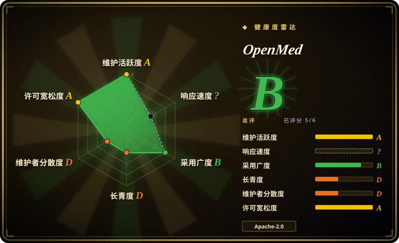
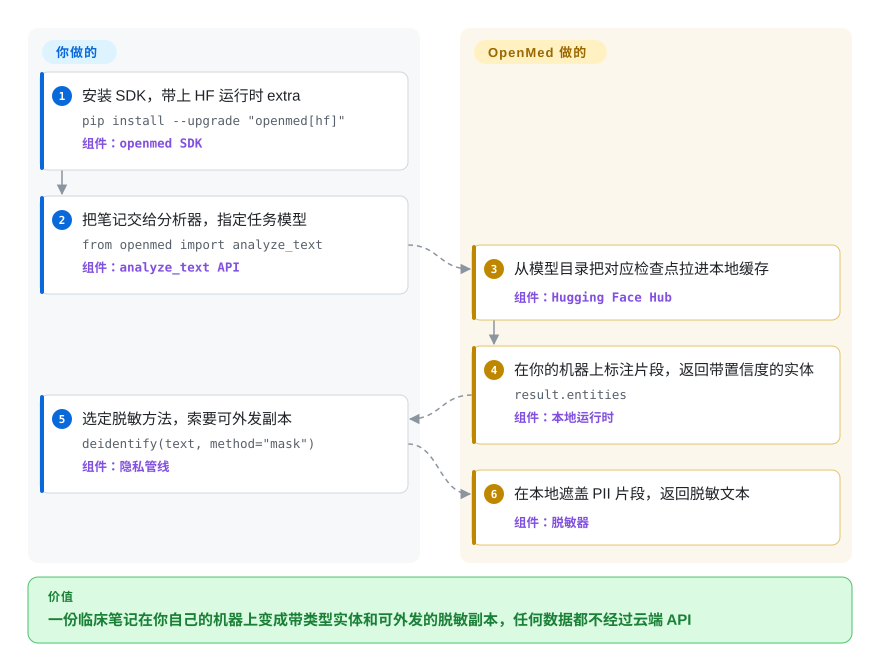

# OpenMed

你手里的每一份出院小结都夹着姓名、住院号和身份证号，而制度规定这些数据一条也不许出内网——可你既要能抽取的结构化实体，又要一份可以发给研究者的脱敏副本。OpenMed 把临床抽取和 PII 去标识化整套跑在你自己控制的硬件上：模型权重落到本地之后，文本不再经过任何云端 API。

## 何时使用

你是医院、注册登记系统或数字健康公司的数据工程师／临床信息学开发者。你手上的活儿长这样：把出院小结变成可用于队列筛选的信号（DISEASE、DRUG、ANATOMY、GENE 这类带类型的实体），顺带产出一份脱敏副本给研究人员。笔记里写着 `Patient: John Doe, DOB: 01/15/1970, SSN: 123-45-6789`，正则层会漏掉写成 `January 15th, 1970` 的日期，而托管医疗 NLP API（AWS Comprehend Medical、Google Healthcare NLP）根本不在选项里——合同里的数据驻留条款禁止患者数据离开你的 VPC。剩下的唯一通路，就是自己跑生物医学 NER 模型。

当这条通路正是你的处境时，就选 OpenMed：一次 `pip install` 拿到一份按任务微调的医学检查点注册表（疾病、用药、PII、解剖、基因模型），统一 API 之下可跑 CPU、CUDA、Apple MLX、ONNX（安卓、浏览器），也可起 FastAPI 服务——各处用的都是同一份权重。它的去标识化路径不止打码：smart merging 让 `01/15/1970` 保持一个整体而不是被切成三个 token；策略档映射到 HIPAA Safe Harbor 的 18 类标识符（美国隐私规则中“删净这 18 类即视为去标识化”的那条），输出还带逐类泄漏指标和签名审计报告。最接近的替代品覆盖面更小：Presidio 是没有医学检查点的通用 PII 框架，scispaCy/medSpaCy 是研究管线而没有打包好的脱敏流程，托管 API 则用“把患者数据送到别人云上”换准确率。决定性取舍：本地优先的广度（医学 NER + PHI 脱敏 + 移动端/浏览器同一项目覆盖），代价是每个模型都要你在自己的笔记上亲验——项目文档自己也这么坚持。

## 怎么用起来

OpenMed 是一个 Python 运行时加一份模型目录，不是要你去注册的云服务。目录的事实源是仓库里的 `models.jsonl`：2,266 行（2026-09-28 清点）逐条登记 token-classification 检查点——即直接给文本片段打类型的模型——按家族分为 NER 1,093、PII 1,018、实验性零样本 143，并写明每个检查点导出的格式。由于同一个基座会以多行出现（PyTorch、ONNX、MLX 4-bit/8-bit），行数夸大了真实权重数量 [推断]。你调用 `analyze_text(..., model_name=...)` 或 `extract_pii` / `deidentify`，运行时解析名字、首次使用时从 Hugging Face 拉取所需工件（离线机器可把 `model_id` 指到本地目录），之后全部推理都发生在你机器上，返回带偏移和置信度的实体。分类器之上是你自己负责策略的隐私层：`mask` / `replace` / `hash` / `shift_dates` 四种方法、Faker 驱动的按国家换证件号（CPF、BSN、NIE…）、校准阈值与报告工件。它替你做的：工件解析、跨后端执行、span 完整性合并、脱敏管线。留在你手里的：选模型、在你自己的笔记上验召回（本页没有任何医学准确率结论可在没有金标准语料时复现），以及全部合规判断——`docs/compliance.md` 明说 SDK 只供证据、从不背书 HIPAA/GDPR 合规。其余入口——FastAPI/gRPC REST 服务、Swift OpenMedKit（SPM）与安卓（JitPack）端侧 SDK、Transformers.js 浏览器导出、MCP server、CLI、可安装的 agent skills 目录——背后都是同一个运行时。

<!-- flow-steps:begin (generated from flows/openmed.json by tools/flow_card.py — do not edit) -->

流程文字版

1. **你**：安装 SDK，带上 HF 运行时 extra — `pip install --upgrade "openmed[hf]"` — 组件：`openmed SDK`
2. **你**：把笔记交给分析器，指定任务模型 — `from openmed import analyze_text` — 组件：`analyze_text API`
3. **OpenMed**：从模型目录把对应检查点拉进本地缓存 — 组件：`Hugging Face Hub`
4. **OpenMed**：在你的机器上标注片段，返回带置信度的实体 — `result.entities` — 组件：`本地运行时`
5. **你**：选定脱敏方法，索要可外发副本 — `deidentify(text, method="mask")` — 组件：`隐私管线`
6. **OpenMed**：在本地遮盖 PII 片段，返回脱敏文本 — 组件：`脱敏器`

**价值**：一份临床笔记在你自己的机器上变成带类型实体和可外发的脱敏副本，任何数据都不经过云端 API

<!-- flow-steps:end -->

## 何时不用

- **你的 PII 问题与临床无关，且要规则级掌控。** 通用 PII 检测、自定义识别器和正则/黑名单管线，选 Microsoft Presidio——OpenMed 的价值在医学检查点，它甚至提供 `presidio` 桥接 extra 而不是正面对撞。
- **允许数据出网、想要零部署的基线准确率。** AWS Comprehend Medical 和 Google Healthcare NL API（均 非仓库）用数据驻留换托管服务；政策允许出网时，托管 API 比本地模型验证省事得多。
- **交付物是研究级临床 NLP 管线本身**——否定检测、experiencer 分类、章节切分、UMLS 概念映射。那是 scispaCy/medSpaCy 生态的领地；OpenMed 以 span 分类器为先（UMLS grounding 只是可选 extra），这类管线请基于 spaCy 搭。
- **要在运行时自定义任意实体标签做零样本抽取。** 逐调用现造 schema 的零样本 NER 选 GLiNER；OpenMed 注册表里自家零样本家族就标着 *experimental*。
- **目标设备很小。** Privacy Filter 家族约 1.4B 参数（Hugging Face 元数据，2026-09-28），主打 NER 检查点是 434M 的 BERT 级别；手表／MCU 级硬件请用确定性正则/词表层，或导出最小 int8 ONNX 后自测内存——仓库的吞吐与加速数字未经这里独立复测。
- **你的语言不在 35 个模型支撑路由之内。** README 自己声明俄语路由用的是文档化的多语言默认占位，支持码表也只有 39 个；其他语言在信任脱敏结果之前先逐条核对 `docs/languages.md`——漏掉一处 PHI 恰是这套工具存在的意义所在。
- **你依赖缓慢变动的供应链。** v2.0.0 于 2026-07-28 落地，2026 年 7–9 月打了约 9 个 release，小版本周更节奏，还配了 v1→v2 迁移指南——锁版本、镜像你在用的权重，并接受小版本间的破坏性变更。
- **想让别人替你出合规结论。** OpenMed 能映射 Safe Harbor 类目、产出泄漏证据，但 expert determination、“无实际知情”判断和密钥保管仍归你；没有任何脱敏 SDK 能替签。
- **首次调用必须零联网。** 除非预取工件并以本地 `model_id` 传入，否则第一次调用会经 Hugging Face Hub 解析权重；气隙部署需要你自己运营的预置步骤。

## 横向对比

| 替代品 | 是否收录 | 我们的评价 | 取舍 |
|---|---|---|---|
| Microsoft Presidio | 未收录 | 文本是临床的、要医学实体类型加 PHI 级脱敏和泄漏报告时选 OpenMed；脱敏通用 PII、要一个可全自定义识别器的编排框架时选 Presidio。 | Presidio 没有医学检查点也没有端侧模型目录——本批 tab-intake 未收录；注意 OpenMed 自带可选桥接 extra，两者是可组合而非二选一。 |
| scispaCy / medSpaCy | 未收录 | 交付物是既有 spaCy 项目里的研究管线（章节、否定、UMLS 概念）时选该生态；交付物是“实体＋脱敏文本”一套 API 打到 CPU/CUDA/MLX/移动端时选 OpenMed。 | 学术谱系成熟、管线目录庞大，但去标识化、多语言 PII 和跨设备导出要你自己搭——本批未收录。 |
| GLiNER | 未收录 | 抽取时现造实体标签的零样本 NER 选 GLiNER；要固定且经过医学微调的标签集、校准置信度包住整条隐私管线时选 OpenMed。 | 一个灵活模型对一份策展注册表；OpenMed 的零样本家族自标实验性，GLiNER 才是被维护的原版——本批未收录。 |
| AWS Comprehend Medical / Google Healthcare NL API | 非仓库 | 数据可出网、不想背模型验证负担时选托管医疗 NLP API；驻留条款、按调用计费或气隙要求一出现，就该选 OpenMed。 | 与本页相反的一端：运维最省事，但 PHI 越过信任边界——它们是付费服务，不是仓库。 |
| OpenAI Privacy Filter / NVIDIA Nemotron-PII | 非仓库 | 要把隐私过滤器装进产品（合并、策略、审计报告、移动导出）就用 OpenMed 这个下游封装；只有从零重训自有栈时才直取上游权重与数据集。 | OpenMed 是对这些 Apache-2.0 权重与 Nemotron-PII 数据的产品化（README 列明出处）；把它们列为替代品属于同一份权重复计。 |

## 技术栈

- **核心：** Python ≥3.10；默认运行时为 Hugging Face `transformers` ≥4.50 + PyTorch（CPU/CUDA），经 `huggingface-hub` 解析工件。
- **Apple 路径：** MLX（`openmed[mlx]`，含 8-bit 变体），支持的 token-classification 工件另有 CoreML 回退（`coremltools`）。
- **移动/浏览器：** ONNX Runtime Mobile（Kotlin SDK，经 JitPack）、Swift 包 OpenMedKit（SPM）、浏览器 WebGPU 走 Transformers.js（`js/` 包 `openmed`）。
- **服务层：** FastAPI + uvicorn、gRPC、可选 OpenTelemetry tracing；Docker 镜像与 `deploy/` 下的 Helm charts。
- **模型目录：** `models.jsonl` 注册表（2,266 行）加导出工具链（`python -m openmed.onnx.convert`），每行带可复现哈希。
- **面积：** 28 个子包（`openmed/ner`、`service`、`mcp`、FHIR interop、`training`、`eval` 等）与约 40 个 optional extras，接入 spaCy/Presidio/LangChain/Ray/Spark/Airflow/Kafka。
- **文档：** MkDocs 站点 openmed.life/docs，提供 `llms.txt` 索引；README 有 15 种语言译本。

## 依赖

- **Python ≥3.10** 加 `[hf]` extra（transformers、torch、accelerate）为默认路径；Apple Silicon 用 `[mlx]`；纯 ONNX 路径要 ONNX Runtime。
- **首次使用需 Hugging Face Hub** 拉取模型工件——权重不在 git 仓库里；离线场景先预置本地目录再传 `model_id`。
- **库路径无数据库。** REST 服务另需 fastapi/uvicorn（及可选 gRPC、异步作业存储）；新增的 "Journey" 时序存储用本地 SQLite 或 PostgreSQL（见 CHANGELOG）。
- **硬件：** CPU 可用；批量吞吐靠 CUDA；Apple Silicon 才有 MLX 加速；434M 参数检查点在现代笔记本上可跑，具体内存占用未在本文实测。
- **可选集成**（各自一个 extra）：Presidio、spaCy/scispaCy/medSpaCy、GLiNER 系零样本、Faker（核心依赖）、QuickUMLS、LangChain/LlamaIndex、Ray/Spark/Beam/Airflow 批处理。

## 运维难度

**嵌入低、生产中等、移动端偏高。** 作为 Python 库嵌入就是 `pip install "openmed[hf]"` 加一次函数调用，不需要任何服务或数据存储。自托管 REST 服务则变成运营一个推理服务：鉴权（API-key/JWT）、模型预加载/卸载窗口、批处理和 tracing 都有文档但要你管。气隙站点再加一步工件预置。Swift/安卓/浏览器 SDK 要你先跑导出管线（ONNX/MLX 转换、tokenizer 对齐校验）再把模型送上设备。无论哪种部署形态，在你自己的笔记上做模型验证都省不掉——项目明确不预背书临床适用性。

## 健康度与可持续性

- **维护（2026-09-28）。** 极度活跃：当天仍有提交，`v2.5.0` 2026-09-15 打 tag，2026 年 7–9 月约 9 个 release，已关 issue 1,473 对未关 259。未关 issue 多为创建仅数分钟的 owner 自开路线图项——这个节奏本身就值得怀疑地读 [推断：依据 issue 创建时间戳，未审计全部 259 条]。
- **治理/巴士因子。** 按文档就是单人：`MAINTAINERS.md` 只列一名维护者（Maziyar Panahi，掌管隐私、注册表、发布与行为准则）；贡献者 API 首位 4,350 提交，第二名 65（2026-09-28）。路线图与合并权集于一人，是本页首要存续风险。
- **后援。** GitHub `owner.type: User`，个人而非基金会；配有官网/品牌（openmed.life）与研究谱系——arXiv 论文 2508.01630（"OpenMed NER"，2025-08，宣称 12 个公开数据集 SOTA）早于本仓库。背后是否有公司注册主体：[推断：openmed.life 与 LinkedIn 公司页存在，注册实体未核实]。
- **年龄与 Lindy（repo 2025-10-04，PyPI 线 2025-08-09，约 12 个月）。** 年轻。一年 5.4k stars 对医疗 AI 而言是可疑增速而非社会证明；Lindy 未证——按“年龄×仍在活跃”合判：当下极其活跃，耐久性未知。
- **采用度。** PyPI 近一月下载 1,802,517 次（pypistats，2026-09-28）；OpenMed 的 Hugging Face 组织返回 1,000+ 模型仓库（API 分页上限），仅前 1,000 个合计 ≥3,670 万次下载；694 forks。未找到可核实的医院生产采用名单。
- **风险信号。** SDK 为 Apache-2.0，但逐条模型条款不一（注册表 license 字段：2,255 apache-2.0、4 other、4 mit、3 缺失——再分发前逐条查）；涉及合规的宣称其文档已明确不做背书；单人合并权下的极端发布节奏；以及仓库面积（移动 SDK、服务、MCP、训练、评测）对单人维护者而言异常地宽。

## 存疑（未验证）

- [未验证] README 横幅“340M+ downloads · 10M+ installs”：PyPI 月下载约 180 万、HF 组织前 1,000 个仓库合计 ≥3,670 万次下载可查，横幅累计数未独立复现。
- [未验证] 性能数字（MLX “比 CPU PyTorch 快 24–33 倍”、批处理“CPU 3.3× / MLX 2.2×”）均为作者自测；仓库虽有 `edge-benchmark.yml` 工作流，本文未复跑任何一项。
- [推断] “行数≠独立权重数”由清单格式字段推得（852 行仅 pytorch、753 行仅 onnx、652 行 mlx+pytorch，同一 base model 跨导出行重复出现）；未做去重精确计数。
- [推断] GitHub 仓库描述里的 "21 languages" / "2,200+ medical models" 与 README 的“39 个路由、35 个模型支撑”及清单 2,266 行相互矛盾，按描述滞后处理。
- [未验证] 临床准确率主张（arXiv 2508.01630 的 12 数据集 SOTA、注册表内各模型 micro-F1）未复现——本地无金标准语料可跑。
- [未验证] 服务异步作业是否用 Redis、遥测默认是否开启（“telemetry-enabled paths”是 README 原话）——未读 `openmed/service/` 内部实现。
- [未验证] 逐语言覆盖质量：README 承认俄语路由是占位默认，其余 34 条模型支撑路由未逐一测试。
- [未验证] 各模型档位在手机/笔记本上的内存与磁盘占用未实测。
- [未验证] stars、forks、issue、下载数均为 2026-09-28 快照。
- [推断] 巴士因子数字取自贡献者 API 列表（4,350 / 65 / 36…），未审计完整提交史与 GitHub 之外的贡献者。
