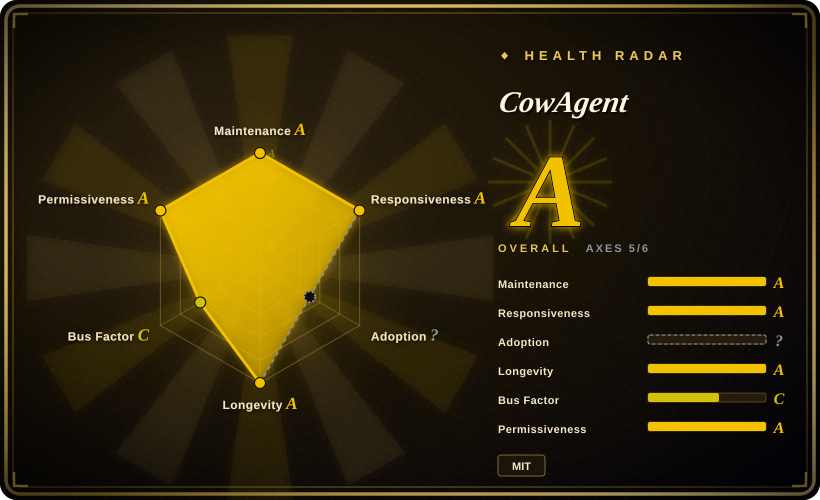
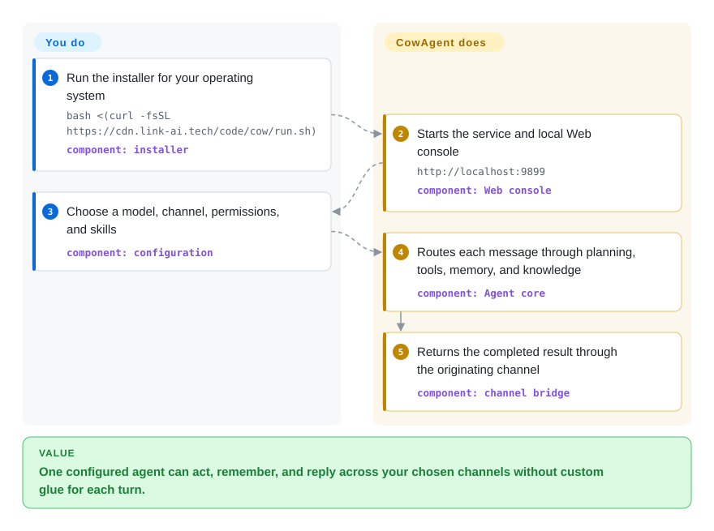

# CowAgent

A self-hosted Python agent harness that connects one tool-using, memory-bearing assistant to a web console and twelve documented IM channel surfaces; it is the renamed continuation of `zhayujie/chatgpt-on-wechat`, not a new repository or a duplicate of the separately indexed `AutumnWhj/ChatGPT-wechat-bot`.

## When to use

You're building a personal or small-team assistant that must do more than answer prompts: it should plan tasks, use files, shell, browser, scheduler, MCP servers, skills, memory, and a knowledge base, then meet users in Web, WeChat, Feishu, DingTalk, WeCom, QQ, Telegram, Slack, or Discord. You want to choose Claude, OpenAI, Gemini, DeepSeek, Qwen, GLM, Kimi, MiniMax, Doubao, ERNIE, MiMo, LinkAI, or a custom compatible endpoint from one console instead of wiring each model and channel yourself.

Choose CowAgent over a focused message-to-LLM relay when its agent runtime, multi-agent teams, persistent workspaces, skills, and broad channel matrix are the reason for the deployment. For WeChat specifically, the current direct-message adapter is the newer iLink bot API path on `ilinkai.weixin.qq.com`; the repository removed its older WeChat/Wechaty/ItChat/WCF paths after previously disabling one to avoid account bans.

## How it works

The installer creates a local service and opens the Web console, where you select model credentials, channels, permissions, skills, and agent workspaces. Incoming channel messages enter a common bridge; the agent core plans a turn and may call tools, skills, memory, knowledge, or delegated agents before the originating channel sends the result back. CowAgent supplies that runtime and the adapters, while you remain responsible for credentials, channel-side registration, model cost, permission scope, and the host it can control. The default web surface is local-only, but server and Docker deployments can expose it when you deliberately configure authentication and network access.

<!-- flow-steps:begin (generated from flows/cowagent.json by tools/flow_card.py — do not edit) -->

Text version of the flow

1. **You**: Run the installer for your operating system — `bash <(curl -fsSL https://cdn.link-ai.tech/code/cow/run.sh)` — component: `installer`
2. **CowAgent**: Starts the service and local Web console — `http://localhost:9899` — component: `Web console`
3. **You**: Choose a model, channel, permissions, and skills — component: `configuration`
4. **CowAgent**: Routes each message through planning, tools, memory, and knowledge — component: `Agent core`
5. **CowAgent**: Returns the completed result through the originating channel — component: `channel bridge`

**Value**: One configured agent can act, remember, and reply across your chosen channels without custom glue for each turn.

<!-- flow-steps:end -->

## When NOT to use

- **You need a Tencent-supported production contract rather than a project-integrated personal assistant.** Use a registered WeCom app, WeCom bot, WeChat Official Account, or WeChat Customer Service API instead; CowAgent can connect several of those official-channel routes, while the direct WeChat iLink route has different one-to-one bot behavior and its long-term policy contract was not independently established here.
- **You cannot accept any uncertainty around personal-WeChat account policy.** Deploy CowAgent through WeCom, an Official Account, Feishu, Telegram, Slack, or another platform-approved bot route instead of the direct WeChat channel; the old lineage once disabled an earlier `wx` implementation to avoid bans, even though that implementation was removed before the current iLink adapter was added.
- **You only need a thin multi-channel LLM relay.** Use [WeChat Bot](wechat-bot.md) or a platform SDK instead; CowAgent adds autonomous tools, workspaces, multi-agent state, memory, knowledge, skills, a web application, and a much larger security and upgrade surface.
- **You need a dedicated multi-bot iLink control plane with persisted traces, Webhooks, Apps, and PostgreSQL/S3 growth paths.** Use [OpeniLink Hub](openilink-hub.md); CowAgent centers the assistant and its agent runtime rather than fleet administration and message-platform observability.
- **The assistant must not execute on its host.** Use a read-only chat application or isolate CowAgent in a container with a restricted workspace; the shipped config enables agent mode and `full-access`, and its terminal, file, browser, MCP, scheduler, and skill surfaces make host permissions a primary design decision.
- **You need a small embeddable Python library.** Use a provider SDK plus the official channel SDK, or an agent framework designed for embedding; CowAgent is an application with a service, web UI, local state layout, plugins, channel adapters, and operational lifecycle.

## Comparison

| Alternative | In index | Our verdict | Tradeoff |
|---|---|---|---|
| [WeChat Bot](wechat-bot.md) | ✅ | Choose WeChat Bot when a narrower Node.js CLI for direct model routing and local WeChat analysis is enough; choose CowAgent when tools, memory, knowledge, multi-agent teams, skills, and its broader assistant runtime decide the task. | WeChat Bot has a smaller conceptual surface but uses an unofficial Wechaty path for personal WeChat; CowAgent is substantially heavier, while its current direct-WeChat adapter uses the newer iLink bot endpoint and only supports one-to-one chats. |
| [OpeniLink Hub](openilink-hub.md) | ✅ | Choose OpeniLink Hub to operate several iLink bots with users, traces, Apps, Webhooks, and durable platform state; choose CowAgent when the bot should itself plan, use tools, remember, and delegate work. | Hub makes message control-plane operations explicit and adds database/auth/registry burden; CowAgent supplies the agent brain and many channel adapters but is not a specialized iLink fleet console. |
| [ChatGPT-wechat-bot](chatgpt-wechat-bot.md) | ✅ | Use ChatGPT-wechat-bot only for archaeology of a small 2022-era Wechaty/ChatGPT demo; choose CowAgent for the actively released continuation of a different repository lineage with current models, channels, and agent capabilities. | The old demo is easier to read but stale and operationally unsafe; CowAgent is maintained and far more capable, at the cost of a much larger codebase and trust boundary. |
| [Wechaty](wechaty.md) | ✅ | Choose Wechaty when you need an embeddable event API and want to own bot logic above a replaceable Puppet provider; choose CowAgent when a finished assistant with models, tools, memory, skills, and channel setup is the requirement. | Wechaty is less opinionated and keeps the application yours, but provider selection and operations are also yours; CowAgent reaches an agent assistant faster and carries a much larger runtime and trust boundary. |

## Tech stack

- **Core:** Python application with a common channel bridge, agent planner/executor, tool and skill registries, memory/knowledge subsystems, scheduler, plugin manager, and a `cow` Click CLI.
- **Web and desktop:** a web.py backend with HTML/CSS/JavaScript/TypeScript assets, plus packaged desktop code for macOS and Windows.
- **Channels:** current source directories cover Web, WeChat iLink, Feishu/Lark, DingTalk, WeCom bot and app, QQ, WeChat Official Account, WeChat Customer Service, Telegram, Slack, and Discord.
- **Models and media:** provider adapters cover the model families listed in the README; optional voice, image, embedding, and browser components expand the dependency set.
- **State and extension:** JSON/config files and per-agent workspaces under `~/cow`, secrets under `~/.cow`, bundled plugins, installable skills, optional vector backends, and MCP transports.

## Dependencies

- **Runtime:** Python 3.7–3.13 according to the quick-start guide, plus Git and network access; the guide recommends Python 3.9. The requirements include NumPy, aiohttp, requests, Pillow, PyYAML, croniter, Click, QR rendering, regex, and channel SDKs.
- **Model access:** at least one supported provider credential and network/billing arrangement, or a compatible local/custom endpoint. Chat, vision, image generation, speech, and embeddings can use separate providers.
- **Channel access:** each enabled channel adds its own app registration, token, account, callback, long-poll, WebSocket, or public-server requirements. WeCom app and Official Account routes require server or Docker deployment and externally reachable callbacks.
- **Agent tools:** browser automation needs browser dependencies; MCP servers and installed skills add their own executables, credentials, permissions, and supply-chain trust.
- **Storage:** writable CowAgent data and workspace directories are required. Memory, knowledge, conversations, media, credentials, plugins, and optional vector indexes all need backup and retention decisions.

## Ops difficulty

**Medium for one local web assistant; high for a 24/7 multi-channel agent.** The one-line installer and local console reduce first-run work, but the maintained system spans a Python service, model keys and billing, channel credentials, QR or callback lifecycle, web authentication, workspace permissions, scheduled work, memory/knowledge retention, plugins, skills, MCP servers, browser dependencies, and upgrades. A public deployment also needs TLS, firewall rules, secret handling, backups, and monitoring. The biggest operational distinction from an ordinary bot is that CowAgent can read and write files and invoke shell/browser tools; permission mode and isolation must be designed before untrusted channel users can reach it.

## Health & viability

- **Maintenance, as of 2026-09-22:** the repository is not archived, its default branch received commits on 2026-09-21, and GitHub reports a push on 2026-09-22. Releases ran from `2.0.0` on 2026-02-03 through `2.1.9` on 2026-09-14, including ten `2.1.x` releases since June.
- **Adoption:** GitHub reports 47,073 stars and 10,369 forks. That is strong interest, but stars and forks do not establish production reliability, security, or successful upgrades.
- **Governance:** the repository is owned by an individual account. GitHub's contributor endpoint shows a broad tail, but the owner has 1,743 attributed commits versus 298 for the next contributor, so roadmap and merge authority remain concentrated.
- **Age and Lindy:** GitHub preserves the repository's 2022-08-07 creation date across the rename. Roughly four years of lineage plus current release and commit activity is a positive durability prior; the 2026 rebrand and rapid agent-platform expansion still make current architecture maturity newer than the repository age alone suggests.
- **Risk posture:** MIT is consistent between GitHub metadata and `LICENSE`. The principal selection risks are host-level agent permissions, secrets and private-message retention, plugin/skill/MCP supply chain, model and channel external dependencies, and the gap between the repository's broad feature velocity and the operator's ability to audit every enabled surface.

## Caveats (unverified)

- [未验证] The repository docs call the current `ilinkai.weixin.qq.com` direct-WeChat path an official API and “safe to use.” The Tencent-owned endpoint and current source path were verified, but no separate Tencent terms document or account-enforcement assurance was found in the repository; operators who cannot accept that gap should use WeCom or Official Account routes.
- [未验证] No live installation, channel login, model call, browser action, upgrade, backup restore, or sustained-load test was performed for this page; capability statements come from the 2026-09-22 repository tree and documentation.
- [未验证] Bundled plugins, downloadable skills, MCP servers, model providers, and channel SDKs were not individually audited for data handling, permissions, retention, vulnerabilities, or maintainer trust.
- **Lineage note (verified):** `chatgpt-on-wechat` and CowAgent are the same repository, confirmed by GitHub repository ID `522158088`, the old API path resolving to `zhayujie/CowAgent`, the README notice, and rename commit `d36d5aee`. [未验证] Compatibility of every pre-rename configuration, plugin, Docker image, and deployment with the much broader CowAgent 2.x architecture was not established; repository continuity is not proof of drop-in behavioral compatibility.
