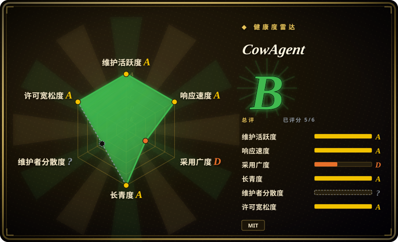
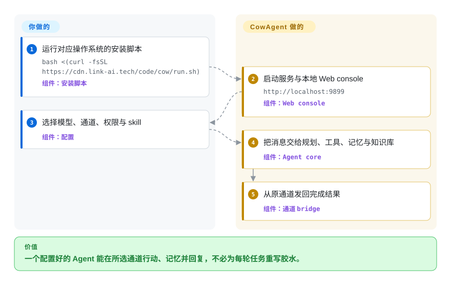

# CowAgent

一个自托管 Python agent harness，把带工具、记忆与知识库的助手接到 Web console 和十二种已记录的 IM 通道；它是 `zhayujie/chatgpt-on-wechat` 更名后的延续，不是新仓库，也不与已收录的 `AutumnWhj/ChatGPT-wechat-bot` 重复。

## 何时使用

你在搭建个人或小团队助手，需求不只是回答 prompt：它要规划任务，调用文件、shell、browser、scheduler、MCP server 和 skill，维护记忆与知识库，再通过 Web、微信、飞书、钉钉、企业微信、QQ、Telegram、Slack 或 Discord 接触用户。你还希望在一个 console 里选择 Claude、OpenAI、Gemini、DeepSeek、Qwen、GLM、Kimi、MiniMax、豆包、ERNIE、MiMo、LinkAI 或自定义兼容 endpoint，而不是逐个编写模型和通道胶水。

当 agent runtime、多 Agent 团队、持久 workspace、skill 与宽通道矩阵正是部署理由时，才应在专用消息转发器之上选择 CowAgent。微信方面，当前私聊 adapter 走 `ilinkai.weixin.qq.com` 上较新的 iLink bot API；仓库此前曾因封号风险停用旧微信路径，后来删除 Wechaty、ItChat 与 WCF 实现，当前 adapter 不是那条旧路径。

## 怎么用起来

安装脚本建立本地服务并打开 Web console，你在其中选择模型凭据、通道、权限、skill 与 Agent workspace。通道消息进入统一 bridge 后，agent core 会规划本轮任务，并可调用工具、skill、记忆、知识库或委派其他 Agent，最后由原通道发回结果。CowAgent 提供 runtime 与 adapter；凭据、通道侧注册、模型费用、权限范围和它能控制的主机仍由你负责。Web 默认只监听本机，但 server 与 Docker 部署可在你明确配置认证和网络后对外开放。

<!-- flow-steps:begin (generated from flows/cowagent.json by tools/flow_card.py — do not edit) -->

流程文字版

1. **你**：运行对应操作系统的安装脚本 — `bash <(curl -fsSL https://cdn.link-ai.tech/code/cow/run.sh)` — 组件：`安装脚本`
2. **CowAgent**：启动服务与本地 Web console — `http://localhost:9899` — 组件：`Web console`
3. **你**：选择模型、通道、权限与 skill — 组件：`配置`
4. **CowAgent**：把消息交给规划、工具、记忆与知识库 — 组件：`Agent core`
5. **CowAgent**：从原通道发回完成结果 — 组件：`通道 bridge`

**价值**：一个配置好的 Agent 能在所选通道行动、记忆并回复，不必为每轮任务重写胶水。

<!-- flow-steps:end -->

## 何时不用

- **你需要腾讯支持的生产契约，而不是项目集成的个人助手。** 改用已注册的企业微信应用、企业微信 bot、微信公众号或微信客服 API；CowAgent 能连接其中多种官方通道，而微信直连 iLink 路径是不同的单聊 bot 形态，本页没有独立确认其长期政策契约。
- **你不能接受任何个人微信账号政策不确定性。** 不要启用微信直连通道，改让 CowAgent 通过企业微信、公众号、飞书、Telegram、Slack 或其他平台批准的 bot 路径服务；这条仓库血缘曾停用较早的 `wx` 实现来规避封号，尽管旧实现已在当前 iLink adapter 加入前删除。
- **你只需要轻量多通道 LLM relay。** 改用 [WeChat Bot](wechat-bot.zh.md) 或平台 SDK；CowAgent 还带自治工具、workspace、多 Agent 状态、记忆、知识库、skill 和 Web 应用，安全面与升级面大得多。
- **你需要专门管理多个 iLink bot，并要求持久 trace、Webhook、App 与 PostgreSQL／S3 扩展路径。** 改用 [OpeniLink Hub](openilink-hub.zh.md)；CowAgent 以助手及其 agent runtime 为中心，不是 fleet administration 和消息平台可观测性系统。
- **助手绝不能在宿主机上执行操作。** 改用只读 chat application，或把 CowAgent 隔离在受限 workspace 的 container 中；随仓库提供的配置启用了 agent mode 与 `full-access`，terminal、file、browser、MCP、scheduler 和 skill 都让宿主权限成为首要设计问题。
- **你需要小型、可嵌入的 Python library。** 改用 provider SDK 加官方 channel SDK，或选择为嵌入设计的 agent framework；CowAgent 是完整应用，包含 service、Web UI、本地状态布局、plugin、channel adapter 和运行生命周期。

## 横向对比

| 替代品 | 是否收录 | 我们的评价 | 取舍 |
|---|---|---|---|
| [WeChat Bot](wechat-bot.zh.md) | ✅ | 如果更窄的 Node.js CLI、直接模型路由与本地微信分析已经够用，选 WeChat Bot；如果工具、记忆、知识库、多 Agent 团队、skill 与更完整的助手 runtime 决定任务，选 CowAgent。 | WeChat Bot 概念面更小，但个人微信使用非官方 Wechaty 路径；CowAgent 重得多，当前微信直连使用较新的 iLink bot endpoint，并且只支持一对一聊天。 |
| [OpeniLink Hub](openilink-hub.zh.md) | ✅ | 如果要用用户、trace、App、Webhook 和持久平台状态运营多个 iLink bot，选 OpeniLink Hub；如果 bot 本身要规划、用工具、记忆和委派任务，选 CowAgent。 | Hub 明确提供消息 control plane，也增加数据库、认证和 registry 运维；CowAgent 提供 agent brain 与多通道 adapter，却不是专门的 iLink fleet console。 |
| [ChatGPT-wechat-bot](chatgpt-wechat-bot.zh.md) | ✅ | 只在考古小型 2022 年 Wechaty／ChatGPT demo 时使用 ChatGPT-wechat-bot；需要另一条仓库血缘中持续发布、支持当前模型与通道的 agent application 时，选 CowAgent。 | 旧 demo 更容易读，却已陈旧且不适合运行；CowAgent 维护活跃、能力广得多，代价是代码库和信任边界也大得多。 |
| [Wechaty](wechaty.zh.md) | ✅ | 如果需要可嵌入的 event API，并希望在可替换 Puppet provider 之上自行控制 bot logic，选 Wechaty；如果需求是已经集成模型、工具、记忆、skill 与通道配置的完整助手，选 CowAgent。 | Wechaty 观点更少，应用归你控制，但 provider 选择与运维也归你承担；CowAgent 更快落成 agent assistant，同时带来大得多的 runtime 与信任边界。 |

## 技术栈

- **核心：** Python application，包含统一 channel bridge、agent planner／executor、tool 与 skill registry、记忆／知识库、scheduler、plugin manager，以及基于 Click 的 `cow` CLI。
- **Web 与 desktop：** web.py backend 加 HTML、CSS、JavaScript、TypeScript 资源，并有面向 macOS 与 Windows 的 packaged desktop 代码。
- **通道：** 当前 source directory 覆盖 Web、微信 iLink、飞书、钉钉、企业微信 bot 与 app、QQ、微信公众号、微信客服、Telegram、Slack 和 Discord。
- **模型与媒体：** provider adapter 覆盖 README 所列模型家族；可选 voice、image、embedding 与 browser component 会继续扩大依赖集合。
- **状态与扩展：** `~/cow` 下的 JSON／config 和各 Agent workspace、`~/.cow` 下的 secret、内置 plugin、可安装 skill、可选 vector backend 与 MCP transport。

## 依赖

- **Runtime：** quick-start 文档支持 Python 3.7–3.13，并建议 Python 3.9；还需要 Git 与网络。Requirements 包含 NumPy、aiohttp、requests、Pillow、PyYAML、croniter、Click、二维码渲染、regex 和多种 channel SDK。
- **模型访问：** 至少一组支持的 provider credential 与网络／计费安排，或兼容的本地／自定义 endpoint。Chat、vision、image generation、speech 与 embedding 可分别选择 provider。
- **通道访问：** 每个启用通道都有自己的 app registration、token、账号、callback、long-poll、WebSocket 或公网 server 要求。企业微信 app 与公众号路径只支持 server 或 Docker 部署，并要求外部 callback 可达。
- **Agent 工具：** Browser automation 需要 browser dependency；MCP server 与已安装 skill 会增加自己的 executable、credential、permission 与供应链信任。
- **存储：** 需要可写的 CowAgent data 与 workspace directory。Memory、knowledge、conversation、media、credential、plugin 与可选 vector index 都需要备份和保留策略。

## 运维难度

**单机本地 Web 助手为中等；全天候多通道 Agent 为高。** 一行安装和本地 console 降低首次运行成本，但持续系统横跨 Python service、模型 key 与计费、通道 credential、二维码或 callback 生命周期、Web 认证、workspace permission、scheduled work、记忆／知识保留、plugin、skill、MCP server、browser dependency 与升级。公网部署还要处理 TLS、firewall、secret、backup 与 monitoring。它与普通 bot 最大的运维差异，是 CowAgent 能读写文件并调用 shell／browser tool；不可信通道用户接入前，必须先设计 permission mode 与 isolation。

## 健康度与可持续性

- **维护，截至 2026-09-22：** 仓库未归档，default branch 在 2026-09-21 仍有 commit，GitHub 报告 2026-09-22 有 push。Release 从 2026-02-03 的 `2.0.0` 延续到 2026-09-14 的 `2.1.9`，其中六月以来发布了十个 `2.1.x` 版本。
- **采用：** GitHub 报告 47,073 star 与 10,369 fork。这是强兴趣信号，但 star 和 fork 不能证明生产可靠性、安全性或升级成功率。
- **治理：** 仓库属于个人账号。GitHub contributor endpoint 显示长尾贡献者很多，但 owner 有 1,743 个归属 commit，第二名为 298 个，因此 roadmap 与 merge authority 仍然集中。
- **年龄与 Lindy：** GitHub 在更名后保留了 2022-08-07 的仓库创建日期。约四年血缘加当前 release 与 commit 活动，为持续性提供正向先验；但 2026 年 rebrand 与 agent platform 快速扩展意味着当前架构成熟度不能直接等同于整个仓库年龄。
- **风险姿态：** GitHub metadata 与 `LICENSE` 都是 MIT。决定性风险来自宿主机级 Agent permission、secret 与私人消息保留、plugin／skill／MCP 供应链、模型与通道外部依赖，以及宽功能快速演进与运营方审计能力之间的差距。

## 存疑（未验证）

- [未验证] 仓库文档称当前 `ilinkai.weixin.qq.com` 微信直连路径为官方 API 且“safe to use”。本页确认了腾讯域名 endpoint 与当前 source path，但仓库内没有独立的腾讯条款文档或账号处置保证；不能接受这个缺口的运营方应使用企业微信或公众号路径。
- [未验证] 本页没有执行 live installation、channel login、model call、browser action、upgrade、backup restore 或 sustained-load test；能力描述来自 2026-09-22 的仓库 tree 与文档。
- [未验证] 内置 plugin、可下载 skill、MCP server、model provider 与 channel SDK 没有逐个审计 data handling、permission、retention、vulnerability 或 maintainer trust。
- **血缘说明（已验证）：** `chatgpt-on-wechat` 与 CowAgent 是同一仓库，证据是 GitHub repository ID `522158088`、旧 API path 解析到 `zhayujie/CowAgent`、README 声明，以及 rename commit `d36d5aee`。[未验证] 本轮没有确认每一份更名前 config、plugin、Docker image 与 deployment 是否兼容大幅扩展后的 CowAgent 2.x architecture；仓库连续性不等于 drop-in behavior compatibility 证明。
