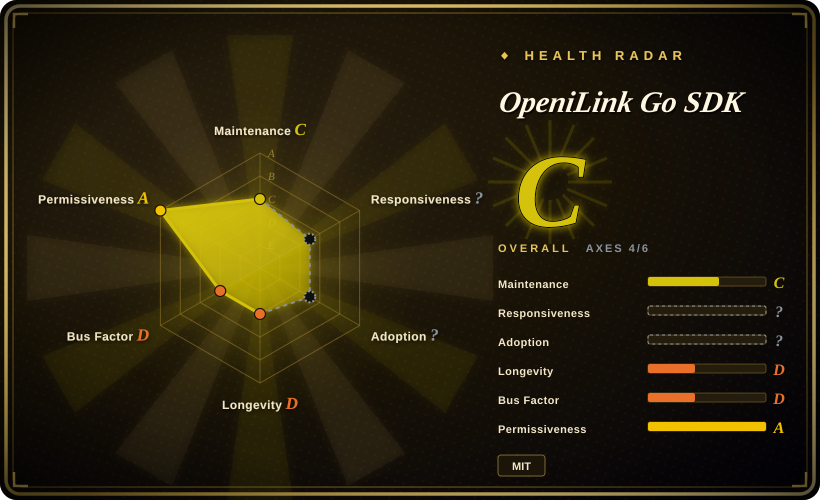
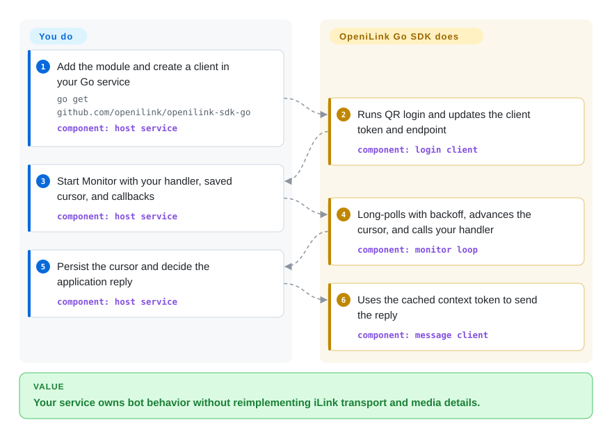

# OpeniLink Go SDK

A small, standard-library-only Go client for putting QR login, long-poll message reception, context-token-aware replies, and encrypted media transfer inside your own service; it is not a bot management plane, and official iLink affiliation is not established.

## When to use

You are adding one iLink-connected WeChat bot to an existing Go service and want the narrowest available OpeniLink integration boundary. You already have a place for application state, authentication, routing, business logic, and operations; what you do not want to rebuild is QR login, the long-poll protocol, context-token handling, media encryption, or typed transport errors.

Choose this SDK over [OpeniLink Hub](openilink-hub.md) when one process and one integration are the point, not a compromise. The SDK gives you protocol primitives and transport-loop retry/backoff without adding Hub's users, database, web console, App Registry, message broker, or multi-bot control plane.

## How it works

Your Go process creates a client, completes QR login, and starts `Monitor` with a message handler and a buffer-update callback. The library long-polls the iLink endpoint, adopts the server timeout, retries transport failures with backoff, caches each sender's context token, and invokes your handler. Your application must persist the returned sync buffer and credentials, decide what a message means, and own business-level deduplication, delivery policy, authentication, routing, and recovery. Calling `Push` or the typed send/media methods turns that application decision back into an iLink request.

<!-- flow-steps:begin (generated from flows/openilink-sdk-go.json by tools/flow_card.py — do not edit) -->

Text version of the flow

1. **You**: Add the module and create a client in your Go service — `go get github.com/openilink/openilink-sdk-go` — component: `host service`
2. **OpeniLink Go SDK**: Runs QR login and updates the client token and endpoint — component: `login client`
3. **You**: Start Monitor with your handler, saved cursor, and callbacks — component: `host service`
4. **OpeniLink Go SDK**: Long-polls with backoff, advances the cursor, and calls your handler — component: `monitor loop`
5. **You**: Persist the cursor and decide the application reply — component: `host service`
6. **OpeniLink Go SDK**: Uses the cached context token to send the reply — component: `message client`

**Value**: Your service owns bot behavior without reimplementing iLink transport and media details.

<!-- flow-steps:end -->

## When NOT to use

- **You need a supported official channel or cannot accept account restriction risk.** Use WeCom or another documented Tencent API surface instead; a third-party SDK around personal-IM automation does not supply an official production contract or remove platform-policy and ban risk.
- **You need users, multiple bots, durable message history, traces, installable Apps, or a web console.** Use [OpeniLink Hub](openilink-hub.md) instead; rebuilding those layers around the SDK defeats the reason to choose the smaller boundary.
- **You do not want to own application reliability.** Use Hub or a purpose-built managed relay instead; the SDK retries its long-poll transport, but persistence, idempotency, outbound retry policy, dead-letter handling, authentication, routing, monitoring, backups, and incident response remain in your service.
- **You need an established dependency with a long compatibility record.** Use an official Tencent integration or another mature messaging stack instead; this repository was created in 2026-03, has one visible contributor, and has had no default-branch commit since 2026-04-04.
- **Your host application is not Go.** Use the sibling Node.js, Python, PHP, Java, C#, or Lua repository instead of wrapping this library across a process boundary; they are peer client libraries in the same organization, although their API coverage and maintenance cadence must be checked separately.
- **You need a prebuilt WeChat-to-Telegram bridge.** Use `openilink-tg` instead; this SDK provides protocol calls and callbacks, not destination-specific routing or a runnable relay product.

## Comparison

| Alternative | In index | Our verdict | Tradeoff |
|---|---|---|---|
| [OpeniLink Hub](openilink-hub.md) | ✅ | For one Go integration inside a service you already operate, choose this SDK; when multiple bots, users, message history, traces, Apps, and a web console are requirements, choose Hub. | The SDK keeps the code and trust boundary smaller, but you own persistence, auth, business routing, delivery recovery, and operations; Hub supplies those layers and centralizes their data and risk. |
| `openilink-sdk-node` | not indexed | Choose the Node SDK when the host service is Node.js 18+ and async `fetch` integration matters more than Go's single-binary toolchain; otherwise choose this Go SDK, which the Hub documentation lists first and which has the highest GitHub star count among the language SDKs as of 2026-09-22. | Both are focused clients with QR login, polling, media, and no runtime package dependencies; their types, cancellation model, and release surfaces follow their host ecosystems. |
| `openilink-sdk-python` | not indexed | Choose the Python SDK for an existing Python 3.10+ bot or rapid scripting; choose this Go SDK for a dependency-free compiled service and its broader documented media helpers. | Python is easier to embed in Python workflows but brings `requests` and `qrcode`; both still leave durable state, policy, routing, and operations to the application. |
| `openilink-sdk-php` | not indexed | Choose the PHP SDK when an existing PHP 8.1+ application is the non-negotiable host; choose this Go SDK when a continuously running polling worker and standard-library-only deployment fit better. | PHP uses curl, JSON, and OpenSSL extensions and mirrors the same focused client surface; Go avoids external modules but does not remove the need to run and supervise a long-lived bot process. |

## Tech stack

- **Language and module:** Go 1.22 module `github.com/openilink/openilink-sdk-go`; `go.mod` declares no third-party modules.
- **Transport:** standard-library HTTP with an injectable `HTTPDoer`, context cancellation, structured `APIError` and `HTTPError`, and a long-poll monitor with server-directed timeout and retry/backoff.
- **Protocol helpers:** QR login, sync-buffer progression, per-user context-token cache, text and typing APIs, media upload/download, AES-128-ECB processing, MIME routing, and optional SILK-to-WAV decoding through a caller-supplied decoder.
- **Repository shape:** a single library package, one echo-bot example, and unit tests; there is no server, database, web UI, plugin system, or deployment framework in the repository.

## Dependencies

- **Build/runtime:** Go 1.22 or newer; the module itself uses only the Go standard library.
- **Service:** outbound HTTPS access to the iLink API and CDN endpoints, plus a compatible WeChat/iLink account that can complete QR login.
- **Application-owned state:** secure storage for the bot token and sync buffer if restarts must resume cleanly; the SDK exposes callbacks and values but does not provide a datastore.
- **Optional voice support:** a caller-provided `SILKDecoder`; the SDK downloads and decrypts voice payloads and can wrap returned PCM as WAV, but does not ship a SILK codec.

## Ops difficulty

**Low as a library integration; medium to high as a continuously operated bot.** Adding the module is small, and the SDK covers QR login, long polling, transport retry/backoff, context-token caching, and media protocol details. Production responsibility remains with the host: credential protection, durable cursor writes, process supervision, application-level retries and idempotency, message privacy, observability, reconnect and re-login handling, rate or policy changes, backups, and any user-facing authentication. The smaller trust boundary is real only if the surrounding service already owns those concerns well.

## Health & viability

- **Maintenance, as of 2026-09-22:** the repository was created on 2026-03-22 and its 29-commit default branch last moved on 2026-04-04. It is not archived, but roughly 171 days without a push and an open May pull request provide no evidence of current active maintenance.
- **Release discipline:** tags progressed from `v0.1.0` through `v0.6.0`, with `v0.6.0` exactly matching the current branch head. GitHub reports zero Releases, so there are version markers but no release notes or visible maintained-release channel.
- **Adoption:** 16 stars and 5 forks are very small signals. No public production users, dependent-package count, throughput record, or upgrade record was established for this page.
- **Governance:** all 29 commits are attributed by GitHub's contributor endpoint to one contributor, and the repository belongs to the young OpenILink organization rather than a foundation or multi-vendor governance body. Treat roadmap and bus-factor risk as concentrated.
- **Age and Lindy:** a six-month-old repository with activity concentrated in its first two weeks has not accumulated a meaningful longevity prior. Its concise implementation and tests reduce inspection cost, but they do not substitute for continued maintenance.
- **Risk posture:** the decisive non-code risks are the unverified official-affiliation status, personal-IM platform policy and account-ban exposure, protocol drift, and the lack of a documented compatibility or support commitment.

## Caveats (unverified)

- [未验证] The SDK README does not state an official affiliation or endorsement status. The sibling OpeniLink Hub in the same organization explicitly says it is independently developed and not affiliated with or endorsed by the official iLink team; no evidence reviewed for the SDK established a different status.
- [未验证] Current iLink terms, personal-account automation permissions, enforcement behavior, and account-ban likelihood were not verified from an official policy document for this page.
- [未验证] No live login, message exchange, media transfer, reconnect exercise, protocol-compatibility test, or sustained-load test was run against the service.
- [未验证] Production adoption, downstream dependents, operator experience, and the maintainers' future support plans could not be established from repository metadata and documentation.
- [推断] The open pull request proposing a channel-version bump may indicate protocol drift after `v0.6.0`; its necessity and compatibility impact were not independently reproduced.
