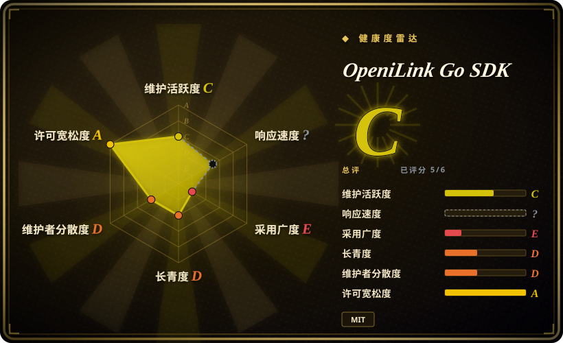
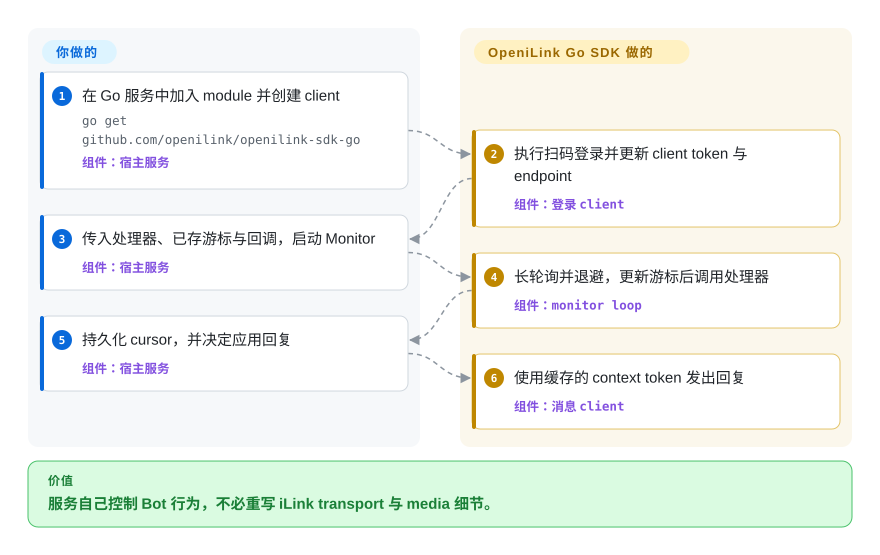

# OpeniLink Go SDK

一个只依赖 Go 标准库的小型 client，用于把扫码登录、长轮询收消息、基于 context token 的回复和加密媒体传输放进自己的服务；它不是 Bot 管理面，官方 iLink 关联状态也没有得到证实。

## 何时使用

你要给现有 Go 服务接入一个连接 iLink 的微信 Bot，并希望 OpeniLink integration boundary 尽可能小。应用状态、认证、routing、业务逻辑与运维已经有归属，你只是不想重写扫码登录、长轮询协议、context token 管理、媒体加密和 typed transport error。

当单进程与单 integration 本来就是目标，而不是暂时妥协时，选这个 SDK 而不是 [OpeniLink Hub](openilink-hub.zh.md)。SDK 提供 protocol primitive 与 transport loop 的 retry／backoff，不会额外引入 Hub 的用户、数据库、Web 控制台、App Registry、message broker 或多 Bot 控制面。

## 怎么用起来

你的 Go 进程创建 client，完成扫码登录，再启动 `Monitor`，传入 message handler 与 buffer update callback。Library 会长轮询 iLink endpoint，采纳 server timeout，对 transport failure 做 retry／backoff，缓存每个 sender 的 context token，再调用你的 handler。应用必须持久化返回的 sync buffer 与 credential，决定消息含义，并负责业务级 deduplication、delivery policy、认证、routing 与恢复。调用 `Push` 或 typed send／media method 后，应用决策才会变成 iLink request。

<!-- flow-steps:begin (generated from flows/openilink-sdk-go.json by tools/flow_card.py — do not edit) -->

流程文字版

1. **你**：在 Go 服务中加入 module 并创建 client — `go get github.com/openilink/openilink-sdk-go` — 组件：`宿主服务`
2. **OpeniLink Go SDK**：执行扫码登录并更新 client token 与 endpoint — 组件：`登录 client`
3. **你**：传入处理器、已存游标与回调，启动 Monitor — 组件：`宿主服务`
4. **OpeniLink Go SDK**：长轮询并退避，更新游标后调用处理器 — 组件：`monitor loop`
5. **你**：持久化 cursor，并决定应用回复 — 组件：`宿主服务`
6. **OpeniLink Go SDK**：使用缓存的 context token 发出回复 — 组件：`消息 client`

**价值**：服务自己控制 Bot 行为，不必重写 iLink transport 与 media 细节。

<!-- flow-steps:end -->

## 何时不用

- **你需要有支持承诺的官方通道，或无法接受账号受限风险。** 改用企业微信或其他有腾讯文档支持的 API 面；围绕个人 IM automation 的第三方 SDK 不会带来官方生产契约，也不能移除平台政策与封号风险。
- **你需要用户、多 Bot、持久消息历史、trace、可安装 App 或 Web 控制台。** 改用 [OpeniLink Hub](openilink-hub.zh.md)；围绕 SDK 重建这些层，会失去选择小边界方案的意义。
- **你不想承担应用可靠性。** 改用 Hub 或专用 managed relay；SDK 会重试长轮询 transport，但持久化、幂等、outbound retry policy、dead letter、认证、routing、monitoring、backup 和 incident response 仍属于你的服务。
- **你需要具有长期 compatibility record 的成熟依赖。** 改用腾讯官方 integration 或其他成熟消息栈；该仓库创建于 2026-03，只有一名可见 contributor，默认分支自 2026-04-04 后没有新 commit。
- **宿主应用不是 Go。** 改用同 organization 下的 Node.js、Python、PHP、Java、C# 或 Lua 仓库，不要跨进程包装这个 library；它们是同级 client library，但 API coverage 与 maintenance cadence 需要分别检查。
- **你需要现成的微信到 Telegram bridge。** 改用 `openilink-tg`；这个 SDK 提供 protocol call 与 callback，不提供面向 destination 的 routing 或可直接运行的 relay product。

## 横向对比

| 替代品 | 是否收录 | 我们的评价 | 取舍 |
|---|---|---|---|
| [OpeniLink Hub](openilink-hub.zh.md) | 已收录 | 如果只要在已有服务中做一个 Go integration，选这个 SDK；如果多 Bot、用户、消息历史、trace、App 和 Web 控制台都是需求，选 Hub。 | SDK 的代码与信任边界更小，但持久化、认证、业务 routing、delivery recovery 与运维由你负责；Hub 提供这些层，也集中承载相关数据与风险。 |
| `openilink-sdk-node` | 未收录 | 如果宿主是 Node.js 18+，而 async `fetch` integration 比 Go 单 binary toolchain 更重要，选 Node SDK；否则选本页 Go SDK，Hub 文档把它列在首位，而且截至 2026-09-22，它在各语言 SDK 中 GitHub star 数最高。 | 两者都是带扫码、polling、media 且无 runtime package dependency 的专用 client；type、cancellation model 与 release surface 遵循各自宿主 ecosystem。 |
| `openilink-sdk-python` | 未收录 | 如果已有 Python 3.10+ Bot 或需要快速 scripting，选 Python SDK；如果要无第三方依赖的 compiled service 与文档覆盖更广的 media helper，选本页 Go SDK。 | Python 更容易嵌入 Python workflow，但带有 `requests` 与 `qrcode`；两者都把持久化、policy、routing 与运维留给应用。 |
| `openilink-sdk-php` | 未收录 | 如果现有 PHP 8.1+ 应用是不可改变的宿主，选 PHP SDK；如果持续运行的 polling worker 与只依赖标准库的部署更匹配，选本页 Go SDK。 | PHP 使用 curl、JSON 与 OpenSSL extension，并提供类似的专用 client surface；Go 不需要外部 module，但仍要运行和监督长生命周期 Bot process。 |

## 技术栈

- **语言与 module：** Go 1.22 module `github.com/openilink/openilink-sdk-go`；`go.mod` 没有声明第三方 module。
- **Transport：** 基于标准库 HTTP，支持注入 `HTTPDoer`、context cancellation、结构化 `APIError` 与 `HTTPError`，并提供采纳 server timeout 和 retry／backoff 的 long-poll monitor。
- **Protocol helper：** 扫码登录、sync buffer 推进、逐用户 context token cache、文本与 typing API、media upload／download、AES-128-ECB、MIME routing，以及通过调用者提供的 decoder 完成可选 SILK-to-WAV decoding。
- **仓库形态：** 单一 library package、一个 echo-bot example 和 unit test；仓库里没有 server、database、Web UI、plugin system 或 deployment framework。

## 依赖

- **构建与运行：** Go 1.22 或更高版本；module 本身只使用 Go 标准库。
- **服务：** 能通过 outbound HTTPS 访问 iLink API 与 CDN endpoint，并有一个能完成扫码登录的兼容微信／iLink 账号。
- **应用自管状态：** 如果重启后要干净恢复，需要安全存储 bot token 与 sync buffer；SDK 暴露 callback 与 value，但不提供 datastore。
- **可选语音支持：** 调用方提供 `SILKDecoder`；SDK 会下载和解密 voice payload，并能把返回的 PCM 封装成 WAV，但不自带 SILK codec。

## 运维难度

**作为 library integration 较低，作为持续运行的 Bot 则为中到高。** 加入 module 很简单，SDK 也覆盖扫码登录、长轮询、transport retry／backoff、context token cache 与媒体协议细节。生产责任仍在宿主：credential protection、持久 cursor write、process supervision、应用级 retry 与幂等、消息隐私、observability、reconnect 与 relogin、rate 或 policy change、backup，以及任何 user-facing authentication。只有周边服务已经妥善承担这些工作时，更小的信任边界才真正成立。

## 健康度与可持续性

- **维护，截至 2026-09-22：** 仓库创建于 2026-03-22，共 29 个 commit，默认分支最后更新于 2026-04-04。仓库没有归档，但大约 171 天没有 push，且 5 月创建的 pull request 仍然打开，没有证据表明当前仍在活跃维护。
- **Release discipline：** tag 从 `v0.1.0` 推进到 `v0.6.0`，其中 `v0.6.0` 与当前 branch head 完全一致。GitHub 报告零个 Release，因此存在 version marker，但没有 release note 或可见的 maintained release channel。
- **采用：** 16 个 star 与 5 个 fork 都是很小的信号。本页没有确认公开生产用户、dependent package 数量、throughput record 或 upgrade record。
- **治理：** GitHub contributor endpoint 把全部 29 个 commit 归到一名 contributor，仓库属于年轻的 OpenILink organization，而非基金会或多 vendor 治理。应把 roadmap 与 bus-factor risk 视为集中状态。
- **年龄与 Lindy：** 一个只有六个月、活动集中在最初两周的仓库，还没有积累有意义的 longevity prior。实现精简且带 test，能降低审计成本，却不能替代持续维护。
- **风险姿态：** 决定性的非代码风险是未验证的官方关联状态、个人 IM platform policy 与封号暴露、protocol drift，以及没有文档化 compatibility 或 support commitment。

## 存疑（未验证）

- [未验证] SDK README 没有声明官方关联或背书状态。同一 organization 下的 OpeniLink Hub 明确表示它是独立开发，与 iLink 官方团队没有关联或背书；本次实读没有发现 SDK 具有不同状态的证据。
- [未验证] 本页没有从官方 policy document 核验当前 iLink 条款、个人账号 automation permission、enforcement behavior 与封号概率。
- [未验证] 本次没有对真实服务执行登录、消息收发、media transfer、reconnect exercise、protocol compatibility test 或 sustained load test。
- [未验证] 无法从仓库 metadata 与文档确认 production adoption、downstream dependent、operator experience 和 maintainer 的未来支持计划。
- [推断] 一个仍打开的 pull request 建议在 `v0.6.0` 后提升 channel version，这可能表示 protocol drift；本次没有独立复现其必要性与 compatibility impact。
