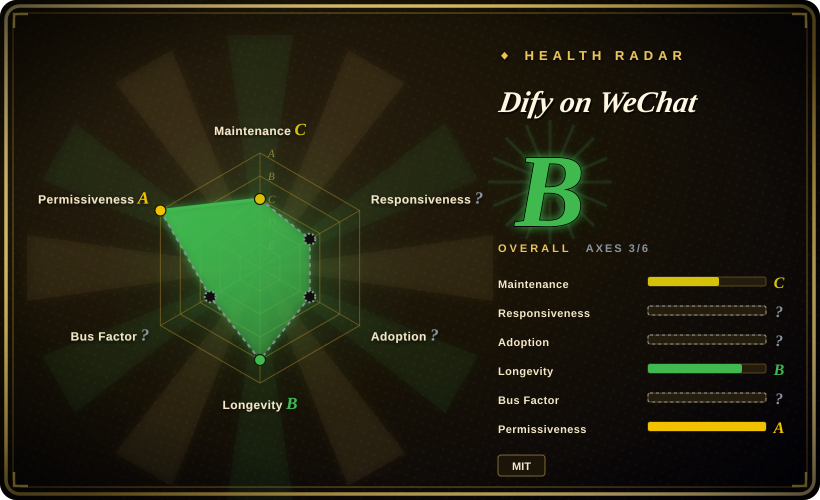
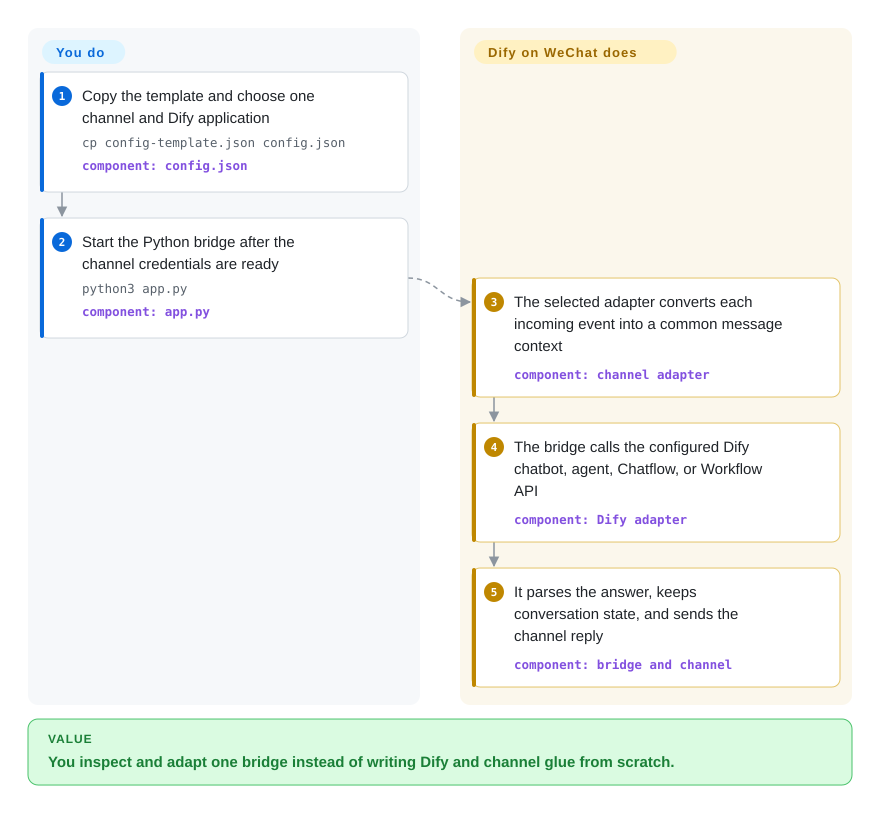

# Dify on WeChat

A source-reviewable Python bridge between Dify and several WeChat or WeCom channel adapters, but not a fully open personal-WeChat stack: its formerly recommended Gewechat service has stopped and never published its complete server implementation.

## When to use

You already run a Dify chatbot, agent, Chatflow, or Workflow and need to expose it through a WeChat Official Account or WeCom application without accepting the closed `dify_helper.exe` in Dify Enterprise WeChat Bot. You want the bridge, Dify request mapping, message parsing, channel selection, and bundled plugins in Python so your team can inspect or modify them.

Choose the channel before choosing the project. Its source-visible official-account and WeCom adapters are the defensible auditability path; its personal-account adapters add external runtimes or unofficial protocols that the repository cannot make auditable, supported, or account-safe.

## How it works

You copy the configuration template, select a channel, and provide the chosen Dify application's API endpoint, key, and type. The selected channel adapter turns each incoming platform event into a common message context, and the bridge dispatches that context to the Dify bot. The Dify adapter calls the chatbot, agent, Chatflow, or Workflow API, parses text and file responses, and keeps the returned conversation identifier before the channel sends the reply. You own the Dify deployment, channel credentials, plugins, and channel-specific runtime; this repository owns only the Python routing and adapters.

<!-- flow-steps:begin (generated from flows/dify-on-wechat.json by tools/flow_card.py — do not edit) -->

Text version of the flow

1. **You**: Copy the template and choose one channel and Dify application — `cp config-template.json config.json` — component: `config.json`
2. **You**: Start the Python bridge after the channel credentials are ready — `python3 app.py` — component: `app.py`
3. **Dify on WeChat**: The selected adapter converts each incoming event into a common message context — component: `channel adapter`
4. **Dify on WeChat**: The bridge calls the configured Dify chatbot, agent, Chatflow, or Workflow API — component: `Dify adapter`
5. **Dify on WeChat**: It parses the answer, keeps conversation state, and sends the channel reply — component: `bridge and channel`

**Value**: You inspect and adapt one bridge instead of writing Dify and channel glue from scratch.

<!-- flow-steps:end -->

## When NOT to use

- **You need a currently maintained personal-WeChat connection.** Choose [WeChat Bot](wechat-bot.md) only after accepting its own unofficial-account warning, or move the workflow to an official WeCom or Official Account API; Dify on WeChat's README says the vendored ItChat path is unusable, while Gewechat has stopped distributing its service and images.
- **Every executable in a personal-WeChat message path must be rebuildable from published source.** Use an official WeCom or Official Account adapter with a small reviewed service instead; Gewechat's archived repository explicitly says its complete server was never included, and the WCFerry and `ntwork` paths introduce separate runtime artifacts.
- **You need an actively evolving, broadly supported multi-channel bot platform.** Evaluate LangBot instead; Dify on WeChat's last release was `0.1.26` on 2025-04-13, its last code change was 2025-04-12, and the 2026-04-03 default-branch push changed only the README.
- **You want the upstream project's current general-purpose agent direction rather than a Dify-specific bridge.** Evaluate CowAgent, the 47k-star upstream from which GitHub records this repository as a fork; this fork remains focused on the older Dify-to-WeChat architecture and has a much smaller adoption signal.
- **You require a turnkey Windows Enterprise WeChat desktop prototype and accept a closed helper.** Use [Dify Enterprise WeChat Bot](dify-enterprise-wechat-bot.md) for that exact compatibility path; Dify on WeChat exposes more source and channel choice, but its `wework` route also depends on an old client and an external `ntwork` wheel.
- **You need an operational promise rather than source to evaluate.** Build a narrow integration on official Tencent APIs, optionally orchestrated with [n8n](../../workflow-orchestration/n8n.md); this drifting repository has 125 open issues and no code release after 2025-04.

## Comparison

| Alternative | In index | Our verdict | Tradeoff |
|---|---|---|---|
| [Dify Enterprise WeChat Bot](dify-enterprise-wechat-bot.md) | ✅ | When source inspection and channel choice decide the selection, choose Dify on WeChat; choose Dify Enterprise WeChat Bot only to reproduce its pinned Windows desktop workflow. | Dify on WeChat exposes its Python bridge and several adapters, but some personal-client runtimes remain opaque or defunct; the alternative is narrower and carries a closed `dify_helper.exe`. |
| [WeChat Bot](wechat-bot.md) | ✅ | Choose WeChat Bot for an active multi-IM CLI and many model backends; choose Dify on WeChat when Dify application types and source-visible official WeChat or WeCom adapters are the center of the task. | WeChat Bot is more active and broader, while Dify on WeChat offers deeper Dify-specific mapping but is drifting and has broken or risky personal-WeChat routes. |
| [CowAgent](cowagent.md) | ✅ | Choose CowAgent for the upstream project's current general agent harness and multi-channel direction; choose this fork only when its explicit Dify bridge and older adapter layout are what you must inspect or preserve. | CowAgent has far stronger adoption and current activity, but it is no longer merely the Dify-focused bridge represented by this fork. |
| LangBot | not indexed | Choose LangBot for a maintained multi-platform bot framework with Dify among many backends; choose Dify on WeChat for a smaller Python codebase whose Dify request path you intend to audit directly. | LangBot brings a larger platform and plugin surface; Dify on WeChat is narrower to inspect but has weaker maintenance and channel viability. |

## Tech stack

- **Core:** Python, `requests`, a common bridge/context layer, and source-visible channel and bot factories.
- **Dify adapter:** direct HTTP clients for chatbot, agent, Chatflow, Workflow, file upload, image, and voice paths; conversation identifiers are held by the bridge session layer.
- **Official-facing adapters:** source modules for WeChat Official Account, WeCom application, and WeCom customer-service callbacks, using `web.py` and `wechatpy` when those optional dependencies are installed.
- **Personal-client adapters:** vendored ItChat, Wechaty, WCFerry, Gewechat client code, and a Windows `ntwork` route; these have different external runtime and platform-risk boundaries.
- **Plugins and UI:** a local plugin manager, bundled source plugins, Gradio web UI, Docker files, and optional speech/model SDKs.

## Dependencies

- Python 3.8+ and the pinned or bounded packages in `requirements.txt`; optional channels, speech, plugins, and the web UI add the much larger `requirements-optional.txt` surface.
- A Dify API endpoint and application key. Using Dify Cloud trusts that hosted backend; self-hosting moves the model, plugin, storage, and network trust boundary into your own Dify deployment.
- Tencent-side credentials and a reachable callback for official WeChat or WeCom adapters.
- For personal WeChat, a separate channel runtime: the old ItChat path is documented as unusable, Gewechat no longer provides its historical service, WCFerry is client-version-sensitive, and `wework` requires a matching old Enterprise WeChat client plus an `ntwork` wheel.
- Any enabled plugin and its external service, package, or credentials; the plugin manager executes local plugin code in the bot process.

## Ops difficulty

**Medium for a narrow official API adapter; high or currently blocked for the documented personal-WeChat paths.** The official route still requires callback exposure, credential protection, Dify availability, dependency pinning, and message-data retention decisions. Personal-account operation adds QR sessions, client or protocol compatibility, ban risk, and runtimes that are no longer distributed or fully source-reviewable. The repository's release and code cadence has drifted, so operators must pin a commit and independently validate every selected channel against current platform behavior.

## Health & viability

- **Maintenance, as of 2026-09-22:** the latest release is `0.1.26` from 2025-04-13, the last code change found in the default-branch history is from 2025-04-12, and the latest push on 2026-04-03 changed only `README.md`. Classify it as drifting, not active.
- **Channel viability:** the current README still presents Gewechat as the preferred personal-WeChat channel, but Gewechat now declares itself stopped and says its complete service implementation and images are unavailable. That makes the old personal-WeChat quick start operationally stale.
- **Adoption:** GitHub reports 2,835 stars and 413 forks, well above the 148-star `mengdahuang` copy but modest beside CowAgent's 47,073 stars and LangBot's 17,949. Stars identify the canonical fork; they do not offset stale runtime dependencies.
- **Governance:** GitHub contributor history is broad, but much of it was inherited from the upstream fork. Five pull requests and 125 issues remain open; no issue was closed in the 90 days checked before 2026-09-22.
- **Age and Lindy:** created in 2023 and productive through early 2025, the project has a real release history rather than launch-only code. [推断] Its short age plus a seventeen-month code-release gap is a negative continuity prior.
- **License and trust:** the repository license is MIT and the core bridge is inspectable. That license does not cover Dify Cloud, Tencent platforms, third-party plugins, WCFerry or `ntwork` artifacts, or the missing Gewechat service implementation.

## Caveats (unverified)

- [未验证] No end-to-end channel was run during this review. Source presence and README claims do not establish that any adapter still works against current Tencent or Dify behavior.
- [未验证] No measured account-ban rate or safe operating threshold exists for the unofficial personal-WeChat routes; platform enforcement can change independently of this repository.
- [未验证] The provenance, reproducibility, and current behavior of third-party personal-client artifacts such as WCFerry packages, `ntwork` wheels, and historical Gewechat images were not established from this repository.
- [推断] The contributor count overstates current maintainer redundancy because GitHub attributes inherited upstream commits to this fork; current ownership continuity remains unclear.
