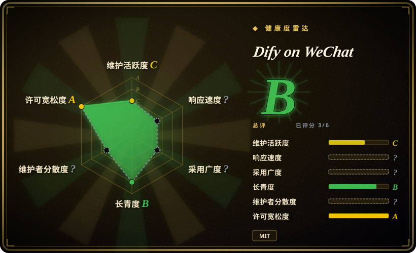
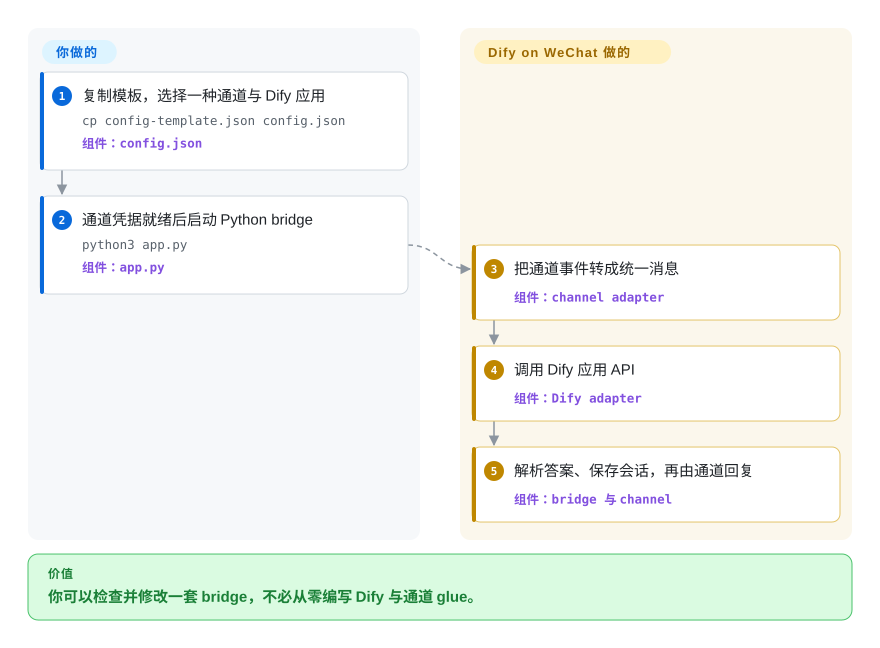

# Dify on WeChat

一个源码可审查的 Python 桥，把 Dify 接到多种微信或企业微信 channel adapter；但它不是个人微信全链路开源方案，因为原先推荐的 Gewechat 服务已停止，且从未公开完整服务端实现。

## 何时使用

你已经运行 Dify chatbot、agent、Chatflow 或 Workflow，希望通过微信公众号或企业微信应用对外提供能力，又不能接受 Dify Enterprise WeChat Bot 消息链路中的闭源 `dify_helper.exe`。团队希望直接检查或修改 Python 编写的 bridge、Dify 请求映射、消息解析、channel 选择和 bundled plugin。

应先选 channel，再选项目。源码可见的公众号与企业微信 adapter 才是较合理的可审查路径；个人号 adapter 会引入外部 runtime 或非官方协议，本仓库无法让它们变得可审查、受官方支持或没有账号风险。

## 怎么用起来

你复制配置模板，选择 channel，再填入 Dify application 的 API endpoint、key 和类型。所选 channel adapter 把平台事件转换成统一 message context，bridge 再把 context 分派给 Dify bot。Dify adapter 调用 chatbot、agent、Chatflow 或 Workflow API，解析文本与文件响应，并保留返回的 conversation identifier，最后由 channel 发回回复。Dify deployment、channel credential、plugin 与 channel-specific runtime 由你负责；本仓库只负责 Python routing 与 adapter。

<!-- flow-steps:begin (generated from flows/dify-on-wechat.json by tools/flow_card.py — do not edit) -->

流程文字版

1. **你**：复制模板，选择一种通道与 Dify 应用 — `cp config-template.json config.json` — 组件：`config.json`
2. **你**：通道凭据就绪后启动 Python bridge — `python3 app.py` — 组件：`app.py`
3. **Dify on WeChat**：把通道事件转成统一消息 — 组件：`channel adapter`
4. **Dify on WeChat**：调用 Dify 应用 API — 组件：`Dify adapter`
5. **Dify on WeChat**：解析答案、保存会话，再由通道回复 — 组件：`bridge 与 channel`

**价值**：你可以检查并修改一套 bridge，不必从零编写 Dify 与通道 glue。

<!-- flow-steps:end -->

## 何时不用

- **你需要当前仍维护的个人微信连接。** 只有接受同类非官方账号警告后才考虑 [WeChat Bot](wechat-bot.zh.md)，否则把流程迁到官方企业微信或公众号 API；Dify on WeChat 的 README 已说明 vendored ItChat 通道不可用，Gewechat 也已停止提供服务和 image。
- **个人微信消息路径中的每个 executable 都必须能从公开源码重建。** 改用官方企业微信或公众号 adapter 配合小型 reviewed service；Gewechat 归档仓库明确说明从未包含完整 server，WCFerry 与 `ntwork` 通道还会引入独立 runtime artifact。
- **你需要持续演进、广泛支持的 multi-channel bot platform。** 改评估 LangBot；Dify on WeChat 最新 release `0.1.26` 发布于 2025-04-13，最后一次 code change 是 2025-04-12，2026-04-03 的 default-branch push 只改了 README。
- **你要的是 upstream 当前的通用 agent 方向，而不是 Dify-specific bridge。** 评估 CowAgent；GitHub 记录它是本仓库的 4.7 万 star upstream。本 fork 仍聚焦较旧的 Dify 到微信架构，adoption signal 也小得多。
- **你必须复现开箱即用的 Windows 企业微信桌面原型，并接受 closed helper。** 用 [Dify Enterprise WeChat Bot](dify-enterprise-wechat-bot.zh.md) 走它的精确 compatibility path；Dify on WeChat 暴露了更多源码与 channel 选择，但 `wework` 通道同样依赖旧客户端与外部 `ntwork` wheel。
- **你要的是运维承诺，而不只是可检查源码。** 围绕腾讯官方 API 建一个窄 integration，必要时用 [n8n](../../workflow-orchestration/n8n.zh.md) 编排；这个 drifting repository 有 125 个 open issue，2025-04 后没有 code release。

## 横向对比

| 替代品 | 是否收录 | 我们的评价 | 取舍 |
|---|---|---|---|
| [Dify Enterprise WeChat Bot](dify-enterprise-wechat-bot.zh.md) | 已收录 | 如果源码检查与 channel 选择决定选型，选 Dify on WeChat；只有要复现固定 Windows desktop workflow 时，才选 Dify Enterprise WeChat Bot。 | Dify on WeChat 公开 Python bridge 与多种 adapter，但部分个人客户端 runtime 仍不透明或已失效；另一项目更窄，并携带闭源 `dify_helper.exe`。 |
| [WeChat Bot](wechat-bot.zh.md) | 已收录 | 需要活跃的 multi-IM CLI 与多种 model backend 时，选 WeChat Bot；任务中心是 Dify application type 和源码可见的官方微信或企业微信 adapter 时，选 Dify on WeChat。 | WeChat Bot 更活跃、覆盖更广；Dify on WeChat 的 Dify-specific mapping 更深，却已 drifting，个人微信通道也失效或有风险。 |
| [CowAgent](cowagent.zh.md) | 已收录 | 需要 upstream 当前通用 agent harness 与 multi-channel 方向时，选 CowAgent；只有必须审查或保留显式 Dify bridge 与旧 adapter layout 时，才选本 fork。 | CowAgent adoption 与当前 activity 强得多，但它已经不只是这个 fork 所代表的 Dify-focused bridge。 |
| LangBot | 未收录 | 需要仍维护的 multi-platform bot framework，并把 Dify 当作多种 backend 之一时，选 LangBot；准备直接审计较小 Python codebase 的 Dify request path 时，才选 Dify on WeChat。 | LangBot 带来更大的 platform 与 plugin surface；Dify on WeChat 更窄、更容易检查，却有更弱的维护与 channel viability。 |

## 技术栈

- **Core：** Python、`requests`、统一 bridge/context layer，以及源码可见的 channel factory 与 bot factory。
- **Dify adapter：** 直接调用 chatbot、agent、Chatflow、Workflow、file upload、image 与 voice HTTP API；conversation identifier 由 bridge session layer 保存。
- **官方侧 adapter：** 包含微信公众号、企业微信应用与企业微信客服 callback source module；安装对应 optional dependency 后使用 `web.py` 与 `wechatpy`。
- **个人客户端 adapter：** vendored ItChat、Wechaty、WCFerry、Gewechat client code 与 Windows `ntwork` 通道；每条路径都有不同的 external runtime 与 platform-risk boundary。
- **Plugin 与 UI：** local plugin manager、bundled source plugin、Gradio web UI、Docker file，以及可选 speech/model SDK。

## 依赖

- Python 3.8+，以及 `requirements.txt` 中 pinned 或 bounded 的 package；optional channel、speech、plugin 与 web UI 会加入大得多的 `requirements-optional.txt` surface。
- Dify API endpoint 与 application key。使用 Dify Cloud 就要信任 hosted backend；self-hosting 则把 model、plugin、storage 与 network trust boundary 移到自己的 Dify deployment。
- 使用官方微信或企业微信 adapter 时，需要腾讯侧 credential 与公网可达 callback。
- 使用个人微信时，需要另一个 channel runtime：旧 ItChat path 已被文档标为不可用，Gewechat 不再提供历史 service，WCFerry 对 client version 敏感，`wework` 则需要匹配的旧企业微信客户端与 `ntwork` wheel。
- 每个启用的 plugin 及其 external service、package 或 credential；plugin manager 会在 bot process 内执行 local plugin code。

## 运维难度

**窄 official API adapter 为中等；文档中的个人微信路径则为高，甚至已经阻塞。** 官方路径仍要处理 callback exposure、credential protection、Dify availability、dependency pinning 与 message-data retention。个人号运行还会增加 QR session、client 或 protocol compatibility、封号风险，以及已停止分发或无法完整源码审查的 runtime。Repository release 与 code cadence 已 drifting，operator 必须 pin commit，并针对当前 platform behavior 独立验证所选 channel。

## 健康度与可持续性

- **维护，截至 2026-09-22：** 最新 release `0.1.26` 发布于 2025-04-13，default-branch history 中最后一次 code change 是 2025-04-12，最新 push 为 2026-04-03，且只修改 `README.md`。应归类为 drifting，而不是 active。
- **Channel viability：** 当前 README 仍把 Gewechat 作为首选个人微信 channel，但 Gewechat 已声明停止维护，并说明完整 service implementation 与 image 均不可用。旧个人微信 quick start 因此已 operationally stale。
- **Adoption：** GitHub 报告 2,835 个 star 与 413 个 fork，明显高于 `mengdahuang` copy 的 148 个 star，但远小于 CowAgent 的 47,073 个 star 与 LangBot 的 17,949 个 star。Star 能帮助定位 canonical fork，却不能抵消 stale runtime dependency。
- **治理：** GitHub contributor history 很广，但大量记录继承自 upstream fork。目前仍有 5 个 pull request 与 125 个 open issue；截至 2026-09-22 向前检查 90 天，没有 issue 被关闭。
- **年龄与 Lindy：** 项目创建于 2023 年，到 2025 年初有真实 release history，并非 launch-only code。[推断] 较短项目年龄加十七个月 code-release gap，对 continuity 是负面先验。
- **许可证与信任：** Repository license 为 MIT，core bridge 可检查。但该许可证不覆盖 Dify Cloud、腾讯平台、third-party plugin、WCFerry 或 `ntwork` artifact，也不覆盖缺失的 Gewechat service implementation。

## 存疑（未验证）

- [未验证] 本次审查没有实际运行 end-to-end channel。存在源码与 README 声明，不能证明任一 adapter 仍适配当前腾讯或 Dify behavior。
- [未验证] 非官方个人微信路径没有公开 measured ban rate 或 safe operating threshold；platform enforcement 可以独立于本仓库变化。
- [未验证] 本仓库无法建立 WCFerry package、`ntwork` wheel 与历史 Gewechat image 等 third-party personal-client artifact 的 provenance、reproducibility 和当前 behavior。
- [推断] Contributor count 会把 upstream inherited commit 计入本 fork，因此夸大了 current maintainer redundancy；当前 ownership continuity 仍不清楚。
