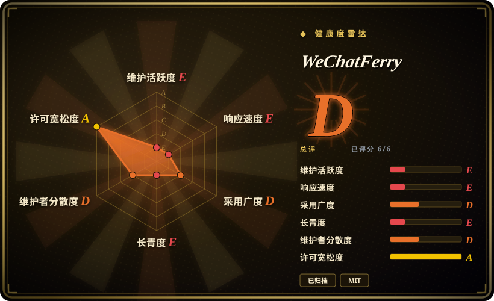
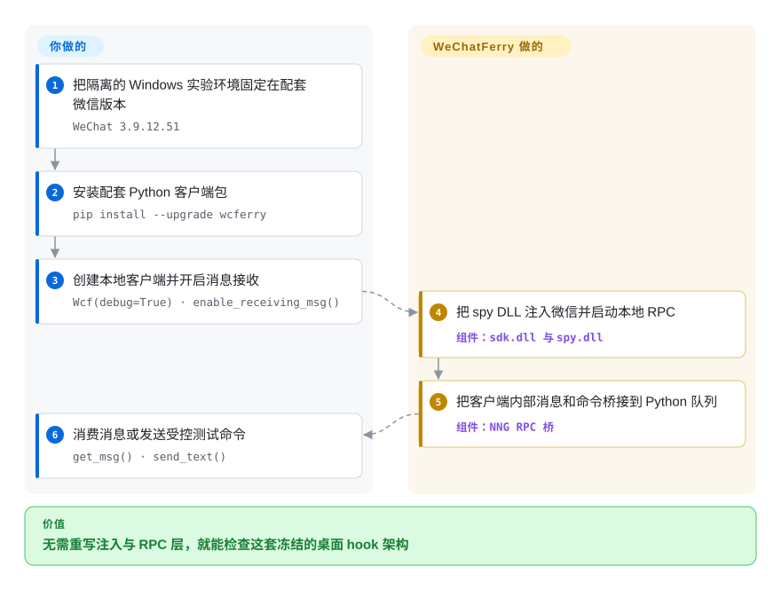

# WeChatFerry

一个已经归档的 Windows 微信客户端 hook 与本地 RPC 库。原仓库只应当作研究和兼容性快照，不应作为新部署的在维护依赖。

> **已经归档：** 截至 2026-09-22，GitHub 报告该仓库已变为只读。维护者曾在 2025-05-25 的 `final commit` 中把整个代码树替换为“因为不抗因素，停止维护。”；这次破坏性提交在 2026-03-21 被回滚，此后又发布了 `v39.5.2`，但仓库后来仍被归档，且没有点名后继项目。GitHub 仓库 API 不提供确切归档日期。

## 何时使用

你正在审计一个既有 Windows 自动化系统，它已经固定使用 64 位微信 `3.9.12.51` 客户端和 WeChatFerry `v39.5.2`；或者你正在研究一个原生 DLL 注入器如何把应用内部消息 API 暴露为小型 RPC 接口。这个冻结代码树适合追踪该设计、在隔离账号上复现遗留环境，或者规划迁出路径。

只有当研究对象是 Windows 桌面客户端注入，而不是已经失效的网页版微信协议时，才应在 [wxpy](wxpy.zh.md) 或 [ItChat](itchat.zh.md) 之外选择这个快照。不要仅因为旧 Python API 方便就采用它：归档状态、客户端精确版本绑定和账号处置风险才是决定性因素。

## 怎么用起来

Python 包会加载 `sdk.dll`，由它打开 Windows 微信进程，并通过远程线程加载项目的 spy DLL。注入组件读取并调用与版本绑定的客户端内部能力，再通过本地 NNG RPC 提供命令和入站消息；你的 Python 进程创建 `Wcf`、开启消息接收并消费队列。你负责编写机器人逻辑，WeChatFerry 负责注入和 RPC 桥接。最终发布版把这条路径绑定到微信 `3.9.12.51`，换一个客户端构建就可能让偏移失效。

<!-- flow-steps:begin (generated from flows/wechatferry.json by tools/flow_card.py — do not edit) -->

流程文字版

1. **你**：把隔离的 Windows 实验环境固定在配套微信版本 — `WeChat 3.9.12.51`
2. **你**：安装配套 Python 客户端包 — `pip install --upgrade wcferry`
3. **你**：创建本地客户端并开启消息接收 — `Wcf(debug=True) · enable_receiving_msg()`
4. **WeChatFerry**：把 spy DLL 注入微信并启动本地 RPC — 组件：`sdk.dll 与 spy.dll`
5. **WeChatFerry**：把客户端内部消息和命令桥接到 Python 队列 — 组件：`NNG RPC 桥`
6. **你**：消费消息或发送受控测试命令 — `get_msg() · send_text()`

**价值**：无需重写注入与 RPC 层，就能检查这套冻结的桌面 hook 架构

<!-- flow-steps:end -->

## 何时不用

- **你正在新建生产集成。** 改用企业微信 API 或微信公众号／小程序服务端 API；原 WeChatFerry 仓库已经归档，无法持续提供客户端偏移、依赖或安全更新。
- **你运行当前微信 4.x，或者无法冻结桌面客户端。** 改用官方通道，或单独评估同一维护者较新的 `wcfLink` 仓库；`v39.5.2` 明确绑定微信 `3.9.12.51`，而 4.x 支持请求始终没有得到受支持版本。
- **你不能承受账号警告、限制或封禁风险。** 改用企业微信、公众号或其他平台的官方 bot API。微信服务协议禁止反向工程、挂接运行时数据、未授权插件／工具和第三方自动化；issue #126 有多条用户自报的警告和临时封禁案例，维护者回答“只读监听是否安全”时，把它比作撬开保险柜后声称“只是看看”。
- **你需要在维护的机器人应用，而不是协议文物。** 需要维护中的多 IM 应用时选 [WeChat Bot](wechat-bot.zh.md)，但账号安全重要时应使用它的飞书、Telegram 或 WhatsApp 官方通道；它的个人微信 adapter 也不是官方安全替代品。
- **你需要跨平台部署。** 改用官方 HTTP API 或其他平台的官方 SDK；WeChatFerry 核心依赖 Windows 进程访问、DLL 注入、匹配的 x64 二进制和特定微信可执行文件布局。
- **你需要证据证明冻结快照在今天仍能工作。** 不要部署本页所述归档目标。维护者在 2026-05 说过“能用的能用……”，发布产物也仍可下载，但本次核验没有使用真实 Windows／微信账号复现。

## 横向对比

| 替代品 | 是否收录 | 我们的评价 | 取舍 |
|---|---|---|---|
| [WeChat Bot](wechat-bot.zh.md) | 已收录 | 如果维护中的多通道助手比直接 Windows 客户端 RPC 更重要，选 WeChat Bot；如果必须得到官方支持，则两者的个人微信路径都不要选。 | WeChat Bot 增加现成模型和 IM adapter，但微信路径仍是非官方的；WeChatFerry 能暴露更深的本地客户端能力，却已归档并绑定版本。 |
| `lich0821/wcfLink` | 未收录 | 如果明确需要同一维护者较新的 Go／iLink 路线，可以评估 wcfLink；除非维护者记录了项目脉络，否则不要称它为 WeChatFerry 后继。 | 它是可收录的真实仓库，提供本地 HTTP 和 Go library 接口，也不做 DLL 注入；但 WeChatFerry 从未点名它为后继，它没有声明许可证，平台风险也需要单独审查。 |
| 企业微信／微信公众号 API | 非仓库 | 生产、合规敏感或重要账号自动化应选腾讯官方 API；这个归档快照只用于研究遗留个人号集成。 | 官方 API 提供受支持契约，也不需要桌面注入，但暴露的是企业、公众号或小程序表面，而不是任意个人号控制。 |
| [wxpy](wxpy.zh.md) | 已收录 | 只把 wxpy 用作旧 Python 对象 API 参考；只把 WeChatFerry 用作 Windows 客户端注入与本地 RPC 参考。 | 两者都是归档参考材料：wxpy 更简单，却建立在基本失效的网页协议上；WeChatFerry 触及较新的客户端表面，代价是原生注入和精确版本偏移。 |

## 技术栈

- **核心：** C++ 与 Visual Studio 2019 工程，产出 x64 SDK DLL 和注入式 spy DLL。
- **注入：** Windows `OpenProcess`、`VirtualAllocEx`、`WriteProcessMemory` 和 `CreateRemoteThread` 把 DLL 加载进微信进程。
- **RPC：** Protocol Buffers／nanopb 消息跑在 NNG 上；命令默认使用端口 `10086`，入站消息使用下一个端口。
- **客户端表面：** 仓库包含或链接 Python、Go、Java、HTTP、Node.js、C# 和 Rust 客户端；文档快速开始走 Python `wcferry` 包。

## 依赖

- 64 位 Windows 主机和最终受支持的微信桌面客户端 `3.9.12.51`；客户端自动升级会破坏版本固定关系。
- 打包的 Python 路线需要 Python、`wcferry`、`pynng`、`protobuf`、`requests` 和配套原生 DLL。README 建议源码构建使用 Python 3.10。
- 重建原生组件需要 Visual Studio 2019、CMake／vcpkg、protobuf 工具和 Windows 进程注入权限。
- 一个个人微信账号，以及手机侧登录确认。这也是风险最高的依赖，因为处置权属于腾讯，不属于这个库。

## 运维难度

**除一次性兼容实验室外，难度高。** 顺利路径很短，但实际运维需要冻结特定 Windows 客户端、控制升级、保持 DLL 与 Python 包版本匹配、监控注入进程与两个本地 RPC 端口，并处理登录或会话失败。一次微信升级就可能让原生偏移变成崩溃或注入失败。仓库归档后，不再有上游负责追平这些变化，而账号处置仍完全超出运营方控制。

## 健康度与可持续性

- **维护，截至 2026-09-22：已归档，不再接收更新。** 默认分支头提交日期为 2026-03-21；最新发布是 2026-03-28 面向微信 `3.9.12.51` 的 `v39.5.2`。仓库归档时，维护者自己提交的 `3.9.12.56` PR 仍然开启。
- **生命周期信号：** 2025 年的 `final commit` 明确写过停止维护，并删除整个代码树。尽管维护者后来回滚并恢复发布，今天的归档标记仍是决定性状态：不要指望下一次偏移更新。
- **快照可用性：** 维护者在 2026-05 表示工具仍可用，固定安装包和 release 也仍可下载。这只能支持遗留复现，不能证明兼容当前微信 4.x 或未来服务行为。
- **采用与治理：** 约 6.8k star 和 1.6k fork 表明它得到过大量关注，但路线图和归档决定始终掌握在一名个人 owner 手里。对于版本绑定的注入代码，热度无法替代活跃维护者。
- **年龄与 Lindy：** 约四年的历史加近期发布活动，通常会形成正向先验；显式归档和平台耦合抵消了它对未来选型的意义。[推断]
- **风险：** MIT 只覆盖仓库代码，不代表获得微信自动化许可。腾讯协议明确禁止本项目所用的反向工程、运行时挂接、未授权工具和自动化机制，也允许对违规行为采取警告、限制、封禁或回收账号等措施。

## 存疑（未验证）

- [未验证] GitHub 在 2026-09-22 确认 `archived: true`，但不暴露 `archived_at`；无法核实确切归档日。2026-07-10 的一组 owner 操作不足以把当天认定为归档日期。
- [未验证] 本次没有使用 Windows／微信账号复现。“仍可工作”仅限维护者 2026-05 的评论，以及 `v39.5.2` 声明与 `3.9.12.51` 配套，并非独立兼容性结果。
- [未验证] issue #126、#386、#422 和 #426 中的账号警告与封禁案例都是用户自报，不是可量化发生率。违反 ToS 可以直接核验，但具体账号的概率和严重程度无法确认。
- [未验证] `wcfLink` 是同一 owner 较新的仓库，按仓库形态可以收录，但 WeChatFerry 和 wcfLink 都没有把它称作 WeChatFerry 后继；本次没有测试迁移兼容性。
- [推断] 归档标记加上没有点名交接，使“仅用于研究、参考和受控遗留复现”成为审慎的选型结论，即使固定快照仍有可能运行。
