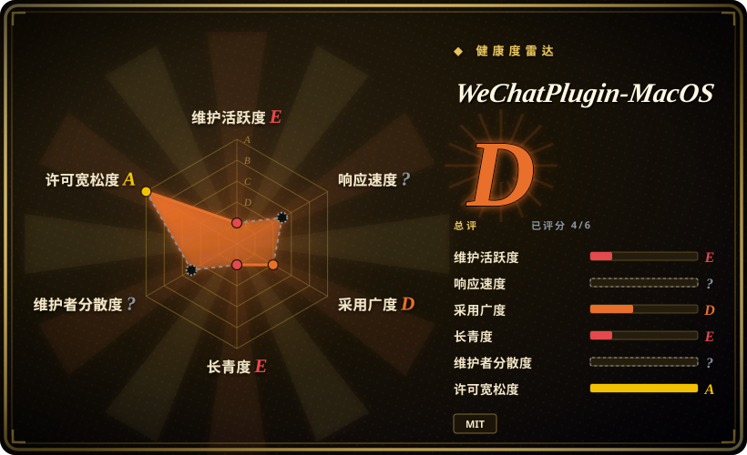
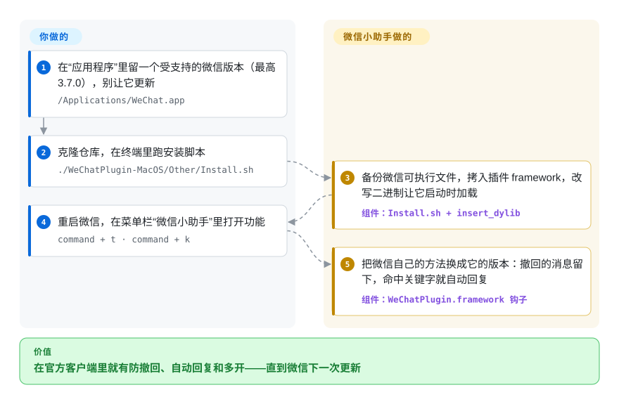

# WeChatPlugin-MacOS

一个 macOS 微信**客户端魔改插件**（微信小助手）——消息防撤回、自动回复、远程控制、微信多开，以及一堆界面便利功能——做法是**把插件注入到 macOS 上的 WeChat.app 里**。**话说白了：它靠对*特定*微信版本的客户端二进制打补丁来工作，所以微信一更新它就坏；仓库已约 3 年半没有提交（最后一次提交在 2023-03，加的是微信 3.7.0 适配）、针对的是老版本微信，因此在当前微信上几乎可以肯定已经跑不起来了。**

## 何时使用

你是个 macOS 微信的资深重度用户，并且刻意**把微信钉死在一个老版本**上——README 针对的就是远古版本（徽章写的是微信 2.3.22，更新日志提到支持到 3.7.0）——你想把那些经典的体验增强找回来：发送方撤回也不消失的消息（防撤回）、按关键词自动回复的机器人、两个微信账号并排多开、窗口置顶，以及 Alfred 快捷发送工作流。你能接受关掉微信的自动更新、把注入式插件装进 `WeChat.app`，也接受一旦让微信更新，整套东西就停摆。在这种狭窄的、冻结版本的设置里，WeChatPlugin-MacOS 是 macOS 微信魔改的范本实现。

现实地说，这基本上是 2026 年还去碰它的**唯一**场景：一个你永不更新的、钉死的老版本 macOS 微信，跑在一个无所谓或低风险的账号上，你看重这些魔改胜过稳定性和账号安全。只要上述任一条件不成立，就请看下文——这是博物馆藏品，不是能拿来搭东西的地基。

## 怎么用起来

这个插件住在微信**里面**，而不是旁边。它的安装脚本先备份微信的可执行文件，把 `WeChatPlugin.framework` 拷进 app 包，再用 `insert_dylib` 往可执行文件的加载清单里添一行——于是微信每次启动，都会顺带把插件也加载进来。加载之后，插件对微信的方法做 swizzle（方法替换）：把微信自己的某个例程（比如处理撤回通知、处理一批新消息的那个）换成它的版本，于是能把消息留下、自动回一句、或者跳过多开检查。**挂钩的活全是插件干的；你只负责选一个兼容的微信、跑脚本、在新出现的“微信小助手”菜单里拨开关。** 麻烦出在它钩的对象：`FFProcessReqsvrZZ` 这类微信内部的类名和方法名，并不是公开接口，下个版本随时可以改——就像照着一把锁配的钥匙，锁一换就插不进去了。

<!-- flow-steps:begin (generated from flows/wechatplugin-macos.json by tools/flow_card.py — do not edit) -->

流程文字版

1. **你**：在“应用程序”里留一个受支持的微信版本（最高 3.7.0），别让它更新 — `/Applications/WeChat.app`
2. **你**：克隆仓库，在终端里跑安装脚本 — `./WeChatPlugin-MacOS/Other/Install.sh`
3. **WeChatPlugin-MacOS**：备份微信可执行文件，拷入插件 framework，改写二进制让它启动时加载 — 组件：`Install.sh + insert_dylib`
4. **你**：重启微信，在菜单栏“微信小助手”里打开功能 — `command + t · command + k`
5. **WeChatPlugin-MacOS**：把微信自己的方法换成它的版本：撤回的消息留下，命中关键字就自动回复 — 组件：`WeChatPlugin.framework 钩子`

**价值**：在官方客户端里就有防撤回、自动回复和多开——直到微信下一次更新

<!-- flow-steps:end -->

## 何时不用

- **你用的是当前 / 自动更新的微信。** 这是最主要的排除项。插件**针对特定微信版本对 WeChat.app 二进制打补丁**，所以**微信每更新一次它就坏一次**——而仓库已约 3 年半没有提交、针对的是 2.3.x–3.7.x 这般老的版本，因此在今天发行的微信上**几乎可以肯定已经不可用**。承重判断：这不是“也许需要调一下”，而是“地基没了”。[推断]
- **你在乎这个账号。** 驱动一个被增强 / 注入过的微信客户端，是**违反微信服务条款**的，并带有真实的**限流 / 冻结 / 永久封禁**风险。别拿一个你输不起的账号去试。
- **安全敏感场景。** 你是在**往一个握有你私密对话和通讯录的消息客户端里注入第三方代码**——一个巨大的信任与攻击面（插件能读 / 改微信看到的一切）。一个无人维护的注入器只会放大这种风险。
- **你不在 macOS 上。** 它**仅限 macOS**，打的是桌面版 WeChat.app 的补丁；对 Windows、移动端或服务端自动化，这里什么都没有。
- **你需要可编程 / 受支持的 IM 自动化。** 这是桌面 UI 魔改，不是 API。要做合规自动化，请用**企业微信（WeCom）API** 或**微信公众号 / 小程序**服务端 API；要做个人号风格的机器人，[ItChat](itchat.zh.md) 及其后继者也存在（但它们同样已死 / 脆弱，并带有相同的 ToS 风险）。
- **生产环境或任何必须保持运行的东西。** 一个针对自动更新客户端的无人维护二进制补丁，撑不起一个稳定依赖。

## 横向对比

| 替代品 | 是否收录 | 我们的评价 | 取舍 |
|---|---|---|---|
| WeChatTweak-macOS（Sunnyyoung 分叉 / 后继） | 未收录 | 坚持 macOS 微信魔改且想要较新的后继项目时，选 WeChatTweak-macOS。 | macOS 微信魔改的社区后继——同一类防撤回 / 多开功能，但维护更近、带 CLI 安装器；它仍是针对特定微信版本的二进制补丁，因此继承了同样的版本脆弱性和 ToS / 封号风险。如果你执意走这条路，它是更明智的选择。 |
| [ItChat](itchat.zh.md) | ✅ | 需要网页微信协议的可编程库、而非桌面魔改时，选 ItChat。 | 通过（已失效的）网页协议自动化微信**个人号**的 Python 库——是可编程 API，而非桌面客户端魔改。它也已基本死亡且被平台封堵；面不同（网页协议 vs 二进制注入），但“已废弃 + ToS 风险”的结论相同。 |
| 官方微信（不装插件） | 未收录 | 账号安全和干净更新比魔改功能更重要时，选官方微信。 | 受支持的路径：没有防撤回、没有自动回复、没有多开，但它能干净地更新、不是封号风险，也不往你的消息工具里注入外来代码。对任何在乎账号的人来说，这才是诚实的默认选择。 |
| 企业微信 / 公众号 / 小程序 API | 未收录 | 合规的企业或公众平台自动化面能满足需求时，选腾讯官方 API。 | 腾讯**官方、受认可**的自动化面；稳定且有支持，但它们自动化的是企业 / 公众号场景，而非你的个人桌面微信——是合规但不同的产品，并非平替。 |

## 技术栈

- **语言：** Objective-C——一个 macOS WeChat.app 插件，也就是运行在微信进程**内部**的代码。
- **机制：** 对 `WeChat.app` 做二进制 / 运行时**打补丁与注入**（经典的 macOS “tweak” 套路）：`insert_dylib` 往微信可执行文件里加一条加载 `WeChatPlugin.framework` 的指令，framework 再 swizzle 微信自己的 Objective-C 方法（C 符号则用 `fishhook`），来加入防撤回、自动回复等。
- **能力面：** 防撤回、按关键词自动回复、远程控制（含通过 AppleScript 辅助脚本做语音 / 系统控制）、微信多开、窗口置顶、会话相关调整，以及 Alfred 工作流集成。
- **耦合：** 与特定微信客户端版本紧耦合——README 明确标注“支持微信 2.3.22 / 3.7.0”，这正是脆弱性的根源。

## 依赖

- **一个特定的、钉死的 macOS WeChat.app**——真正的依赖。插件必须匹配它所针对的微信版本；你通常得**关掉微信的自动更新**来保住一个兼容的版本，而且一般需要非 App Store 版的微信。
- **macOS**（桌面）——没有其他平台适用。
- **辅助功能 / 自动化权限**用于远程控制功能（README 指示在“系统偏好设置 → 安全性与隐私 → 辅助功能”里添加微信和脚本编辑器）。
- **可选：Alfred**，用于快捷发送工作流（一个独立的 `wechat-alfred-workflow` 仓库）。
- **构建：** 若不用预编译安装，从源码编译需要 Xcode / Objective-C 工具链。

## 运维难度

**装起来看似很低，但真正的难点是让它根本能持续工作——而这你基本做不到。** 把插件装进 WeChat.app 是有引导的过程（仓库附了 `Install.md`），顺路径就几步。难的、赢不了的部分是**版本管理**：你必须把微信冻结在一个兼容版本、拒绝每一次更新（微信会反复提示并能自我更新）、在任何被迫升级后重新打补丁——而由于项目在 3.7.0（2023-03）之后就停止跟进新微信版本，根本不存在一个可供打补丁的、面向当前微信的维护版本。没有服务或数据存储要跑；全部运维负担就是用一个无人维护的补丁去对抗一个自动更新的客户端，这是个必败的局面。

## 健康度与可持续性

- **响应速度**：无法计算——no_traffic。
- **维护（2026-10）：吃老本 → 实质已死。** 默认分支最后一次提交是 **2023-03-21**（适配微信 3.7.0 的 v2.0 tag）→ 大约**3 年半没有提交**（GitHub 显示的 2024-06 `pushed_at` 没有给 `master` 带来新提交）；约 152 个 open issue，单一维护者（owner 类型为 **User**，`TKkk-iOSer`），未归档但也没动静。这是一个滑向废弃、而非活跃的项目。[推断]
- **天生版本脆弱——决定性信号。** 它**给一个自动更新的客户端二进制打补丁**，且绑死特定微信版本。哪怕是维护良好的同类项目，宿主应用一更新就会立刻失效；一个针对 2.3.x–3.7.x 这般老版本的*无人*维护项目，在当前微信上**按其构造就是不可用的**。[推断]
- **Lindy 判断：实践中不通过。** 创建于 **2017-04**（约 9 年），单看年龄像是 Lindy——但 Lindy 是**年龄 × 仍然活跃**，绝不是单看年龄。这里是**长寿但停更，且在结构上注定失败**（一个追逐移动目标、而维护者已停止追逐的补丁）。它的长寿被*抵消*而非*兑现*——正是 Lindy 失效的教科书案例。[推断]
- **治理 / bus factor。** 单一维护者的个人仓库，没有基金会 / 厂商 / 后继接管——bus factor 为一，而工作已经停了。约 14k 的高 star 数反映的是过去的流行，而非当前的健康。[推断]
- **风险标记。** 违反微信 ToS（封号风险）；往私密消息客户端注入第三方代码的安全风险；仅限 macOS；MIT 许可是整幅图景里唯一没有负担的部分。[推断]

## 存疑（未验证）

- [未验证] “约 14.3k star / 2455 fork / 约 152 个 open issue / 388 watcher” 取自 2026-06 的 GitHub API；star/issue/fork 数对时间敏感且不可靠，仅供参考。
- [推断] “最后一次提交 2023-03-21” 取自 `master` 分支的 commits API（2026-10-08 查）；仓库**并未**标记 `archived`，README 中也无显式弃用声明——“实质已死 / 在当前微信上不可用” 是从约 3 年半无提交加上版本脆弱机制*推断*而来，并非引自官方声明。
- [推断] 注入本身已于 2026-10-08 读源码核实（`Other/Install.sh` 备份可执行文件并调用 `insert_dylib`；`WeChat+hook.m` 替换 `FFProcessReqsvrZZ` 等微信类上的方法）。至于这些类名、方法名会随微信版本变化——也就是一更新就坏的原因——是从逐版本适配列表推断的，没有跨微信版本比对。
- [未验证] 它在今天*任何*仍可安装的微信版本上是否还能工作，未做实测；“在当前微信上几乎可以肯定不可用” 的说法是从沉寂时长与所针对版本做出的推断。
- [未验证] WeChatTweak-macOS 对比行（它当前的维护状态与功能对等程度）描述的是大致格局，未对照该仓库当前状态做新一轮核实。
- [推断] 封号 / 违反 ToS 与安全（代码注入）风险是从工具的非官方注入性质做出的推断，而非实测发生率；严重程度因账号和用法而异。
- [未验证] 安装脚本路径、`insert_dylib` / `fishhook` / `GCDWebServer` 三项依赖和辅助功能权限说明已对照 README 与 `Install.sh` 核实；“需非 App Store 版微信”（README 只把“禁止微信检测更新”开关和它挂钩）以及 Xcode 构建路径没有对照 `Install.md` 重新核对。
