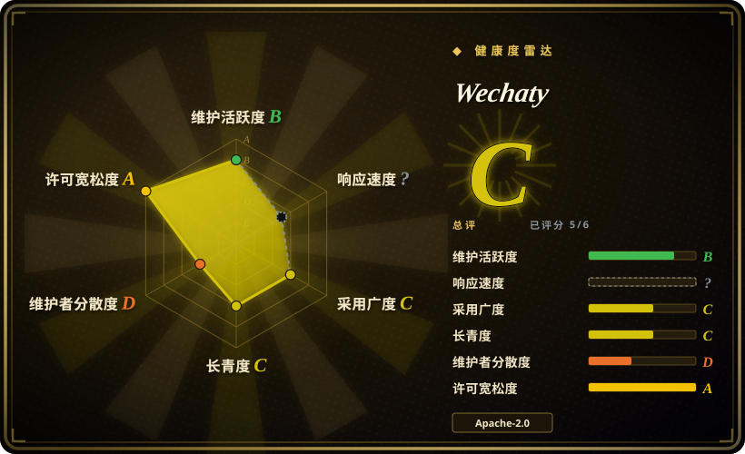
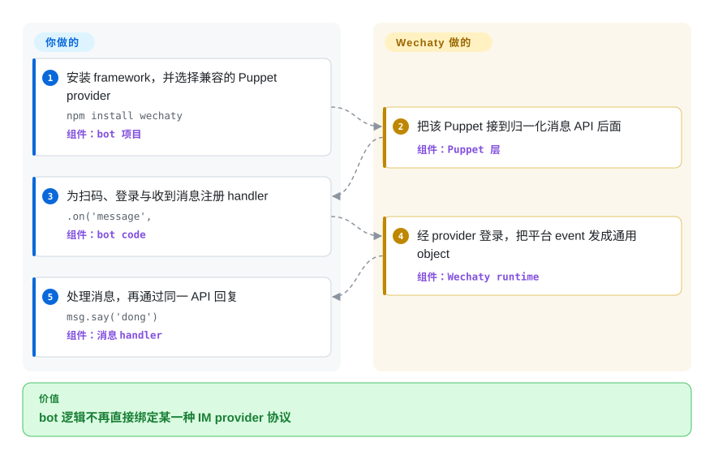

# Wechaty

一个 TypeScript conversational-RPA framework，用统一事件 API 和可替换的 Puppet provider 层承接微信、WhatsApp、企业微信等 IM backend；抽象已经成熟，但 provider 可用性和个人账号处置风险必须分别核查。

## 何时使用

你在开发 code-first bot，希望消息、联系人、群聊、登录与回复逻辑能够跨 IM 协议或 provider 复用。你愿意自行开发应用，并选择、托管或购买连接具体平台的 Puppet，而不是采用一个已经固定工作流的助手产品。

当可复用 framework 与 provider 边界比现成 LLM adapter、分析命令和通道 CLI 更重要时，应在 [WeChat Bot](wechat-bot.zh.md) 之上选择 Wechaty。所选 Puppet 使用平台授权入口时，这个选择最稳妥；若连接个人微信号，provider 选择首先是平台规则与账号安全决策，而不只是配置项。

## 怎么用起来

你的 bot 导入 Wechaty，为扫码、登录和消息等事件注册 handler，再通过 framework 的 `Message`、`Contact` 与 `Room` object 回复。Puppet 负责平台特有 transport，可以进程内运行，也可以通过 gRPC Puppet Service 连接；选择与运营 provider 是你的责任。Wechaty 把 provider event 归一为同一套 API，但不会让非官方 provider 自动获得授权或稳定性。

<!-- flow-steps:begin (generated from flows/wechaty.json by tools/flow_card.py — do not edit) -->

流程文字版

1. **你**：安装 framework，并选择兼容的 Puppet provider — `npm install wechaty` — 组件：`bot 项目`
2. **Wechaty**：把该 Puppet 接到归一化消息 API 后面 — 组件：`Puppet 层`
3. **你**：为扫码、登录与收到消息注册 handler — `.on('message',` — 组件：`bot code`
4. **Wechaty**：经 provider 登录，把平台 event 发成通用 object — 组件：`Wechaty runtime`
5. **你**：处理消息，再通过同一 API 回复 — `msg.say('dong')` — 组件：`消息 handler`

**价值**：bot 逻辑不再直接绑定某一种 IM provider 协议

<!-- flow-steps:end -->

## 何时不用

- **你需要腾讯官方支持的生产通道，或不能承受个人号风险。** 改用企业微信、微信公众号或小程序 API；腾讯微信协议禁止通过未经授权的第三方软件执行自动化操作，并允许对违约账号警告、限制、封禁或注销。
- **你期望 framework 自带当前可靠的个人微信 transport。** 改用腾讯官方入口；若评估 [OpeniLink Hub](../openilink-hub.zh.md)，也必须接受它明确披露的非官方关系与协议风险。Wechaty 的 Web Puppet 文档称 UOS workaround 自 2022 年已无法登录，2025 至 2026 年 issue 还记录了扫码登录受限与封号报告。
- **你要的是开箱即用的多通道 AI 助手，而不是 SDK。** 当 [WeChat Bot](wechat-bot.zh.md) 的模型 adapter、allowlist、本地留存与分析命令正好匹配任务时选它；Wechaty 提供 primitive 与 event，prompt、存储、路由和运维仍由应用承担。
- **你只需要一个官方 WhatsApp 集成。** 改用 Meta 官方 WhatsApp Cloud API 与 SDK；Wechaty 文档中的 WhatsApp Puppet 仍是 alpha，只实现有限功能，仓库最后 push 为 2024-01。
- **你要求 provider 提供已发布的 SLA、隐私政策与当前兼容性证明。** 改与官方平台 provider 签约；Wechaty 的部分 service 文档仍把这些字段写成待补充，多个 provider 仓库自 2022 至 2024 年后就没有活动。
- **你要求 framework 有当前稳定发布列车。** 评估持续发布的官方 SDK 或其他 bot framework；npm stable 停在 2022 年的 `1.20.2`，GitHub 最新 release 是 2021 年的 `v0.56`，main branch manifest 仍是 `2.0.0-alpha.1`。

## 横向对比

| 替代品 | 是否收录 | 我们的评价 | 取舍 |
|---|---|---|---|
| [WeChat Bot](wechat-bot.zh.md) | 已收录 | 需要可复用 event API 与可替换 provider 边界时选 Wechaty；现成 CLI、LLM adapter 与聊天分析流程就是目标产品时选 WeChat Bot。 | Wechaty 观点更少，更容易嵌入；WeChat Bot 更快落成助手，却扩大依赖与隐私面。 |
| [OpeniLink Hub](../openilink-hub.zh.md) | 已收录 | 多个 iLink bot 需要持久化 web 控制面、用户、trace 与 App 时选 OpeniLink Hub；bot 行为属于代码，而且 transport 可替换性更重要时选 Wechaty。 | Hub 提供运维与持久化，却集中更多敏感状态；Wechaty 把应用边界留给你，也要求你自行组装和运营。 |
| `python-wechaty` | 未收录 | Python 是硬约束，并且能接受 Puppet Service 边界时选 `python-wechaty`；需要 canonical Node API 与更深的历史实现基础时选本 TypeScript 仓库。 | Python SDK 适合 Python service，但仍依赖兼容 Puppet；TypeScript core 历史最深，当前发布节奏却很慢。 |
| 企业微信／微信官方 API | 非仓库 | 生产合规、文档化 credential 与账号支持决定选择时，用腾讯官方 API；只有跨平台抽象值得逐个独立核验 provider 时才选 Wechaty。 | 官方 API 面向企业、公众号与小程序流程，不提供任意个人号自动化；Wechaty 跨 IM 更统一，却不能赋予平台授权。 |

## 技术栈

- **Core：** TypeScript、Node.js 16+、ES modules 与 CommonJS output，以及 event-driven `WechatyBuilder` API。
- **抽象层：** `wechaty-puppet` 定义归一化 IM 边界；`wechaty-puppet-service` 通过 gRPC 连接远程、closed-source 或 polyglot provider。
- **状态与 payload：** `memory-card` 保存 bot state，`file-box` 表示 media，user module 提供 message、contact、room、friendship、tag 与 post 等 object。
- **分发：** npm package、Docker image、生成的 TypeDoc API 文档，以及独立的 Python、Go、Java、.NET、PHP、Rust 与 Scala 生态仓库。

## 依赖

- **必需：** 本 TypeScript 实现要求 Node.js 16+ 与 npm 7+；event handler 与业务逻辑由你的 bot code 提供。
- **Provider：** 一个兼容 Puppet package，或 Puppet Service token 与 endpoint。不同 provider 还可能要求 Chromium、Windows、Wine、Android emulator、远端 service 或商业 credential。
- **平台账号：** 所选 IM 的 credential 或扫码登录。个人微信 provider 不等同于官方企业微信、公众号或小程序 API。
- **应用自理：** `memory-card` 之外的持久化、secret、同意与保留控制、retry、monitoring、deployment，以及任何 AI/model backend。

## 运维难度

**使用 Mock 或官方、self-contained provider 时为中等；做个人号自动化时为高。** 六行 bot loop 很小，但生产可靠性取决于所选 Puppet 与上游平台。运营方必须 pin 兼容的 framework-provider 组合，保护 session state 与 token，监控登录和消息投递，在 client 或协议变化后重测，并准备 provider-specific fallback。远端 Puppet Service 还会增加第三方、网络边界，以及可能未发布的隐私与 SLA 条款。

## 健康度与可持续性

- **维护，截至 2026-09：** 仓库未归档，最后 push 是 2025-12-21，但 head 只改了 README link。最近代码改动是 2025-06 的小型错误消息修正，上一次实质 runtime 更新在 2025-04；npm stable 仍是 2022 年的 `1.20.2`。
- **发布纪律：** GitHub release 停在 2021 年的 `v0.56`，npm stable 停在 2022 年，main 则声明 `2.0.0-alpha.1`。三个入口无法给出一致的可消费版本故事，用户应 pin 并集成测试确切版本，不要从 branch 推断 readiness。
- **Provider 健康度：** framework 文档列出 Web、service、Mock、WhatsApp 与多个商业 Puppet，但状态表也把多个 provider 标为 deprecated。本次核查的 repository 从 2025 年仍 push 的 Python/Go SDK，到 2022 至 2024 年后未动的 core Web、service、PadLocal 与 WhatsApp provider；支持状况不均衡，不存在整个项目级的统一保证。
- **治理与采用：** organization-owned repository 约有 23.3k star 与很长的 contributor list，但历史贡献数由 creator 高度主导。当前 default branch 工程活动稀疏，因此热度与十年年龄都不能替代对当前 maintainer 和 provider 的核查。
- **年龄与 Lindy：** 项目始于 2016 年，Puppet 抽象已经跨多个语言 SDK 延续。[推断] 应把它视为安静但仍可用、生态正在漂移的 framework infrastructure，而不是已废弃仓库，也不是持续演进的 turnkey 微信方案。
- **风险姿态：** GitHub、`LICENSE` 与 `package.json` 都一致使用 Apache-2.0。决定性阻碍在外部：腾讯当前协议明确限制未经授权的第三方自动化，而一个 2025 年仍 open 的 issue 到 2026 年仍有多名用户报告扫码登录受限或封号。

## 存疑（未验证）

- [未验证] 本页没有对任何 Puppet 执行当前端到端登录或消息投递测试；文档、repository 新旧与 issue 报告不能证明某个 provider 今天可用。
- [未验证] 封号报告来自用户自述，并与具体 provider 有关。它们能证明真实事件存在，不能给出封号率、安全账号画像或当前安全的 provider。
- [未验证] 商业 Puppet Service 的可用性、所有权、数据处理、定价与支持承诺没有通过独立签约或测试核查；部分官方文档仍把 ToS、隐私政策和 SLA 写成待补充。
- [推断] “安静但仍可用，生态正在漂移”是基于 core commit 稀疏、stable release 陈旧与 provider 活跃度不均的选型判断；未来 maintainer 或 provider 工作可能改变它。
