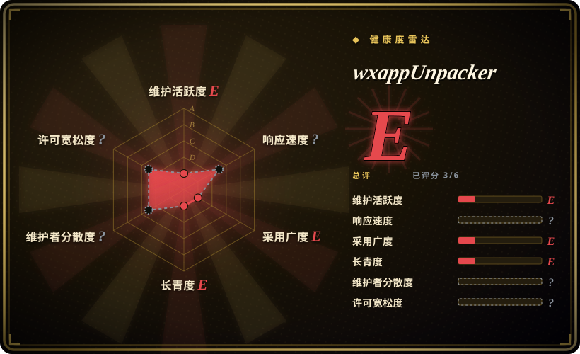
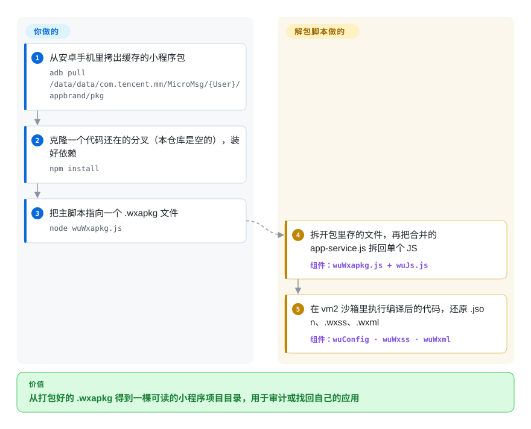

# wxappUnpacker

一个微信小程序 `.wxapkg` 反编译/解包工具——只不过*这个具体的 fork* 已被清空：`xdmjun/wxappUnpacker` 仓库如今只剩一个 `README.md`，内容就是字符串 `del`。它是一座墓碑，真正能用的代码只活在各个 fork 里。

## 何时使用

你是移动安全研究者（或者丢了*自己*那个微信小程序源码的开发者），手里拿着从设备上扒下来的 `.wxapkg` 包，需要把这个打包后的二进制还原成可读的 `.wxml` / `.wxss` / `.json` / `.js`，好审计它做了什么或找回素材。wxappUnpacker 这套 Node.js 脚本（`wuWxapkg.js`、`wuWxss.js`、`wuWxml.js`、`wuJs.js`）正是干这个的社区主力反编译器——对着包跑一下启动脚本，它就把工程目录还原出来。

但要清楚你真正该拿的*不是这个仓库*。`xdmjun/wxappUnpacker` 是个空壳。想要能跑的代码，你得去找一个还有人维护的 fork（这条血缘可追溯到 `qwerty472123/wxappUnpacker`，而它的主人也在 2020-04 用一次 `rm` 提交把它清空，随后 archived）。把本页当作链条上一个死节点的警示牌，而不是安装目标。

## 怎么用起来

`.wxapkg` 是微信为了运行一个小程序而下载的文件：一个装着全部页面的压缩包，只不过页面模板和样式都已经被编译成了 JavaScript。解包脚本把这两层都拆回去——**你只管拿到包、跑一个脚本，剩下的它来做。** 第一步，把压缩包拆回它存的各个文件，再把合并成一大坨的 `app-service.js` 拆回原来一个个的脚本文件。第二步，为了还原 `.wxml`（页面模板）、`.wxss`（样式）和 `.json`（页面配置），它会在 `vm2` 沙箱（一个隔离出来的 JavaScript 运行环境）里真的执行那些编译后的代码，记下这些代码原本会生成什么。这最后一步也正是隐患所在：执行一个不受信任的包里的代码，靠的是一个已经被弃用的沙箱库。这些在 `xdmjun/wxappUnpacker` 里一样都不存在；下面的卡片按 `PyCoreDev` 分叉的 README 来画，那里代码还在。

<!-- flow-steps:begin (generated from flows/wxappunpacker.json by tools/flow_card.py — do not edit) -->

流程文字版

1. **你**：从安卓手机里拷出缓存的小程序包 — `adb pull /data/data/com.tencent.mm/MicroMsg/{User}/appbrand/pkg`
2. **你**：克隆一个代码还在的分叉（本仓库是空的），装好依赖 — `npm install`
3. **你**：把主脚本指向一个 .wxapkg 文件 — `node wuWxapkg.js`
4. **wxappUnpacker**：拆开包里存的文件，再把合并的 app-service.js 拆回单个 JS — 组件：`wuWxapkg.js + wuJs.js`
5. **wxappUnpacker**：在 vm2 沙箱里执行编译后的代码，还原 .json、.wxss、.wxml — 组件：`wuConfig · wuWxss · wuWxml`

**价值**：从打包好的 .wxapkg 得到一棵可读的小程序项目目录，用于审计或找回自己的应用

<!-- flow-steps:end -->

## 何时不用

- **这个仓库没有代码——没有任何东西可装可跑。** 唯一的 HEAD 提交（"del"，2023-04-08）把所有内容替换成了字符串 `del`。`language` 为空，无 LICENSE 文件，无 release，无 tag——git 树里只有 `README.md`，别无他物（2026-10-08 查）。专门选 `xdmjun/wxappUnpacker` 就是死路一条。
- **整条血缘都已废弃。** 上游 `qwerty472123/wxappUnpacker` 在 2020-04-18 被一次 `rm` 提交清空并 archived（只读），这个 fork 在 2023 年自删。bus factor 实质为零——`.wxapkg` 格式一变，没人会来修。
- **依赖已弃用的 `vm2`。** 保留下来的 fork 代码依赖 `vm2@^3.6.0`，其作者在多个严重沙箱逃逸 CVE 之后已弃用它。拿它处理不受信任的包输入，是实打实的供应链/RCE 风险。[推断]
- **法律 / ToS 风险。** 反编译第三方 `.wxapkg` 等于逆向别人的小程序；这通常违反微信平台条款，也可能侵犯目标 app 的著作权。仅对你自己拥有或有明确授权的 app 才站得住脚。
- **这个 fork 没有明确许可证。** GPL-3.0 只在各 fork 的 `package.json` 里声明；`xdmjun` 根本不带 LICENSE 文件，其再分发条款是未定义的。

## 横向对比

| 替代品 | 是否收录 | 我们的评价 | 取舍 |
|---|---|---|---|
| qwerty472123/wxappUnpacker（上游） | 未收录 | 想要原版代码、而不是某个 fork 改过的版本时，去翻上游的 git 历史（检出它 2020-04 那次 `rm` 之前的提交）。 | 原始血缘，但它的 HEAD **和本仓库一样是空的**——一次 `rm` 提交后 archived 只读；代码只活在历史记录和各 fork 里，没人维护。 |
| 其它活着的 fork（SangeCoder / PyCoreDev / yangyang5214） | 未收录 | 能跑的代码幸存状态比本清空仓库更重要时，选活着的 fork。 | 能跑的代码幸存于此；PyCoreDev（2023-02）保留了完整代码 + `package.json`。都不大，也没明显维护——按近期活跃度挑，并自己读 diff。 |
| 自写解包脚本 | 未收录 | 只需从 `.wxapkg` 提取素材时，选自写脚本。 | `.wxapkg` 格式有足够文档，临时脚本是存在的；若你只需提取素材而非完整还原源码，这条路可行。 |

## 技术栈

- **语言：** Node.js（CLI 脚本，无构建步骤）。入口脚本 `wuWxapkg.js`（包）、`wuWxss.js`（CSS）、`wuWxml.js`（XML）、`wuJs.js`（JS），辅以 `wuLib.js` / `wuRestoreZ.js` 与 `bingo.sh` / `bingo.bat` 启动器。[推断——从一个活着的 fork 重建；本仓库自身历史已被覆盖]
- **解析/代码生成依赖：** `cheerio`、`css-tree`、`cssbeautify`、`escodegen`、`esprima`、`js-beautify`、`uglify-es`，以及沙箱执行器 `vm2`。

## 依赖

- **运行时：** Node.js。无服务、无数据存储——就是一批做文件变换的脚本。
- **输入：** 一个或多个 `.wxapkg` 包文件（需你另行从设备获取）。
- **危险依赖：** 依赖链里有 `vm2`（已弃用、有沙箱逃逸 CVE 史）（见存疑）。

## 运维难度

**本仓库无从谈起**——没东西可运维。对一个能用的 fork：**低**（clone、`npm install`、对文件跑脚本）。没有服务器、没有状态、没有部署；就是一次性 CLI 变换。唯一真实的运维隐患是：若处理不信任的包，会触及 `vm2` 风险。

## 健康度与可持续性

- **响应速度**：无法计算——no_data。
- **维护（2026-10）。** 已废弃——仓库唯一的提交（“del”，2023-04-08）只留下一个一个词的 README；之后 `updated_at` 的变化只是元数据触碰，不是活动。上游 `qwerty472123` 仓库 2020-04 以同样方式被清空并 archived。**是死，不是吃老本。**
- **治理 / bus factor。** bus factor 为 **0**：被单个 User 账号所有者删除，上游冻结。整条链上无 release、无 tag、无活跃贡献者。
- **年龄 × Lindy。** 创建于 2019-12，血缘更老（上游创建于 2018-03）。这里年龄毫无意义，因为它*不活跃*——Lindy 要求又老**又**活，它在第二条上不及格。[推断]
- **采用度。** ~2.4k star / ~1.35k fork 攒在如今已不存在的代码上；这些 star 是昔日热度的化石，不是维护信号——正是那种该警惕的“流行但已死”异常。[未验证]
- **风险标记。** 自愿自删（动机未确认，大概率法律/ToS）、本 fork 许可证未定义、能用的 fork 里有弃用的 `vm2`，再加上 `.wxapkg` 反编译底层的 ToS/著作权风险。[推断]

## 存疑（未验证）

- [未验证] 流行的“这个仓库被 DMCA / 被下架”说法**得不到**元数据支持：仓库是活的（`disabled: false`、`archived: false`），不是 404/451。证据显示的是一次*自愿*的 "del" 提交，而非平台下架。
- [推断] 所有者很可能出于法律/ToS 顾虑自己抹掉了仓库，但动机未确认。
- [未验证] 本仓库原始的 README、支持范围与确切技术栈都已被覆盖；这里的功能与依赖是从 `PyCoreDev` fork 重建的，该 fork 镜像 `qwerty472123` 血缘，但未必与 `xdmjun` 当年所发完全逐字节一致。
- [推断] `vm2` 的弃用与沙箱逃逸 CVE 史是公认事实；在此具体用法下的可利用性未经审计。
- [未验证] frontmatter 记为 `NONE`，因为 `xdmjun` 仓库不带 LICENSE 文件（GitHub API `license: null`，2026-10-08）；GPL-3.0-or-later 来自各 fork 的 `package.json`，那不是 LICENSE 文件，所以原始代码的条款同样没有定论。
