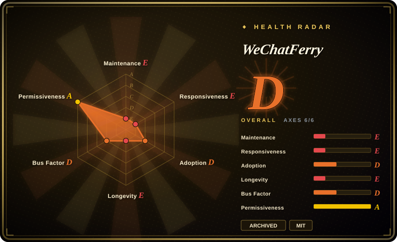
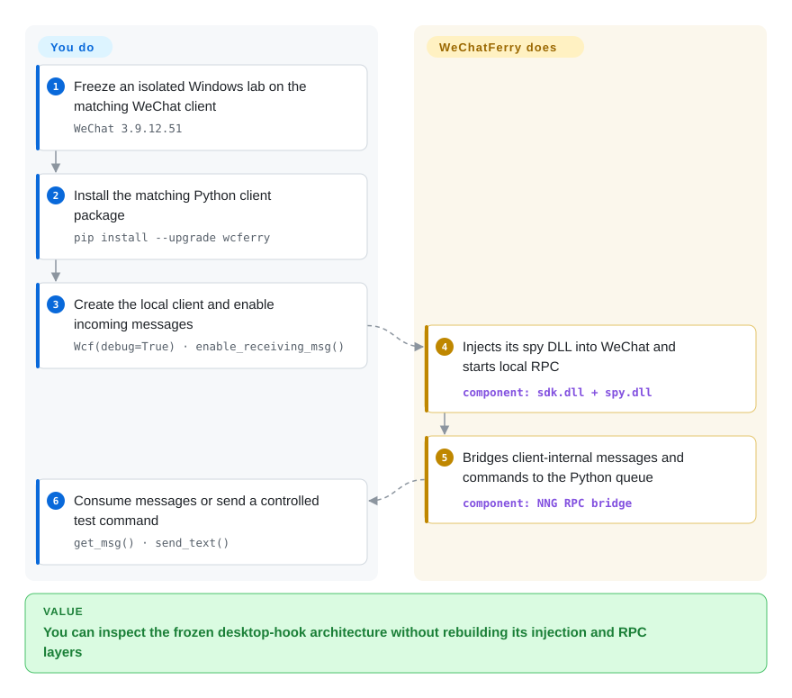

# WeChatFerry

An archived Windows WeChat-client hook and local RPC library. Treat the original repository as a study and compatibility snapshot, not as a maintained dependency for a new deployment.

> **Archived:** GitHub reports the repository read-only as of 2026-09-22. The maintainer previously replaced the whole tree with “因为不抗因素，停止维护。” (“maintenance stopped because of uncontrollable factors”) in the 2025-05-25 `final commit`; that destructive commit was reverted on 2026-03-21 and `v39.5.2` was published afterward, but the repository was later archived without naming a successor. The exact archive date is not exposed by the GitHub repository API.

## When to use

You are auditing an existing Windows automation system that already pins the 64-bit WeChat `3.9.12.51` client and WeChatFerry `v39.5.2`, or you are studying how a native DLL injector exposes an application-internal message API through a small RPC surface. The frozen tree is useful for tracing that design, reproducing a legacy environment in an isolated account, or planning a migration away from it.

Choose this snapshot over [wxpy](wxpy.md) or [ItChat](itchat.md) only when the object of study is the Windows desktop-client injection approach rather than the defunct web-WeChat protocol. Do not choose it merely because the old Python API is convenient: the archive status, exact-client-version coupling, and account-enforcement risk dominate that convenience.

## How it works

The Python package loads `sdk.dll`, which opens the Windows WeChat process and uses a remote thread to load the project's spy DLL. That injected component reads and calls version-specific client internals, then serves commands and incoming messages over local NNG RPC; your Python process creates `Wcf`, enables reception, and consumes its queue. You write the bot logic, while WeChatFerry owns injection and the RPC bridge. The final release bundles this path for WeChat `3.9.12.51`; a different client build can invalidate its offsets.

<!-- flow-steps:begin (generated from flows/wechatferry.json by tools/flow_card.py — do not edit) -->

Text version of the flow

1. **You**: Freeze an isolated Windows lab on the matching WeChat client — `WeChat 3.9.12.51`
2. **You**: Install the matching Python client package — `pip install --upgrade wcferry`
3. **You**: Create the local client and enable incoming messages — `Wcf(debug=True) · enable_receiving_msg()`
4. **WeChatFerry**: Injects its spy DLL into WeChat and starts local RPC — component: `sdk.dll + spy.dll`
5. **WeChatFerry**: Bridges client-internal messages and commands to the Python queue — component: `NNG RPC bridge`
6. **You**: Consume messages or send a controlled test command — `get_msg() · send_text()`

**Value**: You can inspect the frozen desktop-hook architecture without rebuilding its injection and RPC layers

<!-- flow-steps:end -->

## When NOT to use

- **You are starting a new production integration.** Use the official WeCom API or WeChat Official Account/Mini Program server APIs instead; the original WeChatFerry repository is archived, so it cannot supply ongoing client-offset, dependency, or security updates.
- **You run current WeChat 4.x or cannot freeze the desktop client.** Use an official channel, or separately evaluate the same maintainer's newer `wcfLink` repository; `v39.5.2` explicitly targets WeChat `3.9.12.51`, while the open 4.x request never received a supported release.
- **You cannot accept account warning, restriction, or ban risk.** Use WeCom, an Official Account, or another platform's official bot API. WeChat's service agreement forbids reverse engineering, hooking runtime data, unauthorized plugins/tools, and third-party automation; issue #126 contains repeated user reports of warnings and temporary bans, and the maintainer's answer to whether read-only listening is safe compared it to breaking into a safe “just to look.”
- **You need a maintained bot application rather than a protocol artifact.** Use [WeChat Bot](wechat-bot.md) for a maintained multi-IM application, but use one of its official Lark, Telegram, or WhatsApp paths when account safety matters; its personal-WeChat adapter is not an official safe substitute.
- **You need cross-platform deployment.** Use an official HTTP API or another platform's official SDK; WeChatFerry's core depends on Windows process access, DLL injection, matching x64 binaries, and a particular WeChat executable layout.
- **You need evidence that the frozen snapshot still works on today's service.** Do not deploy this page's archival target. The maintainer said “能用的能用……” in 2026-05 and the release artifacts remain downloadable, but no live Windows/account reproduction was performed for this verification.

## Comparison

| Alternative | In index | Our verdict | Tradeoff |
|---|---|---|---|
| [WeChat Bot](wechat-bot.md) | ✅ | Choose WeChat Bot when a maintained multi-channel assistant matters more than direct Windows-client RPC; choose neither personal-WeChat path when official support is required. | WeChat Bot adds ready-made model and IM adapters, but its WeChat path remains unofficial; WeChatFerry exposes deeper local-client capabilities but is archived and version-pinned. |
| `lich0821/wcfLink` | not indexed | Evaluate wcfLink when you specifically want the same maintainer's newer Go/iLink approach; do not call it WeChatFerry's successor unless the maintainer documents that lineage. | It is a real, indexable repository with local HTTP and Go-library surfaces and no DLL injection, but WeChatFerry never names it as the successor, its license is not declared, and its own platform-risk posture needs separate review. |
| WeCom / WeChat Official Account APIs | not a repo | Choose an official Tencent API for production, compliance-sensitive, or valuable-account automation; use this archived snapshot only to study a legacy personal-account integration. | Official APIs give supported contracts and avoid desktop injection, but expose enterprise, public-account, or mini-program surfaces rather than arbitrary personal-account control. |
| [wxpy](wxpy.md) | ✅ | Choose wxpy only to study the older Python object API; choose WeChatFerry only to study Windows-client injection and local RPC. | Both are archived reference material: wxpy is simpler but rests on the largely defunct web protocol, while WeChatFerry reached a newer client surface at the cost of native injection and exact-version offsets. |

## Tech stack

- **Core:** C++ and Visual Studio 2019 projects for an x64 SDK DLL and injected spy DLL.
- **Injection:** Windows `OpenProcess`, `VirtualAllocEx`, `WriteProcessMemory`, and `CreateRemoteThread` load the DLL into the WeChat process.
- **RPC:** Protocol Buffers/nanopb messages over NNG; commands use port `10086` by default and incoming messages use the next port.
- **Client surfaces:** the repository includes Python, Go, Java, HTTP, Node.js, C#, and Rust links or clients; the documented quick start is the Python `wcferry` package.

## Dependencies

- A 64-bit Windows host and the final supported WeChat desktop client `3.9.12.51`; automatic client upgrades break the version pin.
- For the packaged Python path: Python, `wcferry`, `pynng`, `protobuf`, `requests`, and the bundled native DLLs. The README recommends Python 3.10 for source builds.
- For rebuilding native components: Visual Studio 2019, CMake/vcpkg, protobuf tooling, and Windows process-injection permissions.
- A personal WeChat account and phone-side login confirmation. This is also the highest-risk dependency because enforcement belongs to Tencent, not the library.

## Ops difficulty

**High for anything beyond a disposable compatibility lab.** The happy path is short, but operations require freezing a specific Windows client, controlling upgrades, preserving matching DLL and Python package versions, watching the injected process and two local RPC ports, and handling login/session failures. A WeChat update can turn the native offsets into crash or injection failures. The archived repository removes the only upstream place that could reconcile those changes, while account enforcement remains outside operator control.

## Health & viability

- **Maintenance, as of 2026-09-22: archived and closed to updates.** The default-branch head is dated 2026-03-21; the latest release is `v39.5.2`, published 2026-03-28 for WeChat `3.9.12.51`. An owner-authored `3.9.12.56` pull request remained open when the repository was archived.
- **Lifecycle signal:** the 2025 `final commit` explicitly said maintenance had stopped and deleted the tree. Although the maintainer later reverted it and resumed publishing, today's archive flag is the decisive state: do not plan on another offset update.
- **Snapshot viability:** the owner said the tool could still work in 2026-05, and the pinned installer/release remains downloadable. That supports legacy reproduction, not compatibility with current WeChat 4.x or future service behavior.
- **Adoption and governance:** about 6.8k stars and 1.6k forks show substantial interest, but the roadmap and archive decision remained with one personal owner. Popularity cannot replace an active maintainer for version-pinned injection code.
- **Age/Lindy:** roughly four years of history plus recent release activity would normally be a positive prior; explicit archival and platform coupling negate it for forward-looking selection. [推断]
- **Risk:** MIT covers the repository code, not permission to automate WeChat. Tencent's agreement expressly prohibits the reverse engineering, runtime hooking, unauthorized tooling, and automation mechanisms this project uses, and permits warnings, restrictions, bans, or account recovery actions for violations.

## Caveats (unverified)

- [未验证] GitHub confirms `archived: true` on 2026-09-22 but exposes no `archived_at`; the precise day of archival could not be verified. The cluster of owner actions on 2026-07-10 is not sufficient to assign that date.
- [未验证] No Windows/WeChat account reproduction was performed. “Still works” is limited to the maintainer's 2026-05 comment and the `v39.5.2` release's stated `3.9.12.51` pairing, not an independent compatibility result.
- [未验证] Account-warning and ban examples in issues #126, #386, #422, and #426 are self-reported anecdotes, not a measured incidence rate. The ToS conflict is directly verifiable; the probability and severity for any particular account are not.
- [未验证] `wcfLink` is a newer repository by the same owner and is indexable by repository shape, but neither WeChatFerry nor wcfLink names it as WeChatFerry's successor; migration compatibility was not tested.
- [推断] The archive flag and absence of a named handoff make “study/reference and controlled legacy reproduction only” the prudent selection verdict, even though a pinned snapshot may still run.
