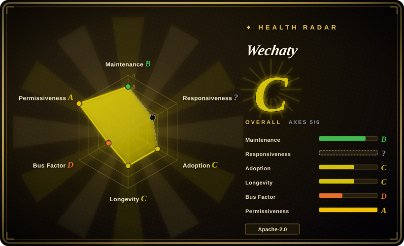
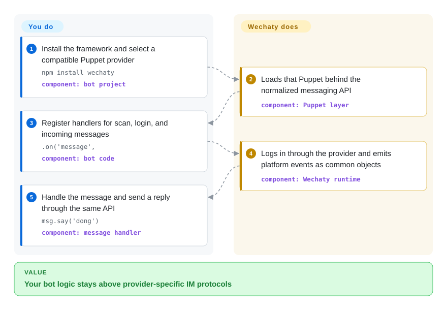

# Wechaty

A TypeScript conversational-RPA framework that puts WeChat, WhatsApp, WeCom, and other IM backends behind one event-driven API and replaceable Puppet provider layer; the abstraction is mature, but provider viability and personal-account enforcement risk must be checked separately.

## When to use

You're building a code-first bot whose message, contact, room, login, and reply logic should survive a change of IM protocol or provider. You are willing to own the application and choose, host, or buy the Puppet that connects it to a platform, rather than adopting an opinionated finished assistant.

Choose Wechaty over [WeChat Bot](wechat-bot.md) when the reusable framework and provider boundary matter more than ready-made LLM adapters, analysis commands, and channel-specific CLI workflows. It is most defensible when the selected Puppet uses an authorized platform surface; for a personal WeChat account, provider selection is a policy and account-safety decision, not a mere configuration choice.

## How it works

Your bot imports Wechaty, registers handlers for events such as scan, login, and message, and replies through the framework's `Message`, `Contact`, and `Room` objects. A Puppet implements the platform-specific transport, either in-process or behind the gRPC Puppet Service interface; you choose and operate that provider. Wechaty normalizes the provider's events into one API, but it does not make an unofficial provider authorized or stable.

<!-- flow-steps:begin (generated from flows/wechaty.json by tools/flow_card.py — do not edit) -->

Text version of the flow

1. **You**: Install the framework and select a compatible Puppet provider — `npm install wechaty` — component: `bot project`
2. **Wechaty**: Loads that Puppet behind the normalized messaging API — component: `Puppet layer`
3. **You**: Register handlers for scan, login, and incoming messages — `.on('message',` — component: `bot code`
4. **Wechaty**: Logs in through the provider and emits platform events as common objects — component: `Wechaty runtime`
5. **You**: Handle the message and send a reply through the same API — `msg.say('dong')` — component: `message handler`

**Value**: Your bot logic stays above provider-specific IM protocols

<!-- flow-steps:end -->

## When NOT to use

- **You need a Tencent-supported production channel or cannot risk a personal account.** Use WeCom, WeChat Official Account, or Mini Program APIs instead; Tencent's Weixin agreement forbids automated operations and access through unauthorized third-party software, and permits warnings, restrictions, bans, or account cancellation for breaches.
- **You expect the framework to supply a currently reliable personal-WeChat transport.** Use an official Tencent surface, or evaluate [OpeniLink Hub](openilink-hub.md) only after accepting its explicit non-affiliation and protocol risks; Wechaty's documented Web Puppet says the UOS workaround stopped logging in in 2022, while 2025–2026 issue reports describe scan-login restrictions and bans.
- **You want a ready-made multi-channel AI assistant rather than an SDK.** Use [WeChat Bot](wechat-bot.md) when its model adapters, allowlists, local capture, and analysis commands fit; Wechaty gives you primitives and events, leaving prompts, storage, routing, and operations to your application.
- **You need one official WhatsApp integration.** Use Meta's official WhatsApp Cloud API and SDKs instead; the documented Wechaty WhatsApp Puppet is alpha, implements only a narrow feature subset, and its repository was last pushed in 2024-01.
- **You require a provider with a published SLA, privacy policy, and current compatibility proof.** Contract directly with an official platform provider instead; Wechaty's service documentation still leaves these fields unfinished for some providers, and several provider repositories have not moved since 2022–2024.
- **You require a framework with a current stable release train.** Evaluate a maintained official SDK or another actively released bot framework instead; the npm stable line ends at `1.20.2` from 2022, GitHub's latest release is `v0.56` from 2021, and the main branch manifest remains `2.0.0-alpha.1`.

## Comparison

| Alternative | In index | Our verdict | Tradeoff |
|---|---|---|---|
| [WeChat Bot](wechat-bot.md) | ✅ | Choose Wechaty when you need a reusable event API and swappable provider boundary; choose WeChat Bot when its CLI, LLM adapters, and chat-analysis workflow are the product you want. | Wechaty is less opinionated and more embeddable; WeChat Bot reaches a working assistant faster but adds a broader dependency and privacy surface. |
| [OpeniLink Hub](openilink-hub.md) | ✅ | Choose OpeniLink Hub when several iLink-connected bots need a persistent web control plane, users, traces, and Apps; choose Wechaty when bot behavior belongs in code and transport interchangeability matters more. | Hub supplies operations and persistence but centralizes more sensitive state; Wechaty keeps the application boundary yours but makes you assemble and operate it. |
| `python-wechaty` | not indexed | Choose `python-wechaty` when Python is non-negotiable and you accept the Puppet Service boundary; choose this TypeScript repository for the canonical Node API and its larger historical implementation base. | The Python SDK fits Python services but still depends on a compatible Puppet; the TypeScript core has the deepest history yet a slow current release cadence. |
| WeCom / official WeChat APIs | not a repo | Choose an official Tencent API for production compliance, documented credentials, and account support; choose Wechaty only when its cross-platform abstraction is worth independently validating every provider. | Official APIs cover enterprise, public-account, and Mini Program workflows rather than arbitrary personal-account automation; Wechaty is more uniform across IMs but cannot confer platform authorization. |

## Tech stack

- **Core:** TypeScript, Node.js 16+, ES modules with CommonJS output, and an event-driven `WechatyBuilder` API.
- **Abstraction:** `wechaty-puppet` defines the normalized IM boundary; `wechaty-puppet-service` carries it over gRPC for remote, closed-source, or polyglot providers.
- **State and payloads:** `memory-card` persists bot state, `file-box` represents media, and user modules expose messages, contacts, rooms, friendships, tags, posts, and related objects.
- **Distribution:** npm package, Docker images, generated TypeDoc API documentation, and separate Python, Go, Java, .NET, PHP, Rust, and Scala ecosystem repositories.

## Dependencies

- **Required:** Node.js 16+ and npm 7+ for this TypeScript implementation; your bot code supplies event handlers and business logic.
- **Provider:** one compatible Puppet package or Puppet Service token/endpoint. Provider-specific requirements may include Chromium, Windows, Wine, an Android emulator, a remote service, or commercial credentials.
- **Platform account:** credentials or QR login for the selected IM. Personal WeChat providers are not equivalent to official WeCom, Official Account, or Mini Program APIs.
- **Application-owned:** persistence beyond `memory-card`, secrets, consent and retention controls, retries, monitoring, deployment, and any AI/model backend.

## Ops difficulty

**Medium for Mock or an official, self-contained provider; high for personal-account automation.** The six-line bot loop is small, but production reliability belongs to the selected Puppet and its upstream platform. Operators must pin a compatible framework-provider pair, protect session state and tokens, monitor login and message delivery, test after client or protocol changes, and keep a provider-specific fallback. Remote Puppet Services also add a third party, network boundary, and potentially unpublished privacy or SLA terms.

## Health & viability

- **Maintenance, as of 2026-09:** the repository is not archived and was pushed on 2025-12-21, but that head changed README links. The most recent code change was a small error-message fix in 2025-06; the prior substantial runtime update landed in 2025-04, and npm's stable release remains `1.20.2` from 2022.
- **Release discipline:** GitHub releases stop at `v0.56` in 2021, npm stable stops in 2022, and main declares `2.0.0-alpha.1`. Those three surfaces disagree about the consumable release story, so users should pin and integration-test exact versions rather than infer readiness from the branch.
- **Provider health:** the framework documents Web, service, Mock, WhatsApp, and multiple commercial Puppets, but its own status tables mark several providers deprecated. The checked repositories range from a 2025 Python/Go SDK push to 2022–2024 activity for core Web, service, PadLocal, and WhatsApp providers; provider support is uneven rather than one project-wide guarantee.
- **Governance and adoption:** the organization-owned repository has about 23.3k stars and a long contributor list, but historical contribution counts are dominated by the creator. Current default-branch engineering activity is sparse, so popularity and ten years of age do not substitute for a current maintainer and provider check.
- **Age and Lindy:** the project dates to 2016 and established a durable Puppet abstraction across language SDKs. [推断] Treat it as quiet-but-usable framework infrastructure with ecosystem drift, not as an abandoned repository or as an actively evolving turnkey WeChat solution.
- **Risk posture:** Apache-2.0 is consistent across GitHub, `LICENSE`, and `package.json`. The selection blocker is external: Tencent's current agreement expressly restricts unauthorized third-party automation, and an open 2025 issue contains multiple reports of scan-login restrictions or bans through 2026.

## Caveats (unverified)

- [未验证] No current end-to-end login or message-delivery test was run against any Puppet; documentation, repository recency, and issue reports do not prove that a specific provider works today.
- [未验证] Account-ban reports are self-reported and provider-specific. They establish real incidents, not a ban rate, a safe account profile, or a provider that is currently safe.
- [未验证] The availability, ownership, data handling, pricing, and support commitments of commercial Puppet Services were not independently contracted or tested; some official docs still say ToS, privacy policy, and SLA are to be added.
- [推断] “Quiet-but-usable with ecosystem drift” is a selection judgment based on sparse core commits, old stable releases, and uneven provider activity; future maintainer or provider work could change it.
