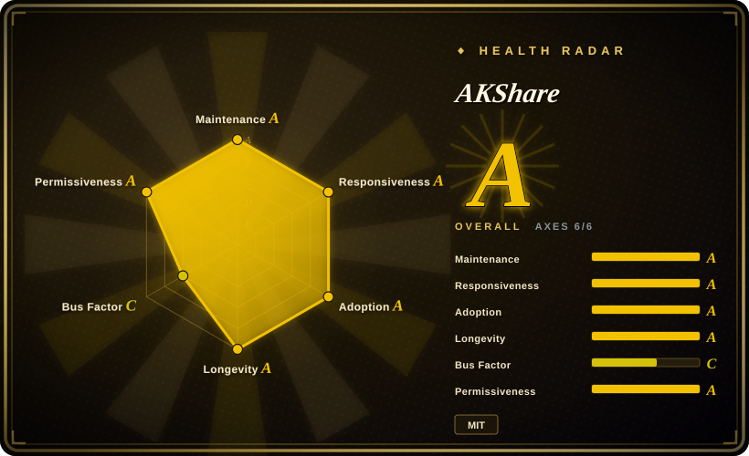
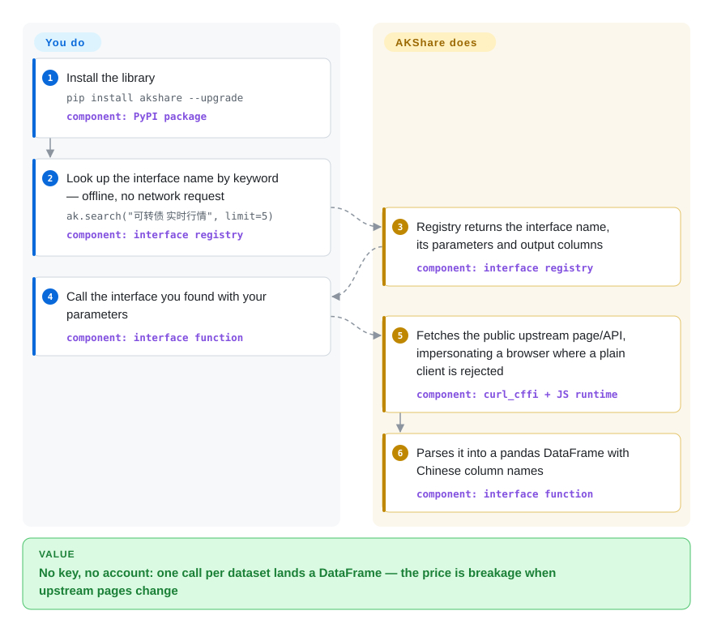

# AKShare

You need A-share quotes, a futures inventory series or a macro series tonight, and the procurement answer is "no budget, no account, no key". AKShare is a MIT-licensed Python library that wraps public web interfaces — Eastmoney, Sina, the exchanges' own sites, plus a long tail of data pages — into one-call pandas DataFrames; the price is that an interface can silently break the day its upstream page changes, and the project answers with a near-weekly fix-and-release cadence.

## When to use

You are a researcher, a student or a one-person quant shop in a pandas workflow, and the data you need is Chinese-market bread and butter — A-share quotes and history, fund NAVs, futures holdings and warehouse receipts, bond quotes, or cross-domain extras like macro indicators and alternative series that commercial A-share vendors gate behind seats. The constraint is real: no account, no token, no purchase order, and the script has to run tonight. Register-and-pay options ([Tushare](tushare.md), [HiThink Financial-API](financial-api.md)) solve the contract problem but not this one.

Reach for AKShare when breadth-per-yuan and zero ceremony beat field contracts: every dataset is one function call, the interface registry is searchable offline (`ak.search("可转债 实时行情")` returns interface names and metadata without a network round trip — the README explicitly pitches this at LLM-driven programs), and there is no key to leak or rotate. The deciding tradeoff: you accept that the data comes from public pages the project does not control, so an upstream redesign can break or silently shift an interface between versions, and "the fix" is upgrading to the next patch release, not opening a support ticket.

## How it works

AKShare is a thick client over other people's web pages. Each interface function knows one public endpoint — an Eastmoney data API, a Sina quote feed, an exchange website table — including the quirks needed to get a straight answer: `curl_cffi` impersonates a browser's TLS fingerprint where a plain `requests` call would be rejected, and an embedded JavaScript runtime (`mini-racer`) evaluates the obfuscated JS some portals require before they hand over data. What you do: install the library, find the interface name by keyword, call it with parameters. What it does: fetch the upstream page or API, parse HTML/JSON into a normalized pandas DataFrame with Chinese column names, and hand it back — the README's worked example is the whole usage story: `ak.stock_zh_a_hist(symbol="000001", period="daily", start_date="20170301", end_date="20231022", adjust="")` returns the daily-history DataFrame. There is no server of yours, no account of yours, and no contract with the source: the moment Eastmoney renames a field, the interface drifts until a fix ships — which is why the release cadence is the product's real heartbeat, and why you pin the version and upgrade deliberately.

<!-- flow-steps:begin (generated from flows/akshare.json by tools/flow_card.py — do not edit) -->

Text version of the flow

1. **You**: Install the library — `pip install akshare --upgrade` — component: `PyPI package`
2. **You**: Look up the interface name by keyword — offline, no network request — `ak.search("可转债 实时行情", limit=5)` — component: `interface registry`
3. **AKShare**: Registry returns the interface name, its parameters and output columns — component: `interface registry`
4. **You**: Call the interface you found with your parameters — component: `interface function`
5. **AKShare**: Fetches the public upstream page/API, impersonating a browser where a plain client is rejected — component: `curl_cffi + JS runtime`
6. **AKShare**: Parses it into a pandas DataFrame with Chinese column names — component: `interface function`

**Value**: No key, no account: one call per dataset lands a DataFrame — the price is breakage when upstream pages change

<!-- flow-steps:end -->

## When NOT to use

- **You need a field contract, an SLA, or someone to escalate a wrong number to.** Public pages owe you nothing; the project's own statement reserves the right to remove interfaces. For a documented, token-gated contract pick [Tushare](tushare.md) (community-operated, points-metered) or [HiThink Financial-API](financial-api.md) (vendor-official); for institutional accountability pick a commercial terminal (Wind, iFinD, Choice — not repos).
- **The pipeline runs unattended in production.** A silent field shift or a rejected request (recent fixes in the repo are literally "interface columns misaligned", "upstream rejected the request") can corrupt a nightly job between versions. If you must run unattended, add schema assertions on every DataFrame and pin the exact version — or move to a contracted source.
- **You need minute bars, tick or Level-2 data with availability guarantees.** Minute-level interfaces exist but ride the same public pages with no SLA; reliable tick/Level-2 belongs to paid feeds ([Tushare](tushare.md) sells minute history as a separate licence; terminals sell it with support).
- **You intend to redistribute or commercialize the data.** The project's own statement scopes the data to academic research and reference, and the underlying rights belong to the upstream sites; check that statement against your use before shipping data in a product. [未验证]
- **You are not in Python.** The library is Python 3.11+ (64-bit) only. The README points non-Python users at the companion HTTP wrapper AKTools; for first-class multi-language access use a service with a documented REST surface instead.
- **Your compliance environment forbids scraping or TLS impersonation.** `curl_cffi` exists precisely to look like a browser; some enterprises rule that out by policy. [推断]

## Comparison

| Alternative | In index | Our verdict | Tradeoff |
|---|---|---|---|
| [Tushare](tushare.md) | ✅ | Pick AKShare when zero cost and zero registration are hard constraints and occasional breakage is tolerable; pick Tushare when documented fields, decade-deep history and a single accountable operator are worth registering, earning points and paying for. | AKShare is free but contractless; Tushare meters access by points (120 free points reach only non-adjusted daily bars) and sells minute/news/US-HK as separate licences. |
| [HiThink Financial-API](financial-api.md) | ✅ | Pick AKShare for tonight's zero-budget script and for breadth the vendor does not sell (macro series, commodity colour, US daily bars); pick the official service when the numbers must match the vendor's own terminals and an agent-native skill/MCP surface matters. | The official route buys field contracts and a local-DuckDB history path at the price of a key and vendor lock-in; AKShare buys breadth and freedom at the price of breakage risk. |
| [yfinance](yfinance.md) | ✅ | Pick yfinance when your tickers are US/global and Yahoo's coverage suffices; pick AKShare when the work is Chinese-market — US daily bars exist here too, but A-share depth, futures and macro are the point. | yfinance has the same unofficial-scraping fragability against Yahoo; neither offers a contract, but their coverage continents barely overlap. |
| Wind / Tonghuashun iFinD / Eastmoney Choice | 非仓库 | Pick a commercial terminal when tick/Level-2, institutional coverage and a support contract are requirements; AKShare is the opposite bet — free, immediate, unsupported. | Closed desktop/feed products with seat pricing; the honest comparison is coverage-and-accountability versus cost-and-ceremony. |

## Tech stack

- **Language:** Python, requires 3.11+ (64-bit); classifiers list 3.11–3.14.
- **Scraping core** (from `pyproject.toml`): `requests` plus `curl_cffi` (browser TLS impersonation), `beautifulsoup4` / `lxml` / `html5lib` for parsing, `jsonpath` and `tabulate` for extraction, `mini-racer` / `py-mini-racer` / `akracer` to execute portal JavaScript (platform-dependent picks).
- **Data shape:** pandas DataFrames with Chinese column names, per interface; Excel readers (`xlrd`, `openpyxl`) for sources that publish spreadsheets.
- **Interface registry:** an offline, searchable index of interface names, parameters and output columns (`ak.search` / `ak.interface_info`), documented as keyword matching rather than semantic search.
- **Quality infrastructure:** Ruff for lint/format, GitHub Actions checks plus a release-and-deploy workflow, tests via a `test` dependency group.

## Dependencies

- **Python 3.11+ (64-bit)** and the pip dependencies above — that is the whole install; no account, no token, no service to run.
- **Network reach to the upstream sites** — Eastmoney, Sina, the exchanges, and the long tail of sources named in the README's acknowledgement; some will reject or throttle clients that look like scripts.
- **Optional:** the Docker Jupyter image (`akfamily/aktools:jupyter`) and the AKTools HTTP wrapper if you need to serve other languages.

## Ops difficulty

**Trivial to start, real to keep.** Install is one `pip install akshare --upgrade`; there is no server, credential or quota to operate. The day-2 burden is version discipline: upstream pages change without notice, so pin the exact version in any recurring job, upgrade deliberately (the changelog between patch releases is often exactly "fixed interface X"), and assert DataFrame schemas before persisting. Add polite request pacing of your own — there is no operator-side rate limiter protecting either you or the upstream site. For a workload you cannot babysit, that maintenance load is the signal to move to a contracted source.

## Health & viability

- **Maintenance (2026-09-22).** Extremely active: PyPI shipped `1.18.95 → 1.18.97` within four days, last push 2 days ago (2026-09-20), and the recent merge stream is almost entirely upstream-breakage fixes (misaligned columns, timeouts, "clear error when upstream rejects") — the maintenance model *is* breakage repair.
- **Age and Lindy prior.** Created 2019-10 (2,548 days ≈ 7 years) and still shipping weekly: a solid age × still-active record for the free-scraping niche; it outlived the older scrape-first generation (old Tushare) it acknowledges learning from. [推断]
- **Governance and bus factor.** An organization account (`akfamily`) with 27 active maintainers in 12 months (top-1 share 0.612) but a clearly lead-driven merge stream; bus factor concentrates in the lead author. [推断]
- **Adoption.** ~22.7k stars, 3.5k forks, 2,105,796 PyPI downloads last month and 54 dependent repos (the machine axis still discounts the graph tier); widely cited as the default free Chinese-market data library. [推断]
- **Responsiveness.** Zero open issues at snapshot time; median first response 26.3 hours across 37 qualifying issues/PRs. Individual bug reports from outside may travel through docs channels rather than GitHub Issues. [推断]
- **Risk flags.** Data is explicitly academic-research-scoped by the project's own statement, and interfaces can be removed "based on uncontrollable factors" — both quoted from the README. The README also carries promotional content (paid knowledge community, sibling products), which is a tone signal, not a licence issue. No relicense history (MIT throughout).

## Caveats (unverified)

- [未验证] Exact interface count and per-category coverage are not stated in a machine-checkable form; breadth here is characterized from the README's source list and docs structure, not counted.
- [未验证] How often interfaces break in practice (failures per month per workload) is not measured; the fix-cadence evidence implies it is routine, but no rate is asserted.
- [未验证] Upstream sites' terms regarding automated access were not reviewed per source; the `curl_cffi` impersonation layer is a fact from `pyproject.toml`, its per-source legality was not assessed.
- [推断] "Sustained PyPI download volume" and "default free Chinese-market data library" are ecosystem-standing inferences; the health block's adoption axis carries the measured numbers.
- [推断] Bus-factor and responsiveness characterizations are inferred from contributor lists and the PR merge stream, not from inside information.
