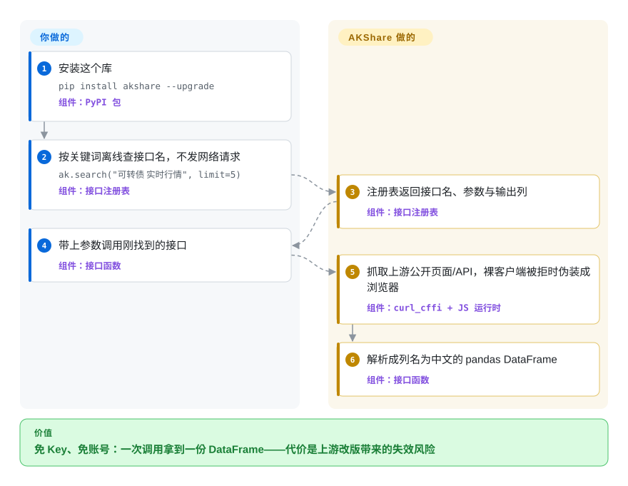

# AKShare

今晚就要 A 股行情、某个期货库存序列或一条宏观序列，而采购答案是「没预算、没账号、没 Key」。AKShare 是一个 MIT 协议的 Python 库，把东方财富、新浪、各交易所网站以及一长尾公开数据页封装成一次函数调用就返回 pandas DataFrame 的接口；代价是上游页面一改版，接口就可能悄悄失效，项目的应对是近乎每周多个版本的修复发布节奏。

## 何时使用

你是研究者、学生或单人量化，工作流在 pandas 里，要的数据是中国市场的基本口粮——A 股行情与历史、基金净值、期货持仓与仓单、债券行情，再加上商业终端按席位收费的那些跨域数据（宏观指标、另类序列）。约束也是真的：不能注册账号、不能拿 token、不能走采购，脚本今晚就得跑。[Tushare](tushare.zh.md)、[HiThink Financial-API](financial-api.zh.md) 这些注册制选项解决的是字段契约问题，解决不了「零门槛」问题。

该翻到这一页的判断标准：每一块钱换来的广度和零仪式感，比字段契约更重要——每个数据集就是一次函数调用；接口注册表可以离线按关键词检索（`ak.search("可转债 实时行情")` 不发网络请求就返回接口名和元数据，README 明说这是给 LLM 驱动程序设计的）；没有会泄漏、要轮换的 Key。决定性取舍：你接受数据来自项目控制不了的公开页面，上游一次改版就可能在版本间弄断接口或悄悄挪动字段，「修复」方式是升级到下一个补丁版本，而不是开一张工单。

## 怎么用起来

AKShare 是「别人网页上的厚客户端」。每个接口函数背后是唯一一个公开端点——东方财富的数据 API、新浪的行情 feed、交易所网站的表格——连同把它问出真话所需的全部小动作：`curl_cffi` 在裸 `requests` 会被拒的地方伪装成浏览器的 TLS 指纹；内嵌的 JavaScript 运行时（`mini-racer`）执行某些门户先要你跑一段混淆 JS 才肯给的数据。你要做的：装库、按关键词找接口名、带参数调用。它做的：抓上游页面或 API，把 HTML/JSON 解析成列名为中文的规整 pandas DataFrame 交回——README 的示例就是全部用法：`ak.stock_zh_a_hist(symbol="000001", period="daily", start_date="20170301", end_date="20231022", adjust="")` 直接返回日线历史 DataFrame。你这边没有服务器、没有账号，和源站也没有契约：东方财富哪天改了字段名，接口就漂移到修复发布为止——这就是为什么发版节奏才是这个产品真正的心跳，也是为什么要钉死版本、有意识地升级。

<!-- flow-steps:begin (generated from flows/akshare.json by tools/flow_card.py — do not edit) -->

流程文字版

1. **你**：安装这个库 — `pip install akshare --upgrade` — 组件：`PyPI 包`
2. **你**：按关键词离线查接口名，不发网络请求 — `ak.search("可转债 实时行情", limit=5)` — 组件：`接口注册表`
3. **AKShare**：注册表返回接口名、参数与输出列 — 组件：`接口注册表`
4. **你**：带上参数调用刚找到的接口 — 组件：`接口函数`
5. **AKShare**：抓取上游公开页面/API，裸客户端被拒时伪装成浏览器 — 组件：`curl_cffi + JS 运行时`
6. **AKShare**：解析成列名为中文的 pandas DataFrame — 组件：`接口函数`

**价值**：免 Key、免账号：一次调用拿到一份 DataFrame——代价是上游改版带来的失效风险

<!-- flow-steps:end -->

## 何时不用

- **你要字段契约、SLA，或者一个能追责错数的对象。** 公开页面不欠你什么；项目自己的声明就保留「部分接口可能被移除」的权利。要文档化、token 门槛的契约，选 [Tushare](tushare.zh.md)（社区运营、按积分计量）或 [HiThink Financial-API](financial-api.zh.md)（供应商官方）；要机构级问责，选商业终端（Wind、iFinD、Choice——非仓库）。
- **管线要在生产环境无人值守地跑。** 一次静默的字段挪位或一次被拒的请求（仓库近期的修复就叫「接口字段错位」「上游拒绝时给出明确报错」）足以在两次版本之间污染你的夜跑任务。必须无人值守的话，给每个 DataFrame 加 schema 断言并钉死精确版本——或者换有契约的数据源。
- **你要有可用性保证的分钟线、tick 或 Level-2。** 分钟级接口存在，但同样骑在无 SLA 的公开页面上；可靠的 tick/Level-2 属于付费行情（[Tushare](tushare.zh.md) 的历史分钟是单独授权售卖；终端带支持合同卖）。
- **你要转售或商业化这些数据。** 项目声明把数据用途限定在学术研究与参考，底层权利属于上游站点；把数据打进产品前，先拿这份声明对照你的用途。 [未验证]
- **你不在 Python 里。** 本库只支持 Python 3.11+（64 位）。README 给非 Python 用户的出路是配套 HTTP 封装 AKTools；要多语言一等公民，改用有正式 REST 面的服务。
- **你的合规环境禁止爬取或 TLS 伪装。** `curl_cffi` 的存在意义就是「看起来像浏览器」；有些企业按政策直接排除这类做法。 [推断]

## 横向对比

| 替代品 | 是否收录 | 我们的评价 | 取舍 |
|---|---|---|---|
| [Tushare](tushare.zh.md) | 已收录 | 零成本、零注册是硬约束、偶尔断接口能接受时选 AKShare；字段有文档、历史够深、需要唯一可追责运营方时选 Tushare，代价是注册、攒积分、付费。 | AKShare 免费但无契约；Tushare 按积分计量（120 免费积分只能拿非复权日线），分钟/新闻/港美股另按年单独授权。 |
| [HiThink Financial-API](financial-api.zh.md) | 已收录 | 今晚就要跑的零预算脚本、以及官方不卖的广度（宏观序列、商品面、美股日线）选 AKShare；数字必须与供应商自家终端对齐、要原生的 Agent Skill/MCP 入口时选官方服务。 | 官方路线用一把 Key 和供应商锁定换来字段契约与本地 DuckDB 历史路径；AKShare 用断接口风险换来广度与自由。 |
| [yfinance](yfinance.zh.md) | 已收录 | 标的主要在美股/全球、Yahoo 覆盖够用时选 yfinance；工作对象是中国市场时选 AKShare——这里也有美股日线，但 A 股深度、期货和宏观才是它的本分。 | yfinance 对 Yahoo 同样是非官方抓取、同样没契约；两者的脆弱性同构，覆盖的大陆却几乎不重叠。 |
| Wind / 同花顺 iFinD / 东方财富 Choice | 非仓库 | tick/Level-2、机构级覆盖和支持合同是硬需求时选商业终端；AKShare 是反向下注——免费、即取、无支持。 | 闭源桌面/行情产品、按席位收费；诚实的对比轴是覆盖与问责对成本与仪式感。 |

## 技术栈

- **语言：** Python，要求 3.11+（64 位）；classifiers 列到 3.14。
- **抓取核心**（取自 `pyproject.toml`）：`requests` 加 `curl_cffi`（伪装浏览器 TLS 指纹），`beautifulsoup4` / `lxml` / `html5lib` 解析，`jsonpath` 和 `tabulate` 抽取，`mini-racer` / `py-mini-racer` / `akracer` 执行门户 JavaScript（按平台各取其一）。
- **数据形态：** 按接口返回列名为中文的 pandas DataFrame；对发电子表格的源用 Excel 读取器（`xlrd`、`openpyxl`）。
- **接口注册表：** 可离线检索的接口名、参数与输出列索引（`ak.search` / `ak.interface_info`），文档明说这是关键词匹配而不是语义搜索。
- **质量设施：** Ruff 负责 lint/format，GitHub Actions 检查加发布部署工作流，测试走 `test` 依赖组。

## 依赖

- **Python 3.11+（64 位）** 加上面的 pip 依赖——安装到此为止；没有账号、没有 token、没有要运行的服务。
- **能访问上游站点**——东方财富、新浪、各交易所，以及 README 致谢名单里那一长尾源站；有些会拒绝或限流看起来像脚本的客户端。
- **可选：** Docker Jupyter 镜像（`akfamily/aktools:jupyter`）与 AKTools HTTP 封装，用于服务其他语言。

## 运维难度

**起步 trivial，维持是真功夫。** 安装就是一句 `pip install akshare --upgrade`；没有服务器、凭据或配额要运维。第二天起的负担是版本纪律：上游页面毫无通知地变，任何周期任务都应钉死精确版本、有意识地升级（补丁版本之间的变更日志常常恰好就是「修复了 X 接口」）、落盘前对 DataFrame 做 schema 断言。请求节奏要自己放礼貌——没有任何运营方侧的限流器在保护你或上游站点。当一个工作负载你 babysit 不起时，这份维护量就是换到契约数据源的信号。

## 健康度与可持续性

- **维护（2026-09-22）。** 极度活跃：四天内在 PyPI 连发 `1.18.95 → 1.18.97`，最后一次 push 在 2 天前（2026-09-20）；近期合并流几乎全是「上游变了所以修」——字段错位、超时、「上游拒绝时给出明确报错」。它的维护模式本身就是断口修复。
- **年龄与 Lindy 先验。** 创建于 2019-10（已创建 2,548 天，约 7 年）且仍在每周发版：对免费抓取这个生态位是扎实的「年龄 × 仍活跃」记录；它熬过了自己致谢中提到的上一代抓取库（老 Tushare）。 [推断]
- **治理与 bus factor。** 组织账号（`akfamily`），12 个月内活跃维护者 27 人（第一贡献者份额 0.612），但合并流明显由主导作者驱动；bus factor 集中在主导者一人。 [推断]
- **采用度。** 约 22.7k star、3.5k fork，最近一个月 PyPI 下载量 2,105,796 次、依赖仓库 54 个（机器轴仍因图谱层级压分）；被广泛当作中国市场免费数据库的默认选项。 [推断]
- **响应速度。** 快照时 0 个 open issue；37 个合格 issue/PR 的首次响应中位数为 26.3 小时。外部用户报的 bug 可能走文档渠道而不是 GitHub Issues。 [推断]
- **风险信号。** 项目自己的声明把数据用途限定在学术研究，并明说「基于某些不可控因素，部分接口可能被移除」——两句都是 README 原文。README 里也带推广内容（付费知识社区、兄弟产品），这是语气信号而不是协议问题。无 relicense 历史（一直是 MIT）。

## 存疑（未验证）

- [未验证] 接口总数与分品类覆盖面没有机器可查的口径；本页的「广度」是从 README 的数据源名单和文档结构归纳的，没有数过。
- [未验证] 接口实际失效频率（每月每工作负载多少次）没有实测；修复节奏的证据暗示这是常态，但本页不断言具体比率。
- [未验证] 各上游站点关于自动化访问的条款未逐一审阅；`curl_cffi` 伪装层的存在是 `pyproject.toml` 里的硬事实，其在各源站的合法性未评估。
- [推断] 「PyPI 下载量持续」「中国市场免费数据库默认选项」是生态地位推断；实测数字以健康度块的采用度轴为准。
- [推断] bus factor 与响应速度的画像来自贡献者名单和 PR 合并流，不是内部信息。
