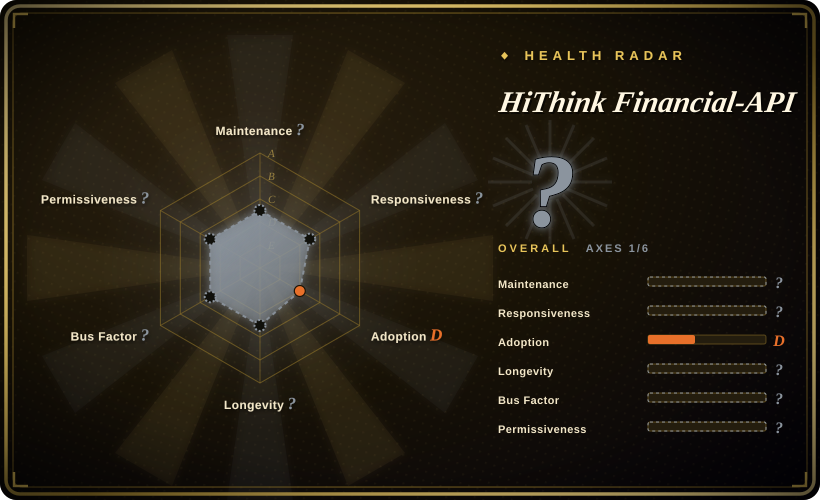
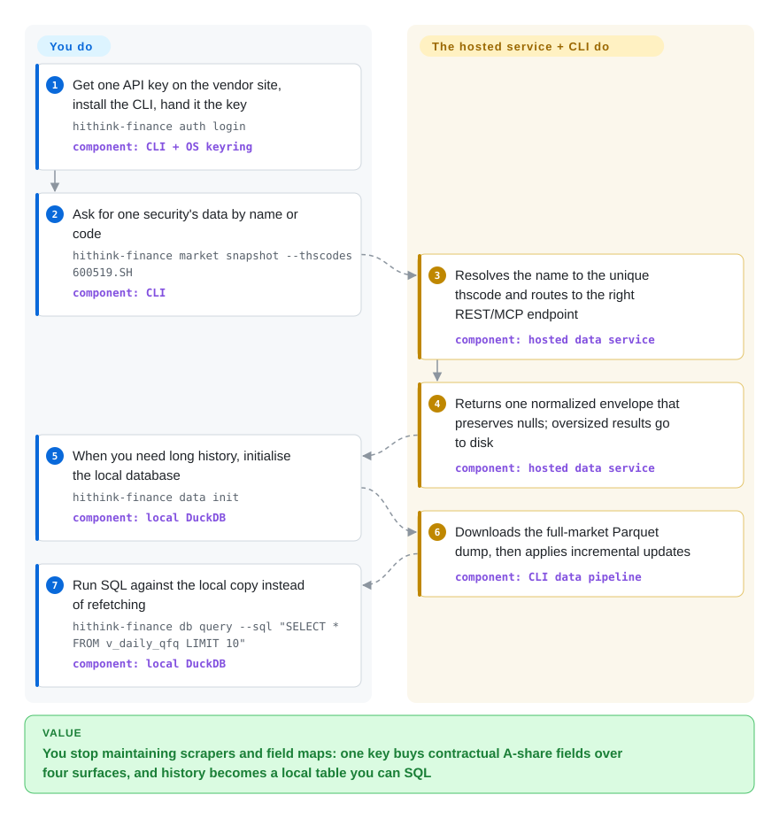

# HiThink Financial-API

Scraping Chinese stock quotes and financials off public pages gets you stale fields, renamed columns, and a pipeline that dies on the next site redesign. This repo is the client side of Tonghuashun's hosted A-share (mainland-China-listed stock) data service: one API key, and the same normalized quotes, statements, index/fund/futures data come back through a CLI, a REST call, an MCP tool or a Python toolkit — with full-market history landing in a local DuckDB you query with SQL.

> **⚠️ The GitHub repository is gone (as of 2026-10-09).** `github.com/HiThink-Tech/Financial-API` and the `HiThink-Tech` account both return 404; from outside you cannot tell whether they were deleted, made private or renamed without a redirect. The code survives on the vendor's Gitee mirror (`gitee.com/HiThink-Tech/Financial-API`), frozen at the 2026-09-22 commit this page last verified. The npm CLI and the hosted data service still work, but the vendor's documented `npx skills add HiThink-Tech/Financial-API` skill install now fails.

## When to use

You are wiring Chinese equity data into an agent or a research script — latest quotes, K-line history, income/balance/cash-flow statements, valuation snapshots, limit-up and dragon-tiger-list special data, fund and futures/options reference data — and the free routes keep failing you: the scrape-based library returned an empty frame because the upstream page changed shape, or a turnover number is obviously wrong and you have no contract to appeal to. A commercial terminal (Wind, iFinD, Choice) would settle it, but it wants a seat licence and a desktop client.

Reach for this page when one key and one documented field contract should serve both the human path (`hithink-finance market snapshot --thscodes 600519.SH` in a terminal) and the agent path (the bundled `hithink-finance` Agent Skill, or the six hosted MCP endpoints), plus a locally maintained DuckDB for long-history SQL work. The deciding tradeoff against the free alternatives is **contractual field stability from an official vendor source** — every endpoint's parameters, response fields and null semantics are documented in-repo and mirrored into the skill — paid for with a key, a vendor dependency, and the capability scope the vendor chose.

## How it works

The repo is not the data; it is the official client toolkit around a hosted service. You create one API key on the vendor's site and hand it to the client once — after that the CLI (a Node.js package, `@hithink-tech/hithink-finance-cli`), the Python toolkit, the hosted MCP servers and raw REST all authenticate with that same key. What you do: name the security and the window, supply the key, and decide where oversized results land. What it does: resolve a name or partial code into the service's unique security id (`thscode`, e.g. `600519.SH`), route the request to the right endpoint, and return a normalized envelope that preserves nulls rather than zero-filling them. For history it stops querying one symbol at a time and instead downloads full-market Parquet dumps plus REST deltas into a local DuckDB, so a multi-year backtest reads a local table. There is no offline mode: with no key and no reachable service the client has nothing to serve.

<!-- flow-steps:begin (generated from flows/financial-api.json by tools/flow_card.py — do not edit) -->

Text version of the flow

1. **You**: Get one API key on the vendor site, install the CLI, hand it the key — `hithink-finance auth login` — component: `CLI + OS keyring`
2. **You**: Ask for one security's data by name or code — `hithink-finance market snapshot --thscodes 600519.SH` — component: `CLI`
3. **HiThink Financial-API**: Resolves the name to the unique thscode and routes to the right REST/MCP endpoint — component: `hosted data service`
4. **HiThink Financial-API**: Returns one normalized envelope that preserves nulls; oversized results go to disk — component: `hosted data service`
5. **You**: When you need long history, initialise the local database — `hithink-finance data init` — component: `local DuckDB`
6. **HiThink Financial-API**: Downloads the full-market Parquet dump, then applies incremental updates — component: `CLI data pipeline`
7. **You**: Run SQL against the local copy instead of refetching — `hithink-finance db query --sql "SELECT * FROM v_daily_qfq LIMIT 10"` — component: `local DuckDB`

**Value**: You stop maintaining scrapers and field maps: one key buys contractual A-share fields over four surfaces, and history becomes a local table you can SQL

<!-- flow-steps:end -->

## When NOT to use

- **You need minute bars, tick or Level-2 data, Hong Kong/US listings, macro series, news or announcement full text, or research reports.** The service's own capability table excludes every one of these, and the vendor's premium capabilities (capital flow, high-frequency movement, futures/options professional data) are shipped only inside its desktop client, not through the public API, MCP, CLI or Python SDK. For US/global daily bars reach for [yfinance](yfinance.md); for tick/Level-2 and cross-market depth you are back to a commercial terminal or an exchange/broker feed.
- **You need the data without a vendor relationship.** No key, no data — the client carries no dataset. If zero budget is a hard constraint, use a community scrape source or a free points tier ([AKShare](akshare.md), [Tushare](tushare.md)) and accept that endpoints break without notice.
- **You intend to redistribute or publish the data.** The repository code is MIT, but MIT covers code, not the numbers you pull through the service; redistribution and storage terms live in the vendor's agreement. Read those terms before shipping data inside a product. [未验证]
- **You want a backtest engine, portfolio analytics or signals.** This is a data plane, not a research platform. Pair it with [backtrader](backtrader.md), [qlib](qlib.md) or [FinRL](finrl.md), which model and backtest rather than source.
- **You need the client source to live somewhere stable, or a public issue tracker.** The GitHub repository, its issues and its release tags vanished between 2026-09-22 and 2026-10-09 with no notice in the vendor docs, which still link to it. What is left is the Gitee mirror, unchanged since 2026-09-22. Vendor the client code you depend on (or pin the npm package version), and install the Agent Skill from Skill Hub (`skillhub.cn/skills/hithink-finance`) or the Gitee copy instead of `npx skills add`. If you need an open client that is visibly maintained, use [AKShare](akshare.md), whose repository is active.
- **You need a contractual SLA for a live or regulated data path.** Public issues showed 429 global rate limits and 504 quote snapshots under normal load, and the project was roughly three months old under a single GitHub account that has since disappeared. A production trading or compliance path usually wants a support contract instead. [推断]
- **Your environment cannot run Node.js ≥ 22.12 or Python ≥ 3.11 and you do not want to hand-write HTTP.** The default entry point is a Node CLI; the Python package is installed from the repo — now only the Gitee mirror — not from PyPI (both `marketdb` and `hithink-finance` returned 404 on PyPI as of 2026-09-22). Only raw REST is language-agnostic.

## Comparison

| Alternative | In index | Our verdict | Tradeoff |
|---|---|---|---|
| [yfinance](yfinance.md) | ✅ | Pick yfinance when you want keyless, free daily bars for US/global tickers and can accept that Yahoo sourcing is unofficial; pick this page when the securities are A-shares and you need statements, valuations and limit-up-class special data behind a documented field contract. | yfinance costs nothing and needs no account, but its A-share coverage is thin price series with no contractual fundamentals and no vendor to escalate field errors to. |
| [OpenBB](openbb.md) | ✅ | Pick OpenBB when you need one uniform API and terminal UI over many providers and will bring your own provider keys; pick this page when a single official Chinese source with a native agent and CLI surface matters more than an aggregation layer. | OpenBB is a platform rather than a data source — more flexible and multi-market, but it supplies no A-share data on its own. |
| [AKShare](akshare.md) | ✅ | Pick AKShare when the budget is exactly zero and a broken endpoint is an acceptable Tuesday; pick this page when stable field names, documented parameters and an official source justify a key and a vendor dependency. | AKShare's breadth (macro and alternative datasets, plus US daily bars) exceeds this service's public scope, but it is community-scraped with no contract, no null-semantics promise and no support. |
| [Tushare](tushare.md) | ✅ | Closest structural peer — a hosted A-share data service behind a token. Pick Tushare for decade-old featured datasets and à-la-carte paid depth (minute bars, news, US/HK); pick this page when you want the vendor-official data and a bundled public futures/options catalogue; neither offers a live public repo any more — Tushare's GitHub master stopped in 2020, and this project's GitHub repo vanished in 2026-10, leaving a frozen Gitee mirror. | Both are token-gated with MCP/Skills surfaces; Tushare meters access by points (120 free points reach only non-adjusted daily bars) and sells minute/news/US-HK as separate licences, while this page's cost is one vendor key — per-endpoint feature parity is not claimed. |
| Wind / Tonghuashun iFinD / Eastmoney Choice | 非仓库 | Pick a commercial terminal when you need tick/Level-2, institutional coverage and a support contract; pick this page when the public A-share, fund, futures and options API subset plus a self-service key is enough. | Closed desktop/feed products with seat pricing and no repository to read — out of scope for this index by shape, and materially more expensive. |

## Tech stack

- **Languages:** TypeScript for the CLI (Node.js ≥ 22.12.0), Python ≥ 3.11 for the `python/` toolkit and its `marketdb` package.
- **CLI runtime dependencies** (from `hithink-finance-cli/package.json`): `commander` for argument parsing, `zod` for schemas, `@duckdb/node-api` for the local database, `@napi-rs/keyring` for the OS credential store, `skills` for Agent Skill installation.
- **Python dependencies:** `duckdb`, `pyarrow`, `pandas`, `typer`, `rich`, `python-dotenv`, `requests`.
- **Data plane:** hosted REST plus six hosted MCP servers under `fuyao.aicubes.cn`; local storage is a DuckDB file fed by full-market Parquet dumps plus REST deltas.
- **Contracts as content:** endpoint documentation lives in Markdown under `docs/api/` and `docs/mcp/`, and `scripts/sync_skill_contracts.py` mirrors it into the standalone Agent Skill so the agent and the docs cannot drift.

## Dependencies

- **An API key** created on the vendor's site (`fuyao.aicubes.cn/admin/`), shared by REST, MCP, CLI and Python. The clients also read the `HITHINK_FINANCE_API_KEY` environment variable and a user-level `credentials.env` / OS credential store.
- **Network reach to `fuyao.aicubes.cn`** for every remote read and for the market dumps — there is no bundled dataset.
- **Node.js ≥ 22.12.0** for the CLI (it pulls native DuckDB and keyring bindings), or **Python ≥ 3.11** for the toolkit path.
- **Disk space** for the local DuckDB plus downloaded Parquet dumps; the project documents no size figure.
- **Nothing to self-host:** no server, no database service, no scheduler. The DuckDB file is the only state you own.

## Ops difficulty

**Low as a consumer — you hold a key, not a service.** Day-2 work is rate-limit-aware batching (the bundled skill instructs the agent to lower concurrency, back off and not retry in parallel on `4001`/429), refreshing the local database (`hithink-finance data sync`, or `marketdb auto-sync` for the Python path) and rotating the key that four surfaces share. Two traps come with the shape rather than the code: any full-market, paginated or long-window result must be written to disk instead of held in context, and the local copy is only as fresh as the last dump or sync. There is no cluster to operate; the hard part is governance — who holds the key, and what you are allowed to store and republish.

## Health & viability

- **Maintenance — GitHub repository gone, client code frozen (2026-10-09).** Until 2026-09-22 this was very active and release-driven: CLI tags `v0.1.3` through `v0.1.13` in about three months, commits every month since 2026-06, CI workflows and a licence check on the npm publish path. Since then the GitHub repo and its owner account return 404, and the official Gitee mirror's newest commit is still the 2026-09-22 snapshot. The npm CLI (`v0.1.13`) is still published and not deprecated, and the hosted service still answers, so existing integrations keep working; what is gone is the public development venue. The radar now reads `?` on every GitHub-measured axis because there is no repository left to measure, not because the scorer failed.
- **Age and Lindy prior.** Created 2026-06-09, so about four months old, and the main repository disappeared without notice — the Lindy prior gives no protection at all. Longevity rests entirely on the vendor continuing to run the hosted service. [推断]
- **Adoption.** Before it vanished the GitHub repo had ~3.7k stars and ~320 forks; those can no longer be read. The CLI's monthly npm downloads read ~4,460 in the radar's registry source (npm's own API shows 3,846 for the 30 days to 2026-10-07); the Gitee mirror shows 31 stars and 12 forks.
- **Governance and bus factor.** The GitHub owner was a **user account** (`HiThink-Tech`) with one listed contributor, and that account is now gone; the surviving copy is the `HiThink-Tech` Gitee mirror that the vendor's docs link to. The roadmap is the vendor's, and the data plane can be neither forked nor self-hosted.
- **Responsiveness.** On 2026-09-22 most recent issues were closed within hours. That issue tracker went down with the repository, and the Gitee mirror is not where issues were handled, so there is currently no visible public support channel.
- **Backing.** The vendor docs (`fuyao.aicubes.cn`) present this as Tonghuashun's official A-share data service and still link to both the GitHub and Gitee repositories; the parent is a long-standing listed Chinese financial-information vendor. The service staying up while the repo vanished suggests a decision about the GitHub presence rather than the product being shut down — but no announcement explains it. [推断]
- **Risk flags.** A vanished canonical repository, with the vendor's own install instructions now broken. Inside the code, the licence is inconsistent: root `LICENSE` and `hithink-finance-cli/LICENSE` are MIT, while `python/pyproject.toml` declares `license = { text = "Proprietary" }` for the `marketdb` package (unchanged on the Gitee mirror). Beyond that: vendor lock-in with key-gated access, and a scope that can contract — the 2026-09-20 changelog moved capital flow, high-frequency movement and futures/options professional data into the vendor's desktop client, and the service docs still describe the capital-flow endpoints but mark them "not open for external access".

## Caveats (unverified)

- [未验证] Pricing, free tier and quota economics are not documented in the repository or in the service's own `llms.txt`; the only publicly evidenced limits are runtime errors (429 / `4001`). Confirm commercial terms on the vendor site before assuming free access.
- [未验证] The claim that `HiThink-Tech` is Tonghuashun's official project rests on the README, the `fuyao.aicubes.cn` service domain and links to `lumi.10jqka.com.cn` — not on verifiable account ownership.
- [未验证] Data licensing, storage and redistribution terms are absent from the repository; the MIT grant covers the code only.
- [未验证] The local DuckDB plus Parquet dump footprint is not documented; size your disk from a real sync.
- [未验证] Field-level correctness is asserted by the vendor. No independent benchmark of these datasets against Wind, Tushare or AKShare was run for this page.
- [未验证] The Tushare and AKShare rows point at their own atlas pages; their pricing/points tables were re-verified 2026-09-22 from the operators' own docs (tushare.pro 积分频次对应表; AKShare README statement) and change without notice.
- [推断] High stars-per-month on a young vendor repository is partly promotion — the README links a 同花顺 client download and a Skill Hub listing — as well as genuine demand.
- [推断] "The hosted service and its key are the single point of failure" follows from the absence of any self-hosted or offline mode, not from a measured outage record.
- [未验证] Why the GitHub repository and the `HiThink-Tech` account return 404 (deleted, made private, or renamed without a redirect) is unknown; no notice was found on the vendor docs, which still link to it as of 2026-10-09. It was readable on 2026-09-22.
- [推断] The Gitee repository `gitee.com/HiThink-Tech/Financial-API` is treated as the vendor's official mirror because the vendor docs link to it and its newest commit is the same `3bca780` snapshot this page recorded from GitHub; the account's identity was not otherwise verified. Facts on this page dated 2026-10-09 (licence files, CLI version, Node engine) were read from that mirror and from npm.
- [未验证] The `upstream:` block in the frontmatter still records the last GitHub state (2026-09-22); it cannot be refreshed because the repository no longer resolves, and `tools/upstream_snapshot.py` fails on the 404.
