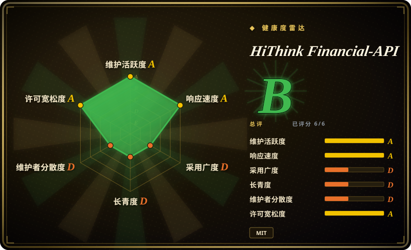
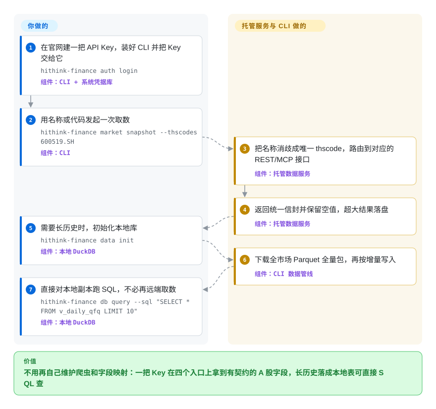

# HiThink Financial-API

从公开网页上爬 A 股行情和财报，字段会悄悄改名，数据会莫名变成空值，站点一改版整条管线就断。这个仓库是同花顺托管 A 股数据服务的客户端工具箱：一把 API Key，通过 CLI、REST、MCP 或 Python 拿回同一套归一化字段（行情、财报、指数、基金、期货），全市场长历史还能落进本地 DuckDB，直接用 SQL 查。

## 何时使用

你在给一个 Agent 或研究脚本接中国股票数据——最新行情、K 线历史、利润表/资产负债表/现金流量表、估值快照、涨停与龙虎榜类特色数据、基金和期货期权资料——而免费路线反复失效：爬取型库返回空表，因为上游页面改了结构；或者某个成交额数字明显不对，而你没有任何字段契约可以申诉。商业终端（Wind、iFinD、Choice）能解决，但要买席位、装桌面客户端。

值得翻到这一页的情况：一把 Key 加一份有文档的字段契约，同时服务人肉路径（终端里的 `hithink-finance market snapshot --thscodes 600519.SH`）和 Agent 路径（仓库自带的 `hithink-finance` Agent Skill，或六个托管 MCP 端点），再加一个本地维护的 DuckDB 做长历史 SQL。相对免费替代品的决定性取舍是**来自官方数据源的字段契约稳定性**——每个接口的参数、响应字段和空值语义都在仓库里有文档、并同步进 Skill——代价是接受一把 Key、一个供应商依赖，以及供应商划定的能力范围。

## 怎么用起来

仓库本身不是数据，而是托管服务之上的官方客户端工具箱。你先在官网建一把 API Key，交给客户端一次；之后 CLI（Node.js 包 `@hithink-tech/hithink-finance-cli`）、Python toolkit、托管 MCP 服务和裸 REST 都用这同一把 Key 认证。你要做的是：说清标的和时间窗、把 Key 交出去、决定超大结果落在哪。它做的是：把名称或残缺代码解析成服务端唯一的证券 id（`thscode`，例如 `600519.SH`），把请求路由到对应接口，返回统一信封并保留空值——不会用 0 冒充缺失。历史数据它不走逐只查询，而是下载全市场 Parquet 全量包加 REST 增量，写进本地 DuckDB，多年回测读的就是一张本地表。它没有离线模式：没有 Key、连不上服务，客户端手里什么都没有。

<!-- flow-steps:begin (generated from flows/financial-api.json by tools/flow_card.py — do not edit) -->

流程文字版

1. **你**：在官网建一把 API Key，装好 CLI 并把 Key 交给它 — `hithink-finance auth login` — 组件：`CLI + 系统凭据库`
2. **你**：用名称或代码发起一次取数 — `hithink-finance market snapshot --thscodes 600519.SH` — 组件：`CLI`
3. **HiThink Financial-API**：把名称消歧成唯一 thscode，路由到对应的 REST/MCP 接口 — 组件：`托管数据服务`
4. **HiThink Financial-API**：返回统一信封并保留空值，超大结果落盘 — 组件：`托管数据服务`
5. **你**：需要长历史时，初始化本地库 — `hithink-finance data init` — 组件：`本地 DuckDB`
6. **HiThink Financial-API**：下载全市场 Parquet 全量包，再按增量写入 — 组件：`CLI 数据管线`
7. **你**：直接对本地副本跑 SQL，不必再远端取数 — `hithink-finance db query --sql "SELECT * FROM v_daily_qfq LIMIT 10"` — 组件：`本地 DuckDB`

**价值**：不用再自己维护爬虫和字段映射：一把 Key 在四个入口上拿到有契约的 A 股字段，长历史落成本地表可直接 SQL 查

<!-- flow-steps:end -->

## 何时不用

- **你要分钟 K、tick 或 Level-2，港股/美股、宏观数据、新闻公告原文或研报。** 服务自身的能力表把这些全部排除，供应商的高级能力（资金流向、高频动向、期货期权专业数据）只在它的桌面客户端里提供，不走公开 API、MCP、CLI 或 Python SDK。美股/全球日线改用 [yfinance](yfinance.zh.md)；tick/Level-2 和跨市场深度只能回到商业终端或交易所、券商行情。
- **你要的是没有供应商关系的取数。** 没有 Key 就没有数据——客户端里不附带任何数据集。预算必须为零时，选社区爬取源或免费积分档（[AKShare](akshare.zh.md)、[Tushare](tushare.zh.md)），并接受接口随时失效。
- **你打算转售或公开发布这些数据。** 仓库代码是 MIT，但 MIT 只覆盖代码，不覆盖你通过服务取回的数值；转售与存储条款在供应商协议里。把数据打进产品前先读那份协议。 [未验证]
- **你要回测引擎、组合分析或信号。** 这里是数据面，不是研究平台。用它配 [backtrader](backtrader.zh.md)、[qlib](qlib.zh.md) 或 [FinRL](finrl.zh.md)，那些负责建模与回测，不负责取数。
- **实时或受监管的数据通路需要合同级 SLA。** 公开 issue 里能看到 429 全局限流和行情快照 504，而项目只有约三个月、挂在一个 GitHub 账号下。生产交易或合规通路通常需要带支持合同的供应商。 [推断]
- **你的环境跑不了 Node.js ≥ 22.12 或 Python ≥ 3.11，也不想自己写 HTTP。** 默认入口是 Node CLI；Python 包从仓库安装而不是从 PyPI 装（截至 2026-09-22，PyPI 上 `marketdb` 与 `hithink-finance` 都是 404）。只有裸 REST 与语言无关。

## 横向对比

| 替代品 | 是否收录 | 我们的评价 | 取舍 |
|---|---|---|---|
| [yfinance](yfinance.zh.md) | 已收录 | 要免 Key、免账号的美股/全球日线时选 yfinance；标的是 A 股、且你要财报、估值和涨停类特色数据且有字段契约可依时，选本页项目。 | yfinance 零成本、零账号，但 A 股只覆盖较薄的行情序列，没有契约化财务字段，字段出错也没有供应商可追。 |
| [OpenBB](openbb.zh.md) | 已收录 | 要一套统一 API 加终端界面、覆盖多家数据商并自带 provider key 时选 OpenBB；更看重单一官方中文数据源加原生的 Agent、CLI 入口时，选本页项目。 | OpenBB 是平台不是数据源——更灵活、跨市场，但它自己不提供 A 股数据。 |
| [AKShare](akshare.zh.md) | 已收录 | 预算严格为零、且能接受接口随时坏掉时选 AKShare；字段名稳定、参数有文档、来源官方这些值得换一把 Key 和供应商依赖时，选本页项目。 | AKShare 的广度（宏观、另类数据，另有美股日线）超出本服务的公开范围，但它是社区爬取、没有契约、不承诺空值语义、也没有支持。 |
| [Tushare](tushare.zh.md) | 已收录 | 结构上最接近的同类——托管 A 股数据服务加一个 token。要十年特色数据与按需付费深度（分钟线、新闻、港美股）时选 Tushare；要供应商官方口径、打包的公开期货期权目录、以及一个真在开发现场的仓库时，选本页项目。 | 两者都是 token 门槛加 MCP/Skills 面；Tushare 按积分计量（120 免费积分只到非复权日线），分钟/新闻/港美股按年单独授权，本页的成本是一把供应商 Key——本页不宣称与之逐接口对齐。 |
| Wind / 同花顺 iFinD / 东方财富 Choice | 非仓库 | 需要 tick/Level-2、机构级覆盖和支持合同时选商业终端；公开的 A 股、基金、期货期权 API 子集加自助 Key 够用时，选本页项目。 | 闭源桌面/行情产品，按席位收费且没有可读仓库——按形态就不在本索引范围内，且贵得多。 |

## 技术栈

- **语言：** CLI 用 TypeScript（Node.js ≥ 22.12.0），`python/` toolkit 及其 `marketdb` 包用 Python ≥ 3.11。
- **CLI 运行时依赖**（取自 `hithink-finance-cli/package.json`）：`commander` 解析参数、`zod` 定义 schema、`@duckdb/node-api` 访问本地库、`@napi-rs/keyring` 读写系统凭据库、`skills` 负责安装 Agent Skill。
- **Python 依赖：** `duckdb`、`pyarrow`、`pandas`、`typer`、`rich`、`python-dotenv`、`requests`。
- **数据面：** `fuyao.aicubes.cn` 上的托管 REST 加六个托管 MCP 服务；本地存储是一个 DuckDB 文件，由全市场 Parquet 全量包加 REST 增量喂出来。
- **契约即内容：** 接口文档以 Markdown 维护在 `docs/api/` 与 `docs/mcp/`，`scripts/sync_skill_contracts.py` 把它镜像进独立发布的 Agent Skill，让 Agent 读到的和文档不会漂移。

## 依赖

- **一把 API Key**，在官网 `fuyao.aicubes.cn/admin/` 创建，REST、MCP、CLI、Python 共用。客户端也会读 `HITHINK_FINANCE_API_KEY` 环境变量和用户级 `credentials.env` 或系统凭据库。
- **能访问 `fuyao.aicubes.cn`**，远端读取和全市场全量包都走它——没有随仓库分发的数据集。
- **Node.js ≥ 22.12.0**（CLI 会拉原生 DuckDB 和 keyring 绑定），或走 Python 路线时 **Python ≥ 3.11**。
- **磁盘空间**，用于本地 DuckDB 和下载的 Parquet 全量包；项目未给出体积数字。
- **没有要自托管的东西：** 没有服务端、没有数据库服务、没有调度器。你拥有的唯一状态就是那个 DuckDB 文件。

## 运维难度

**作为使用方很低——你拿的是一把 Key，不是一个服务。** 日常工作是按限流节奏批量取数（仓库自带的 Skill 要求 Agent 在 `4001`/429 时降频、退避、不并发重放）、刷新本地库（`hithink-finance data sync`，Python 路线用 `marketdb auto-sync`）、轮换四个入口共用的那把 Key。两个坑来自形态而不是代码：全市场、分页全集或长窗口的结果必须落盘而不是留在上下文里；本地副本的新鲜度只等于最后一次全量包或同步。没有集群要维护，难的是治理——Key 归谁管，以及你被允许存什么、发什么。

## 健康度与可持续性

- **维护（2026-09-22）。** 非常活跃且按版本驱动：约三个月内从 CLI `v0.1.3` 发到 `v0.1.13`，`v0.1.13` 发布于 2026-09-22（与最后一次 push 同一天），2026-06 起每个月都有提交，仓库带三个 GitHub Actions 工作流，npm 发布路径里挂了许可证检查（`prepublishOnly` 跑 `check-license.mjs` 加完整验证链）。
- **年龄与 Lindy 先验。** 创建于 2026-06-09，约三个半月——Lindy 先验对它是零保护：它的寿命取决于供应商是否继续运营这个服务，而不是自身历史。 [推断]
- **采用度。** 三个月约 3,723 star、323 fork，实测最近一个月 CLI 的 npm 下载约 4,460 次。增长很快，但在一个年轻的供应商仓库上，star 速度既是需求信号也是推广信号。 [推断]
- **治理与 bus factor。** GitHub owner 是**用户账号**（`HiThink-Tech`）而不是组织，仓库列出的贡献者只有 1 人；路线图归供应商，数据面既不能 fork 也不能自托管。 [推断]
- **响应速度。** 最近十条 issue（2026 年 9 月）里八条已关闭，多数在开单后几个小时内关闭——包括当天处理的 504 行情快照报告，以及一条关于成交额数据异常的更正报告。仍未关闭的都是功能请求（竞价批量取 top N、历史估值）。
- **背书。** README 自述为同花顺官方 A 股数据服务，并链接了 `10jqka.com.cn` 域名下的客户端下载；母公司是长期上市的国内金融信息厂商，运营背书因此可信，但 GitHub 账号的企业身份无法仅凭仓库确认。 [未验证]
- **风险信号。** 仓库内部许可证不一致：根 `LICENSE` 与 `hithink-finance-cli/LICENSE` 是 MIT，而 `python/pyproject.toml` 为 `marketdb` 包声明了 `license = { text = "Proprietary" }`——要 vendor Python 部分之前两份都读。此外还有：Key 门槛造成的供应商锁定；能力范围可能收缩——2026-09-20 的变更日志把资金流向、高频动向和期货期权专业数据移进了供应商桌面客户端，退出了公开 API。

## 存疑（未验证）

- [未验证] 价格、免费额度与配额机制在仓库和服务的 `llms.txt` 里都没有文档；公开可证的只有运行时错误（429 / `4001`）。在假设免费用量之前先到官网确认商务条款。
- [未验证] `HiThink-Tech` 是同花顺官方项目这一说法，依据是 README、`fuyao.aicubes.cn` 服务域名和指向 `lumi.10jqka.com.cn` 的链接，而不是可核验的账号归属。
- [未验证] 数据授权、存储与再分发条款不在仓库里；MIT 授权只覆盖代码。
- [未验证] 本地 DuckDB 加 Parquet 全量包的占用未文档化；按一次真实同步来估磁盘。
- [未验证] 字段级正确性由供应商自述，本页没有把数据集与 Wind、Tushare、AKShare 做独立比对。
- [未验证] Tushare 与 AKShare 两行已指向各自的收录页；其积分/价目表于 2026-09-22 按运营方自己的文档复核（tushare.pro 积分频次对应表、AKShare README 声明），且可能随时调整。
- [推断] 年轻供应商仓库的高 star 增速里，推广成分与真实需求各占一部分——README 链接了同花顺客户端下载和 Skill Hub 页面。
- [推断] “托管服务和它的 Key 是单点”是由不存在自托管或离线模式推出的，不是来自实测的故障记录。
