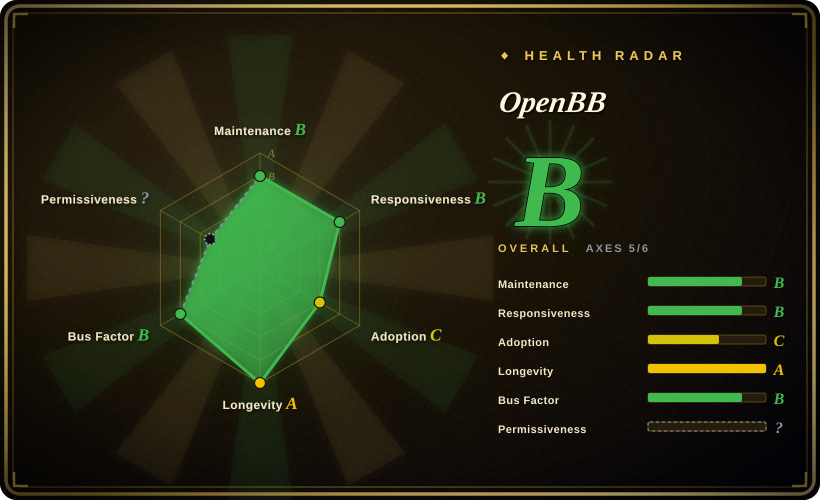
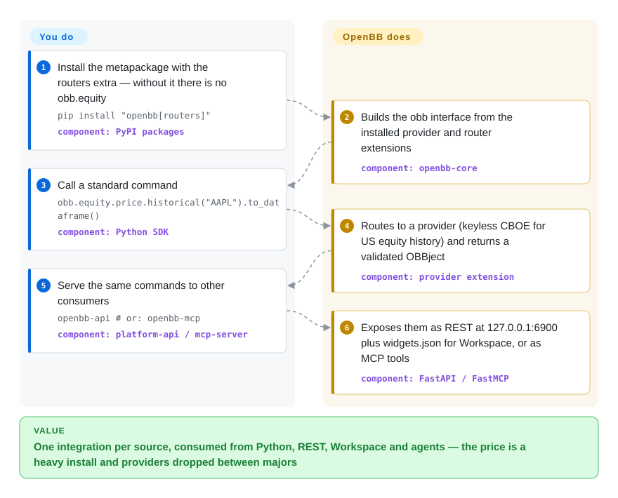

# OpenBB

The same market, filings and macro series end up needed in a notebook, behind a REST endpoint, in an analyst's dashboard and inside an AI agent — and each surface grows its own glue code per data source. OpenBB's Open Data Platform (ODP) wraps each source once as a Python provider extension and serves that one integration to Python, a local REST server, a CLI and an MCP server for agents.

## When to use

You run data plumbing for a research or quant team — or you are wiring finance data into an LLM agent — and several consumers need the same sources: quants in Python, analysts in a dashboard, an agent over MCP, an internal app over REST. Writing a FRED client, an SEC-filings parser and a CBOE quote fetcher three times over is the cost you are trying to stop paying.

Reach for OpenBB when "connect once, consume everywhere" is the actual requirement and the sources you need are the ones it ships after V5: US and international official data (SEC filings and company facts, FRED, BLS, EIA, CFTC, the Federal Reserve, Treasury, ECB, IMF, OECD, FINRA, JODI), exchange-sourced quotes (CBOE, Nasdaq, TMX, Deribit), Fama-French factors and RSS news — or when you will write your own provider extension for a licensed feed and want it served to every surface for free. Since V5 (2026-09-29) the code is Apache-2.0, so embedding it in a product no longer carries the AGPL network clause the 4.x line had. The deciding tradeoff: you get one typed data layer with REST, MCP and Workspace widgets already attached, and you pay with a heavy install and a provider roster that the maintainers prune between major versions.

## How it works

OpenBB is a plugin host. `openbb-core` defines standard data models (an equity price bar, a balance sheet) and a command router; each data source is a separate PyPI package — a *provider extension* — that maps its API onto those models; *router extensions* (`openbb-equity`, `openbb-economy`, …) group commands into namespaces like `obb.equity.price.historical`. When you install packages, the core builds the `obb` Python interface from whatever extensions are present (the first import prints `Extensions to add: … Building...`). What you do: install the metapackage *with* the `routers` extra — a plain `pip install openbb` 5.0.0 gives provider namespaces (`obb.cboe`, `obb.sec`, `obb.fred`) but no `obb.equity`, so the README's own quickstart raises `AttributeError` without it — then call a command and convert the result with `.to_dataframe()`. What it does: picks a provider (CBOE by default for US equity history in our run, no key needed), fetches, validates into the standard model and returns an `OBBject`. The same installed commands are what `openbb-api` serves as REST at `127.0.0.1:6900` (plus a `widgets.json` that OpenBB Workspace reads) and what `openbb-mcp` exposes as MCP tools — that is the "connect once" part. FRED, BLS and EIA need API keys and CFTC an app token, set in the user settings file; the other shipped providers are keyless.

<!-- flow-steps:begin (generated from flows/openbb.json by tools/flow_card.py — do not edit) -->

Text version of the flow

1. **You**: Install the metapackage with the routers extra — without it there is no obb.equity — `pip install "openbb[routers]"` — component: `PyPI packages`
2. **OpenBB**: Builds the obb interface from the installed provider and router extensions — component: `openbb-core`
3. **You**: Call a standard command — `obb.equity.price.historical("AAPL").to_dataframe()` — component: `Python SDK`
4. **OpenBB**: Routes to a provider (keyless CBOE for US equity history) and returns a validated OBBject — component: `provider extension`
5. **You**: Serve the same commands to other consumers — `openbb-api   # or: openbb-mcp` — component: `platform-api / mcp-server`
6. **OpenBB**: Exposes them as REST at 127.0.0.1:6900 plus widgets.json for Workspace, or as MCP tools — component: `FastAPI / FastMCP`

**Value**: One integration per source, consumed from Python, REST, Workspace and agents — the price is a heavy install and providers dropped between majors

<!-- flow-steps:end -->

## When NOT to use

- **You came for yfinance, FMP, Intrinio, Tiingo, Alpha Vantage or Benzinga through OpenBB.** V5 removed sixteen provider packages, including all of those, and the release notes list "where the functionality went" as *none* for most. Call [yfinance](yfinance.md) directly, or pin the 4.x line — which is AGPL-3.0-only and frozen.
- **Your market is China.** The shipped providers are US, Canadian and international agencies and exchanges; for A-shares, futures and Chinese macro use [AKShare](akshare.md) (keyless) or [Tushare](tushare.md) (token-gated).
- **You want a small dependency.** `pip install "openbb[routers]"` resolved 241 packages into a 787 MB environment in our run, and the metapackage pulls `openbb-devtools` — pytest, tox, pre-commit, ruff — into the runtime install. If you only need one source, install `openbb-core` plus that provider package, or use a single-purpose library (for SEC filings, edgartools).
- **You want the GUI more than the data layer.** The analyst UI, OpenBB Workspace, is a hosted closed product at pro.openbb.co; this repo is the data layer, the API/MCP servers, a CLI and the ODP Desktop tray app (macOS and Windows binaries; Linux only by building it yourself).
- **You need an accountable data contract or execution.** The README itself says the data "is not necessarily accurate"; there is no broker execution (the Tradier provider went in V5). For licensed real-time data with support, buy a terminal and, if you want, wrap it as your own provider.
- **Bus factor is a hard constraint.** The V5 rewrite and nearly every commit on `develop` since April 2026 come from one maintainer, and the repository moved to a new, profile-less organization (`openbq-org`) in 2026-09 without a public explanation. [推断]

## Comparison

| Alternative | In index | Our verdict | Tradeoff |
|---|---|---|---|
| [yfinance](yfinance.md) | ✅ | Pick yfinance when one notebook needs Yahoo quotes and fundamentals now; pick OpenBB when several consumers (Python, REST, MCP, Workspace) must share many official sources through one typed layer. | yfinance is one light dependency over unofficial Yahoo endpoints; OpenBB V5 no longer bundles Yahoo at all, and costs a heavy install for its multi-surface serving. |
| [AKShare](akshare.md) | ✅ | Pick AKShare for Chinese-market data; pick OpenBB for US/international official sources and for serving them to agents and dashboards. | Coverage barely overlaps: AKShare scrapes Chinese portals into DataFrames, OpenBB wraps official APIs behind standard models and servers. |
| [qlib](qlib.md) | ✅ | Pick qlib when the job is training and backtesting models on a prepared dataset; pick OpenBB when the job is getting heterogeneous data in and out to people and agents. | qlib owns the research loop but expects you to bring data; OpenBB owns data access but has no backtesting or model pipeline. |
| edgartools | 未收录 | Pick edgartools when SEC filings and XBRL financials are the whole job; pick OpenBB when SEC is one of several sources the same consumers query. | edgartools (MIT) is a deep, focused SEC library; OpenBB's `openbb-sec` covers filings and company facts as one provider among seventeen. |
| Bloomberg Terminal / LSEG Workspace | 非仓库 | Pick a terminal when licensed real-time data, coverage guarantees and support are requirements; OpenBB is the integration layer, not a data licence. | Seat-priced closed products with accountability; OpenBB is free code whose data quality is whatever the upstream source provides. |

## Tech stack

- **Language:** Python, `requires-python >=3.10,<4` (the README states 3.10–3.14).
- **Core:** `openbb-core` 2.0 — Pydantic v2 standard models, a command router, FastAPI + Uvicorn for the REST server, an optional Flask extra (`a2wsgi`) and an optional pandas extra for `.to_dataframe()`.
- **Extensions:** each provider and router is its own PyPI package (seventeen providers in-tree after V5); the core generates the `obb` interface from installed extensions at build/first import.
- **Servers:** `openbb-platform-api` (`openbb-api`, REST + Workspace `widgets.json`), `openbb-mcp-server` (`openbb-mcp`, built on FastMCP, with tool discovery to keep the initial tool list small), `openbb-cli` 2.0.
- **Charting:** `openbb-charting` 4.0 on Plotly, optional PyWry windows.
- **Desktop:** ODP Desktop, a Tauri app (Rust + React/TypeScript), roughly 35 MB installed.
- **Build:** hatchling + PEP 621 per package, `uv.lock` files, ruff and ty in CI.

## Dependencies

- **Python 3.10+** and the package set you choose — the full metapackage is heavy (see When NOT to use); individual packages are much lighter.
- **Network reach to each provider's upstream API.** Keyless for SEC, CBOE, Nasdaq, TMX, Deribit, ECB, IMF, OECD, FINRA, Federal Reserve, Treasury and others; API keys for FRED, BLS and EIA, an app token for CFTC.
- **Optional:** an OpenBB Workspace account (hosted, closed) if analysts should see the data as widgets; Docker if you use the shipped `docker-compose.yml` (API on 6900, MCP on 8001).

## Ops difficulty

**Easy to try, medium to keep.** Install is `pip install "openbb[routers]"` (about two and a half minutes and 241 packages in our run), and `openbb-api` serves REST locally with no further setup. The day-2 work is version discipline: majors move namespaces (`obb.regulators.sec.*` became `obb.sec.*` in V5) and drop providers outright, so pin exact package versions, read the changelog before upgrading, and keep provider keys in the user settings file rather than in code. Running it as a shared service means owning a FastAPI deployment and its auth yourself — the repo ships a compose file, not a hardened deployment.

## Health & viability

- **Maintenance (2026-10-09).** Active but bursty: the last commit is 7 days old and only 4 of the last 13 weeks saw commits, because V5 was built on a branch for five months and landed in one 2026-09-29 merge (`openbb` 5.0.0, core/CLI/API/MCP 2.0.x on PyPI the same day).
- **Age and Lindy prior.** The repository is 2119 days old (created 2020-12) and has survived three product reshapes — Terminal, Platform 4.x, ODP — while staying active; age × still-active supports it, but each reshape broke users, so the prior protects the project's survival more than any given API.
- **Governance and bus factor.** 45 active contributors in 12 months with a top-1 share of 0.44 and top-3 of 0.526, but the post-April stream is almost entirely one maintainer (deeleeramone), and the repo now lives under `openbq-org`, an organization created 2026-09-11 with no profile, while the company's own repos stay under `OpenBB-finance`.
- **Adoption.** ~74.0k stars and 7.6k forks; the adoption radar reads 104,671 PyPI downloads last month for `openbb`, 5 dependent repos and 172,443 release-asset downloads — modest usage for the star count.
- **Responsiveness.** Median first response 137.3 hours across 14 qualifying issues (radar B); 88 open issues at snapshot time.
- **Risk flags.** Two relicenses in 28 months: MIT until 2024-05, AGPL-3.0-only from 2024-05-14, Apache-2.0 from V5 (PR #7677, 2026-09-24). The current direction is more permissive, but 4.x artifacts stay AGPL. The license radar axis is `?`: GitHub reports `NOASSERTION` because the LICENSE file has a one-line preamble, and the package registry mirror the scorer cross-checks still lists AGPL-3.0-only for 4.7.2. The file itself and every V5 `pyproject.toml` say Apache-2.0.

## Caveats (unverified)

- [推断] Why the repository moved to `openbq-org` is not stated anywhere public. The new org (created 2026-09-11, 8 repos, no profile) also holds `openbb-brightquery`, a BrightQuery KYB app built for OpenBB Workspace, which suggests a tie-up with BrightQuery; the LICENSE copyright and `pyproject.toml` URLs still say OpenBB Inc. / `OpenBB-finance`.
- [推断] "Nearly every commit from one maintainer" is read from the last 40 commits on `develop` and the V5 release-note PR table, not from a full contributor analysis; the governance axis counts a broader 12-month window.
- [未验证] Whether OpenBB Inc. still funds the open-source ODP work after the move — no announcement was found.
- [未验证] Install size and time (241 packages, 787 MB, ~2.5 minutes) are one macOS run with uv and Python 3.12; other platforms and resolvers will differ.
- [未验证] Download counts disagree by source: the radar's 104,671 last month comes from the ecosyste.ms package record; pypistats reported 60,485 for the same package on 2026-10-09.
- [未验证] The docs site (docs.openbb.co) was not re-read page by page for V5; examples there may still name removed providers, as the V5 release notes admit for `examples/` and router docstrings.
- [未验证] ODP Desktop was not installed; its description comes from `desktop/README.md`.
