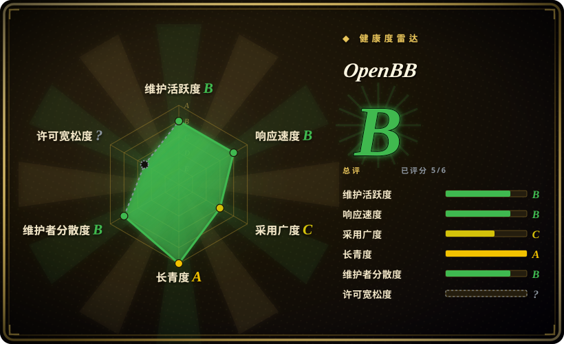
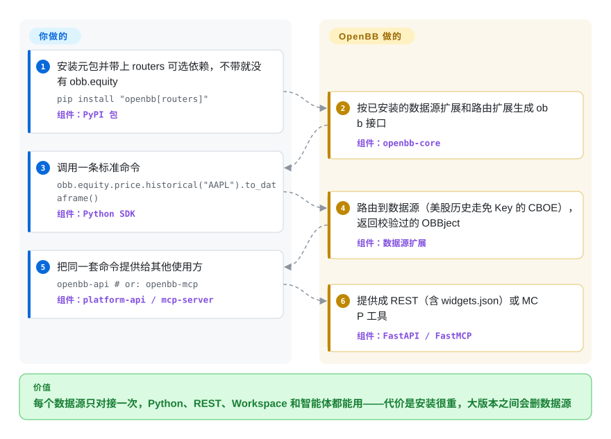

# OpenBB

同一批行情、公司公告和宏观序列，研究员要在 notebook 里用，内部系统要走 REST 接口，分析师要在看板上看，AI 智能体也要调——每多一个出口，就要给每个数据源再写一遍对接代码。OpenBB 的 Open Data Platform（ODP）把每个数据源只封装一次成 Python 的数据源扩展，再把这一份对接同时提供给 Python、本地 REST 服务、命令行和给智能体用的 MCP 服务。

## 何时使用

你在给研究或量化团队搭数据管道，或者要把金融数据接进一个大模型智能体，而且同一批数据源有好几个使用方：量化在 Python 里取数，分析师在看板里看，智能体走 MCP，内部应用走 REST。你想停掉的成本，是把 FRED 客户端、SEC 公告解析器、CBOE 行情抓取各写三遍。

当“接一次、到处用”是真实需求，并且你要的数据源正好是 V5 之后仍随包提供的那些时，选 OpenBB：美国和国际官方数据（SEC 公告与公司财务事实、FRED、BLS、EIA、CFTC、美联储、美国财政部、欧洲央行、IMF、OECD、FINRA、JODI），交易所来源的行情（CBOE、Nasdaq、TMX、Deribit），Fama-French 因子和 RSS 新闻；或者你打算给自己采购的数据源写一个扩展，让它自动出现在所有出口上。V5（2026-09-29）起代码改为 Apache-2.0，嵌进产品不再背 4.x 时代 AGPL 的网络条款。决定性的取舍是：你得到一层带类型的统一数据层，REST、MCP 和 Workspace 小组件都已接好；代价是安装很重，而且维护者会在大版本之间直接砍掉数据源。

## 怎么用起来

OpenBB 是一个插件宿主。`openbb-core` 定义标准数据模型（一根股票日线、一张资产负债表）和命令路由；每个数据源是一个单独的 PyPI 包，叫“数据源扩展”，负责把自家 API 映射到这些模型上；“路由扩展”（`openbb-equity`、`openbb-economy` 等）把命令组织成 `obb.equity.price.historical` 这样的命名空间。装好包之后，核心会按已安装的扩展生成 `obb` 这个 Python 接口（首次导入会打印 `Extensions to add: … Building...`）。你要做的：安装元包时带上 `routers` 这个可选依赖——只装 `pip install openbb` 5.0.0 只有按数据源分的命名空间（`obb.cboe`、`obb.sec`、`obb.fred`），没有 `obb.equity`，README 自己的快速上手示例会直接报 `AttributeError`——然后调用命令，用 `.to_dataframe()` 转成表。它做的：挑一个数据源（我们实测美股历史默认走 CBOE，无需 Key），取数，校验成标准模型，返回一个 `OBBject`。同一套已安装的命令，`openbb-api` 会在 `127.0.0.1:6900` 以 REST 形式提供（外加一份给 OpenBB Workspace 读的 `widgets.json`），`openbb-mcp` 会以 MCP 工具形式提供——“接一次”指的就是这一层。FRED、BLS、EIA 需要 API Key，CFTC 需要应用令牌，写在用户设置文件里；其余随包数据源都不需要 Key。

<!-- flow-steps:begin (generated from flows/openbb.json by tools/flow_card.py — do not edit) -->

流程文字版

1. **你**：安装元包并带上 routers 可选依赖，不带就没有 obb.equity — `pip install "openbb[routers]"` — 组件：`PyPI 包`
2. **OpenBB**：按已安装的数据源扩展和路由扩展生成 obb 接口 — 组件：`openbb-core`
3. **你**：调用一条标准命令 — `obb.equity.price.historical("AAPL").to_dataframe()` — 组件：`Python SDK`
4. **OpenBB**：路由到数据源（美股历史走免 Key 的 CBOE），返回校验过的 OBBject — 组件：`数据源扩展`
5. **你**：把同一套命令提供给其他使用方 — `openbb-api   # or: openbb-mcp` — 组件：`platform-api / mcp-server`
6. **OpenBB**：提供成 REST（含 widgets.json）或 MCP 工具 — 组件：`FastAPI / FastMCP`

**价值**：每个数据源只对接一次，Python、REST、Workspace 和智能体都能用——代价是安装很重，大版本之间会删数据源

<!-- flow-steps:end -->

## 何时不用

- **你是冲着通过 OpenBB 用 yfinance、FMP、Intrinio、Tiingo、Alpha Vantage 或 Benzinga 来的。** V5 删掉了 16 个数据源包，上面这些全在里面，发布说明里大多数的“功能去向”一栏写的是“无”。直接用 [yfinance](yfinance.zh.md)，或者钉在 4.x——而 4.x 是 AGPL-3.0-only 且已冻结。
- **你的市场在中国。** 随包数据源是美国、加拿大和国际机构与交易所；A 股、期货和中国宏观数据用 [AKShare](akshare.zh.md)（免 Key）或 [Tushare](tushare.zh.md)（需令牌）。
- **你想要一个轻依赖。** 我们实测 `pip install "openbb[routers]"` 解析出 241 个包、环境占 787 MB，而且元包把 `openbb-devtools`（pytest、tox、pre-commit、ruff）拉进了运行时依赖。只要一个数据源的话，装 `openbb-core` 加那一个数据源包，或者用专门的库（SEC 公告用 edgartools）。
- **你要的是界面而不是数据层。** 给分析师用的界面 OpenBB Workspace 是闭源托管产品（pro.openbb.co）；本仓库是数据层、API/MCP 服务、命令行和 ODP Desktop 托盘应用（提供 macOS 和 Windows 安装包；Linux 只能自己编译）。
- **你需要有人负责的数据合同或交易执行。** README 自己写着数据“不一定准确”；没有券商下单能力（Tradier 数据源在 V5 删了）。要有授权、有支持的实时数据，就买终端，愿意的话再把它包成自己的数据源扩展。
- **总线因子是硬约束。** V5 重写和 2026 年 4 月以来 `develop` 上几乎所有提交都出自一位维护者，仓库还在 2026-09 搬进了一个新建、没有简介的组织（`openbq-org`），没有公开说明。[推断]

## 横向对比

| 备选 | 是否收录 | 我们的评价 | 取舍 |
|---|---|---|---|
| [yfinance](yfinance.zh.md) | ✅ | 一个 notebook 现在就要雅虎行情和基本面，选 yfinance；好几个使用方（Python、REST、MCP、Workspace）要通过一层带类型的接口共享多个官方数据源，选 OpenBB。 | yfinance 是一个轻依赖，走非官方的雅虎接口；OpenBB V5 已完全不带雅虎，多出口服务的代价是很重的安装。 |
| [AKShare](akshare.zh.md) | ✅ | 中国市场数据选 AKShare；美国和国际官方数据、并且要提供给智能体和看板，选 OpenBB。 | 覆盖面几乎不重叠：AKShare 抓中文门户转成 DataFrame，OpenBB 把官方 API 包在标准模型和服务后面。 |
| [qlib](qlib.zh.md) | ✅ | 任务是在准备好的数据集上训练和回测模型，选 qlib；任务是把各路数据接进来、再交给人和智能体，选 OpenBB。 | qlib 管研究闭环但要你自带数据；OpenBB 管数据接入但没有回测和建模流水线。 |
| edgartools | 未收录 | SEC 公告和 XBRL 财务就是全部需求，选 edgartools；SEC 只是同一批使用方要查的多个数据源之一，选 OpenBB。 | edgartools（MIT）是专注、深入的 SEC 库；OpenBB 的 `openbb-sec` 只是 17 个数据源之一，覆盖公告和公司财务事实。 |
| Bloomberg 终端 / LSEG Workspace | 非仓库 | 授权实时数据、覆盖保证和厂商支持是硬需求，选终端；OpenBB 是集成层，不是数据授权。 | 按席位收费的闭源产品，有人负责；OpenBB 是免费代码，数据质量取决于上游来源。 |

## 技术栈

- **语言：** Python，`requires-python >=3.10,<4`（README 写的是 3.10–3.14）。
- **核心：** `openbb-core` 2.0——Pydantic v2 标准模型、命令路由，REST 服务用 FastAPI + Uvicorn，可选 Flask 扩展（`a2wsgi`），可选 pandas 扩展用于 `.to_dataframe()`。
- **扩展：** 每个数据源和路由都是独立的 PyPI 包（V5 之后仓库内有 17 个数据源）；核心在构建或首次导入时按已安装扩展生成 `obb` 接口。
- **服务：** `openbb-platform-api`（`openbb-api`，REST 加 Workspace 的 `widgets.json`），`openbb-mcp-server`（`openbb-mcp`，基于 FastMCP，用工具发现机制让初始工具列表保持很短），`openbb-cli` 2.0。
- **图表：** `openbb-charting` 4.0，基于 Plotly，可选 PyWry 窗口。
- **桌面端：** ODP Desktop，Tauri 应用（Rust + React/TypeScript），安装后约 35 MB。
- **构建：** 每个包用 hatchling + PEP 621，提交 `uv.lock`，CI 里跑 ruff 和 ty。

## 依赖

- **Python 3.10+** 加上你选的那组包——完整元包很重（见“何时不用”），单装几个包要轻得多。
- **能访问各数据源的上游 API。** SEC、CBOE、Nasdaq、TMX、Deribit、欧洲央行、IMF、OECD、FINRA、美联储、美国财政部等无需 Key；FRED、BLS、EIA 需要 API Key，CFTC 需要应用令牌。
- **可选：** 想让分析师以小组件形式看数据，需要 OpenBB Workspace 账号（托管、闭源）；用仓库自带的 `docker-compose.yml`（API 在 6900，MCP 在 8001）则需要 Docker。

## 运维难度

**上手容易，长期维护中等。** 安装就是 `pip install "openbb[routers]"`（我们实测约两分半、241 个包），`openbb-api` 不用额外配置就能在本地提供 REST。日常要做的是版本纪律：大版本会搬命名空间（V5 里 `obb.regulators.sec.*` 变成了 `obb.sec.*`），还会整个删掉数据源，所以要钉死每个包的版本，升级前读变更说明，数据源 Key 放在用户设置文件里而不是代码里。要做成共享服务，就得自己负责 FastAPI 的部署和鉴权——仓库给的是一个 compose 文件，不是加固过的部署方案。

## 健康度与可持续性

- **维护（2026-10-09）。** 活跃但成批推进：最后一次提交在 7 天前，过去 13 周里只有 4 周有提交，因为 V5 在分支上做了五个月，2026-09-29 一次合并上线（同一天 PyPI 发布 `openbb` 5.0.0，core/CLI/API/MCP 为 2.0.x）。
- **年龄与林迪先验。** 仓库已存在 2119 天（2020-12 创建），经历了三次产品形态变化——Terminal、Platform 4.x、ODP——一直保持活跃；年龄 × 仍活跃支持它，但每次变形都打断过用户，所以这个先验保护的是项目的存活，而不是某一版 API。
- **治理与总线因子。** 过去 12 个月有 45 位活跃贡献者，头号贡献者占比 0.44，前三占比 0.526；但 4 月以后的提交几乎全部来自一位维护者（deeleeramone），而且仓库现在挂在 `openbq-org` 下——一个 2026-09-11 创建、没有简介的组织，公司自己的仓库仍留在 `OpenBB-finance`。
- **采用度。** 约 7.40 万星、7.6k fork；采用度雷达读到 `openbb` 上月 PyPI 下载 104,671 次、5 个依赖仓库、172,443 次发布附件下载——相对星数，实际使用量偏温和。
- **响应度。** 14 个合格 issue 的首次响应中位数为 137.3 小时（雷达 B）；快照时有 88 个未关闭 issue。
- **风险信号。** 28 个月内两次换许可证：2024-05 之前是 MIT，2024-05-14 起 AGPL-3.0-only，V5 起 Apache-2.0（PR #7677，2026-09-24）。方向是越来越宽松，但 4.x 的发布物仍是 AGPL。许可证雷达轴是 `?`：GitHub 报 `NOASSERTION`，因为 LICENSE 文件开头多了一行说明；评分器交叉核对的包注册表镜像对 4.7.2 仍记为 AGPL-3.0-only。文件本身和 V5 的每个 `pyproject.toml` 都写的是 Apache-2.0。

## 存疑（未验证）

- [推断] 仓库为什么搬到 `openbq-org`，公开渠道没有说明。新组织（2026-09-11 创建、8 个仓库、没有简介）里还有 `openbb-brightquery`，是为 OpenBB Workspace 做的 BrightQuery 企业信息查询应用，暗示与 BrightQuery 有合作；LICENSE 的版权方和 `pyproject.toml` 里的地址仍是 OpenBB Inc. / `OpenBB-finance`。
- [推断] “几乎所有提交出自一位维护者”来自 `develop` 最近 40 个提交和 V5 发布说明里的 PR 表，不是完整的贡献者分析；治理轴统计的是更宽的 12 个月窗口。
- [未验证] 搬家之后 OpenBB Inc. 是否仍在资助开源 ODP 的开发——没找到公告。
- [未验证] 安装体积和耗时（241 个包、787 MB、约两分半）只是一次 macOS + uv + Python 3.12 的实测，其他平台和解析器会不同。
- [未验证] 下载量因来源而异：雷达的上月 104,671 次来自 ecosyste.ms 的包记录；pypistats 在 2026-10-09 给同一个包报的是 60,485 次。
- [未验证] 文档站（docs.openbb.co）没有按 V5 逐页重读；那里的示例可能仍提到已删除的数据源，V5 发布说明自己也承认 `examples/` 和路由文档字符串里有这种残留。
- [未验证] 没有安装 ODP Desktop；对它的描述来自 `desktop/README.md`。
