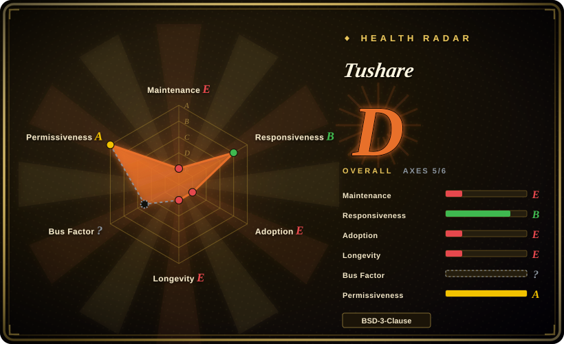
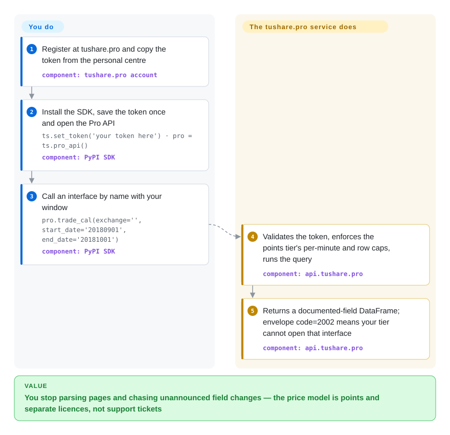

# Tushare

You want A-share daily bars, statements and index data with documented fields and a decade of history, without buying a terminal seat — and you accept that a pip-installed package is only the door. The data lives behind the tushare.pro service behind a personal token and a points system: 120 free points reach non-adjusted daily bars at 50 calls a minute, and everything beyond (full financials, minute bars, news, US/HK) is metered by purchased points or separate yearly licences. Note what the GitHub repo is not: its master branch has been frozen since 2020 while the SDK keeps releasing on PyPI — development happens behind the service, not in the open.

## When to use

You are building a quant research pipeline over Chinese A-share history — daily bars across the whole market, income/balance/cash-flow statements, index constituents, or the featured datasets Tushare has accumulated over a decade (chip distribution, earnings forecasts, brokers' monthly picks). Free scraping ([AKShare](akshare.md)) gets you similar tables but nobody owes you the fields; a commercial terminal (Wind, iFinD, Choice) is accountable but priced as an institution. Tushare is the middle bet: register, get a token, and the interface contract is documented per endpoint with named fields, a stable `ts_code` universe, and an operator whose business is keeping the data flowing.

Reach for it when documented fields plus deep history are worth a little money and a registration: the entry tier is free (120 points), the workhorse tier is a few hundred yuan a year (2000+ points unlocks most regular interfaces at 200 calls/min with a 100k/day cap), and à-la-carte licences cover minute bars, news, research reports, US/HK that the open alternatives cannot deliver reliably at all. HTTP, Python, Matlab and R SDKs are documented, and 2026-era additions (Tushare MCP server, Tushare Skills) give coding agents a native path — the deciding tradeoff versus [HiThink Financial-API](financial-api.md) is community-operator versus vendor-official, and which paid catalogue fits: Tushare sells minute/news/US-HK depth, the official service bundles public futures/options data behind one key.

## How it works

Two layers, and only one of them is in the repo. The **service** (`api.tushare.pro`) is a JSON-over-HTTP query engine: every dataset is an `api_name`, every call POSTs `{api_name, token, params, fields}`, and the answer is an envelope where `code=0` carries `fields` + row-aligned `items` and `code=2002` means your points tier cannot open that door. The **SDK** (`pip install tushare`) is a thin client: `ts.set_token(...)` saves the credential once, `pro = ts.pro_api()` binds to the service, and `pro.daily(...)` / `pro.query('trade_cal', ...)` return pandas DataFrames with documented column names. What you do: register on the website, copy the token from the personal centre, pick interfaces your points tier allows. What it does: authenticate the token, enforce the tier's calls-per-minute and rows-per-call, run the query against maintained databases, and return normalized rows. The legacy scraping interfaces still documented in the repo README (`ts.get_hist_data` and friends) predate this architecture; the current docs describe only the Pro path.

<!-- flow-steps:begin (generated from flows/tushare.json by tools/flow_card.py — do not edit) -->

Text version of the flow

1. **You**: Register at tushare.pro and copy the token from the personal centre — component: `tushare.pro account`
2. **You**: Install the SDK, save the token once and open the Pro API — `ts.set_token('your token here') · pro = ts.pro_api()` — component: `PyPI SDK`
3. **You**: Call an interface by name with your window — `pro.trade_cal(exchange='', start_date='20180901', end_date='20181001')` — component: `PyPI SDK`
4. **Tushare**: Validates the token, enforces the points tier's per-minute and row caps, runs the query — component: `api.tushare.pro`
5. **Tushare**: Returns a documented-field DataFrame; envelope code=2002 means your tier cannot open that interface — component: `api.tushare.pro`

**Value**: You stop parsing pages and chasing unannounced field changes — the price model is points and separate licences, not support tickets

<!-- flow-steps:end -->

## When NOT to use

- **You need keyless, zero-ceremony data tonight.** Registration, points and quotas are the product model. Pick [AKShare](akshare.md) for the free no-contract route, or [yfinance](yfinance.md) for US/global tickers.
- **You expect the GitHub repository to be the living project.** Master's last commit is 2020-03; issues (767 open) go largely unanswered there; SDK releases land on PyPI (latest 1.4.29, 2026-03) without matching public commits. You cannot audit the current SDK's source, and bug reports travel through QQ/WeChat groups (the "senior" group is a paid membership) rather than GitHub. For an open-repo counterpart with comparable structure, see [HiThink Financial-API](financial-api.md). [推断]
- **You need institutional accountability or an SLA.** A community-operated service with point economics and 10x pricing for companies is not a contracted data vendor; regulated paths belong to commercial terminals (Wind/iFinD/Choice — not repos) or broker/exchange feeds.
- **Your budget is exactly zero beyond the free tier.** 120 points reach only non-adjusted daily bars (50 calls/min, 8000 rows/day); adjusted bars, full financials and featured data start at paid tiers, and minute/news/US-HK are separately licensed per year. Check the points-frequency table before committing the architecture.
- **You are starting new code on the old interfaces.** The scraping-era API in the repo README predates Pro and its sources have moved on; new code should target the Pro surface only.
- **You need self-hosting or an offline mode.** There is none: the databases, the token validation and the quota enforcement all live server-side.

## Comparison

| Alternative | In index | Our verdict | Tradeoff |
|---|---|---|---|
| [AKShare](akshare.md) | ✅ | Pick AKShare when zero cost and zero registration are hard constraints; pick Tushare when documented fields, deep history and one accountable operator are worth the token and the tiers. | AKShare is free but rides public pages that break; Tushare's contract costs points — 120 free points reach only non-adjusted daily bars. |
| [HiThink Financial-API](financial-api.md) | ✅ | Pick the official Tonghuashun service when vendor-official numbers, a bundled public futures/options catalogue and an open repo matter; pick Tushare when decade-old featured datasets and à-la-carte paid depth (minute bars, news, US/HK) fit better. | Both are token-gated hosted services with MCP/Skills surfaces; the axes are community-operator vs vendor-official and which paid catalogue matches the workload. |
| [yfinance](yfinance.md) | ✅ | Pick yfinance for keyless US/global daily bars; pick Tushare when A-share statements, index membership and featured China datasets are the work — with a token and a budget. | yfinance is free and unofficial; Tushare sells exactly the China depth yfinance lacks. |
| Wind / Tonghuashun iFinD / Eastmoney Choice | 非仓库 | Pick a terminal when tick/Level-2, cross-market institutional coverage and support contracts are non-negotiable; Tushare prices individuals into the middle. | Terminals cost seats; Tushare costs points — with a fraction of the accountability and no SLA. |

## Tech stack

- **Language:** Python SDK (the PyPI `tushare` package); HTTP, Matlab and R SDKs are documented on the service site, plus a 2026-era MCP server and Agent Skills.
- **Transport** (from the repo's Pro client and docs): JSON POST to `api.tushare.pro` — `requests` + `simplejson`, pandas on the return path; envelope `code=0` success, `2002` permission.
- **Legacy modules** in the repo (pre-2020 scraper): pandas, lxml, requests, msgpack, pyzmq — effectively dormant.
- **Repo quality infrastructure:** none current — CI badges point at Travis-era setups; the live development happens outside the public repo. [推断]

## Dependencies

- **A registered tushare.pro account and its token** (copied from the personal centre; refreshing the token revokes the old one) — no token, no data, at any tier.
- **A points tier matching your interfaces**: 120 free (non-adjusted daily, 50 calls/min, 8000 rows/day), 2000+ (most interfaces, 200 calls/min, 100k/day), 5000+/10000+ for higher frequency; minute bars, real-time quotes, news, US/HK are separate yearly/monthly licences.
- **Network reach to `api.tushare.pro`** (plain HTTP per the docs example).
- **Python 3 with pandas** (the docs also require lxml); the SDK itself is thin.

## Ops difficulty

**Low mechanically, real administratively.** The SDK is a thin client — nothing to deploy. What you operate is entitlements: the token (a leak means someone else burns your quota; refresh revokes), the points budget against per-minute/per-day caps (a full-market backfill at 120 points is impossible by design — 8000 rows/day — and the tier ladder is the real capacity plan), and licence renewals for minute/news/US-HK add-ons. Companies pay 10x the individual price list. Support flows through community channels rather than tickets, so budget debugging time accordingly. [推断]

## Health & viability

- **Maintenance (2026-09-22).** Split-brain: the GitHub repo's master last commit is 2,393 days old (**2020-03-04**) with 767 open issues and no tag newer than 0.2.0, while the PyPI SDK shipped 1.4.26→1.4.29 on a single day (2026-03-25) and has been quiet for the ~6 months since. The service site is alive and current (© 2026, ICP-licensed, 2026-era MCP/Skills docs).
- **Age and Lindy prior.** Repo created 2015-01 (4,276 days ≈ 11.7 years) and the Pro service has operated across that span — a genuinely strong Lindy record for the *service*; but the artifact you can inspect (the repo) is not the thing that is alive, so the prior applies to the operator, not the code. [推断]
- **Governance and bus factor.** Organization account (`waditu`), 22 listed contributors on GitHub, but the current SDK's development happens outside public view; roadmap and data quality are the operator's alone. [推断]
- **Adoption.** ~15.4k stars, 4.4k forks, and issues filed as recently as September 2026 show an active user base still reporting data-correctness findings; the machine axis still grades E because the registry scan finds no canonical package and 0 dependent repos — usage flows through the service without registering as measurable repo dependencies. [推断]
- **Responsiveness.** The machine axis grades B off a thin sample (median first response 29.0 hours across 3 qualifying issues), but 767 open issues and recent data-quality reports (an ROE discrepancy, zero-value auction rows) sitting unanswered tell the fuller story; the README routes support to QQ groups, one of which is explicitly a paid "senior" tier. [推断]
- **Risk flags.** Token-gated vendor dependence with metered economics; no public source for the current SDK (no audit path); pricing table changes at the operator's discretion; legacy interfaces in the README describe a scraping era that no longer works. No relicense history (BSD-3-Clause throughout).

## Caveats (unverified)

- [未验证] Service uptime, data-freshness SLAs and current data-quality processes are not published; nothing here verifies them.
- [未验证] Where the current SDK's source actually lives (private repo vs local builds) was not determined; the GitHub master ↔ PyPI release gap is a dated observation, not an explained one.
- [未验证] The 10x company pricing, licence renewals and refund policy are read from the operator's 2026-09-22 price table and may change without notice.
- [推断] "Support flows through community channels rather than tickets" is inferred from the README's QQ-group routing and open-issue patterns, not from a support-contract review.
- [推断] The Lindy verdict on the service rests on its decade-long operating history and current docs; internal investment levels are unknown.
