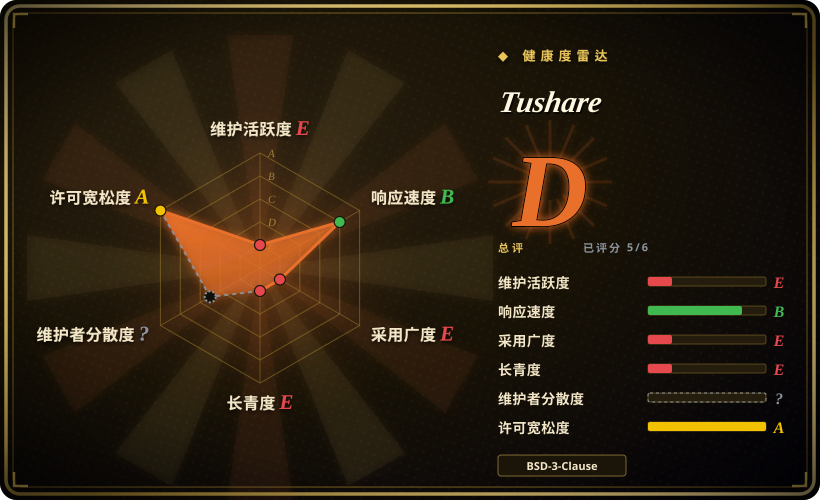
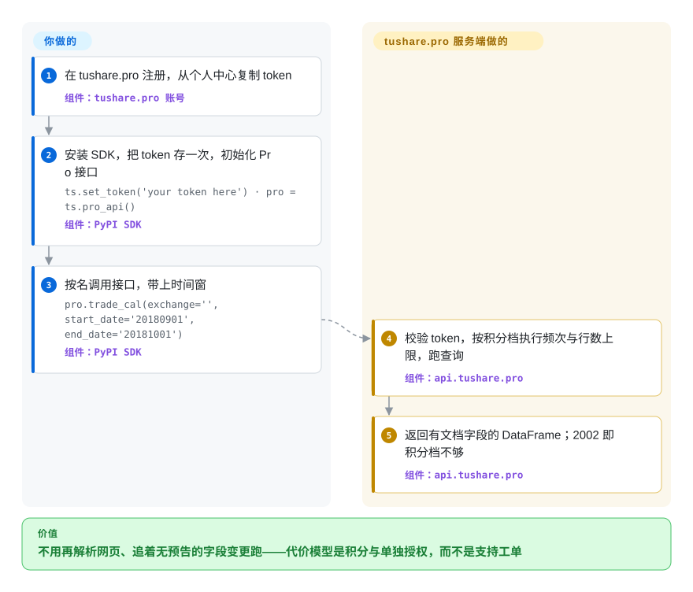

# Tushare

你要一份字段有文档、历史有十年纵深、还不用买终端席位的 A 股日线/财报/指数数据——并且接受「pip 装的那个包只是一扇门」。数据在 tushare.pro 服务端，凭个人 token 加积分体系取用：120 免费积分只能拿非复权日线、每分钟 50 次；再往上（财报全量、分钟线、新闻、港美股）要么按积分计量，要么按年单独买授权。还要看清 GitHub 仓库是什么、不是什么：master 停在 2020 年，SDK 却仍在 PyPI 发版——开发现场在服务端背后，不在公开仓库里。

## 何时使用

你在搭一条覆盖中国 A 股历史的量化研究管线——全市场日线、利润表/资产负债表/现金流量表、指数成分，或者 Tushare 十年攒下的特色数据（筹码分布、盈利预测、券商每月金股）。免费抓取（[AKShare](akshare.zh.md)）能给你相似的表，但没有人欠你字段；商业终端（Wind、iFinD、Choice）可追责，但按机构定价。Tushare 是中间下注：注册、拿 token，换来的是逐接口有文档、字段具名、`ts_code` 体系稳定、且运营方以此为生的契约。

值得翻到这一页的判断标准：字段有文档加历史纵深，值得花一点钱和一次注册——入门档免费（120 积分），主力档一年几百元（2000+ 积分打开多数常规接口，每分钟 200 次、每天 10 万次），分钟线、新闻、研报、港美股这类开放替代品根本稳定拿不到的深度按需另购。HTTP、Python、Matlab、R 的 SDK 都有文档，2026 年又加了 MCP 服务与 Tushare Skills，编码 Agent 有了原生入口。与 [HiThink Financial-API](financial-api.zh.md) 的决定性取舍是社区运营对供应商官方、以及哪家的付费目录更对口：Tushare 卖分钟/新闻/港美股深度，官方服务把公开期货期权打包在一把 Key 后面。

## 怎么用起来

两层结构，仓库里只有其中一层。**服务端**（`api.tushare.pro`）是一台 JSON-over-HTTP 的查询引擎：每个数据集是一个 `api_name`，每次调用 POST `{api_name, token, params, fields}`，应答信封里 `code=0` 带着字段名与逐行对齐的 `items`，`code=2002` 表示你的积分档开不了这扇门。**SDK**（`pip install tushare`）是薄客户端：`ts.set_token(...)` 存一次凭据，`pro = ts.pro_api()` 绑定服务，`pro.daily(...)` / `pro.query('trade_cal', ...)` 返回列名有文档的 pandas DataFrame。你要做的：官网注册、个人中心复制 token、挑积分档允许的接口。它做的：验证 token、按档位执行每分钟频次与每次行数上限、在维护好的数据库上跑查询、返回规整的行。仓库 README 里仍写着的爬虫时代接口（`ts.get_hist_data` 一族）早于这套架构；现行文档只描述 Pro 路径。

<!-- flow-steps:begin (generated from flows/tushare.json by tools/flow_card.py — do not edit) -->

流程文字版

1. **你**：在 tushare.pro 注册，从个人中心复制 token — 组件：`tushare.pro 账号`
2. **你**：安装 SDK，把 token 存一次，初始化 Pro 接口 — `ts.set_token('your token here') · pro = ts.pro_api()` — 组件：`PyPI SDK`
3. **你**：按名调用接口，带上时间窗 — `pro.trade_cal(exchange='', start_date='20180901', end_date='20181001')` — 组件：`PyPI SDK`
4. **Tushare**：校验 token，按积分档执行频次与行数上限，跑查询 — 组件：`api.tushare.pro`
5. **Tushare**：返回有文档字段的 DataFrame；2002 即积分档不够 — 组件：`api.tushare.pro`

**价值**：不用再解析网页、追着无预告的字段变更跑——代价模型是积分与单独授权，而不是支持工单

<!-- flow-steps:end -->

## 何时不用

- **今晚就要免 Key、零仪式感的数据。** 注册、积分、配额就是它的产品模式。免费无契约路线选 [AKShare](akshare.zh.md)，美股/全球标的选 [yfinance](yfinance.zh.md)。
- **你以为 GitHub 仓库是活的项目本体。** master 最后一次提交停在 2020-03；767 个 open issue 基本无人应答；SDK 在 PyPI 上发版（最新 1.4.29，2026-03）却没有对应的公开提交。你无法审计现行 SDK 的源码，报 bug 走的是 QQ/微信群（「高级」群是付费会员制）而不是 GitHub。要一个结构相近、仓库公开的对照物，看 [HiThink Financial-API](financial-api.zh.md)。 [推断]
- **你要机构问责或 SLA。** 一个按积分经济学运营、机构价十倍的社区服务不是签合同的数商；受监管的通路属于商业终端（Wind/iFinD/Choice——非仓库）或券商、交易所行情。
- **预算严丝合缝只剩免费档。** 120 积分只到非复权日线（每分钟 50 次、每天 8000 行）；复权、财报全量、特色数据从付费档开始，分钟/新闻/港美股按年单独授权。定架构前先核积分频次表。
- **你打算在老接口上写新代码。** 仓库 README 里的爬虫时代 API 早于 Pro，数据源早已变迁；新代码只应面向 Pro 面。
- **你要自托管或离线模式。** 没有：数据库、token 校验、配额执行全在服务端。

## 横向对比

| 替代品 | 是否收录 | 我们的评价 | 取舍 |
|---|---|---|---|
| [AKShare](akshare.zh.md) | 已收录 | 零成本、零注册是硬约束时选 AKShare；字段有文档、历史够深、要唯一可追责运营方时选 Tushare，代价是 token 和档位。 | AKShare 免费但骑在会变的公开页面上；Tushare 的契约按积分计价——120 免费积分只到非复权日线。 |
| [HiThink Financial-API](financial-api.zh.md) | 已收录 | 要供应商官方口径、打包的公开期货期权目录和一个公开仓库时选官方服务；十年特色数据与按需付费深度（分钟线、新闻、港美股）更对口时选 Tushare。 | 两者都是 token 门槛的托管服务、都有 MCP/Skills 面；真正的轴是社区运营对供应商官方，以及哪家的付费目录匹配工作负载。 |
| [yfinance](yfinance.zh.md) | 已收录 | 免 Key 的美股/全球日线选 yfinance；工作对象是 A 股财报、指数成分和中国特色数据集时选 Tushare——带上 token 和预算。 | yfinance 免费且非官方；Tushare 卖的正是 yfinance 缺的中国深度。 |
| Wind / 同花顺 iFinD / 东方财富 Choice | 非仓库 | tick/Level-2、跨市场机构覆盖和支持合同不可谈判时选终端；Tushare 把个人定价拉进了中间档。 | 终端按席位收费；Tushare 按积分收费——问责与 SLA 都只是终端的一个零头。 |

## 技术栈

- **语言：** Python SDK（PyPI 包 `tushare`）；服务站文档另列 HTTP、Matlab、R 的 SDK，2026 年新增 MCP 服务与 Agent Skills。
- **传输**（取自仓库 Pro client 与文档）：JSON POST 到 `api.tushare.pro`——`requests` 加 `simplejson`，返回路径上是 pandas；信封 `code=0` 成功、`2002` 权限不足。
- **仓库里的遗留模块**（2020 前的爬虫）：pandas、lxml、requests、msgpack、pyzmq——实际已休眠。
- **仓库质量设施：** 无现行设施——CI 徽章还指向 Travis 时代；活的开发发生在公开仓库之外。 [推断]

## 依赖

- **一个注册好的 tushare.pro 账号和它的 token**（个人中心复制；刷新即作废旧 token）——没有 token，任何档位都取不到数。
- **与目标接口匹配的积分档**：120 免费（非复权日线、每分钟 50 次、每天 8000 行）、2000+（多数接口、每分钟 200 次、每天 10 万次）、5000+/10000+ 更高频；分钟线、实时行情、新闻、港美股按年/按月单独授权。
- **能访问 `api.tushare.pro`**（文档示例为明文 HTTP）。
- **带 pandas 的 Python 3**（文档另要求 lxml）；SDK 本身很薄。

## 运维难度

**机械上很低，行政上是真功夫。** SDK 是薄客户端，没有要部署的东西。你要运维的是权利凭证：token（泄漏等于别人烧你的配额；刷新即吊销）、对着每分钟/每天上限的积分预算（120 积分按设计就不可能做全市场回填——每天 8000 行，档位阶梯才是真正的容量规划）、以及分钟/新闻/港美股加购的续期。公司价是个人价目表的十倍。支持走社区渠道而不是工单，排错时间要按此预算。 [推断]

## 健康度与可持续性

- **维护（2026-09-22）。** 裂脑状态：GitHub 仓库 master 最后提交已是 2,393 天前（**2020-03-04**），767 个 open issue，tag 最新只到 0.2.0；PyPI SDK 却在 2026-03-25 一天连发 1.4.26→1.4.29，此后约 6 个月无新版。服务网站活着且新（© 2026、ICP 备案、2026 年的 MCP/Skills 文档）。
- **年龄与 Lindy 先验。** 仓库创建于 2015-01（已创建 4,276 天，约 11.7 年），Pro 服务贯穿这段时期运营——对「服务」而言是实打实的强 Lindy 记录；但你能检查的那个 artifact（仓库）并不是活着的那个东西，先验落在运营方身上，不落在代码上。 [推断]
- **治理与 bus factor。** 组织账号（`waditu`），GitHub 列名贡献者 22 人，但现行 SDK 的开发发生在公开视野之外；路线图和数据质量只由运营方掌握。 [推断]
- **采用度。** 约 15.4k star、4.4k fork，2026 年 9 月仍有人提数据正确性 issue，用户群是活的；机器轴仍给 E，因为注册表扫描找不到规范包名、依赖仓库计 0 个——用量走的是服务端，不体现为可测的仓库依赖。 [推断]
- **响应速度。** 机器轴给 B，但样本很薄（3 个合格 issue 的首次响应中位数为 29.0 小时）；767 个 open issue 和挂着没人回的近期数据质量报告（ROE 口径出入、竞价全零行）才是全貌，README 把支持导向 QQ 群，其中一个明说是付费「高级」群。 [推断]
- **风险信号。** token 门槛的供应商依赖加计量经济学；现行 SDK 无公开源码（无审计路径）；价目表随运营方调整；README 里的遗留接口描述的是早已不工作的爬虫时代。无 relicense 历史（一直是 BSD-3-Clause）。

## 存疑（未验证）

- [未验证] 服务可用性、数据新鲜度 SLA 与现行数据质量流程未公开；本页没有任何东西验证它们。
- [未验证] 现行 SDK 的源码究竟在哪里（私有仓库还是本地构建）没有查清；GitHub master 与 PyPI 发版之间的断口是带日期的观察，不是有解释的结论。
- [未验证] 机构十倍定价、授权续期与退款政策读自运营方 2026-09-22 的价目表，可能随时调整。
- [推断] 「支持走社区渠道而不是工单」是从 README 的 QQ 群导向和 open issue 模式推出的，不是审阅支持合同得出的。
- [推断] 对服务的 Lindy 裁决建立在十年运营史与现行文档上；内部投入水平未知。
