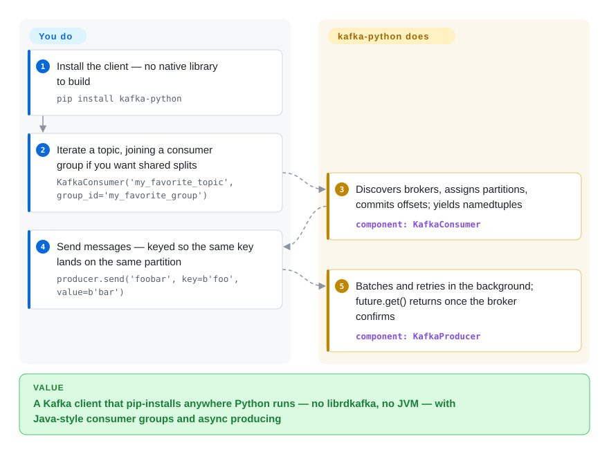

# kafka-python

You need to read and write Kafka topics from Python, but the fast clients ship a native library — `pip install` turns into compiling librdkafka, matching wheels across laptop/CI/slim container, and praying the glibc lines up. kafka-python removes that layer entirely: the Kafka wire protocol is implemented in pure Python, so a bare `pip install kafka-python` works anywhere Python runs.

## When to use

You're a Python developer who needs to read from or write to Kafka from your app, a data pipeline, or a script, and you want it to *just install* — no librdkafka to compile, no system packages, no wheel-matching gymnastics across your laptop, CI, and a slim container. You `pip install kafka-python`, import `KafkaConsumer('my_topic')`, and iterate over messages as namedtuples; producing is `KafkaProducer().send(...)`. Because it's pure Python, it drops cleanly into PyPy, locked-down environments, and minimal Docker images where building a native extension is a pain. The API is designed to track the official Java client, so consumer groups, dynamic partition assignment, and offset commits work the way you'd expect.

It also fits when you want lightweight admin without a JVM on the box: `kafka-python admin -b localhost:9092 cluster describe` (or `python -m kafka.admin`) replaces a chunk of the Kafka `bin/*.sh` scripts for creating topics, describing clusters, and quick interactive tasks — handy in environments where you don't have a compatible JVM at hand. For raw throughput you can `pip install crc32c` to offload checksumming to an optimized C library without making it a hard dependency.

## How it works

kafka-python speaks the Kafka wire protocol itself: since 3.0 its encoder/decoder classes are generated from the JSON message definitions in the Apache Kafka source, so it follows the Java client's protocol without any C core. You construct one of three high-level objects — `KafkaConsumer`, `KafkaProducer`, or `KafkaAdminClient` — and broker discovery, partition assignment, batching, retries, and offset commits happen underneath; you iterate messages as namedtuples (topic, partition, offset, key, value) and get a future back from `send()` you can block on when you need delivery confirmation. The same three clients are also exposed as CLIs (`python -m kafka.consumer` / `kafka.producer` / `kafka.admin`) for one-off ops tasks without a JVM. What stays yours: (de)serialization, delivery-semantics knobs (`acks`, idempotence, transactions), and consumer-group design — plus an optional `pip install crc32c` if checksums become your CPU bottleneck.

<!-- flow-steps:begin (generated from flows/kafka-python.json by tools/flow_card.py — do not edit) -->

Text version of the flow

1. **You**: Install the client — no native library to build — `pip install kafka-python`
2. **You**: Iterate a topic, joining a consumer group if you want shared splits — `KafkaConsumer('my_favorite_topic', group_id='my_favorite_group')`
3. **kafka-python**: Discovers brokers, assigns partitions, commits offsets; yields namedtuples — component: `KafkaConsumer`
4. **You**: Send messages — keyed so the same key lands on the same partition — `producer.send('foobar', key=b'foo', value=b'bar')`
5. **kafka-python**: Batches and retries in the background; future.get() returns once the broker confirms — component: `KafkaProducer`

**Value**: A Kafka client that pip-installs anywhere Python runs — no librdkafka, no JVM — with Java-style consumer groups and async producing

<!-- flow-steps:end -->

## When NOT to use

- **Maximum throughput / lowest latency.** A pure-Python client cannot match the `librdkafka`-backed `confluent-kafka-python` for high-volume producing/consuming. If you're saturating links or counting microseconds, use the native client.
- **You need the newest broker features day one.** Protocol/KIP support is implemented in Python; the README's compatibility badge advertises Kafka 0.8 → 4.3 (2026-09), but brand-new KIPs can still trail a fresh Kafka release — verify your required KIPs/broker version on the project's compatibility page before depending on it.
- **Async-native codebases.** The public API is synchronous/iterator-based. The 3.x internals moved toward an async event loop, but if you want a first-class `asyncio` API, `aiokafka` is purpose-built for that.
- **You already run the Confluent stack.** If you're standardized on Confluent Platform/Schema Registry tooling, `confluent-kafka-python` integrates more tightly with that ecosystem (serializers, registry clients).
- **Heavy stream processing.** It's a client, not a stream-processing framework — no Kafka Streams equivalent. For stateful topologies use Faust/Quix/ksqlDB or the JVM Streams API.

## Comparison

| Alternative | In index | Our verdict | Tradeoff |
|---|---|---|---|
| confluent-kafka-python | 未收录 | Choose confluent-kafka-python when throughput, latency, Confluent ecosystem integration, or fastest protocol coverage matters most; choose kafka-python when pure-Python portability and trivial installs are the deciding constraints. | Official Confluent client wrapping `librdkafka` (C) — highest throughput/latency and quickest protocol coverage, but needs the native lib and is less trivially portable than pure Python. |
| aiokafka | 未收录 | Choose aiokafka for async-first Python services that need a native `asyncio` API; choose kafka-python for synchronous consumers, producers, and admin scripts. | Native `asyncio` Kafka client (built on kafka-python's lineage); the right pick for async-first apps, narrower surface than the sync client. |
| [kafka-ui](kafka-ui.md) | ✅ | Treat kafka-ui as complementary: choose it for human cluster browsing and admin, while kafka-python remains the library to embed in Python producers, consumers, and scripts. | A web UI for cluster management, not a client library — complements rather than competes; different job entirely. |
| Java/Scala official client | 未收录 | Choose the Java/Scala client for JVM services, reference-client behavior, or Kafka Streams; choose kafka-python when the application boundary is Python and a JVM client is not acceptable. | The reference implementation with first-class feature support and Kafka Streams, but JVM-only — not an option for a Python service. |
| Sarama (Go) | 未收录 | Choose Sarama for Go services that want a mature no-native-dependency Kafka client; choose kafka-python for the same portability tradeoff in Python. | Mature pure-Go Kafka client; same "no native dep" appeal but for Go, not Python. |

## Tech stack

- **Language:** pure Python, no Cython/C/Rust core (the headline portability claim); Python 3.8+ required for the 3.x line.
- **Components:** `KafkaConsumer`, `KafkaProducer`, `KafkaAdminClient`, plus `kafka-python`/`python -m kafka.*` CLI entry points.
- **3.0 internals:** protocol stack dynamically generated from Apache Kafka JSON message schemas; networking refactored around a `kafka.net` event loop with async/await internally; encode/decode optimizations via compiled/cached bytecode. KIPs named in the 3.0 notes include Cooperative Rebalance (KIP-429), Rack-aware Fetch (KIP-392), Log-Truncation detection (KIP-320), Transactional Producer work (KIP-360/447/654), and Sticky Partitioner (KIP-480).
- **Optional native accel:** `crc32c` C library for faster checksums (auto-used if installed); gzip is stdlib, while LZ4/Snappy/Zstandard pull optional libraries (see Dependencies).

## Dependencies

- **A reachable Kafka cluster** — the README badge advertises Kafka 0.8 → 4.3 compatibility (2026-09); exact KIP coverage per broker version is on the project's compatibility page. [未验证]
- **Core install: none** — pure Python, no external runtime deps for the base case.
- **Compression (per README):** gzip via stdlib; LZ4 via `python-lz4` / `lz4tools` / `py-lz4framed`; Snappy via `python-snappy`; Zstandard via `python-zstandard`.
- **Optional:** `crc32c` for high-throughput checksumming; SASL/SSL security libs depend on your auth setup (not enumerated here). [未验证]
- **Python 3.8+** for the current major version.

## Ops difficulty

**Low.** It's a library, not a service — `pip install` and you're done; nothing to deploy or operate beyond your own application. The "no native dependency" design is exactly an *ops* win: reproducible installs in CI and slim containers without build toolchains, and it runs on PyPy/locked-down hosts. The operational reality you do own is Kafka client tuning — batching, `acks`, retries, consumer-group rebalancing, and offset-commit semantics — which is inherent to any Kafka client, not specific to this one. The cluster you connect to is the hard thing to run; the client is not.

## Health & viability

- **Responsiveness**: Grade A — median first-response time 1.9 hours across 12 qualifying issues/PRs (scorer, 2026-09-28).
- **Maintenance (2026-09) — active, steady point releases.** Five releases since the last check: 3.0.7 (2026-06-28), 3.0.8 (2026-07-09), 3.0.9 (2026-07-21), 3.0.10 (2026-08-04), 3.0.11 (2026-08-16, GitHub API) — a roughly weekly-to-fortnightly bugfix cadence on the 3.0 line; last master commit 2026-09-03. Not archived. The 3.0 line was a substantial refactor (protocol generation, async internals).
- **Governance / bus factor.** `User`-owned (Dana Powers, `dpkp`) — nominally single-owner, but a long-standing **multi-contributor** project (jeffwidman, mumrah, wizzat and others in the top contributors), so the bus factor is better than a typical solo repo. Still, no foundation backing — direction rests with a small core. [推断]
- **Age × Lindy.** Created **2012-09** (~14 years) and *still actively shipping releases* ⇒ a **strong Lindy** signal: one of the oldest, most-proven Python Kafka clients, not a newcomer. Old-and-active is the good quadrant. [推断]
- **Adoption.** ~5.9k stars / ~1.5k forks (GitHub API, 2026-09-28) and ~16.8M PyPI downloads/month (scorer, 2026-09-28) — ubiquitous for scripting and CI jobs where native wheels are a pain; ~21 open issues alongside frequent releases suggests an attentive, on-top-of-it maintenance posture. [推断]
- **Risk flags.** Main considerations are *performance ceiling* vs native clients and *protocol lag* vs the newest broker features — capability bounds, not health red flags. Apache-2.0, no relicense history found. [推断]

## Caveats (unverified)

- [未验证] Stars (5,904), open issues (~21), and release list (3.0.11 @ 2026-08-16) are a GitHub API snapshot of 2026-09-28 — volatile, re-check.
- [未验证] The advertised broker compatibility range (Kafka 0.8 → 4.3, README badge) and exact KIP coverage per version are the project's claims; confirm the specific KIP/broker version you need against the compatibility page before depending on it.
- [未验证] SASL/SSL security-library requirements are not enumerated in the README; check the install docs for your auth mechanism.
- [推断] "Better-than-solo bus factor" is inferred from the contributor list, not a governance document; it remains a `User`-owned repo with a small core.
- [推断] The async/await internals vs a first-class asyncio API distinction (favoring aiokafka for async-first apps) is inferred from the 3.0 notes and ecosystem, not verified by reading the public API surface here.
