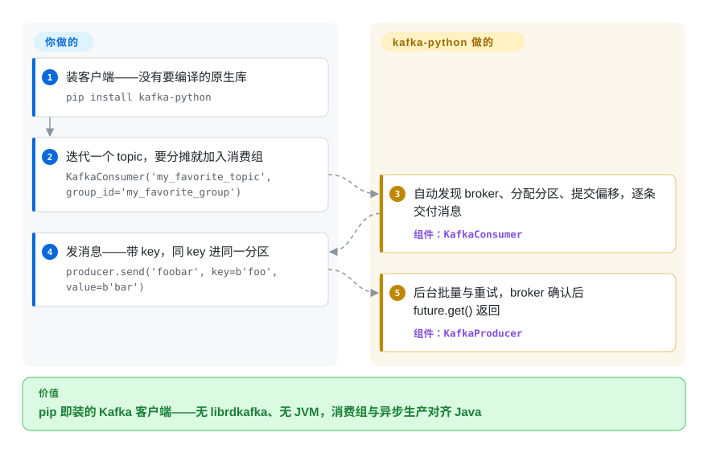

# kafka-python

你要从 Python 里读写 Kafka topic，但高性能客户端都带一个原生库——`pip install` 变成编译 librdkafka、在笔记本、CI 和精简容器之间对齐 wheel、祈祷 glibc 版本刚好合适。kafka-python 干脆拿掉了这一层：Kafka 网络协议整体用纯 Python 实现，一句 `pip install kafka-python` 在任何跑得动 Python 的地方都装得上。

## 何时使用

你是 Python 开发者，需要在应用、数据管道或脚本里读写 Kafka，并且希望它*装上就能用*——不用编译 librdkafka、不用系统包、不用在笔记本、CI 和精简容器之间折腾 wheel 匹配。你 `pip install kafka-python`，import `KafkaConsumer('my_topic')`，把消息当 namedtuple 迭代；生产就是 `KafkaProducer().send(...)`。因为是纯 Python，它能干净地落进 PyPy、受限环境和那些「编译原生扩展很痛」的极简 Docker 镜像里。API 设计上对齐官方 Java 客户端，所以消费组、动态分区分配、offset 提交都如你所料。

当你想在机器上不带 JVM 做轻量管理时它也合适：`kafka-python admin -b localhost:9092 cluster describe`（或 `python -m kafka.admin`）替代了一部分 Kafka `bin/*.sh` 脚本，用于创建 topic、描述集群和快速交互——在手头没有兼容 JVM 的环境里很方便。要追求原始吞吐，你可以 `pip install crc32c` 把校验和卸载给一个优化过的 C 库，而不必把它变成硬依赖。

## 怎么用起来

kafka-python 自己会说 Kafka 网络协议：3.0 起，编解码类由 Apache Kafka 源码里的 JSON 消息定义动态生成，没有 C 内核也能跟上 Java 客户端的协议。你只构造三个高层对象之一——`KafkaConsumer`、`KafkaProducer` 或 `KafkaAdminClient`——broker 发现、分区分配、批量、重试、offset 提交都在底下发生；消息以 namedtuple（topic、partition、offset、key、value）迭代给你，`send()` 返回一个 future，要确认投递就阻塞在它上面。同一套客户端还有 CLI 入口（`python -m kafka.consumer` / `kafka.producer` / `kafka.admin`），不开 JVM 也能做一次性运维操作。留在你手里的：（反）序列化、投递语义（`acks`、幂等、事务）和消费组设计；校验和成了 CPU 瓶颈时，再按需 `pip install crc32c`。

<!-- flow-steps:begin (generated from flows/kafka-python.json by tools/flow_card.py — do not edit) -->

流程文字版

1. **你**：装客户端——没有要编译的原生库 — `pip install kafka-python`
2. **你**：迭代一个 topic，要分摊就加入消费组 — `KafkaConsumer('my_favorite_topic', group_id='my_favorite_group')`
3. **kafka-python**：自动发现 broker、分配分区、提交偏移，逐条交付消息 — 组件：`KafkaConsumer`
4. **你**：发消息——带 key，同 key 进同一分区 — `producer.send('foobar', key=b'foo', value=b'bar')`
5. **kafka-python**：后台批量与重试，broker 确认后 future.get() 返回 — 组件：`KafkaProducer`

**价值**：pip 即装的 Kafka 客户端——无 librdkafka、无 JVM，消费组与异步生产对齐 Java

<!-- flow-steps:end -->

## 何时不用

- **追求极致吞吐 / 最低延迟。** 纯 Python 客户端比不过 `librdkafka` 加持的 `confluent-kafka-python` 在高量生产/消费上的表现。若你在打满链路或计较微秒，用原生客户端。
- **你要第一天就用上最新 broker 特性。** 协议/KIP 支持是用 Python 实现的；README 的兼容徽章宣称支持 Kafka 0.8 → 4.3（2026-09），但全新 KIP 仍可能落后于 Kafka 的新版本——依赖前请到项目的兼容性页核对你需要的 KIP/broker 版本。
- **以 async 为原生的代码库。** 公开 API 是同步/迭代器式的。3.x 内部转向了 async 事件循环，但若你想要一等公民的 `asyncio` API，`aiokafka` 是专为此打造的。
- **你已经在用 Confluent 全家桶。** 若你标准化在 Confluent Platform/Schema Registry 工具链上，`confluent-kafka-python` 与该生态（序列化器、registry 客户端）集成更紧。
- **重度流处理。** 它是客户端，不是流处理框架——没有 Kafka Streams 的等价物。要做有状态拓扑请用 Faust/Quix/ksqlDB 或 JVM 的 Streams API。

## 横向对比

| 替代品 | 是否收录 | 我们的评价 | 取舍 |
|---|---|---|---|
| confluent-kafka-python | 未收录 | 当吞吐、延迟、Confluent 生态集成或最快协议覆盖最重要时，选 confluent-kafka-python；当纯 Python 可移植性和安装简单才是硬约束时，选 kafka-python。 | 官方 Confluent 客户端，封装 `librdkafka`（C）——吞吐/延迟最佳、协议覆盖最快，但需要原生库，可移植性不如纯 Python 那么轻易。 |
| aiokafka | 未收录 | 当 async 优先的 Python 服务需要原生 `asyncio` API 时，选 aiokafka；当需求是同步消费者、生产者和管理脚本时，选 kafka-python。 | 原生 `asyncio` Kafka 客户端（脱胎于 kafka-python 一脉）；async 优先应用的正确选择，面比同步客户端窄。 |
| [kafka-ui](kafka-ui.zh.md) | ✅ | kafka-ui 是互补项：人要浏览和管理集群时选它；要嵌入 Python 生产者、消费者或脚本时，仍选 kafka-python。 | 是集群管理的 Web UI，而非客户端库——互补而非竞争；完全不同的活。 |
| Java/Scala 官方客户端 | 未收录 | 当服务在 JVM 上、需要参考客户端行为或 Kafka Streams 时，选 Java/Scala 官方客户端；当应用边界是 Python 且不能接受 JVM 客户端时，选 kafka-python。 | 参考实现，特性一等支持且带 Kafka Streams，但仅限 JVM——对 Python 服务不是选项。 |
| Sarama（Go） | 未收录 | 当 Go 服务需要成熟、无原生依赖的 Kafka 客户端时，选 Sarama；当你要在 Python 里获得同类可移植性取舍时，选 kafka-python。 | 成熟的纯 Go Kafka 客户端；同样「无原生依赖」的卖点，但面向 Go 而非 Python。 |

## 技术栈

- **语言：** 纯 Python，无 Cython/C/Rust 内核（核心可移植性卖点）；3.x 线要求 Python 3.8+。
- **组件：** `KafkaConsumer`、`KafkaProducer`、`KafkaAdminClient`，外加 `kafka-python`/`python -m kafka.*` CLI 入口。
- **3.0 内部：** 协议栈由 Apache Kafka 的 JSON 消息 schema 动态生成；网络层围绕 `kafka.net` 事件循环、内部用 async/await 重构；通过编译/缓存 bytecode 做编解码优化。3.0 说明里点名的 KIP 包括 Cooperative Rebalance（KIP-429）、Rack-aware Fetch（KIP-392）、Log-Truncation 检测（KIP-320）、事务生产者改进（KIP-360/447/654）与 Sticky Partitioner（KIP-480）。
- **可选原生加速：** `crc32c` C 库加速校验和（装了即自动启用）；gzip 走标准库，LZ4/Snappy/Zstandard 需要额外装库（见依赖）。

## 依赖

- **一个可达的 Kafka 集群**——README 徽章宣称兼容 Kafka 0.8 → 4.3（2026-09）；各 broker 版本的确切 KIP 覆盖见项目兼容性页。[未验证]
- **核心安装：无**——纯 Python，基础场景无外部运行时依赖。
- **压缩（README 逐条列出）：** gzip 用标准库；LZ4 用 `python-lz4` / `lz4tools` / `py-lz4framed`；Snappy 用 `python-snappy`；Zstandard 用 `python-zstandard`。
- **可选：** 高吞吐场景装 `crc32c` 加速校验和；SASL/SSL 的安全库视你的认证方式而定（README 未逐一列出）。[未验证]
- **Python 3.8+** 用于当前大版本。

## 运维难度

**低。** 它是库而非服务——`pip install` 即完事；除了你自己的应用，没东西要部署或运维。「无原生依赖」的设计本身就是*运维*红利：CI 和精简容器里可重现安装、无需构建工具链，还能跑在 PyPy/受限主机上。你确实要承担的运维现实是 Kafka 客户端调优——批量、`acks`、重试、消费组再平衡、offset 提交语义——这是任何 Kafka 客户端固有的，并非本库特有。难跑的是你连的那个集群，而不是客户端。

## 健康度与可持续性

- **响应速度**：Grade A——中位首次响应时间 1.9 小时，基于 12 个 qualifying issues/PRs（评分器，2026-09-28）。
- **维护（2026-09）——活跃，点发布稳定。** 自上次核查以来发了五个版本：3.0.7（2026-06-28）、3.0.8（2026-07-09）、3.0.9（2026-07-21）、3.0.10（2026-08-04）、3.0.11（2026-08-16，GitHub API）——3.0 线大致每周到双周的修复节奏；master 最近一次提交 2026-09-03。未归档。3.0 线是一次大重构（协议生成、async 内部）。
- **治理 / bus factor。** `User` 所有（Dana Powers，`dpkp`）——名义上单一所有者，但是一个长期的**多贡献者**项目（jeffwidman、mumrah、wizzat 等都在头部贡献者里），所以 bus factor 好于典型的单人仓库。不过没有基金会背书——方向系于一个小核心团队。[推断]
- **年龄 × Lindy。** 2012-09 创建（约 14 年）且*仍在活跃发版* ⇒ **强 Lindy** 信号：最老、最久经验证的 Python Kafka 客户端之一，而非新秀。老而活跃是好象限。[推断]
- **采用度。** 约 5.9k star / 约 1.5k fork（GitHub API，2026-09-28），PyPI 月下载约 1680 万（评分器，2026-09-28）——在原生 wheel 是痛点的脚本与 CI 场景里随处可见；约 21 个未决 issue 配上频繁发版，提示一种盯得紧、跟得上的维护姿态。[推断]
- **风险标记。** 主要考量是相对原生客户端的*性能上限*和相对最新 broker 特性的*协议滞后*——是能力边界，而非健康红旗。Apache-2.0，未发现 relicense 历史。[推断]

## 存疑（未验证）

- [未验证] Star 数（5,904）、未决 issue（约 21）与发布列表（3.0.11 @ 2026-08-16）是 2026-09-28 的 GitHub API 快照——易变，请重新核实。
- [未验证] 宣称的 broker 兼容范围（Kafka 0.8 → 4.3，README 徽章）与逐版本的确切 KIP 覆盖是项目自己的说法；依赖前请对照兼容性页确认你需要的具体 KIP/broker 版本。
- [未验证] SASL/SSL 所需安全库未在 README 枚举；请按你的认证方式查安装文档。
- [推断]「好于单人的 bus factor」由贡献者列表推断，而非治理文档；它仍是 `User` 所有的仓库、核心团队不大。
- [推断] async/await 内部与一等 asyncio API 之间的区分（async 优先应用更适合 aiokafka）由 3.0 说明和生态推断，未通过阅读此处公开 API 面来核实。
