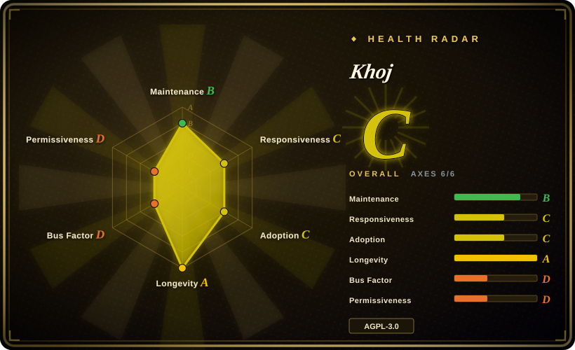

# Khoj

A self-hostable "AI second brain" server plus clients: it indexes your documents, answers questions over them alongside web search, and reaches you from a browser, desktop app, Obsidian, Emacs, phone or WhatsApp.

## When to use

You're a researcher or engineer whose context lives in many places — PDFs, markdown, org-mode, Word, Notion exports — and you want one assistant that answers from *all of it* plus the open web, no matter which device you're on. You don't want another single-machine note app: you want to run the brain on a home server or use the hosted app, and you want to choose between a cloud model and a local one (llama/qwen/mistral) per task.

So you self-host Khoj (or point at `app.khoj.dev`), connect your document sources and an LLM — online or local — and it chunks and embeds your corpus into Postgres/pgvector for semantic search. From then on you ask in the browser, from Obsidian or Emacs, on your phone, or over WhatsApp, and it answers with retrieval over your own documents and the web. Pick it over [LLM Wiki](llm-wiki.md) when **reach and retrieval** matter more than a persistent compiled wiki; pick it over [SiYuan](siyuan.md) / [Logseq](logseq.md) when you want an AI-first answer surface rather than an editor you author in.

## When NOT to use

- **Don't bet a production system on the release line.** Development commits continue (last push 2026-08-02) but the newest tagged release is `2.0.0-beta.28` from 2026-03 — the release cadence has been quiet for ~5 months. Verify current activity before depending on it. `[推断]`
- **Don't pick it for a light single-machine setup.** Self-hosting means Python, PostgreSQL with `pgvector`, and a heavy dependency stack (PyTorch, sentence-transformers) — if a local desktop app is enough, [Reor](reor.md) or [LLM Wiki](llm-wiki.md) is lighter.
- **Don't expect a persistent, inspectable compiled wiki.** Khoj re-retrieves per query and answers in chat; if you want markdown pages that accumulate and cross-reference, use [LLM Wiki](llm-wiki.md).
- **Don't use it for structured block-level authoring.** Khoj is a retrieval/answer surface, not an editor; for block references and WYSIWYG use [SiYuan](siyuan.md), and for an outline + Datalog queries use [Logseq](logseq.md).
- **Don't use it if document egress is unacceptable.** Web search and any cloud model send data out; local models reduce but do not necessarily remove egress (search still calls out). For a fully local, no-search workflow, keep the corpus in a local-only editor.
- **Don't use it as a compliance-grade record.** No evidence-verification of answers against cited sources is described; treat outputs as retrieval-assisted drafts. `[推断]`
- **Check AGPL-3.0 compatibility** for closed-product embedding or redistribution. `[推断]`

## Comparison

| Alternative | In index | Our verdict | Tradeoff |
|---|---|---|---|
| [LLM Wiki](llm-wiki.md) | ✅ | Choose Khoj when you need the same corpus from many clients and want web + docs retrieval; choose LLM Wiki when you want sources compiled once into a persistent, readable wiki you own as markdown. | Khoj spans browser/desktop/Obsidian/Emacs/phone/WhatsApp over many LLMs but re-derives per query and needs a Python/Postgres stack; LLM Wiki pre-compiles knowledge in a desktop app but has no multi-client reach. |
| [Logseq](logseq.md) | ✅ | Choose Khoj when you want AI answers over an existing document pile; choose Logseq when you want a mature local outliner you author and query yourself. | Logseq is a proven, model-free local-first editor with a big plugin ecosystem; Khoj is AI-first and server-based, with heavier ops and no structured editing. |
| [SiYuan](siyuan.md) | ✅ | Choose Khoj for retrieval-first AI across devices; choose SiYuan for a self-hosted block-level workspace where AI is an assistant inside the editor. | SiYuan gives block references, WYSIWYG and Docker/mobile access but is open-core and human-authoring-first; Khoj is fully open and AI-first but gives up structured authoring. |
| [Reor](reor.md) | ✅ | Choose Khoj when you want multi-device AI answers over documents; treat Reor as a reference because it is archived. | Reor was a lighter, fully local desktop AI note app (Ollama + LanceDB) but stopped in 2025-05; Khoj is heavier and server-shaped but still developed. |
| NotebookLM | 未收录 | Choose NotebookLM for zero-setup, hosted, source-grounded Q&A over a few docs; choose Khoj when you want self-hosting, many clients, web search and your own model choice. | NotebookLM is polished and managed but closed, account-bound and capped to selected sources; Khoj is self-hostable and broad but you operate Postgres and the model stack. |
| ChatGPT Projects / Claude Projects | 未收录 | Choose a hosted assistant when you want the lowest-effort general AI and don't need local ownership; choose Khoj when privacy, self-hosting and retrieval over your own corpus across clients are the point. | Hosted assistants are more capable general models with no ops, but they own the data path and don't give you a self-hosted retrieval layer you control. |

## Tech stack

- **Server:** Python 3.10–3.12, FastAPI + uvicorn; packaged on PyPI (`khoj`) and as a Docker image (`ghcr.io/khoj-ai/khoj`)
- **Storage/search:** PostgreSQL with `pgvector` (`psycopg2-binary`, `pgvector`) for embeddings and semantic search
- **ML:** PyTorch 2.6, `sentence-transformers`, `transformers` for local embeddings/models
- **Clients:** web app, desktop app, Obsidian plugin, Emacs package, phone apps, WhatsApp integration
- **LLM access:** OpenAI-compatible (`openai` SDK) plus local models; agent/automation layer on top
- **Search:** web search plus document retrieval; image generation, TTS and scheduling as adjunct features

## Dependencies

- **PostgreSQL + pgvector** — a hard requirement for self-hosting; the vector extension must be available
- **Python 3.10–3.12** (the project pins `<3.13`) and a substantial ML dependency tree (Torch, transformers)
- **A model source** — cloud API key(s) or a local model runtime; a GPU is optional but improves local inference
- **A host that stays up** for multi-device/messaging access; Docker-compose is the common deployment path
- **Outbound network** for web search and any cloud model calls

## Ops difficulty

**Medium–high when self-hosted.** You run and patch Postgres+pgvector, a Python service in a heavy ML environment, and persistent model configuration; Docker-compose templates ease the start but you still own upgrades, backups and the network boundary. The hosted `app.khoj.dev` removes ops at the cost of sending your corpus to a third party. Release staleness adds risk: pin versions and watch for security fixes.

## Health & viability

- **Maintenance (2026-09).** Mixed: commits continue to 2026-08-02, but the newest tagged release is a **2.0.0 beta from 2026-03** — long stretches between releases, so "active code, quiet releases." Not archived. `[推断]`
- **Governance / bus factor.** Organization-owned with two dominant contributors (~3.5k and ~1.6k commits, then a sharp drop) — a small core team, not foundation-governed. `[推断]`
- **Age & Lindy.** Created 2021-08, ~5 years of activity ⇒ a **moderate-to-strong Lindy** signal for the AI-second-brain niche. `[推断]`
- **Adoption & ecosystem.** ~37k stars, PyPI + GHCR distribution, a Discord community, multiple official clients and a commercial cloud/enterprise offering — broader than a hobby project, though the commercial layer's health is unverified. `[未验证]`
- **Risk flags.** AGPL-3.0. Beta-versioned releases with a quiet line (production-readiness caveat). Heavy ML/Postgres ops. Web search and cloud models are an egress boundary for sensitive corpora. `[推断]`

## Caveats (unverified)

- **Release-line status** — whether `2.0.0-beta.28` (2026-03) is the current release or simply the newest GitHub tag is not confirmed from a changelog. `[未验证]`
- **Commercial backing** — the cloud/enterprise offering implies a company behind the project; its structure and the OSS-vs-cloud feature split were not verified. `[未验证]`
- **Feature claims** — agents, scheduled automations, deep research, image generation, TTS and WhatsApp access are README claims, not reviewed in source. `[未验证]`
- **Retrieval/benchmark claims** — the README links to a blog on retrieval/reasoning benchmark performance; the numbers were not validated. `[未验证]`
- **Local-only operation** — whether a fully offline configuration (no web search, local models) is supported end-to-end was not established. `[未验证]`
- **Data handling on the hosted app** — encryption and retention for `app.khoj.dev` are not described in the sources read. `[未验证]`
