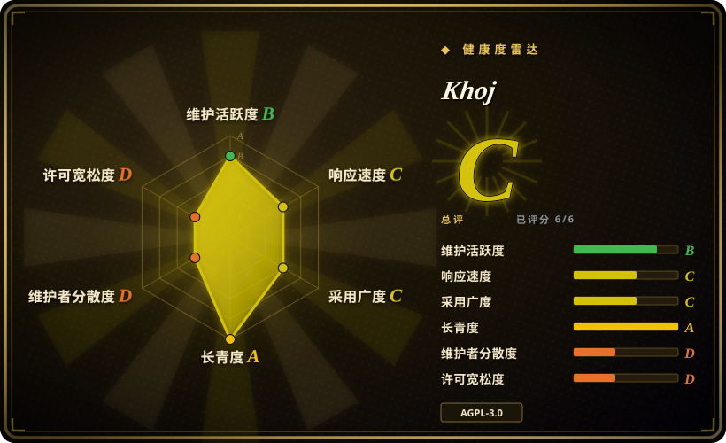

# Khoj

一个可自托管的「AI 第二大脑」服务加多端客户端：它索引你的文档，结合网络搜索在这些文档上回答问题，并能从浏览器、桌面应用、Obsidian、Emacs、手机或 WhatsApp 找到你。

## 何时使用

你是一名研究者或工程师，上下文散落在很多地方——PDF、markdown、org-mode、Word、Notion 导出——你想要一个助手，无论你在哪台设备上，都能从**这全部内容加上公开网络**作答。你不想要又一个单机笔记应用：你想把「大脑」跑在家庭服务器上或用托管版，并且想按任务在云端模型与本地模型（llama／qwen／mistral）之间选择。

于是你自托管 Khoj（或指向 `app.khoj.dev`），接上文档源与一个 LLM（在线或本地），它把你的语料切块并嵌入 Postgres／pgvector 做语义检索。此后你可以在浏览器、Obsidian 或 Emacs、手机上、或经 WhatsApp 提问，它用你自己的文档加网络检索作答。当**触面与检索**比一份持久编译的维基更重要时，选它而不是 [LLM Wiki](llm-wiki.zh.md)；当你想要 AI 优先的作答界面、而不是自己撰写的编辑器时，选它而不是 [SiYuan](siyuan.zh.md)／[Logseq](logseq.zh.md)。

## 何时不用

- **不要把生产系统押在发布线上。** 开发提交仍在继续（最后 push 2026-08-02），但最新的 tag 发布是 2026-03 的 `2.0.0-beta.28`——发布节奏已安静约 5 个月。依赖它之前请先核实当前活跃度。[推断]
- **单机轻量场景不要选它。** 自托管意味着 Python、带 `pgvector` 的 PostgreSQL，以及一大坨重依赖（PyTorch、sentence-transformers）——本地桌面应用够用的话，[Reor](reor.zh.md) 或 [LLM Wiki](llm-wiki.zh.md) 更轻。
- **不要期待一份持久、可检视的已编译维基。** Khoj 每次查询重新检索、在聊天里作答；想要会累积、会互链的 markdown 页面，请用 [LLM Wiki](llm-wiki.zh.md)。
- **不要用它做结构化块级撰写。** Khoj 是检索／作答界面，不是编辑器；要块引用与所见即所得用 [SiYuan](siyuan.zh.md)，要大纲 + Datalog 查询用 [Logseq](logseq.zh.md)。
- **文档外发不可接受时不要用。** 网络搜索与任何云端模型都会把数据发出去；本地模型能减少、但未必消除外发（搜索仍要出网）。要完全本地、不出网的流程，就把语料放在仅本地的编辑器里。
- **不要当作合规级记录。** 没有描述「把答案与其引用源做证据核对」的机制；请把输出当作检索辅助的草稿。[推断]
- **闭源产品嵌入或再分发前，先确认 AGPL-3.0 兼容性。** [推断]

## 横向对比

| 替代品 | 是否收录 | 我们的评价 | 取舍 |
|---|---|---|---|
| [LLM Wiki](llm-wiki.zh.md) | ✅ | 需要从多客户端访问同一语料、并要「网络 + 文档」检索时，选 Khoj；想要资料被一次性编译成一份以 markdown 拥有、持久可读的维基时，选 LLM Wiki。 | Khoj 覆盖浏览器／桌面／Obsidian／Emacs／手机／WhatsApp、支持多种 LLM，但每次查询重新推导，且需要 Python/Postgres 栈；LLM Wiki 在桌面应用里预编译知识，但没有多客户端触面。 |
| [Logseq](logseq.zh.md) | ✅ | 想对既有的一堆文档做 AI 问答，选 Khoj；想要一个成熟、本地、由你撰写并查询的大纲工具，选 Logseq。 | Logseq 是久经考验、不依赖模型的本地优先编辑器，插件生态大；Khoj 是 AI 优先、基于服务端，运维更重且没有结构化编辑。 |
| [SiYuan](siyuan.zh.md) | ✅ | 想要跨设备、检索优先的 AI，选 Khoj；想要自托管、块级工作空间且 AI 只是编辑器内助手，选 SiYuan。 | SiYuan 提供块引用、所见即所得与 Docker／移动端访问，但 open-core 且以人撰写为先；Khoj 完全开源、AI 优先，但放弃结构化撰写。 |
| [Reor](reor.zh.md) | ✅ | 想要跨设备、对文档做 AI 问答时选 Khoj；Reor 只能当参考，因为它已归档。 | Reor 曾是更轻、全本地的桌面 AI 笔记应用（Ollama + LanceDB），但 2025-05 停更；Khoj 更重、服务端形态，但仍在开发。 |
| NotebookLM | 未收录 | 想要零配置、托管、对少量文档做有源可依的问答，选 NotebookLM；想要自托管、多客户端、网络搜索与自选模型，选 Khoj。 | NotebookLM 精致、托管，但闭源、绑定账号且受限于所选资料；Khoj 可自托管、触面广，但 Postgres 与模型栈要你自己运维。 |
| ChatGPT Projects / Claude Projects | 未收录 | 想要最省力的通用 AI、不要求本地所有权时，选托管助手；当隐私、自托管与跨客户端检索自有语料才是重点时，选 Khoj。 | 托管助手是能力更强的通用模型且零运维，但数据路径归它们、也不给你一个自控的自托管检索层。 |

## 技术栈

- **服务端：** Python 3.10–3.12、FastAPI + uvicorn；以 PyPI 包（`khoj`）与 Docker 镜像（`ghcr.io/khoj-ai/khoj`）分发
- **存储／检索：** PostgreSQL + `pgvector`（`psycopg2-binary`、`pgvector`）存 embedding 并做语义检索
- **ML：** PyTorch 2.6、`sentence-transformers`、`transformers`，用于本地 embedding／模型
- **客户端：** 网页应用、桌面应用、Obsidian 插件、Emacs 包、手机应用、WhatsApp 集成
- **LLM 接入：** 兼容 OpenAI（`openai` SDK）并支持本地模型；之上有 agent／自动化层
- **搜索：** 网络搜索 + 文档检索；图像生成、TTS 与定时任务为附加功能

## 依赖

- **PostgreSQL + pgvector**——自托管的硬性要求；必须能装上向量扩展
- **Python 3.10–3.12**（项目锁定 `<3.13`）与一大棵 ML 依赖树（Torch、transformers）
- **一个模型来源**——云端 API key，或本地模型运行时；GPU 可选，但能改善本地推理
- **一台常驻主机**，供多设备／消息客户端访问；Docker-compose 是常见部署路径
- **对外网络**，用于网络搜索与任何云端模型调用

## 运维难度

**自托管中偏高。** 你要运行并修补 Postgres+pgvector、一个跑在重型 ML 环境里的 Python 服务，以及持久的模型配置；Docker-compose 模板让起步更容易，但升级、备份与网络边界仍归你。托管版 `app.khoj.dev` 免去运维，代价是把语料交给第三方。发布停滞额外增加风险：锁定版本并关注安全修复。

## 健康度与可持续性

- **维护（2026-09）。** 喜忧参半：提交延续到 2026-08-02，但最新 tag 发布是 **2026-03 的 2.0.0 beta**——发布间隔很长，属于「代码活跃、发布安静」。未归档。[推断]
- **治理 / bus factor。** 组织所有，两位主导贡献者（约 3500 与 1600 次提交，之后急剧下降）——小核心团队，非基金会治理。[推断]
- **年龄与 Lindy。** 2021-08 创建、约 5 年活跃 ⇒ 对 AI 第二大脑这一细分领域是**中等偏强 Lindy** 信号。[推断]
- **采用度与生态。** 约 37k star、PyPI + GHCR 分发、Discord 社区、多个官方客户端，并有商业云／企业版——超出业余项目，但商业层的健康度未经核实。[未验证]
- **风险标记。** AGPL-3.0。beta 版本号加安静的发布线（生产就绪度存疑）。重型 ML／Postgres 运维。网络搜索与云端模型对敏感语料是外发边界。[推断]

## 存疑（未验证）

- **发布线状态**——`2.0.0-beta.28`（2026-03）究竟是当前版本、还是仅仅是 GitHub 上最新的 tag，未从 changelog 确认。[未验证]
- **商业背书**——云／企业版暗示项目背后有公司；其结构以及 OSS 与云版的功能切分未核实。[未验证]
- **功能声明**——agents、定时自动化、深度研究、图像生成、TTS 与 WhatsApp 接入均为 README 声明，未在源码中审查。[未验证]
- **检索／基准声明**——README 链接了关于检索与推理基准表现的博客；其数字未经验证。[未验证]
- **纯本地运行**——是否支持端到端的全离线配置（无网络搜索、本地模型）尚未确认。[未验证]
- **托管版的数据处理**——`app.khoj.dev` 的加密与留存策略在所读来源中未描述。[未验证]
