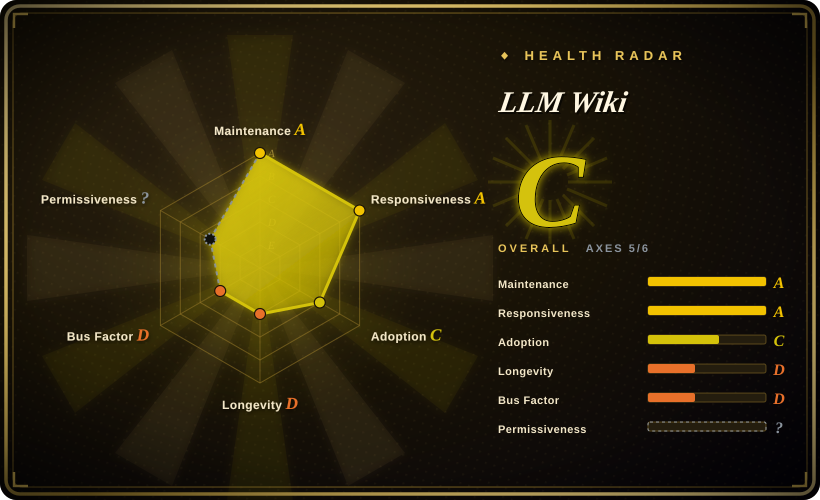

# LLM Wiki

A cross-platform desktop app that turns your documents into an interlinked local wiki: the LLM compiles sources into markdown pages once and keeps them current, instead of re-deriving answers from raw chunks on every query.

## When to use

You're a researcher (or a very online generalist) with a growing pile of PDFs, web clips, EPUBs and notes about one topic — say, battery chemistry or a market you're tracking — and you keep asking the same synthesis questions across that pile. Chat-with-your-docs tools make you re-upload and re-ask; by the time you need "how do these five papers disagree about cycle life?", the model is re-reading fragments with no memory of last week's answer. You want the *assembly* done once and kept, not redone every session.

So you point LLM Wiki at a folder, it runs a two-step ingest (analyze the source, then write/update wiki pages with `sources:` traceability), and it maintains `index.md`, per-entity/concept pages, cross-links and a knowledge graph around them. Because the artifact is plain markdown in a git-friendly folder that is Obsidian-compatible, you keep ownership and can read it without the app. It also ships a local MCP server and HTTP API, so Claude Code or Codex can query the same wiki — pick it over a human-authored outliner (Logseq/SiYuan) when the *maintenance* is the thing you refuse to do yourself, and over a doc-chat RAG app such as [Khoj](khoj.md) when you want a persistent, inspectable compiled corpus rather than query-time retrieval.

## When NOT to use

- **Don't bet long-term on it yet.** Created 2026-04, ~5 months old, one dominant maintainer (731 of ~850 commits) — if you need a knowledge base you'll still run in three years, use the mature, community-scale **Logseq** or **SiYuan** instead, and revisit LLM Wiki when it has a maintenance track record.
- **Not if the LLM must not see your documents.** Ingest and chat send source text to whatever you configure; local Ollama avoids provider egress but the app makes no encryption-at-rest or provider-boundary promise. If the corpus is confidential, keep it in **Logseq/SiYuan** (local files, no mandatory model call) or run an air-gapped setup you have audited yourself.
- **Not as a system of record for compliance.** The wiki trusts its own compiled synthesis; nothing verifies a page against its cited source, so a confidently wrong summary can be cited later as fact. For audit-grade provenance use an evidence-verifying store, not this.
- **Not if you need mobile or browser access.** It's a Tauri desktop app (macOS/Windows/Linux) with no first-party phone app; use **Khoj** when you need browser/phone/Obsidian/WhatsApp access to the same corpus.
- **Not at very large corpus scale without tuning.** The index-driven navigation pattern is a deliberate bet that works at moderate scale (~100 sources); past that you depend on its optional LanceDB vector search being configured. If millions of chunks are the job, that's **rag-retrieval** infrastructure, not a personal wiki.
- **Not for a zero-build/zero-cost workflow.** Building from source needs Rust 1.88+, Node 20+, and `protoc`; every ingest and query spends LLM tokens. If either is a blocker, a human-authored app or a plain Obsidian vault is cheaper.
- **Not if GPL-3.0 is incompatible with your distribution.** Embedding this into a proprietary product is a copyleft problem; check your license obligations first.

## Comparison

| Alternative | In index | Our verdict | Tradeoff |
|---|---|---|---|
| [Logseq](logseq.md) | ✅ | Choose Logseq when *you* want to be the author and the app must be mature, local-first and extensible; choose LLM Wiki when the bottleneck is the bookkeeping (cross-links, summaries, contradiction notes) and you'd rather an agent do it. | Logseq gives a battle-tested outliner + Datalog queries + a big plugin community and no mandatory model call, but the linking and upkeep are yours and its DB rewrite is still beta; LLM Wiki buys that upkeep with a young, single-maintainer app and per-token cost. |
| [SiYuan](siyuan.md) | ✅ | Choose SiYuan when you want self-hosted/Docker, block-level references and AI as an assistant inside a human-owned workspace; choose LLM Wiki when the LLM should own the wiki layer and you want an Obsidian-compatible compiled artifact plus MCP access. | SiYuan is more mature and operable (Go kernel, Docker, mobile) but is open-core with paid tiers and its AI is an add-on; LLM Wiki is fully open (GPL-3.0) and agent-first, but desktop-only and unproven. |
| [Khoj](khoj.md) | ✅ | Choose Khoj when you need to reach the same corpus from browser, phone, Obsidian and WhatsApp over local *or* cloud models; choose LLM Wiki when the deliverable is a persistent, human-readable compiled wiki rather than a retrieval+chat surface. | Khoj has broader reach and a server/self-host model with pgvector, but it re-retrieves per query and needs a heavier Python/Postgres stack; LLM Wiki pre-compiles knowledge and runs as a desktop app but lacks multi-client access. |
| [Reor](reor.md) | ✅ | Choose Reor only as a design reference for local-first AI notes; for production pick LLM Wiki (if you accept its youth) or an actively maintained alternative, because Reor is archived. | Reor is the closest architectural cousin (local embeddings, Ollama, LanceDB, markdown editor) and needs no cloud, but it was archived in 2025-05 — no security or dependency fixes. |
| NotebookLM | 未收录 | Choose NotebookLM when you want zero setup, Google-hosted, source-grounded Q&A over a few documents; choose LLM Wiki when the knowledge must persist locally, stay inspectable as markdown, and compound across sources. | NotebookLM is polished and hosted but closed, account-bound and re-derives per query; LLM Wiki is local and compounding but you operate it and pay for models. |
| Obsidian | 未收录 | Choose Obsidian when you want a proprietary-but-free local vault with a huge plugin ecosystem and you accept doing the maintenance; choose LLM Wiki when you want the LLM to maintain an Obsidian-compatible vault for you. | Obsidian is its own product (not an OSS repository) with better polish and no token cost, but no automatic compilation; LLM Wiki generates the vault Obsidian reads. |

## Tech stack

- **Desktop shell:** Tauri v2 (Rust), requiring Rust 1.88+
- **Frontend:** React 19 + TypeScript + Vite; Tailwind CSS v4 + shadcn-style UI
- **Editor:** Milkdown (ProseMirror-based WYSIWYG)
- **Graph:** sigma.js + graphology + ForceAtlas2 + Louvain community detection
- **Retrieval:** tokenized (CJK bigram) search + 4-signal graph relevance; optional vector search via LanceDB
- **Document parsing:** pdfium-render / pdf-extract, docx-rs, calamine, EPUB/MOBI, optional MinerU for complex PDFs
- **LLM access:** streaming HTTP to OpenAI / Anthropic / Google / Ollama / custom OpenAI-compatible endpoints
- **Integrations:** bundled MCP server (`mcp-server/`), local HTTP API on `127.0.0.1:19828`, Chrome MV3 web clipper
- **Web search (Deep Research):** Tavily, SerpApi, or SearXNG

## Dependencies

- **Node.js 20+** and **Rust 1.88+** to build from source, plus **`protoc`** (bundled MCP server is compiled as a Tauri resource)
- **An LLM endpoint** — a cloud API key (OpenAI/Anthropic/Google) or a local runtime such as Ollama; ingest and chat are unusable without one
- **Optional:** an embedding endpoint for vector search; MinerU (cloud, local API, or pipeline) for hard PDFs; Tavily/SerpApi/SearXNG keys for Deep Research
- **Prebuilt binaries** exist for macOS (`.dmg`, ARM + Intel), Windows (`.msi`) and Linux (`.deb`/`.AppImage`), so an end user need not install a toolchain

## Ops difficulty

**Medium for users, high to build.** End users download a binary and configure a provider in Settings — low friction. But: the source build is a real Rust + Node + protoc toolchain; ingest is serial and token-billed; a persistent queue, crash recovery and auto-watch are included, yet you still own backups of the project folder and the API keys. Desktop-only distribution and a ~5-month-old codebase mean occasional rough edges and breaking releases (version still 0.x).

## Health & viability

- **Maintenance (2026-09).** Active: 856 commits since 2026-04, releases roughly every 1–2 weeks (v0.6.7 → v0.6.11 through 2026-08), last push 2026-08-25. Not archived. [推断]
- **Governance / bus factor.** **High risk:** a single author dominates (nashsu 731 commits; next contributor 22) under a personal account, with 283 open issues and ~99 open PRs against it. There is no foundation or vendor behind the roadmap. [推断]
- **Age & Lindy.** **Negative signal:** 5 months old with ~19.8k stars is the hyped-young profile the index treats as a risk flag, not proof — age × still-active has not had time to accumulate. Popularity here outruns track record. [推断]
- **Adoption & ecosystem.** Rapid star/fork growth (19.8k / 2.2k) and an official companion agent-skill repo; the real (unverified) adoption signal is production use, which is too new to have. [未验证]
- **Risk flags.** GPL-3.0 (confirmed from `LICENSE`, despite the API reporting `NOASSERTION`). Document text is sent to the configured model provider unless you run local models — a privacy boundary that matters for sensitive corpora. `[推断]`

## Caveats (unverified)

- **Feature claims** — two-step ingest, 4-signal relevance weights, Louvain gap detection, Deep Research, web clipper and the API/MCP surface are taken from the project README, not verified in source. `[未验证]`
- **Vector-search benchmark** — the README's "recall 58.2% → 71.4%" is author-reported with no reproduction details. `[未验证]`
- **CJK bigram tokenization and the 60/20/5/15 context split** are README descriptions of the retrieval pipeline; not code-verified. `[未验证]`
- **Scope of local-only operation** — whether every multimodal/embedding path can run fully offline is not established; the app supports local endpoints but the README does not guarantee a no-egress mode. `[未验证]`
- **Encryption / data-at-rest posture** — no at-rest encryption is documented; "plaintext on disk" is an inference from the architecture, not an explicit statement. `[推断]`
- **Moderate-scale ceiling (~100 sources)** is the upstream Karpathy pattern's own stated range, not a measured limit of this app. `[未验证]`
