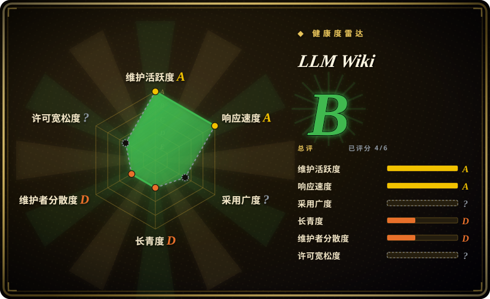

# LLM Wiki

一款跨平台桌面应用，把你的文档变成一份本地互链的维基：LLM 把资料一次性编译成 markdown 页面并持续保鲜，而不是每次查询都从原始分块重新推导答案。

## 何时使用

你是一名研究者（或者一个信息摄入量极大的杂食者），围绕某个主题——比如电池化学、或你正在跟踪的某个市场——攒了一大堆 PDF、网页剪藏、EPUB 和笔记，而且你反复在这堆材料上问同一类综合问题。和文档聊天类工具逼你每次重新上传、重新提问；等你真正需要「这五篇论文在循环寿命上到底怎么打架」时，模型又在一堆碎片里重新读一遍，完全不记得上周给过的答案。你想要的是**把综合这件事做一次并留住**，而不是每个会话重做。

于是你让 LLM Wiki 指向一个文件夹：它跑两步式摄入（先分析资料，再生成／更新带 `sources:` 溯源的维基页），并围绕这些页面维护 `index.md`、实体/概念页、互链和一张知识图谱。因为产物就是纯 markdown、放在 git 友好、且与 Obsidian 兼容的目录里，所有权仍在你手上，离开应用也能读。它还自带本地 MCP server 与 HTTP API，Claude Code 或 Codex 可以查询同一份维基——当你**拒绝自己承担维护**时，选它而不是人肉撰写的大纲工具（Logseq／SiYuan）；当你想要一份持久、可检视的「已编译语料」而不是查询时检索时，选它而不是文档聊天式 RAG 应用（如 [Khoj](khoj.zh.md)）。

## 何时不用

- **还不足以长期押注。** 2026-04 创建，约 5 个月，单个维护者占绝对主导（约 850 次提交里 731 次）。如果你需要一个三年后还在用的知识库，请改用成熟、有社区规模支撑的 **Logseq** 或 **SiYuan**，等 LLM Wiki 攒出维护记录再回来。
- **文档不该让 LLM 看到时不要用。** 摄入与聊天都会把源文本发给你配置的模型；本地 Ollama 能避开厂商外发，但应用对静态加密和厂商边界没有任何承诺。语料涉密就留在 **Logseq／SiYuan**（本地文件、不强制调用模型），或自建一套你自己审计过的隔离环境。
- **不要当作合规级的系统记录（system of record）。** 这份维基信任自己的编译综合：没有任何机制把页面与其引用源做核对，于是一个自信但错误的摘要日后会被当作事实引用。需要可审计的溯源，就用会验证证据的存储，而不是它。
- **需要移动端或浏览器访问时不要用。** 它是 Tauri 桌面应用（macOS／Windows／Linux），没有第一方手机端；需要从浏览器／手机／Obsidian／WhatsApp 访问同一语料时用 **Khoj**。
- **语料规模极大且不调优时不要用。** 「靠索引导航」这个模式是有意为之的赌注，只在中等规模（约 100 份源）成立；再往上就只能指望它可选的 LanceDB 向量检索配置得当。如果任务本身就是百万级分块，那属于 **rag-retrieval** 的基础设施，不是个人维基。
- **想要零构建／零成本流程时不要用。** 从源码构建需要 Rust 1.88+、Node 20+ 和 `protoc`；每次摄入与查询都花 LLM token。若这两点里任一无法接受，人肉撰写的应用或一个纯 Obsidian vault 更省。
- **GPL-3.0 与你的分发方式不兼容时不要用。** 把它嵌进专有产品是 copyleft 问题，先确认你的许可证义务。

## 横向对比

| 替代品 | 是否收录 | 我们的评价 | 取舍 |
|---|---|---|---|
| [Logseq](logseq.zh.md) | ✅ | 当你想让**自己**当作者、且应用必须成熟、本地优先、可扩展时，选 Logseq；当瓶颈是簿记（互链、摘要、矛盾标注）且你宁愿让 agent 干时，选 LLM Wiki。 | Logseq 提供久经考验的大纲工具 + Datalog 查询 + 庞大插件社区，且不强制调用模型，但互链与维护归你，且它的 DB 重写仍是 beta；LLM Wiki 用年轻、单人维护的应用和按 token 计费换来这份维护。 |
| [SiYuan](siyuan.zh.md) | ✅ | 当你要自托管／Docker、块级引用，且 AI 只是人主导工作空间里的助手时，选 SiYuan；当 LLM 应当拥有维基层、你要一份 Obsidian 兼容的已编译产物并希望 MCP 可访问时，选 LLM Wiki。 | SiYuan 更成熟、更易运维（Go 内核、Docker、移动端），但是 open-core、有付费层级，AI 只是附加；LLM Wiki 完全开源（GPL-3.0）且 agent 优先，但仅桌面端、未经检验。 |
| [Khoj](khoj.zh.md) | ✅ | 当你需要从浏览器、手机、Obsidian 和 WhatsApp 访问同一语料、且本地或云端模型都行时，选 Khoj；当交付物是一份持久、可读的已编译维基而非「检索 + 聊天」界面时，选 LLM Wiki。 | Khoj 触面更广，走服务端／自托管 + pgvector，但每次查询都重新检索，且需要更重的 Python/Postgres 栈；LLM Wiki 预编译知识、以桌面应用运行，但缺多客户端访问。 |
| [Reor](reor.zh.md) | ✅ | 只把 Reor 当作本地优先 AI 笔记的设计参考；生产环境请选 LLM Wiki（若能接受其年轻）或仍在维护的替代品，因为 Reor 已归档。 | Reor 是架构上最接近的同型（本地 embedding、Ollama、LanceDB、markdown 编辑器）且无需云端，但它 2025-05 已归档——不再有安全与依赖修复。 |
| NotebookLM | 未收录 | 当你想要零配置、Google 托管、对少量文档做有源可依的问答时，选 NotebookLM；当知识必须持久留在本地、以 markdown 可检视、并跨资料复利累积时，选 LLM Wiki。 | NotebookLM 精致、托管，但闭源、绑定账号且每次查询重新推导；LLM Wiki 本地、会复利，但要你自己运维并为模型付费。 |
| Obsidian | 未收录 | 当你想要一个专有但免费的本地 vault、插件生态庞大，并接受自己维护时，选 Obsidian；当你想要 LLM 替你维护一个 Obsidian 兼容 vault 时，选 LLM Wiki。 | Obsidian 是独立产品（不是开源仓库），打磨更好且没有 token 成本，但不做自动编译；LLM Wiki 生成的就是 Obsidian 要读的那份 vault。 |

## 技术栈

- **桌面外壳：** Tauri v2（Rust），要求 Rust 1.88+
- **前端：** React 19 + TypeScript + Vite；Tailwind CSS v4 + shadcn 风格 UI
- **编辑器：** Milkdown（基于 ProseMirror 的所见即所得）
- **图谱：** sigma.js + graphology + ForceAtlas2 + Louvain 社区发现
- **检索：** 分词搜索（中文 CJK bigram）+ 4 信号图相关度；可选 LanceDB 向量检索
- **文档解析：** pdfium-render／pdf-extract、docx-rs、calamine、EPUB／MOBI，复杂 PDF 可选 MinerU
- **LLM 接入：** 流式 HTTP，支持 OpenAI／Anthropic／Google／Ollama／自定义 OpenAI 兼容端点
- **集成：** 自带 MCP server（`mcp-server/`）、`127.0.0.1:19828` 本地 HTTP API、Chrome MV3 网页剪藏
- **网络搜索（Deep Research）：** Tavily、SerpApi 或 SearXNG

## 依赖

- 从源码构建需要 **Node.js 20+**、**Rust 1.88+**，以及 **`protoc`**（自带的 MCP server 会作为 Tauri 资源一起编译）
- **一个 LLM 端点**——云端 API key（OpenAI／Anthropic／Google）或本地运行时（如 Ollama）；没有它无法摄入与聊天
- **可选：** 向量检索用的 embedding 端点；处理硬 PDF 用的 MinerU（云端、本地 API 或 pipeline）；Deep Research 用的 Tavily／SerpApi／SearXNG key
- 提供**预编译产物**：macOS（`.dmg`，ARM + Intel）、Windows（`.msi`）、Linux（`.deb`／`.AppImage`），终端用户不必装工具链

## 运维难度

**用户侧中等，构建侧偏高。** 终端用户下载二进制并在设置里配置 provider 即可，摩擦很低。但：源码构建是真实的 Rust + Node + protoc 工具链；摄入是串行且按 token 计费；虽然内置了持久队列、崩溃恢复与自动监听，项目目录与 API key 的备份仍归你。仅桌面端分发、加上约 5 个月大的代码库，意味着偶有毛刺和破坏性发布（版本仍是 0.x）。

## 健康度与可持续性

- **维护（2026-09）。** 活跃：2026-04 以来 856 次提交，发布频率大致每 1–2 周一次（2026-08 期间 v0.6.7 → v0.6.11），最后 push 2026-08-25。未归档。[推断]
- **治理 / bus factor。** **高风险：** 单人主导（nashsu 731 次提交，第二名 22 次），账号为个人账户，同时积压 283 个 open issue 与约 99 个 open PR。路线图背后没有基金会或厂商。[推断]
- **年龄与 Lindy。** **负面信号：** 5 个月大、约 19.8k star，正是本索引视为风险信号而非证明的「年轻爆红」画像——年龄 × 持续活跃还来不及累积。热度跑在了记录前面。[推断]
- **采用度与生态。** star／fork 增长迅猛（19.8k／2.2k），并有官方配套 agent skill 仓库；真正的采用信号应是生产使用，而这太新、尚无从谈起。[未验证]
- **风险标记。** GPL-3.0（已从 `LICENSE` 确认，尽管 API 报 `NOASSERTION`）。除非运行本地模型，文档文本会发给你配置的模型厂商——对敏感语料而言这是一条隐私边界。[推断]

## 存疑（未验证）

- **功能声明**——两步式摄入、4 信号相关度权重、Louvain 缺口检测、Deep Research、网页剪藏以及 API／MCP 表面，均取自项目 README，未在源码中核实。[未验证]
- **向量检索基准**——README 所称「recall 58.2% → 71.4%」为作者自报，无复现细节。[未验证]
- **中文 bigram 分词与 60/20/5/15 上下文分配**是 README 对检索流水线的描述，未核对代码。[未验证]
- **纯本地运行的范围**——多模态／embedding 各路径能否完全离线运行尚未确认；应用支持本地端点，但 README 未保证存在「零外发」模式。[未验证]
- **加密 / 静态数据姿态**——文档未记述静态加密；「磁盘明文」是从架构得出的推断，并非明确陈述。[推断]
- **约 100 份源的中等规模上限**来自上游 Karpathy 模式的自述适用范围，不是本应用实测出的限制。[未验证]
