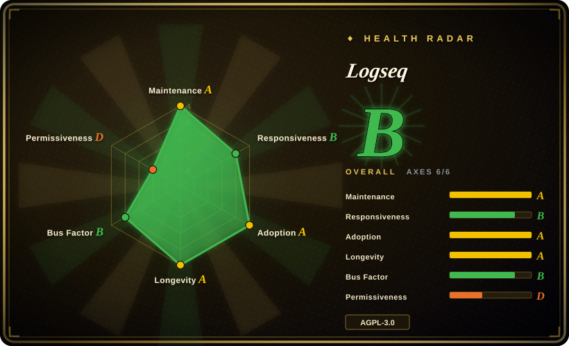

# Logseq

A privacy-first, local-first outliner for knowledge management and collaboration: you write markdown/org blocks, link them by reference, and query your graph with Datalog — no LLM in the loop unless a plugin adds one.

## When to use

You're a developer who thinks in bullets and wants a personal knowledge base that is *yours* — plain files on your disk, no account, no network call when you open it. You've tried Notion-style tools but hate that your notes live in someone's database, and you want to query your own graph ("show every block tagged `#project` that references `[[topic]]` and was written this month") rather than ask a chatbot. You also want a mature app: years of releases, a big plugin ecosystem, and a file format you can `git clone`.

So you install Logseq, point it at a local folder, and it indexes your markdown/org files into blocks you can reference and back-link. Because the editor is block-based and everything is local markdown, you get your own files, version control, and a Datalog query layer over the same graph. Pick it over [LLM Wiki](llm-wiki.md) when you want to be the author and refuse to have a model rewrite your notes; pick it over [SiYuan](siyuan.md) when a plain-file outliner plus a large plugin community matters more than block-level references and self-hosted server access.

## When NOT to use

- **Don't expect the app to write or maintain your wiki.** Logseq is human-authored; there is no ingest pipeline that compiles sources into pages. If the maintenance burden is exactly what you want to offload, use [LLM Wiki](llm-wiki.md) or an AI second brain like [Khoj](khoj.md).
- **Don't adopt the DB version for anything you can't lose.** The README states the DB version is **beta** and that **data loss is possible**, recommending backups or a dedicated test graph; the new mobile app and RTC sync are **alpha**. Either stay on the file-based version or keep automated backups — not an option if you need a stable store today.
- **Not if you need server-grade self-hosting and mobile first-party apps.** There is no Docker server edition; if you want a Go-kernel workspace reachable from a browser or container, use [SiYuan](siyuan.md).
- **Not for real-time team collaboration yet.** RTC is alpha and there is no hardening for multi-writer conflict; for team knowledge use `team-chat` or a hosted wiki.
- **Not if a rich WYSIWYG/database-style workspace is required.** Block outliners feel spartan to non-technical users; a document workspace like SiYuan or a Notion-style tool fits better.
- **Not if you can't accept AGPL-3.0.** Copyleft applies if you redistribute a modified app. `[推断]`
- **Mind the contributor pool.** The core is ClojureScript/Clojure with a forked DataScript — a niche stack, so outside contributions are harder and the bus factor, while far better than a solo project, is a small core team.

## Comparison

| Alternative | In index | Our verdict | Tradeoff |
|---|---|---|---|
| [LLM Wiki](llm-wiki.md) | ✅ | Choose Logseq when the human writes and the app must be mature and model-free; choose LLM Wiki when the bookkeeping (cross-links, summaries, contradiction notes) should be done by an agent. | Logseq gives a proven local-first outliner, Datalog queries and a large plugin community with no token cost; LLM Wiki buys automatic compilation but is a 5-month-old, single-maintainer desktop app. |
| [SiYuan](siyuan.md) | ✅ | Choose Logseq for a plain-file outliner with a big plugin ecosystem; choose SiYuan when you need block-level references, a Go kernel, Docker self-hosting and mobile apps. | Both are local-first and AGPL, but SiYuan is open-core with paid tiers while Logseq is fully free; Logseq's plugin ecosystem is larger, SiYuan's deployment story (server/mobile) is stronger. |
| [Khoj](khoj.md) | ✅ | Choose Logseq when you want to author and query structured notes locally; choose Khoj when you want an AI to answer from your corpus across devices. | Khoj adds semantic retrieval, web search and multi-client access but re-retrieves per query and needs a Python/Postgres service; Logseq keeps everything local and structured but does no synthesis for you. |
| [Reor](reor.md) | ✅ | Choose Logseq for a maintained, community-scale app; choose Reor only as a pattern reference because it is archived. | Reor integrated local LLM/embeddings into a markdown editor but stopped at 2025-05; Logseq has no built-in AI but a live ecosystem. |
| Obsidian | 未收录 | Choose Obsidian for the largest plugin ecosystem and a polished proprietary editor; choose Logseq for open-source, block references and Datalog queries over the same local-files model. | Obsidian is closed-source freeware with better polish and bigger adoption; Logseq is AGPL/open and outline-first, and lets you query the graph programmatically. |
| Notion | 未收录 | Choose Notion when you want a hosted all-in-one workspace and don't mind the cloud; choose Logseq when privacy, local files and version control are non-negotiable. | Notion is a hosted SaaS with databases and collaboration but no local-first ownership; Logseq trades polish and collaboration for local markdown you own. |

## Tech stack

- **App:** ClojureScript + Electron desktop (macOS/Windows/Linux), web version at `app.logseq.com`
- **Storage:** markdown/org files on disk (file-based version); **SQLite** graphs in the beta DB version
- **Query layer:** DataScript (a forked Datalog engine) over an in-memory graph
- **Sync:** RTC (real-time collaboration) in alpha; optional hosted Logseq Sync
- **Extensibility:** plugin API + marketplace; themes; custom CSS
- **Build tooling:** Clojure CLI / Java, Node.js, `deps.edn` (`shadow-cljs`-based frontend build)

## Dependencies

- **Desktop app** — no server or database to run for local, single-user use; the file-based version needs nothing beyond the installer
- **A local folder** for your graph (markdown/org files); the directory is the database
- **Optional:** hosted Logseq Sync / RTC for multi-device or collaboration; Node.js + Java only if building from source
- **No model provider required** — any LLM use comes from third-party plugins and their own keys

## Ops difficulty

**Low.** It is a desktop application over plain files: install, choose a folder, done. Backups are just copying (or git-committing) the graph directory, and there is no service to keep alive. The caveats are the beta DB-version migration (data-loss risk, explicit backup guidance) and plugin supply-chain trust, not day-to-day operations.

## Health & viability

- **Maintenance (2026-09).** Strong: 44.9k stars, nightly builds published 2026-09-19, a stable 2.0.1 in 2026-07, and roughly daily commits. Not archived. [推断]
- **Governance / bus factor.** Organization-owned with several long-tenured core maintainers (top contributor ~11.8k commits, three more in the 2–3k range) — far healthier than a solo project, though the ClojureScript core still concentrates expertise in a small group. [推断]
- **Age & Lindy.** Created 2020-05, ~6 years of continuous activity ⇒ a **strong Lindy** signal for a local-first notes app; it has already survived multiple product pivots. [推断]
- **Adoption & ecosystem.** Large community, plugin marketplace, active forum/Discord and community themes; among the default open-source recommendations in this niche. [未验证]
- **Risk flags.** AGPL-3.0 (no relicense history observed). The real flags are the **beta DB version's data-loss warning** and the project's attention shift toward DB graphs, which leaves the classic file-based version's long-term direction unclear. `[推断]`

## Caveats (unverified)

- **File-based version status** — whether the original markdown-file version is feature-frozen or still actively developed alongside the DB version is not stated in the README. `[未验证]`
- **Hosted sync pricing/limits** — Logseq Sync and RTC are referenced but their pricing, availability and data handling are not confirmed here. `[未验证]`
- **Plugin AI capabilities** — third-party LLM plugins exist in the ecosystem; their scope, quality and data handling were not reviewed. `[未验证]`
- **Adoption numbers** — 44.9k stars and 2.8k forks are a dated API snapshot, not independent evidence of production use. `[未验证]`
- **Datalog/query performance at very large graph sizes** is not characterized by any source read here. `[未验证]`
